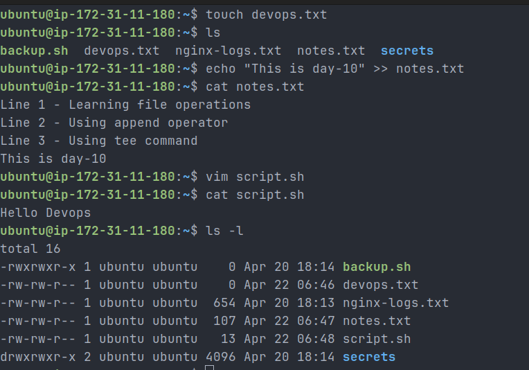
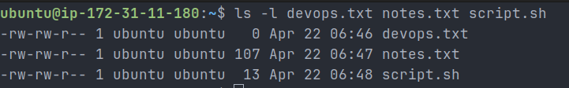
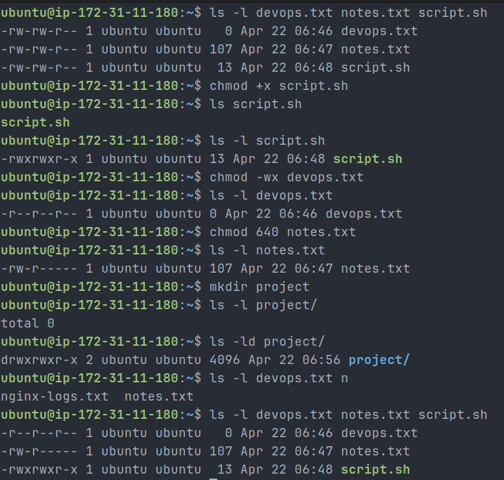
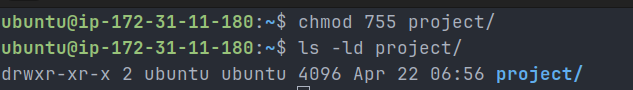
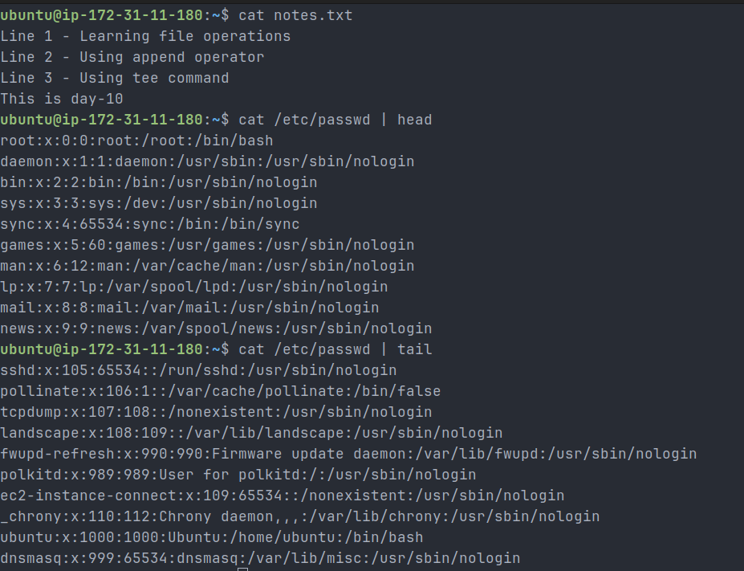
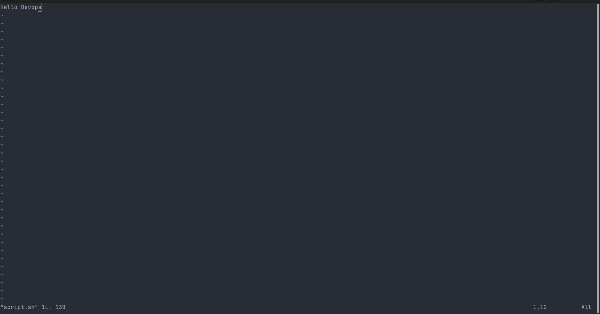
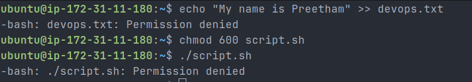

# Day 10 – File Permissions & File Operations

## Files Created

- devops.txt
- notes.txt
- script.sh

### Screenshot



---

## Permission Changes

### script.sh

- Before: -rw-rw-r--
- After: -rwxrwxr-x
- Action: Added execute permission

### devops.txt

- Before: -rw-rw-r--
- After: -r--r--r--
- Action: Removed write permissions

### notes.txt

- Before: -rw-rw-r--
- After: -rw-r-----
- Action: Set secure permission (640)

### project directory

- Permission: drwxr-xr-x (755)

### Screenshots







---

## Commands Used

```bash
touch devops.txt
echo "This is day-10" >> notes.txt
vim script.sh

cat notes.txt
head -n 5 /etc/passwd
tail -n 5 /etc/passwd

chmod +x script.sh
chmod -wx devops.txt
chmod 640 notes.txt

mkdir project
chmod 755 project
```

### Screenshots





---

## Key Learnings

1. Linux permissions control file security at user, group, and others level.
2. Execute permission is mandatory to run scripts.
3. Numeric permissions (640, 755) are widely used in real DevOps environments.

---

## Errors Observed

- Writing to read-only file → Permission denied
- Executing without execute permission → Permission denied

### Screenshot


