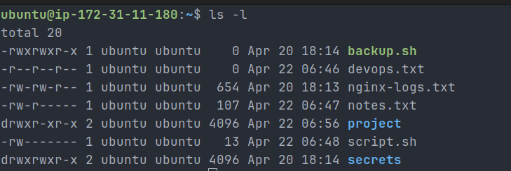
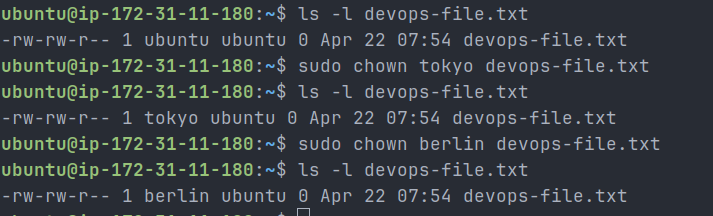
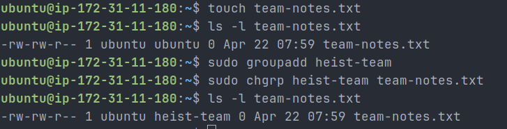
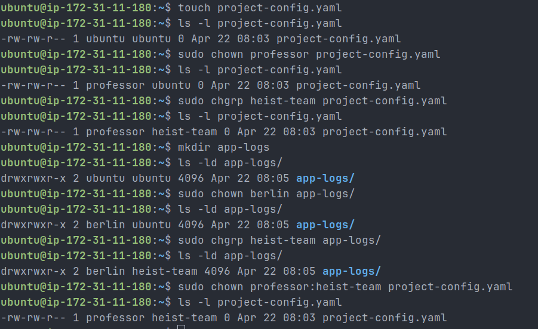
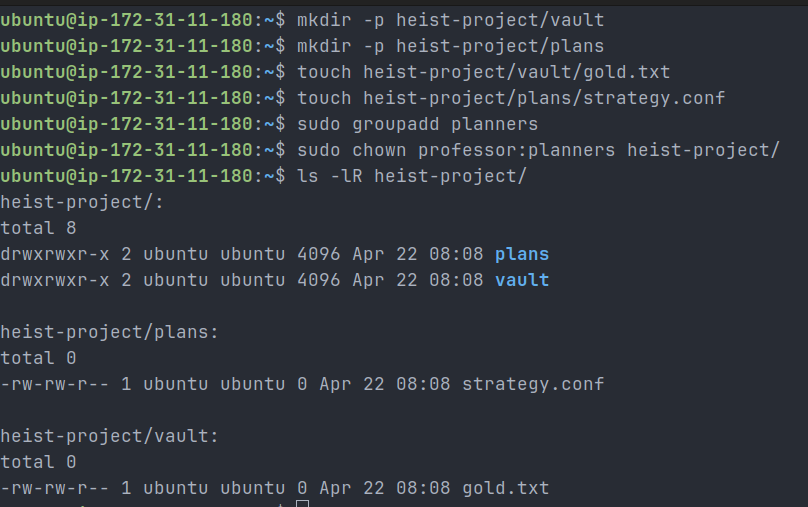
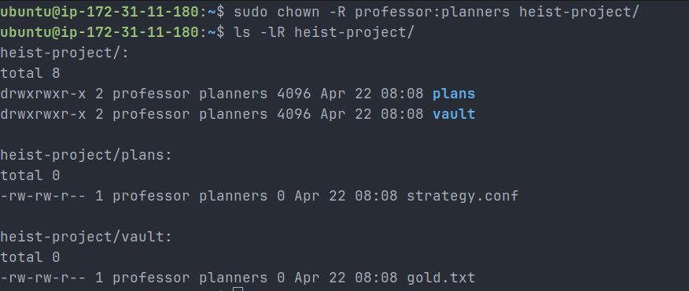
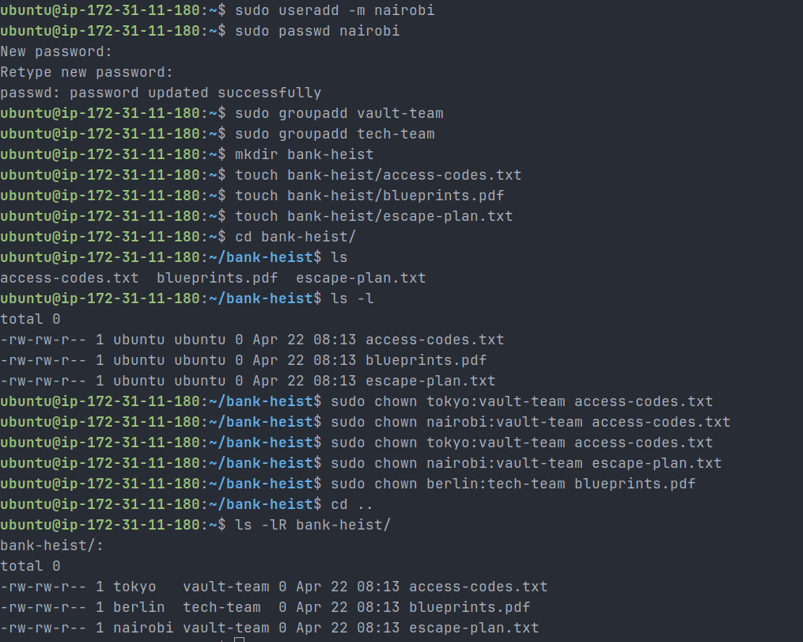

# Day 11 – File Ownership Challenge

## Files & Directories Created

- devops-file.txt
- team-notes.txt
- project-config.yaml
- app-logs/
- heist-project/
  ├── vault/gold.txt
  └── plans/strategy.conf
- bank-heist/
  ├── access-codes.txt
  ├── blueprints.pdf
  └── escape-plan.txt



---

## Ownership Changes

### Task 2 – chown (Owner Change)

- devops-file.txt:
  ubuntu:ubuntu → tokyo:ubuntu → berlin:ubuntu



---

### Task 3 – chgrp (Group Change)

- team-notes.txt:
  ubuntu:ubuntu → ubuntu:heist-team



---

### Task 4 – Owner + Group Combined

- project-config.yaml:
  ubuntu:ubuntu → professor:heist-team

- app-logs/:
  ubuntu:ubuntu → berlin:heist-team



---

### Task 5 – Recursive Ownership

Initial mistake:

- Applied ownership without `-R`, so subfiles were not updated

Correction:

- Applied recursive ownership using:

```bash
sudo chown -R professor:planners heist-project/
```

Final state:

- heist-project/: professor:planners
- vault/gold.txt: professor:planners
- plans/strategy.conf: professor:planners

Initial non-recursive result:



After applying `-R`:



---

### Task 6 – Practice Challenge

- access-codes.txt → tokyo:vault-team
- blueprints.pdf → berlin:tech-team
- escape-plan.txt → nairobi:vault-team

Verified using:

```bash
ls -lR bank-heist/
```



---

## Commands Used

```bash
# View ownership
ls -l

# Create users
sudo useradd tokyo
sudo useradd berlin
sudo useradd nairobi
sudo useradd professor

# Create groups
sudo groupadd heist-team
sudo groupadd planners
sudo groupadd vault-team
sudo groupadd tech-team

# Create files
touch devops-file.txt
touch team-notes.txt
touch project-config.yaml

# Change owner
sudo chown tokyo devops-file.txt
sudo chown berlin devops-file.txt

# Change group
sudo chgrp heist-team team-notes.txt

# Change owner + group
sudo chown professor:heist-team project-config.yaml
sudo chown berlin:heist-team app-logs/

# Recursive ownership
sudo chown -R professor:planners heist-project/

# Practice challenge ownership
sudo chown tokyo:vault-team bank-heist/access-codes.txt
sudo chown berlin:tech-team bank-heist/blueprints.pdf
sudo chown nairobi:vault-team bank-heist/escape-plan.txt
```

---

## What I Learned

1. Every file in Linux has an owner and a group that control access permissions.
2. `chown` can change both owner and group, while `chgrp` changes only the group.
3. Recursive ownership (`-R`) is essential for managing directory structures in real DevOps environments.
4. Incorrect ownership can cause application failures such as "permission denied" errors.
5. Avoid using `777` permissions; always follow the principle of least privilege.

---

## Key Concept

Example:

```bash
-rw-r--r-- 1 tokyo heist-team file.txt
```

- **tokyo** → Owner
- **heist-team** → Group

---

## Real DevOps Use Case

Correct ownership is required for:

- Application deployments
- Log file management (`/var/log/...`)
- CI/CD pipelines (Jenkins, GitHub Actions)
- Shared team directories
- Container volume permissions

Example fix:

```bash
sudo chown -R appuser:appgroup /var/log/myapp/
```

---

## Conclusion

This challenge helped build a strong understanding of Linux file ownership, which is critical for managing permissions in real-world DevOps environments. Proper ownership ensures security, stability, and smooth operation of applications.
