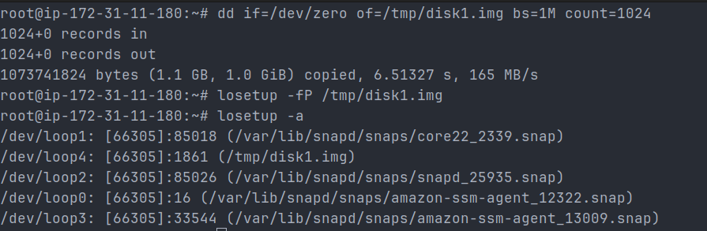
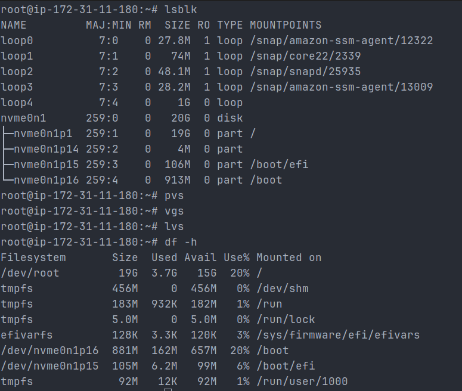
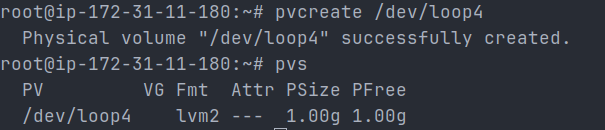
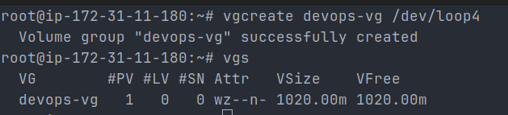
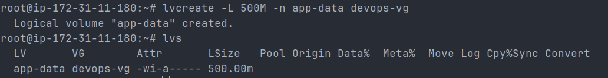
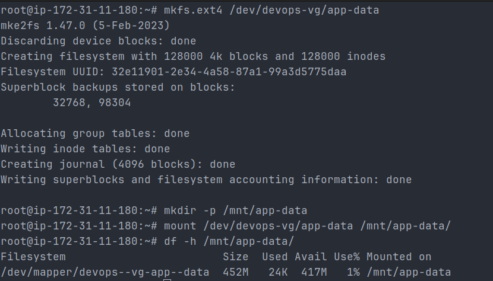
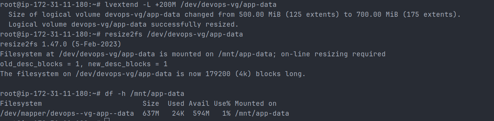
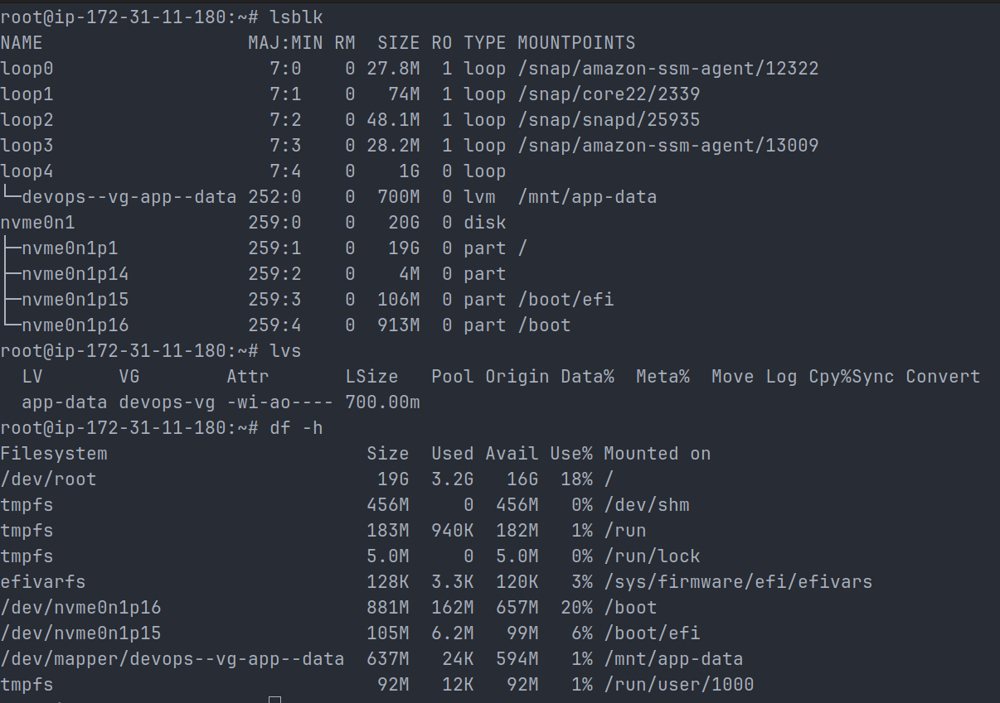

# Day 13 – Linux Volume Management (LVM)

## Objective

Learn and implement LVM to dynamically manage storage by creating, mounting, and extending logical volumes.

---

## Environment

- AWS EC2 (Ubuntu)
- Root access

---

## Create Virtual Disk (EC2 Workaround)

```bash
dd if=/dev/zero of=/tmp/disk1.img bs=1M count=1024
losetup -fP /tmp/disk1.img
losetup -a
```



Output:

```
/dev/loop4: (/tmp/disk1.img)
```

---

## Step 1: Check Current Storage

```bash
lsblk
pvs
vgs
lvs
df -h
```



Observation:

- No existing LVM setup
- Root filesystem on `/dev/nvme0n1p1`

---

## Step 2: Create Physical Volume

```bash
pvcreate /dev/loop4
pvs
```



Output:

```
PV         VG  Fmt  Attr PSize PFree
/dev/loop4     lvm2 ---  1.00g 1.00g
```

---

## Step 3: Create Volume Group

```bash
vgcreate devops-vg /dev/loop4
vgs
```



Output:

```
VG         #PV #LV VSize   VFree
devops-vg   1   0 1020.00m 1020.00m
```

---

## Step 4: Create Logical Volume

```bash
lvcreate -L 500M -n app-data devops-vg
lvs
```



Output:

```
LV        VG         LSize
app-data  devops-vg  500.00m
```

---

## Step 5: Format and Mount

```bash
mkfs.ext4 /dev/devops-vg/app-data
mkdir -p /mnt/app-data
mount /dev/devops-vg/app-data /mnt/app-data
df -h /mnt/app-data
```



Output:

```
/dev/mapper/devops--vg-app--data   452M   24K   417M   1%   /mnt/app-data
```

---

## Step 6: Extend Logical Volume

```bash
lvextend -L +200M /dev/devops-vg/app-data
resize2fs /dev/devops-vg/app-data
df -h /mnt/app-data
```



Output:

```
/dev/mapper/devops--vg-app--data   637M   24K   594M   1%   /mnt/app-data
```

---

## Verification

```bash
lsblk
lvs
df -h
```



Observation:

- Logical volume successfully extended to 700M
- Mounted and available at `/mnt/app-data`

---

## Key Learnings

1. LVM allows flexible storage management without downtime.
2. Logical volumes can be extended while mounted (online resize).
3. Volume Groups aggregate storage and allow dynamic allocation.

---

## Real-World Use Case

- Used in production servers for scaling storage dynamically
- Common in databases, logging systems, and Kubernetes worker nodes

---

## Persist Mount (Best Practice)

```bash
echo '/dev/devops-vg/app-data /mnt/app-data ext4 defaults 0 0' >> /etc/fstab
```

---

## Conclusion

Successfully implemented LVM on an EC2 instance using a loop device, including creation, mounting, and live resizing of a logical volume.
