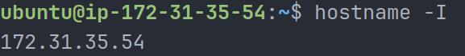
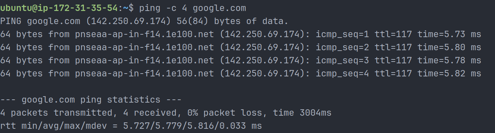
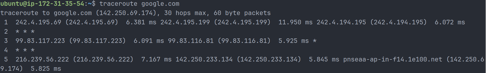
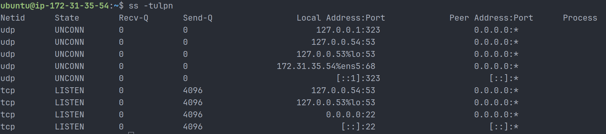
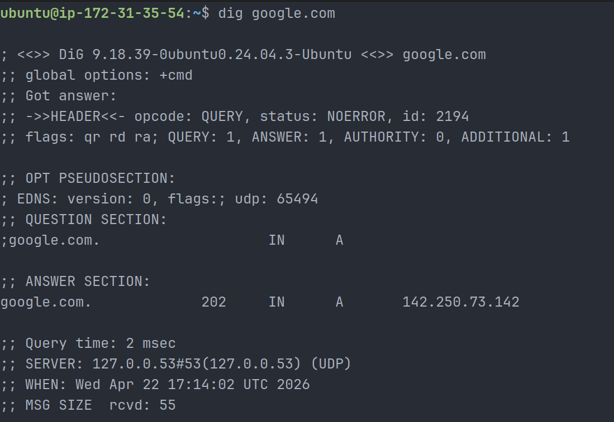
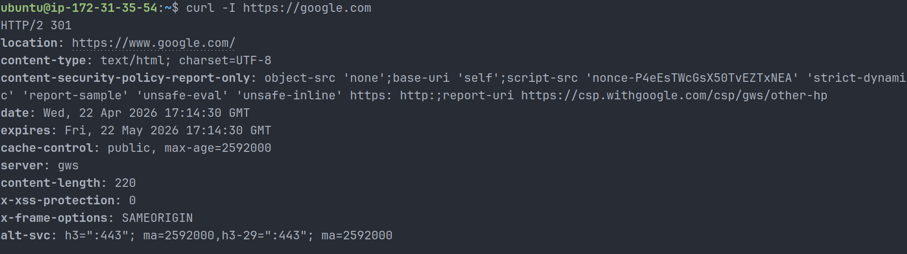
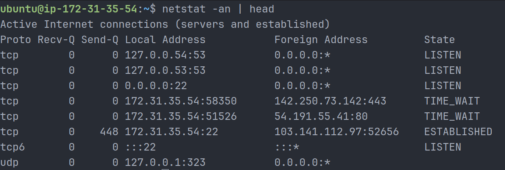
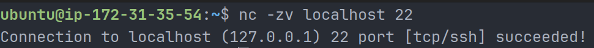

# Day 14 – Networking Fundamentals & Hands-on Checks

## Overview

Practiced core networking concepts and executed real-world troubleshooting commands to validate connectivity, DNS resolution, and service availability in an AWS environment.

---

## Concepts

### OSI vs TCP/IP Models

- OSI (7 layers): Physical → Application (conceptual model)
- TCP/IP (4 layers): Link → Application (practical implementation)

### Protocol Placement

- IP → Internet layer
- TCP/UDP → Transport layer
- HTTP/HTTPS, DNS → Application layer

### Real Example

- `curl https://google.com`
  → HTTP (Application) → TCP (Transport) → IP (Internet)

---

## Hands-on Checks

### Identity

```bash
hostname -I
```



**Output:** 172.31.35.54
**Observation:** Private IP from AWS VPC range.

---

### Reachability

```bash
ping -c 4 google.com
```



**Observation:**

- 0% packet loss
- Avg latency ~5.7 ms
- Stable connectivity

---

### Path

```bash
traceroute google.com
```



**Observation:**

- Multiple hops across network
- Some hops show `* * *` (ICMP filtered)
- Destination reached successfully

---

### Ports

```bash
ss -tulpn
```



**Observation:**

- SSH running on port 22 (LISTEN)
- DNS resolver on 127.0.0.53:53

---

### Name Resolution

```bash
dig google.com
```



**Observation:**

- Resolved IP: 142.250.73.142
- Query time: 2 ms

---

### HTTP Check

```bash
curl -I https://google.com
```



**Observation:**

- HTTP/2 301 response
- Redirects to [https://www.google.com/](https://www.google.com/)

---

### Connections Snapshot

```bash
netstat -an | head
```



**Observation:**

- LISTEN: ports 22, 53
- ESTABLISHED: active SSH session
- TIME_WAIT: recently closed connections

---

## Mini Task – Port Probe

### Identify Port

- SSH on port 22

### Test Port

```bash
nc -zv localhost 22
```



### Result

- Connection successful → Port reachable

### If Not Reachable

```bash
systemctl status ssh
sudo ufw status
```

---

## Reflection

### Fastest Debug Command

- `ping` gives immediate connectivity status

### Next Layer to Check

- DNS failure → Application layer
- HTTP 500 → Application layer

### Follow-up Checks

```bash
journalctl -u ssh
ss -tulpn
```

---

## Learn in Public

Practiced networking commands like ping, traceroute, ss, dig, and curl.
Verified DNS resolution, latency, and service availability.
Observed HTTP redirects and active connections in AWS.

#90DaysOfDevOps
#DevOpsKaJosh
#TrainWithShubham
