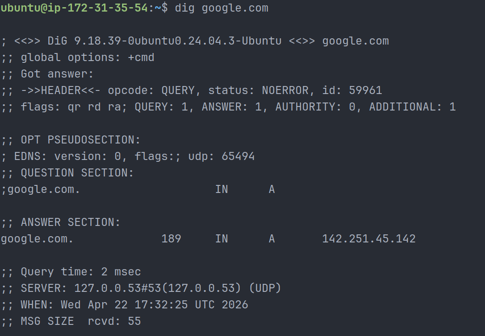
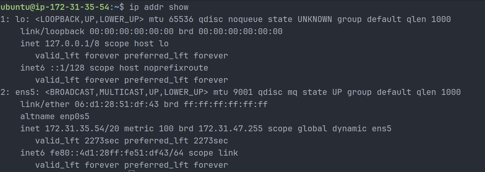
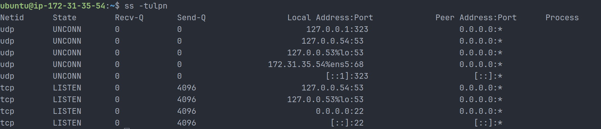

# Day 15 – Networking Concepts: DNS, IP, Subnets & Ports

## Overview

Today’s focus was on understanding core networking concepts required for DevOps, including DNS resolution, IP addressing, CIDR/subnetting, and ports. Hands-on commands like `dig`, `ip addr`, and `ss` were used to validate concepts in a real environment.

---

## Task 1: DNS – How Names Become IPs

### What happens when you type `google.com` in a browser?

- The browser checks local DNS cache.
- If not found, it queries a DNS resolver.
- The resolver contacts root, TLD, and authoritative DNS servers.
- The IP address is returned and used to establish a connection.

### DNS Record Types

- A → Maps domain to IPv4 address
- AAAA → Maps domain to IPv6 address
- CNAME → Alias for another domain
- MX → Mail server record
- NS → Name server record

### Command Output: `dig google.com`

```bash
;; ANSWER SECTION:
google.com.     189     IN      A       142.251.45.142
```



- A Record IP: 142.251.45.142
- TTL: 189 seconds
- DNS Server Used: 127.0.0.53 (local resolver)

---

## Task 2: IP Addressing

### What is an IPv4 address?

An IPv4 address is a 32-bit number written in dotted decimal format (e.g., 192.168.1.10) used to identify devices on a network.

### Public vs Private IP

- Public IP → Accessible over the internet (e.g., 8.8.8.8)
- Private IP → Used within internal networks (e.g., 172.31.35.54)

### Private IP Ranges

- 10.0.0.0 – 10.255.255.255
- 172.16.0.0 – 172.31.255.255
- 192.168.0.0 – 192.168.255.255

### Command Output: `ip addr show`

```bash
inet 172.31.35.54/20 brd 172.31.47.255 scope global dynamic ens5
```



- Identified IP: 172.31.35.54/20 (Private IP in AWS VPC)

---

## Task 3: CIDR & Subnetting

### What does `/24` mean?

- First 24 bits represent the network
- Remaining 8 bits are for host addresses

### Host Calculations

- /24 → 256 total, 254 usable
- /16 → 65536 total, 65534 usable
- /28 → 16 total, 14 usable

### Why do we subnet?

- Better network organization
- Improved security and isolation
- Reduced broadcast traffic
- Efficient IP utilization

### CIDR Table

| CIDR | Subnet Mask     | Total IPs | Usable Hosts |
| ---- | --------------- | --------- | ------------ |
| /24  | 255.255.255.0   | 256       | 254          |
| /16  | 255.255.0.0     | 65536     | 65534        |
| /28  | 255.255.255.240 | 16        | 14           |

---

## Task 4: Ports – The Doors to Services

### What is a port?

A port is a logical communication endpoint that allows multiple services to run on a single IP address.

### Common Ports

| Port  | Service |
| ----- | ------- |
| 22    | SSH     |
| 80    | HTTP    |
| 443   | HTTPS   |
| 53    | DNS     |
| 3306  | MySQL   |
| 6379  | Redis   |
| 27017 | MongoDB |

### Command Output: `ss -tulpn`

```bash
udp   UNCONN  127.0.0.53:53
udp   UNCONN  172.31.35.54:68
tcp   LISTEN  0.0.0.0:22
tcp   LISTEN  [::]:22
```



### Identified Services

- Port 22 → SSH (remote access)
- Port 53 → DNS resolver (systemd-resolved)
- Port 68 → DHCP client

---

## Task 5: Putting It Together

### curl [http://myapp.com:8080](http://myapp.com:8080)

- DNS resolves domain to IP
- Port 8080 identifies the service
- HTTP protocol is used for communication

### App cannot reach DB (10.0.1.50:3306)

- Check network connectivity
- Verify port accessibility
- Inspect firewall/security group rules
- Ensure database service is running

---

## Key Learnings

1. DNS converts domain names into IP addresses.
2. Private IP ranges are used in cloud environments like AWS.
3. Ports are essential for identifying and accessing services.

---
