# Day 29 – Introduction to Docker

## Objective

The goal of Day 29 was to understand the basics of Docker, learn why containers are useful in DevOps, install Docker, and run the first few containers successfully.

Docker is a containerization platform that helps package applications with their dependencies so they can run consistently across different environments.

---

## Task 1: What is Docker?

### What is a Container?

A container is a lightweight and isolated environment used to run an application along with everything it needs.

A container usually includes:

- Application code
- Runtime
- Libraries
- Dependencies
- Configuration files

Containers help solve a common problem in software development:

```text
It works on my machine, but not on the server.
```

With Docker, the same container can run on a developer laptop, test server, production server, or cloud instance with consistent behavior.

---

## Why Do We Need Containers?

Containers are useful because they make application deployment easier and more reliable.

Main benefits of containers:

- Consistent environment across development, testing, and production
- Faster application deployment
- Lightweight compared to virtual machines
- Easy to start, stop, and remove
- Better resource usage
- Easy scaling
- Useful for CI/CD pipelines
- Foundation for Kubernetes and microservices

In DevOps, containers are used to package applications, test services, deploy workloads, and run applications in cloud environments.

---

## Containers vs Virtual Machines

| Feature          | Containers                               | Virtual Machines               |
| ---------------- | ---------------------------------------- | ------------------------------ |
| Startup Speed    | Fast                                     | Slower                         |
| Size             | Lightweight                              | Heavy                          |
| Operating System | Shares host OS kernel                    | Runs full guest OS             |
| Resource Usage   | Low                                      | High                           |
| Portability      | Very portable                            | Less portable                  |
| Isolation        | Process-level isolation                  | Full machine-level isolation   |
| Best Use Case    | Application deployment and microservices | Running full operating systems |

### Simple Explanation

A virtual machine runs a complete operating system on top of a hypervisor.

A container shares the host machine's operating system kernel and only includes the application and required dependencies.

This is why containers are faster, smaller, and easier to move between environments.

---

## Docker Architecture

Docker uses a client-server architecture.

### Main Docker Components

#### 1. Docker Client

The Docker client is the command-line tool used to send commands to Docker.

Example:

```bash
docker run hello-world
```

When we run Docker commands, the Docker client sends requests to the Docker daemon.

---

#### 2. Docker Daemon

The Docker daemon is the background service that manages Docker objects.

It is responsible for:

- Pulling images
- Building images
- Running containers
- Stopping containers
- Removing containers
- Managing Docker networks and volumes

---

#### 3. Docker Images

A Docker image is a read-only template used to create containers.

Examples of Docker images:

- `hello-world`
- `nginx`
- `ubuntu`
- `mysql`
- `python`

An image contains everything required to run an application.

---

#### 4. Docker Containers

A Docker container is a running instance of a Docker image.

Example:

```bash
docker run nginx
```

This command uses the `nginx` image to create and run an Nginx container.

---

#### 5. Docker Registry

A Docker registry is used to store and distribute Docker images.

The most common public Docker registry is Docker Hub.

If an image is not available locally, Docker pulls it from Docker Hub.

Example:

```bash
docker pull nginx
```

---

## Docker Architecture in My Own Words

Docker works like this:

1. I run a Docker command from the terminal.
2. The Docker client sends the request to the Docker daemon.
3. The Docker daemon checks if the required image is available locally.
4. If the image is not available, Docker pulls it from Docker Hub.
5. Docker creates a container from the image.
6. The container runs the application in an isolated environment.

### Docker Architecture Flow

```text
User
 |
 | docker command
 v
Docker Client
 |
 | request
 v
Docker Daemon
 |
 | pulls image if needed
 v
Docker Hub / Registry
 |
 | image
 v
Docker Image
 |
 | creates
 v
Docker Container
```

---

## Task 2: Install Docker

### Check Docker Version

Command used:

```bash
docker --version
```

Output:

```text
Docker version 29.1.3, build 29.1.3-0ubuntu4.1
```

### Screenshot

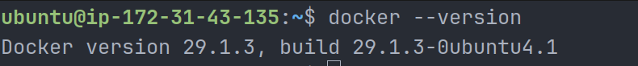

This confirmed that Docker was installed successfully.

---

## Check Docker System Information

Command used:

```bash
docker info
```

This command displayed Docker client and server details.

Important details observed:

- Docker client version: `29.1.3`
- Docker server version: `29.1.3`
- Storage driver: `overlayfs`
- Logging driver: `json-file`
- Cgroup driver: `systemd`
- Running containers: `0`
- Images: `0`

### Screenshot

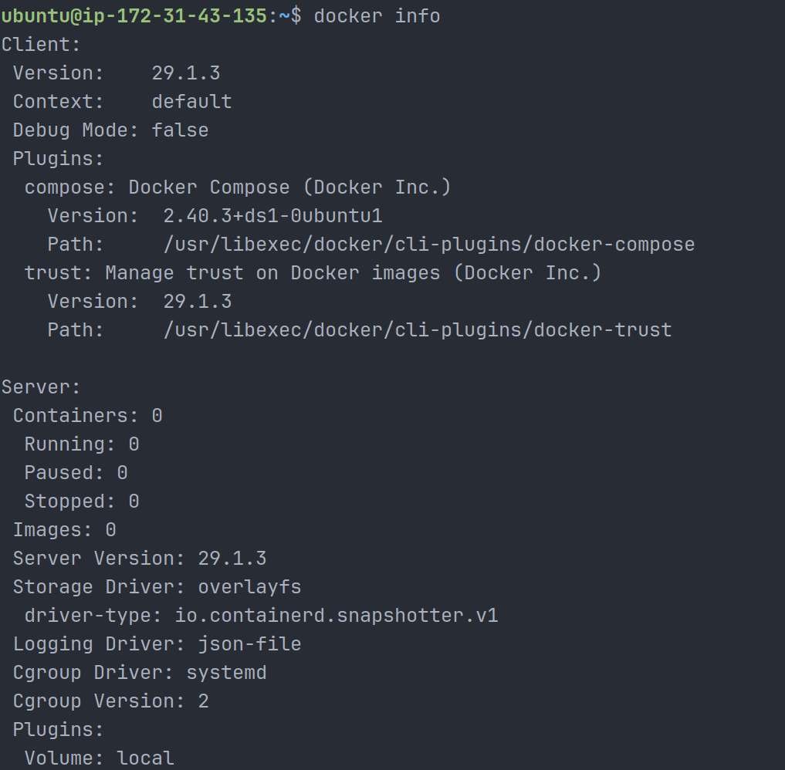

This confirmed that the Docker daemon was running correctly.

---

## Run Hello World Container

Command used:

```bash
docker run hello-world
```

### What Happened?

Docker performed the following steps:

1. Checked if the `hello-world` image was available locally.
2. The image was not found locally.
3. Docker pulled the image from Docker Hub.
4. Docker created a new container from the image.
5. The container printed the Hello from Docker message.
6. The container exited after completing its task.

### Screenshot

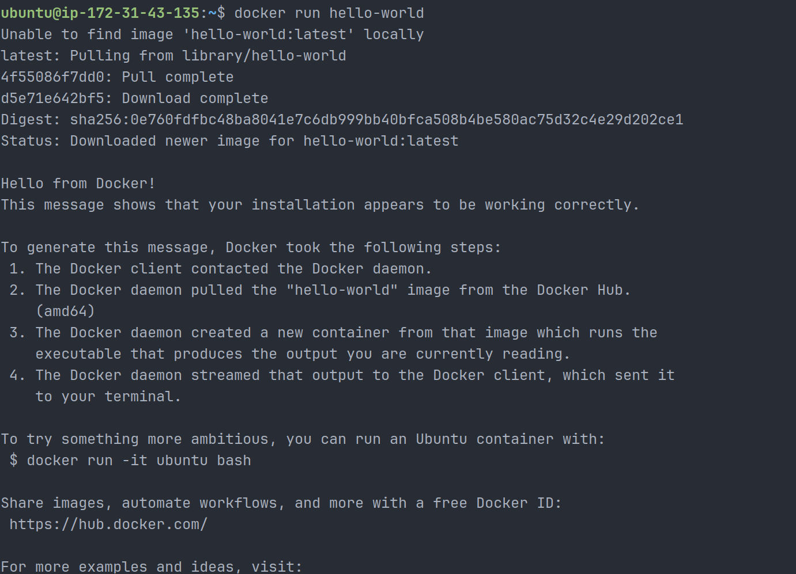

This confirmed that Docker was installed and working properly.

---

## Task 3: Run Real Containers

## Run an Nginx Container

Command used:

```bash
docker run -d -p 8080:80 --name my-nginx nginx
```

### Command Explanation

| Command Part      | Meaning                                  |
| ----------------- | ---------------------------------------- |
| `docker run`      | Creates and runs a new container         |
| `-d`              | Runs the container in detached mode      |
| `-p 8080:80`      | Maps host port 8080 to container port 80 |
| `--name my-nginx` | Gives the container a custom name        |
| `nginx`           | Uses the Nginx image                     |

After running the container, I checked it using:

```bash
docker ps
```

### Screenshot

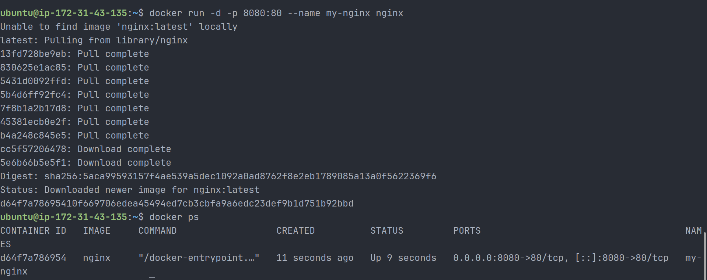

This showed that the Nginx container was running successfully.

---

## Access Nginx in Browser

The Nginx container was accessed from the browser using:

```text
http://52.12.23.139:8080
```

The browser displayed the default Nginx welcome page.

### Screenshot

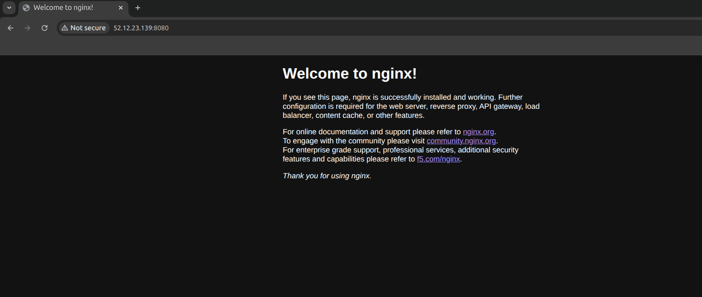

This proved that port mapping worked successfully and the containerized Nginx service was reachable from outside the container.

---

## Run Ubuntu Container in Interactive Mode

Command used:

```bash
docker run -it ubuntu bash
```

### Command Explanation

| Command Part | Meaning                                  |
| ------------ | ---------------------------------------- |
| `-i`         | Keeps input open                         |
| `-t`         | Allocates a terminal                     |
| `ubuntu`     | Uses the Ubuntu image                    |
| `bash`       | Starts a Bash shell inside the container |

Inside the Ubuntu container, I ran:

```bash
cat /etc/os-release
whoami
pwd
ls
```

Observed output:

```text
PRETTY_NAME="Ubuntu 26.04 LTS"
whoami: root
pwd: /
```

### Screenshot

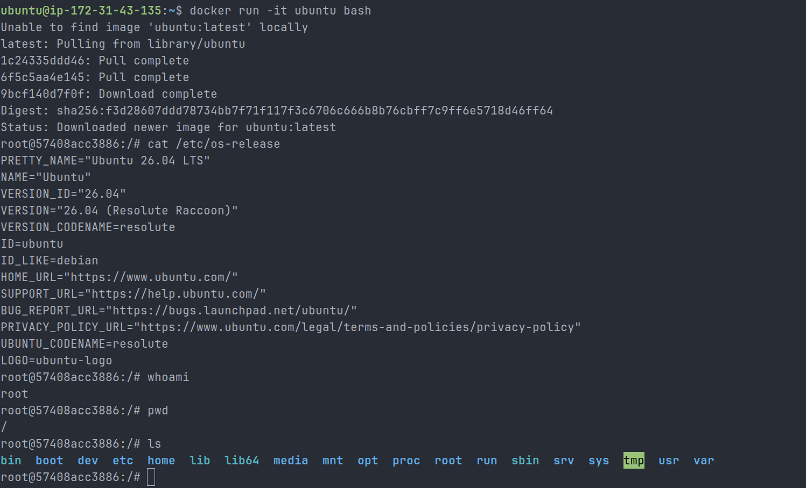

This confirmed that I successfully entered and explored an Ubuntu container like a mini Linux machine.

---

## List Running Containers

Command used:

```bash
docker ps
```

This command showed the currently running containers.

The Nginx container `my-nginx` was running and mapped to port `8080`.

### Screenshot

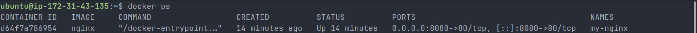

---

## List All Containers

Command used:

```bash
docker ps -a
```

This command showed both running and stopped containers.

Containers visible:

- Ubuntu container
- Nginx container
- Hello World container

### Screenshot

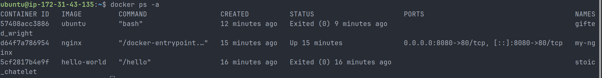

---

## Stop Nginx Container

Command used:

```bash
docker stop my-nginx
```

Then I verified using:

```bash
docker ps
```

The output showed no running containers.

### Screenshot

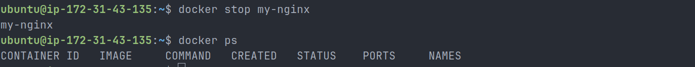

This confirmed that the Nginx container was stopped successfully.

---

## Remove Nginx Container

Command used:

```bash
docker rm my-nginx
```

Then I verified using:

```bash
docker ps -a
```

The `my-nginx` container was no longer listed.

### Screenshot

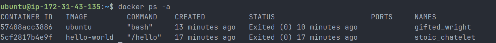

This confirmed that the stopped Nginx container was removed successfully.

---

## Task 4: Explore Docker Commands

## Run a Container in Detached Mode with Custom Name and Port Mapping

Command used:

```bash
docker run -d -p 8081:80 --name nginx-explore nginx
```

Then I checked the running container using:

```bash
docker ps
```

### What This Command Demonstrated

- Detached mode using `-d`
- Custom container name using `--name nginx-explore`
- Port mapping using `-p 8081:80`

### Screenshot

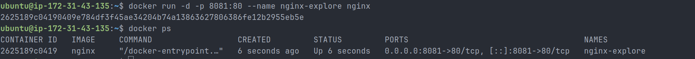

This confirmed that the container was running in the background with a custom name and mapped port.

---

## Check Logs of a Running Container

Command used:

```bash
docker logs nginx-explore
```

The logs showed the Nginx startup process.

Important log messages observed:

```text
Configuration complete; ready for start up
nginx/1.31.1
start worker processes
```

### Screenshot

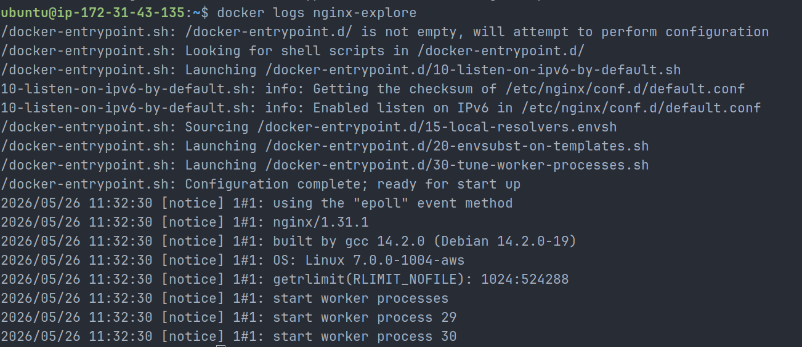

This command is useful in real DevOps work for debugging container startup issues and checking application activity.

---

## Run a Command Inside a Running Container

Command used:

```bash
docker exec -it nginx-explore sh
```

Inside the container, I ran:

```bash
hostname
ps
pwd
ls
whoami
exit
```

Observed output:

```text
hostname: 2625189c0419
pwd: /
whoami: root
```

### Screenshot

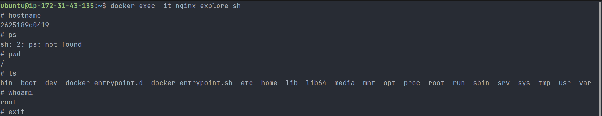

This confirmed that I successfully entered a running container and executed commands inside it.

---

## Observation: `ps` Command Not Found Inside Nginx Container

While exploring the running Nginx container using `docker exec`, I tried running the `ps` command, but it showed:

```text
sh: 2: ps: not found
```

This happened because official Docker images are often minimal and only include the packages required to run the application.

In real DevOps work, minimal images are preferred because they are smaller, faster, and have fewer security risks.

---

## Clean Up Containers

Commands used:

```bash
docker stop nginx-explore
docker rm nginx-explore
docker ps -a
```

After cleanup, only the stopped Ubuntu and Hello World containers remained.

### Screenshot

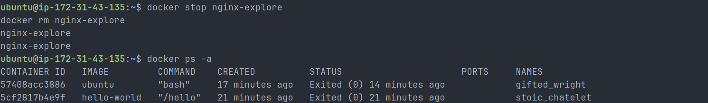

This confirmed that the running Nginx exploration container was stopped and removed successfully.

---

## Screenshots Captured

| Screenshot File                        | Purpose                               |
| -------------------------------------- | ------------------------------------- |
| `01-docker-version.png`                | Docker version verification           |
| `02-docker-info.png`                   | Docker daemon and system info         |
| `03-hello-world-container.png`         | First container execution             |
| `04-nginx-container-running.png`       | Nginx container running               |
| `05-nginx-browser-page.png`            | Nginx accessed in browser             |
| `06-ubuntu-interactive-container.png`  | Ubuntu interactive container          |
| `07-running-containers.png`            | Running containers list               |
| `08-all-containers.png`                | All containers list                   |
| `09-stop-nginx-container.png`          | Stopped Nginx container               |
| `10-remove-nginx-container.png`        | Removed Nginx container               |
| `11-detached-named-port-container.png` | Detached mode, name, and port mapping |
| `12-nginx-container-logs.png`          | Nginx container logs                  |
| `13-exec-inside-container.png`         | Command execution inside container    |
| `14-cleanup-containers.png`            | Final cleanup verification            |

---

## Common Docker Commands Practiced

| Command                                          | Purpose                                     |
| ------------------------------------------------ | ------------------------------------------- |
| `docker --version`                               | Check Docker version                        |
| `docker info`                                    | Show Docker system information              |
| `docker run hello-world`                         | Run test container                          |
| `docker run -d nginx`                            | Run container in detached mode              |
| `docker run -d -p 8080:80 --name my-nginx nginx` | Run named Nginx container with port mapping |
| `docker run -it ubuntu bash`                     | Run Ubuntu interactively                    |
| `docker ps`                                      | List running containers                     |
| `docker ps -a`                                   | List all containers                         |
| `docker stop <container>`                        | Stop a running container                    |
| `docker rm <container>`                          | Remove a stopped container                  |
| `docker logs <container>`                        | View container logs                         |
| `docker exec -it <container> sh`                 | Enter a running container                   |

---

## Key Learnings

- Docker is used to run applications inside containers.
- Containers are lightweight compared to virtual machines.
- Docker images are templates used to create containers.
- Containers are running instances of images.
- Docker Hub is a registry used to download images.
- `docker run` creates and starts containers.
- `docker ps` shows running containers.
- `docker ps -a` shows all containers.
- Detached mode runs containers in the background.
- Port mapping allows host traffic to reach container services.
- `docker logs` helps debug containers.
- `docker exec` allows running commands inside a running container.
- Minimal Docker images may not include common Linux tools like `ps`.

---

## Why Docker Matters for DevOps

Docker is important in DevOps because it makes application deployment consistent, repeatable, and easier to automate.

In real DevOps workflows, Docker is used for:

- Packaging applications
- Running services in isolated environments
- Creating CI/CD pipeline build environments
- Deploying microservices
- Testing applications consistently
- Running workloads on Kubernetes
- Improving development and production consistency

Docker is also a strong foundation for learning Kubernetes, container orchestration, and cloud-native deployments.

---

## Final Summary

Today I learned the basics of Docker and completed hands-on container practice.

I successfully:

- Verified Docker installation
- Checked Docker system information
- Ran the `hello-world` container
- Ran an Nginx web server container
- Accessed Nginx from a browser
- Ran Ubuntu in interactive mode
- Listed running and stopped containers
- Stopped and removed containers
- Ran containers in detached mode
- Used custom container names
- Practiced port mapping
- Checked container logs
- Executed commands inside a running container
- Cleaned up containers after practice

This was my first practical step into containerization and modern DevOps deployment workflows.
