# Day 32 – Docker Volumes & Networking

## Objective

The goal of Day 32 was to understand how Docker handles persistent data and container-to-container communication.

This lab focused on two real-world Docker problems:

1. Containers lose internal data when they are removed.
2. Containers need proper networking to communicate reliably.

---

## Environment

- Operating System: Ubuntu EC2 Instance
- Docker Image Used for Database: `postgres:16`
- Web Server Image: `nginx`
- App/Test Container Image: `ubuntu`
- Database Name: `devopsdb`
- Database User: `postgres`

---

## Task 1: The Problem – Data Loss Without Volumes

### Goal

Run a PostgreSQL container without using any volume, create data inside it, remove the container, and verify whether the data still exists in a new container.

### Commands Used

```bash
docker run -d \
  --name postgres-no-volume \
  -e POSTGRES_PASSWORD=devops123 \
  -e POSTGRES_DB=devopsdb \
  postgres:16
```

```bash
docker ps
```

```bash
docker exec -it postgres-no-volume psql -U postgres -d devopsdb
```

Inside PostgreSQL:

```sql
CREATE TABLE learners (
    id SERIAL PRIMARY KEY,
    name VARCHAR(50),
    skill VARCHAR(50)
);

INSERT INTO learners (name, skill)
VALUES
('Preetham', 'Docker'),
('DevOps Student', 'Volumes');

SELECT * FROM learners;
```

Then the container was stopped and removed:

```bash
docker stop postgres-no-volume
docker rm postgres-no-volume
```

A new PostgreSQL container was created without attaching the previous data:

```bash
docker run -d \
  --name postgres-new \
  -e POSTGRES_PASSWORD=devops123 \
  -e POSTGRES_DB=devopsdb \
  postgres:16
```

The table was checked again:

```bash
docker exec -it postgres-new psql -U postgres -d devopsdb
```

```sql
SELECT * FROM learners;
```

### Output

```text
ERROR:  relation "learners" does not exist
LINE 1: SELECT * FROM learners;
                      ^
```

### Observation

The new container did not contain the `learners` table.

### Explanation

The data was stored inside the container filesystem. When the container was removed, its internal filesystem was also removed. Because no external volume was used, the data was lost permanently.

### Screenshot

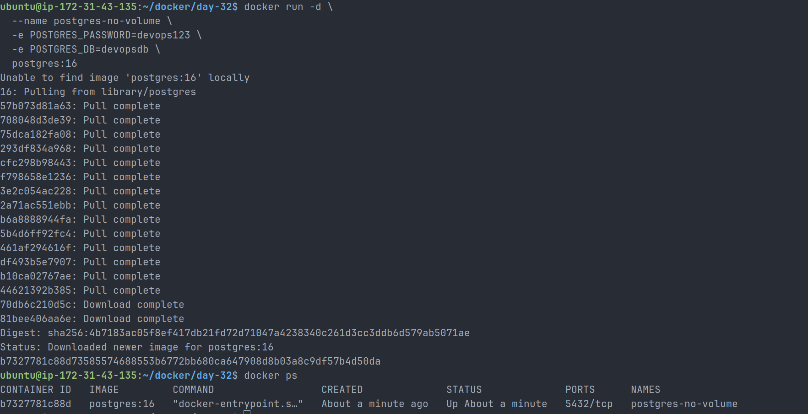

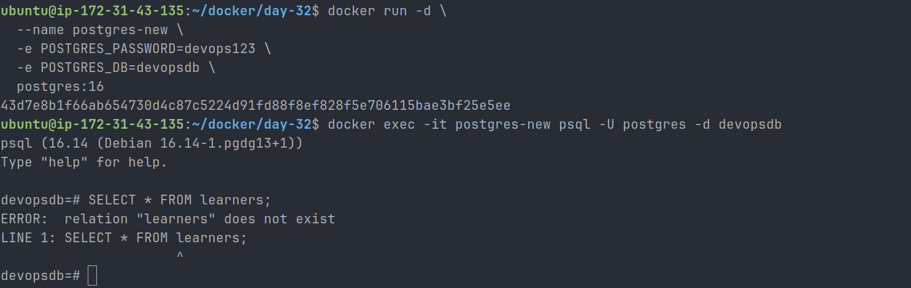

---

## Task 2: Named Volumes

### Goal

Use a Docker named volume to persist PostgreSQL data even after the container is removed.

### Commands Used

```bash
docker volume create postgres_data
```

```bash
docker volume ls
```

```bash
docker run -d \
  --name postgres-volume \
  -e POSTGRES_PASSWORD=devops123 \
  -e POSTGRES_DB=devopsdb \
  -v postgres_data:/var/lib/postgresql/data \
  postgres:16
```

```bash
docker exec -it postgres-volume psql -U postgres -d devopsdb
```

Inside PostgreSQL:

```sql
CREATE TABLE learners (
    id SERIAL PRIMARY KEY,
    name VARCHAR(50),
    skill VARCHAR(50)
);

INSERT INTO learners (name, skill)
VALUES
('Preetham', 'Docker Volumes'),
('DevOps Engineer', 'Data Persistence');

SELECT * FROM learners;
```

The first container was stopped and removed:

```bash
docker stop postgres-volume
docker rm postgres-volume
```

A new container was created using the same named volume:

```bash
docker run -d \
  --name postgres-volume-new \
  -e POSTGRES_PASSWORD=devops123 \
  -e POSTGRES_DB=devopsdb \
  -v postgres_data:/var/lib/postgresql/data \
  postgres:16
```

The data was checked again:

```bash
docker exec -it postgres-volume-new psql -U postgres -d devopsdb
```

```sql
SELECT * FROM learners;
```

### Output

```text
 id |      name       |      skill
----+-----------------+------------------
  1 | Preetham        | Docker Volumes
  2 | DevOps Engineer | Data Persistence
(2 rows)
```

### Volume Inspection

```bash
docker volume inspect postgres_data
```

Important output:

```text
"Mountpoint": "/var/lib/docker/volumes/postgres_data/_data",
"Name": "postgres_data",
"Scope": "local"
```

### Observation

The data was still available after deleting the original container and creating a new one with the same volume.

### Explanation

Docker named volumes are stored outside the container lifecycle. Containers can be removed and recreated, but the data remains inside the Docker-managed volume.

### Screenshot

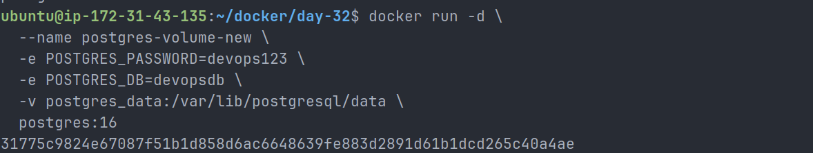

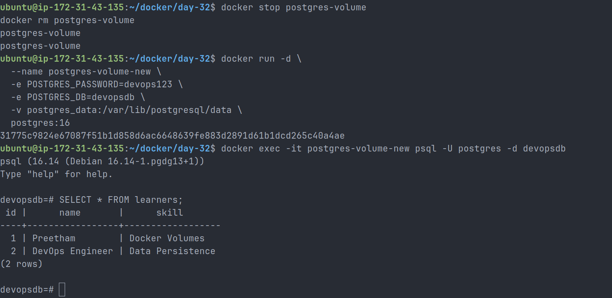

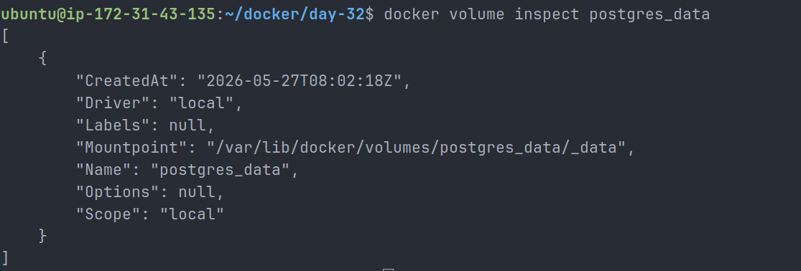

---

## Task 3: Bind Mounts

### Goal

Use a bind mount to serve a local `index.html` file through an Nginx container.

### Commands Used

```bash
mkdir nginx-site
cd nginx-site
touch index.html
```

Initial `index.html` file:

```html
<!DOCTYPE html>
<html>
  <head>
    <title>Docker Bind Mount</title>
  </head>
  <body>
    <h1>Hello from Docker Bind Mount!</h1>
    <p>This page is served from my host machine.</p>
  </body>
</html>
```

Nginx container was started with a bind mount:

```bash
docker run -d \
  --name nginx-bind \
  -p 8080:80 \
  -v $(pwd)/nginx-site:/usr/share/nginx/html \
  nginx
```

The page was accessed in the browser:

```text
http://54.200.67.162:8080
```

Then the host file was updated:

```html
<!DOCTYPE html>
<html>
  <head>
    <title>Docker Bind Mount Updated</title>
  </head>
  <body>
    <h1>Updated from Host Machine!</h1>
    <p>The Nginx container reflected the change immediately.</p>
  </body>
</html>
```

### Observation

After editing the `index.html` file on the host machine, the browser reflected the change immediately after refresh.

### Named Volume vs Bind Mount

| Feature          | Named Volume                             | Bind Mount                                |
| ---------------- | ---------------------------------------- | ----------------------------------------- |
| Managed by       | Docker                                   | Host user/system                          |
| Storage location | Docker-controlled path                   | Specific host directory                   |
| Best use case    | Databases and persistent app data        | Local development and file sharing        |
| Portability      | More portable                            | Depends on host path                      |
| Example          | `postgres_data:/var/lib/postgresql/data` | `$(pwd)/nginx-site:/usr/share/nginx/html` |

### Explanation

A named volume is best for persistent container data like databases because Docker manages the storage location.

A bind mount is best when files need to be edited directly from the host machine and reflected inside the container immediately.

### Screenshot

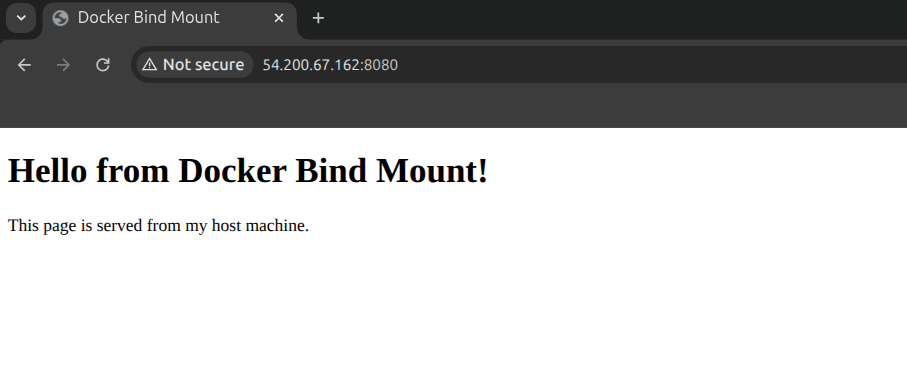

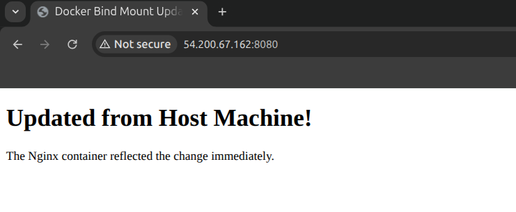

---

## Task 4: Docker Networking Basics

### Goal

Understand how containers communicate on Docker's default bridge network.

### Commands Used

```bash
docker network ls
```

Output showed the default Docker networks:

```text
NETWORK ID     NAME      DRIVER    SCOPE
a65ad2c414d7   bridge    bridge    local
4310bbc2b2b3   host      host      local
cc570c202ba8   none      null      local
```

The default bridge network was inspected:

```bash
docker network inspect bridge
```

Two containers were created on the default bridge network:

```bash
docker run -dit --name container1 ubuntu bash
docker run -dit --name container2 ubuntu bash
```

Ping was installed:

```bash
docker exec container1 apt update
docker exec container1 apt install -y iputils-ping

docker exec container2 apt update
docker exec container2 apt install -y iputils-ping
```

Ping by container name was tested:

```bash
docker exec container1 ping -c 4 container2
```

### Output

```text
ping: container2: Name or service not known
```

Then the IP address of `container2` was checked:

```bash
docker inspect -f '{{range.NetworkSettings.Networks}}{{.IPAddress}}{{end}}' container2
```

Output:

```text
172.17.0.5
```

Ping by IP was tested:

```bash
docker exec container1 ping -c 4 172.17.0.5
```

### Output

```text
4 packets transmitted, 4 received, 0% packet loss
```

### Observation

On the default bridge network:

- Ping by container name failed.
- Ping by container IP address worked.

### Explanation

The default bridge network allows basic container communication by IP address, but it does not provide automatic DNS-based name resolution for container names.

### Screenshot

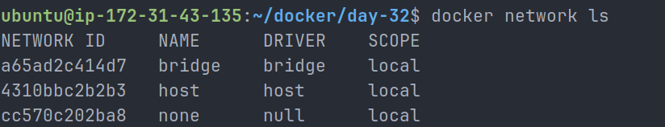

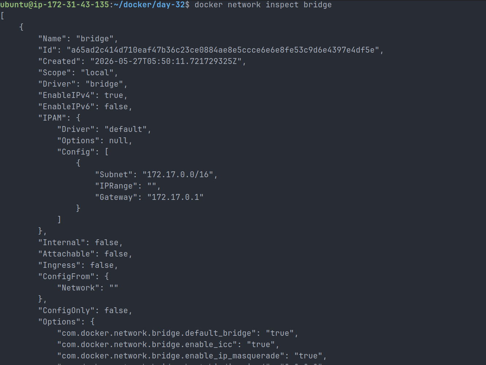

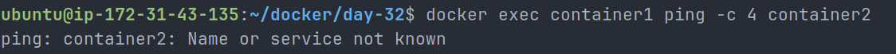

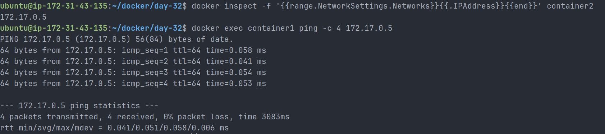

---

## Task 5: Custom Networks

### Goal

Create a custom bridge network and verify container name-based communication.

### Commands Used

```bash
docker network create my-app-net
```

```bash
docker network ls
```

Two containers were created on the custom network:

```bash
docker run -dit --name app1 --network my-app-net ubuntu bash
docker run -dit --name app2 --network my-app-net ubuntu bash
```

Ping was installed inside both containers:

```bash
docker exec app1 apt update
docker exec app1 apt install -y iputils-ping

docker exec app2 apt update
docker exec app2 apt install -y iputils-ping
```

Ping by container name was tested:

```bash
docker exec app1 ping -c 4 app2
```

### Output

```text
PING app2 (172.18.0.3) 56(84) bytes of data.
64 bytes from app2.my-app-net (172.18.0.3): icmp_seq=1 ttl=64 time=0.067 ms
64 bytes from app2.my-app-net (172.18.0.3): icmp_seq=2 ttl=64 time=0.054 ms
64 bytes from app2.my-app-net (172.18.0.3): icmp_seq=3 ttl=64 time=0.057 ms
64 bytes from app2.my-app-net (172.18.0.3): icmp_seq=4 ttl=64 time=0.055 ms

4 packets transmitted, 4 received, 0% packet loss
```

### Observation

Containers on the custom network were able to communicate using container names.

### Explanation

User-defined bridge networks provide built-in DNS resolution. This means Docker automatically resolves container names to container IP addresses inside that custom network.

This is why `app1` could reach `app2` by name.

### Screenshot

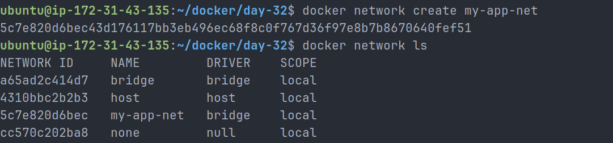

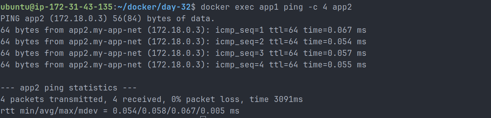

---

## Task 6: Put It Together

### Goal

Run a database container and an app container on the same custom network. The database must also use a named volume for persistence.

### Commands Used

A custom network was created:

```bash
docker network create devops-net
```

A named volume was created:

```bash
docker volume create devops_postgres_data
```

PostgreSQL database container was started:

```bash
docker run -d \
  --name devops-db \
  --network devops-net \
  -e POSTGRES_PASSWORD=devops123 \
  -e POSTGRES_DB=devopsdb \
  -v devops_postgres_data:/var/lib/postgresql/data \
  postgres:16
```

App container was started on the same network:

```bash
docker run -dit \
  --name devops-app \
  --network devops-net \
  ubuntu bash
```

Required tools were installed in the app container:

```bash
docker exec devops-app apt update
docker exec devops-app apt install -y iputils-ping postgresql-client
```

The app container tested network connectivity to the database container by name:

```bash
docker exec devops-app ping -c 4 devops-db
```

### Ping Output

```text
PING devops-db (172.19.0.2) 56(84) bytes of data.
64 bytes from devops-db.devops-net (172.19.0.2): icmp_seq=1 ttl=64 time=0.059 ms
64 bytes from devops-db.devops-net (172.19.0.2): icmp_seq=2 ttl=64 time=0.056 ms
64 bytes from devops-db.devops-net (172.19.0.2): icmp_seq=3 ttl=64 time=0.041 ms
64 bytes from devops-db.devops-net (172.19.0.2): icmp_seq=4 ttl=64 time=0.057 ms

4 packets transmitted, 4 received, 0% packet loss
```

The app container connected to PostgreSQL using the database container name:

```bash
docker exec -it devops-app psql -h devops-db -U postgres -d devopsdb
```

Inside PostgreSQL:

```sql
SELECT version();
```

### PostgreSQL Output

```text
PostgreSQL 16.14 (Debian 16.14-1.pgdg13+1) on x86_64-pc-linux-gnu
```

### Observation

The app container successfully reached the database container using the name `devops-db`.

### Explanation

This setup combines two important Docker production patterns:

1. A named volume for database persistence.
2. A custom Docker network for reliable container-to-container communication.

This is similar to how real multi-container applications are designed before moving to tools like Docker Compose or Kubernetes.

### Screenshot

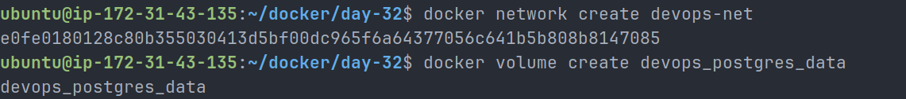

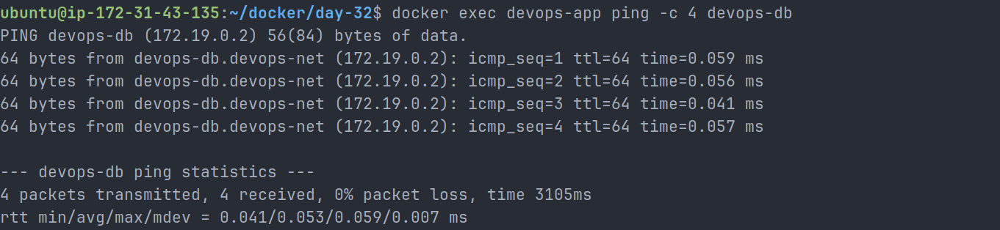

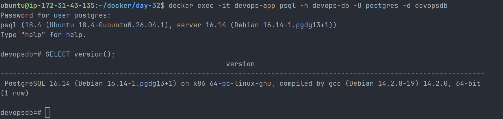

---

## Cleanup

After completing the lab, containers were stopped and removed:

```bash
docker stop postgres-volume-new nginx-bind container1 container2 app1 app2 devops-db devops-app
```

```bash
docker rm postgres-volume-new nginx-bind container1 container2 app1 app2 devops-db devops-app
```

Volumes were removed:

```bash
docker volume rm postgres_data devops_postgres_data
```

Networks were removed:

```bash
docker network rm my-app-net devops-net
```

---

## Key Learnings

- Containers are ephemeral by default.
- Data stored only inside a container is lost when the container is removed.
- Docker named volumes persist data outside the container lifecycle.
- Bind mounts are useful when host files need to be shared directly with containers.
- The default bridge network supports communication by IP address.
- The default bridge network does not provide automatic container name resolution.
- Custom bridge networks provide built-in DNS resolution.
- Real-world Docker applications usually combine persistent volumes with custom networks.

---

## Final Summary

Day 32 helped me understand why volumes and networks are important in Docker.

The main lesson was that containers should not be trusted for permanent data storage. If data must survive container removal, it should be stored in a Docker volume or an external storage system.

I also learned that custom Docker networks are important for multi-container applications because they allow containers to communicate using names instead of changing IP addresses.

This is a key concept for working with Docker Compose, microservices, Kubernetes, and real DevOps environments.
