# Day 33 – Docker Compose: Multi-Container Basics

## Overview

Today I learned how to use **Docker Compose** to run single-container and multi-container applications using a YAML configuration file.

In previous Docker tasks, containers, networks, and volumes were created manually using separate Docker commands. Docker Compose simplifies this workflow by allowing services, ports, volumes, networks, and environment variables to be managed from one `docker-compose.yml` file.

---

## Project Structure

```bash
docker/day-33/
├── compose-basics/
│   └── docker-compose.yml
├── screenshots/
│   ├── 01-docker-compose-version.png
│   ├── 02-nginx-compose-up.png
│   ├── 03-nginx-browser-running.png
│   ├── 04-nginx-compose-down.png
│   ├── 05-wordpress-mysql-compose-up.png
│   ├── 06-wordpress-compose-ps.png
│   ├── 07-wordpress-browser-setup.png
│   ├── 08-wordpress-dashboard.png
│   ├── 09-wordpress-data-persisted-after-restart.png
│   ├── 10-docker-volume-ls.png
│   ├── 11-compose-logs.png
│   ├── 12-compose-service-specific-logs.png
│   ├── 13-compose-stop-start.png
│   ├── 14-compose-down.png
│   ├── 15-docker-compose-config-env.png
│   └── 16-wordpress-env-vars.png
├── wordpress-mysql/
│   ├── docker-compose.yml
│   └── .env
├── day-33-compose.md
└── task.md
```

---

## Task 1: Install and Verify Docker Compose

### Commands Used

```bash
docker compose version
docker --version
```

### Output

```bash
Docker Compose version 2.40.3+ds1-0ubuntu1
Docker version 29.1.3, build 29.1.3-0ubuntu4.1
```

### Explanation

Docker Compose was already available on the system. The installed Compose version is `2.40.3`, and Docker Engine version is `29.1.3`.

### Screenshot

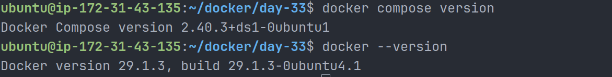

---

## Task 2: First Docker Compose File with Nginx

### Folder Created

```bash
mkdir compose-basics
cd compose-basics
```

### Compose File

File path:

```bash
compose-basics/docker-compose.yml
```

```yaml
services:
  nginx:
    image: nginx:latest
    container_name: compose-nginx
    ports:
      - "8080:80"
```

### Commands Used

```bash
docker compose up
```

Docker Compose created:

- A default network named `compose-basics_default`
- A container named `compose-nginx`

### Browser Verification

Nginx was accessed successfully from the browser using:

```text
http://54.200.67.162:8080
```

The browser showed the default **Welcome to nginx!** page.

### Stop and Remove Nginx Setup

```bash
docker compose down
```

This removed:

- The `compose-nginx` container
- The `compose-basics_default` network

### Screenshots

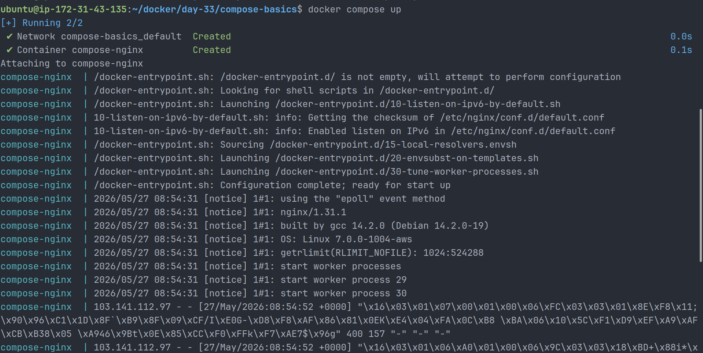

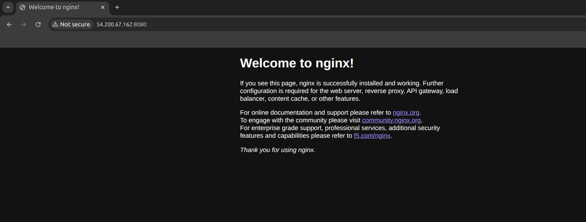

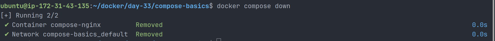

---

## Task 3: WordPress and MySQL Multi-Container Setup

### Folder Created

```bash
mkdir wordpress-mysql
cd wordpress-mysql
```

This task used two services:

- `wordpress`
- `mysql`

Docker Compose automatically created a default network so both containers could communicate with each other.

---

## Environment File

File path:

```bash
wordpress-mysql/.env
```

```env
MYSQL_DATABASE=wordpressdb
MYSQL_USER=wpuser
MYSQL_PASSWORD=wppassword
MYSQL_ROOT_PASSWORD=rootpassword
WORDPRESS_DB_HOST=mysql
WORDPRESS_DB_USER=wpuser
WORDPRESS_DB_PASSWORD=wppassword
WORDPRESS_DB_NAME=wordpressdb
```

### Explanation

The `.env` file stores environment variables separately from the Compose file. This makes the Compose file cleaner and easier to manage.

For this practice task, demo credentials were used. In real projects, sensitive `.env` files should not be committed to GitHub.

---

## WordPress and MySQL Compose File

File path:

```bash
wordpress-mysql/docker-compose.yml
```

```yaml
services:
  mysql:
    image: mysql:8.0
    container_name: compose-mysql
    restart: always
    environment:
      MYSQL_DATABASE: ${MYSQL_DATABASE}
      MYSQL_USER: ${MYSQL_USER}
      MYSQL_PASSWORD: ${MYSQL_PASSWORD}
      MYSQL_ROOT_PASSWORD: ${MYSQL_ROOT_PASSWORD}
    volumes:
      - mysql_data:/var/lib/mysql

  wordpress:
    image: wordpress:latest
    container_name: compose-wordpress
    restart: always
    depends_on:
      - mysql
    ports:
      - "8081:80"
    environment:
      WORDPRESS_DB_HOST: ${WORDPRESS_DB_HOST}
      WORDPRESS_DB_USER: ${WORDPRESS_DB_USER}
      WORDPRESS_DB_PASSWORD: ${WORDPRESS_DB_PASSWORD}
      WORDPRESS_DB_NAME: ${WORDPRESS_DB_NAME}

volumes:
  mysql_data:
```

---

## Starting WordPress and MySQL

### Command Used

```bash
docker compose up -d
```

### Output Summary

Docker Compose pulled the required images and started both containers:

```text
wordpress Pulled
mysql Pulled
Network wordpress-mysql_default Created
Volume wordpress-mysql_mysql_data Created
Container compose-mysql Started
Container compose-wordpress Started
```

### Screenshot

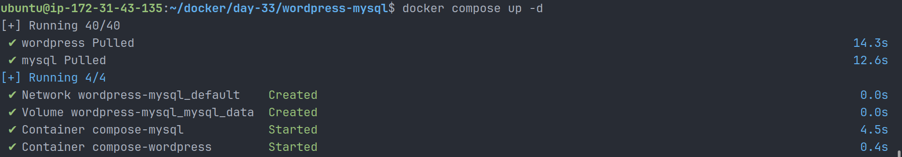

---

## Checking Running Services

### Command Used

```bash
docker compose ps
```

### Output Summary

```text
compose-mysql       mysql:8.0          Up        3306/tcp, 33060/tcp
compose-wordpress   wordpress:latest   Up        0.0.0.0:8081->80/tcp
```

### Explanation

The `mysql` service runs internally on port `3306`. The `wordpress` service is exposed externally on port `8081`, mapped to container port `80`.

### Screenshot

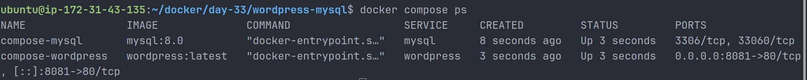

---

## Browser Verification

WordPress was accessed successfully using:

```text
http://54.200.67.162:8081
```

The WordPress installation page loaded successfully, confirming that WordPress could communicate with MySQL using the service name `mysql`.

### Screenshots

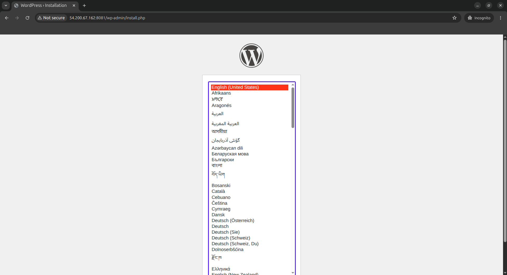

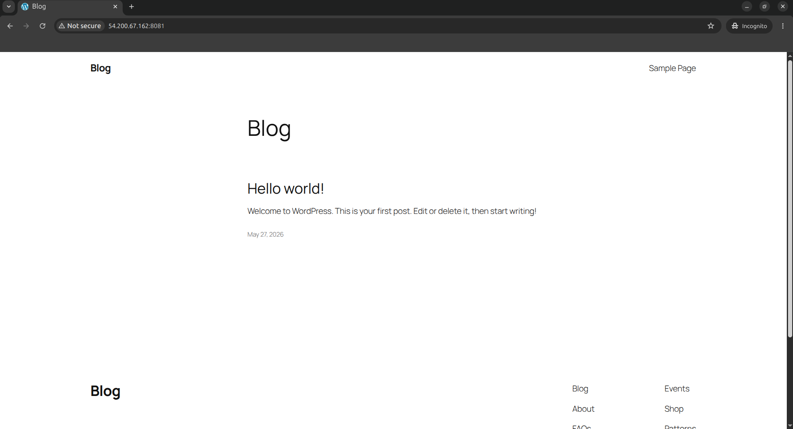

---

## Data Persistence Verification

### Commands Used

```bash
docker compose down
docker compose up -d
```

After restarting the containers, the WordPress site still loaded with the existing setup.

### Why Data Persisted

The MySQL container uses a named volume:

```yaml
volumes:
  - mysql_data:/var/lib/mysql
```

This means MySQL data is stored outside the container lifecycle. Even when containers are removed using `docker compose down`, the named volume remains unless `docker compose down -v` is used.

### Screenshot


---

## Docker Volume Verification

### Command Used

```bash
docker volume ls
```

### Output Summary

```text
local     wordpress-mysql_mysql_data
```

### Explanation

The named volume `wordpress-mysql_mysql_data` confirms that MySQL data is stored persistently.

### Screenshot

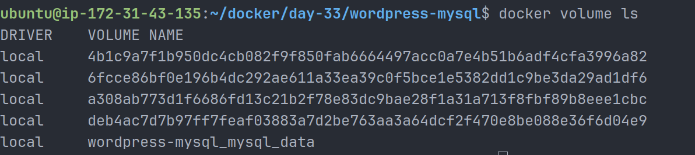

---

## Task 4: Docker Compose Commands Practiced

### 1. Start Services in Detached Mode

```bash
docker compose up -d
```

This starts services in the background.

---

### 2. View Running Services

```bash
docker compose ps
```

This lists containers managed by the current Compose project.

---

### 3. View Logs of All Services

```bash
docker compose logs
```

This displays logs from all services in the Compose file.

### Screenshot

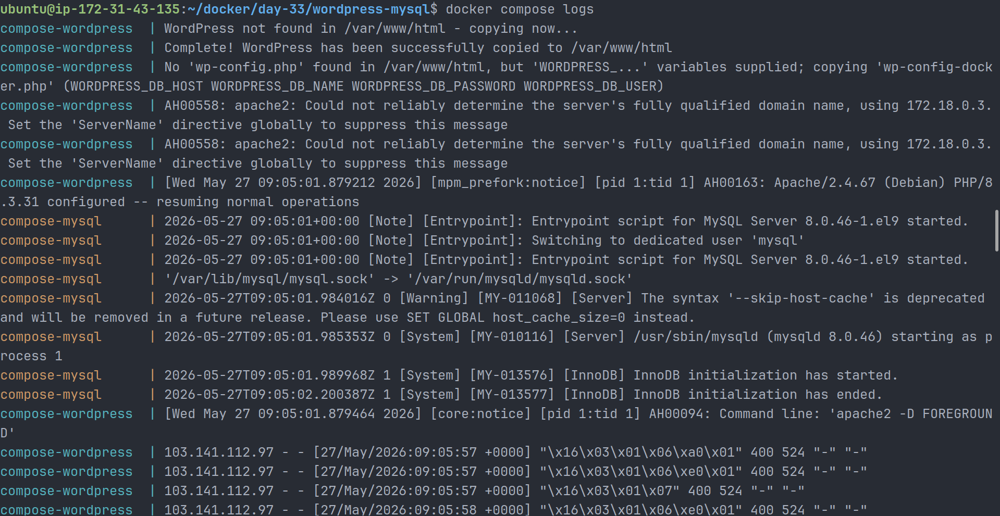

---

### 4. View Logs of a Specific Service

```bash
docker compose logs mysql
docker compose logs wordpress
```

This is useful when debugging only one service.

### Screenshot

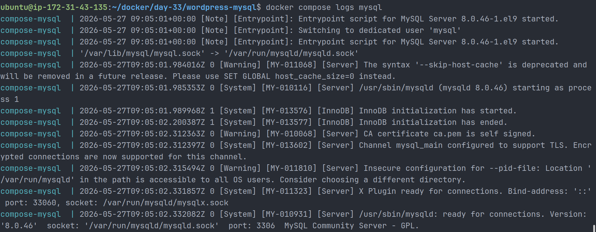

---

### 5. Stop Services Without Removing Containers

```bash
docker compose stop
```

This stops running containers but keeps them available.

---

### 6. Start Stopped Services

```bash
docker compose start
```

This starts existing stopped containers again.

### Screenshot

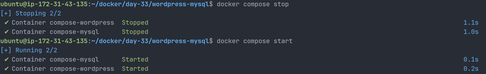

---

### 7. Remove Containers and Network

```bash
docker compose down
```

This removes containers and the default Compose network, but does not remove named volumes by default.

### Screenshot

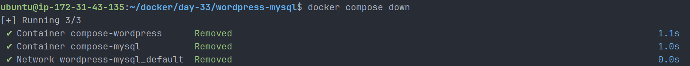

---

### 8. Rebuild Images if Changes Are Made

```bash
docker compose up -d --build
```

This rebuilds images before starting services. It is mainly useful when using a custom `Dockerfile`.

---

## Task 5: Environment Variables

Environment variables were added in the `.env` file and referenced inside the Compose file using the `${VARIABLE_NAME}` syntax.

### Verify Compose Configuration

```bash
docker compose config
```

### Output Summary

```yaml
MYSQL_DATABASE: wordpressdb
MYSQL_PASSWORD: wppassword
MYSQL_ROOT_PASSWORD: rootpassword
MYSQL_USER: wpuser
WORDPRESS_DB_HOST: mysql
WORDPRESS_DB_NAME: wordpressdb
WORDPRESS_DB_PASSWORD: wppassword
WORDPRESS_DB_USER: wpuser
```

### Explanation

The `docker compose config` command showed the final Compose configuration after reading the `.env` file. This confirms that the environment variables were picked up correctly.

### Screenshot

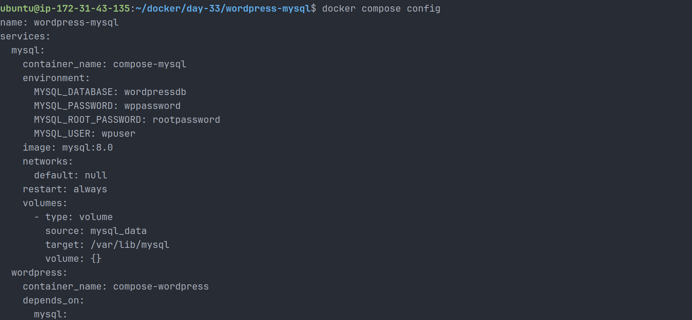

---

## Verifying Environment Variables Inside Container

### Command Used

```bash
docker exec -it compose-wordpress env | grep WORDPRESS
```

### Output

```bash
WORDPRESS_DB_HOST=mysql
WORDPRESS_DB_USER=wpuser
WORDPRESS_DB_PASSWORD=wppassword
WORDPRESS_DB_NAME=wordpressdb
```

### Explanation

This confirms that the WordPress container received the required database environment variables.

### Screenshot

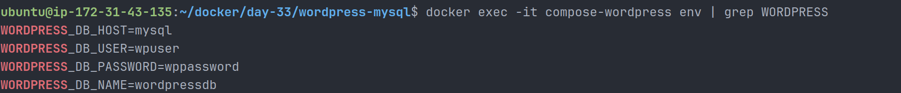

---

## Key Learnings

- Docker Compose allows multiple containers to be managed from one YAML file.
- Compose automatically creates a default network for services.
- Service names work as DNS names inside the Compose network.
- WordPress connected to MySQL using the service name `mysql`.
- Named volumes provide data persistence even after containers are removed.
- `.env` files help separate configuration values from Compose files.
- `docker compose config` is useful for validating the final Compose configuration.
- `docker compose logs` is useful for debugging services.

---

## Common Docker Compose Commands

| Command                         | Purpose                                       |
| ------------------------------- | --------------------------------------------- |
| `docker compose up`             | Start services in foreground                  |
| `docker compose up -d`          | Start services in detached mode               |
| `docker compose ps`             | List running Compose services                 |
| `docker compose logs`           | View logs from all services                   |
| `docker compose logs <service>` | View logs for a specific service              |
| `docker compose stop`           | Stop services without removing containers     |
| `docker compose start`          | Start stopped services                        |
| `docker compose down`           | Remove containers and networks                |
| `docker compose down -v`        | Remove containers, networks, and volumes      |
| `docker compose config`         | Validate and view final Compose configuration |
| `docker compose up -d --build`  | Rebuild and start services                    |

---

## Important Notes

- `docker compose down` removes containers and networks, but keeps named volumes.
- `docker compose down -v` removes volumes and can delete persistent database data.
- In production, passwords should not be hardcoded or committed to GitHub.
- For real projects, use `.env.example` for sample variables and add `.env` to `.gitignore`.

---

## Final Outcome

By completing this task, I successfully:

- Verified Docker Compose installation
- Ran an Nginx container using Docker Compose
- Created a multi-container WordPress and MySQL setup
- Used a named volume for MySQL data persistence
- Practiced important Docker Compose commands
- Used `.env` variables inside a Compose project
- Verified service logs, container status, volumes, and environment variables

Docker Compose is now clear as a practical tool for running multi-container applications with a single command.
