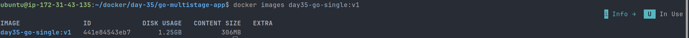
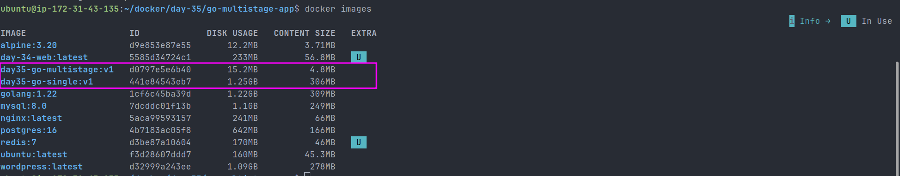
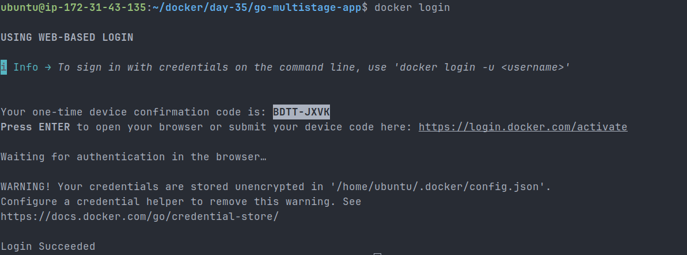
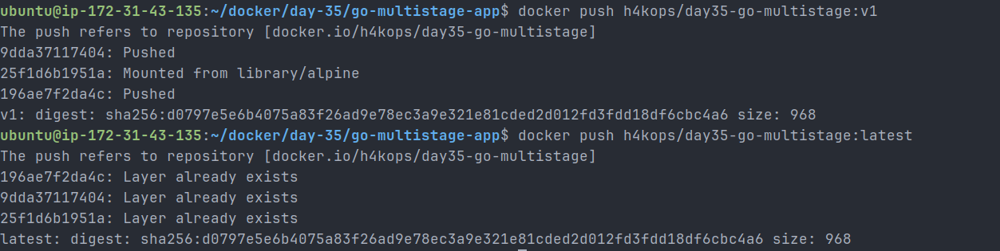
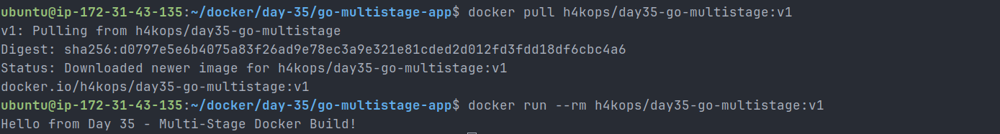
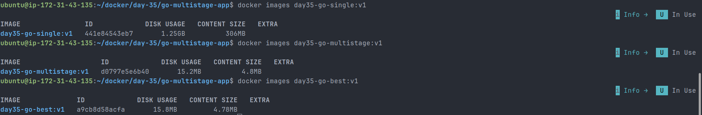

# Day 35 – Multi-Stage Builds & Docker Hub

## Objective

The goal of Day 35 was to learn how to build optimized Docker images using multi-stage builds and push them to Docker Hub.

Multi-stage builds are important in real DevOps workflows because they reduce image size, improve security, and keep build-time dependencies out of the final production image.

---

## Project Structure

```text
day-35/
├── README.md
├── task.md
├── day-35-multistage-hub.md
├── go-multistage-app/
│   ├── main.go
│   ├── Dockerfile.single
│   ├── Dockerfile.multistage
│   └── Dockerfile.best-practice
└── screenshots/
```

---

## Task 1: Single-Stage Docker Image

I created a simple Go application and built it using a single-stage Dockerfile.

### File: `main.go`

```go
package main

import "fmt"

func main() {
	fmt.Println("Hello from Day 35 - Multi-Stage Docker Build!")
}
```

### File: `Dockerfile.single`

```dockerfile
FROM golang:1.22

WORKDIR /app

COPY main.go .

RUN go build -o app main.go

CMD ["./app"]
```

### Build Command

```bash
docker build -t day35-go-single:v1 -f Dockerfile.single .
```

### Run Command

```bash
docker run --rm day35-go-single:v1
```

### Output

```text
Hello from Day 35 - Multi-Stage Docker Build!
```

### Image Size

```bash
docker images day35-go-single:v1
```

| Image                | Image ID       | Disk Usage | Content Size |
| -------------------- | -------------- | ---------: | -----------: |
| `day35-go-single:v1` | `441e84543eb7` |   `1.25GB` |      `306MB` |

### Screenshot



### Observation

The single-stage image was large because it included the full Go image, compiler, build tools, source code, and final binary in the same image.

This is not ideal for production because the final container only needs the compiled application binary.

---

## Task 2: Multi-Stage Docker Image

I created a multi-stage Dockerfile to separate the build stage from the runtime stage.

### File: `Dockerfile.multistage`

```dockerfile
FROM golang:1.22 AS builder

WORKDIR /app

COPY main.go .

RUN CGO_ENABLED=0 GOOS=linux go build -o app main.go

FROM alpine:3.20

WORKDIR /app

COPY --from=builder /app/app .

CMD ["./app"]
```

### Build Command

```bash
docker build -t day35-go-multistage:v1 -f Dockerfile.multistage .
```

### Run Command

```bash
docker run --rm day35-go-multistage:v1
```

### Output

```text
Hello from Day 35 - Multi-Stage Docker Build!
```

### Image Size

```bash
docker images day35-go-multistage:v1
```

| Image                    | Image ID       | Disk Usage | Content Size |
| ------------------------ | -------------- | ---------: | -----------: |
| `day35-go-multistage:v1` | `d0797e5e6b40` |   `15.2MB` |      `4.8MB` |

---

## Single-Stage vs Multi-Stage Comparison

| Image Type   | Image Name               | Disk Usage | Content Size |
| ------------ | ------------------------ | ---------: | -----------: |
| Single-stage | `day35-go-single:v1`     |   `1.25GB` |      `306MB` |
| Multi-stage  | `day35-go-multistage:v1` |   `15.2MB` |      `4.8MB` |

### Screenshot



### Why the Multi-Stage Image Is Smaller

The multi-stage image is much smaller because the final image only contains:

- The compiled Go binary
- A minimal Alpine Linux runtime image

The Go compiler, source code, and build tools are used only in the builder stage and are not copied into the final image.

This makes the final image smaller, cleaner, faster to pull, and safer for production use.

---

## Task 3: Push to Docker Hub

I logged in to Docker Hub from the terminal.

### Docker Login Command

```bash
docker login
```

### Result

```text
Login Succeeded
```

### Screenshot



---

## Tagging the Image

I tagged the local image with my Docker Hub username and repository name.

```bash
docker tag day35-go-multistage:v1 h4kops/day35-go-multistage:v1
docker tag day35-go-multistage:v1 h4kops/day35-go-multistage:latest
```

### Tag Verification

```bash
docker images | grep day35
```

The following images were available locally:

```text
day35-go-multistage:v1
day35-go-single:v1
h4kops/day35-go-multistage:latest
h4kops/day35-go-multistage:v1
```

---

## Pushing the Image

### Push Version Tag

```bash
docker push h4kops/day35-go-multistage:v1
```

### Push Latest Tag

```bash
docker push h4kops/day35-go-multistage:latest
```

### Push Result

Both tags were pushed successfully to Docker Hub.

```text
h4kops/day35-go-multistage:v1
h4kops/day35-go-multistage:latest
```

### Screenshot



### Docker Hub Repository

```text
https://hub.docker.com/r/h4kops/day35-go-multistage
```

---

## Pull Verification

To verify the pushed image, I removed the local Docker Hub tags and pulled the image again from Docker Hub.

### Remove Local Tags

```bash
docker rmi h4kops/day35-go-multistage:v1
docker rmi h4kops/day35-go-multistage:latest
```

### Pull Image

```bash
docker pull h4kops/day35-go-multistage:v1
```

### Run Pulled Image

```bash
docker run --rm h4kops/day35-go-multistage:v1
```

### Output

```text
Hello from Day 35 - Multi-Stage Docker Build!
```

### Observation

The image was successfully pulled from Docker Hub and ran correctly. This confirms that the Docker Hub push was successful.

### Screenshot



---

## Task 4: Docker Hub Repository

After pushing the image, I checked the Docker Hub repository.

### Repository Name

```text
h4kops/day35-go-multistage
```

### Repository Description

```text
Optimized Go application image built using Docker multi-stage builds for Day 35 of my 90DaysOfDevOps journey.
```

### Tags Explored

| Tag      | Purpose                        |
| -------- | ------------------------------ |
| `v1`     | Specific versioned image       |
| `latest` | Default/latest image reference |

### Pull Specific Tag

```bash
docker pull h4kops/day35-go-multistage:v1
```

### Pull Latest Tag

```bash
docker pull h4kops/day35-go-multistage:latest
```

### Specific Tag vs Latest

A specific tag like `v1` points to a fixed version of the image.

The `latest` tag usually points to the most recent image, but it can change over time. In production, specific version tags are safer because they provide predictable deployments and easier rollback.

---

## Task 5: Image Best Practices

I created a best-practice Dockerfile by applying common production image improvements.

### File: `Dockerfile.best-practice`

```dockerfile
FROM golang:1.22 AS builder

WORKDIR /app

COPY main.go .

RUN CGO_ENABLED=0 GOOS=linux go build -ldflags="-s -w" -o app main.go

FROM alpine:3.20

RUN addgroup -S appgroup && adduser -S appuser -G appgroup

WORKDIR /app

COPY --from=builder /app/app .

RUN chown -R appuser:appgroup /app

USER appuser

CMD ["./app"]
```

### Build Command

```bash
docker build -t day35-go-best:v1 -f Dockerfile.best-practice .
```

### Run Command

```bash
docker run --rm day35-go-best:v1
```

### Output

```text
Hello from Day 35 - Multi-Stage Docker Build!
```

### Best Practices Applied

- Used a multi-stage build
- Used a minimal runtime image
- Used a specific base image tag: `alpine:3.20`
- Avoided running the container as root
- Created a dedicated non-root user
- Copied only the required binary into the final image
- Used Go linker flags to reduce binary size

### Best-Practice Image Size

```bash
docker images day35-go-best:v1
```

| Image              | Image ID       | Disk Usage | Content Size |
| ------------------ | -------------- | ---------: | -----------: |
| `day35-go-best:v1` | `a9cb8d58acfa` |   `15.8MB` |     `4.78MB` |

### Screenshot



---

## Final Image Size Comparison

| Image                    | Image ID       | Disk Usage | Content Size |
| ------------------------ | -------------- | ---------: | -----------: |
| `day35-go-single:v1`     | `441e84543eb7` |   `1.25GB` |      `306MB` |
| `day35-go-multistage:v1` | `d0797e5e6b40` |   `15.2MB` |      `4.8MB` |
| `day35-go-best:v1`       | `a9cb8d58acfa` |   `15.8MB` |     `4.78MB` |

---

## Before and After Result

The image size was reduced from `1.25GB` to around `15MB`.

This is a major improvement because smaller Docker images are:

- Faster to build
- Faster to push and pull
- Easier to scan
- More secure
- Better for production deployments
- More efficient in CI/CD pipelines

---

## Key Learnings

- Single-stage Docker images can become very large because they include build tools and dependencies.
- Multi-stage builds keep build-time dependencies out of the final runtime image.
- Smaller images improve performance, security, and deployment speed.
- Docker Hub is used to distribute container images.
- Tags help manage Docker image versions.
- Specific version tags are safer than using only `latest`.
- Running containers as a non-root user is a security best practice.
- Minimal base images reduce the attack surface.
- Production images should contain only what is required to run the application.

---

## Conclusion

Day 35 helped me understand how production Docker images are built, optimized, tagged, pushed, and verified.

I learned how to create a large single-stage image, optimize it using a multi-stage Dockerfile, apply container security best practices, and publish the final image to Docker Hub.

The biggest improvement was reducing the image size from `1.25GB` to around `15MB`, which clearly shows why multi-stage builds are important in real DevOps workflows.
