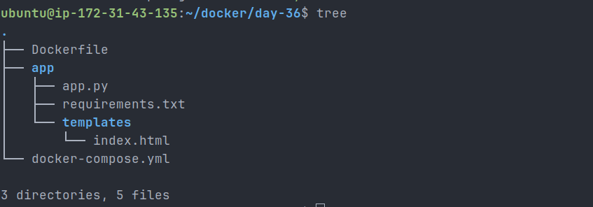
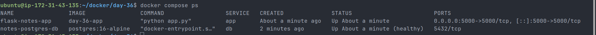
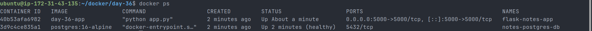
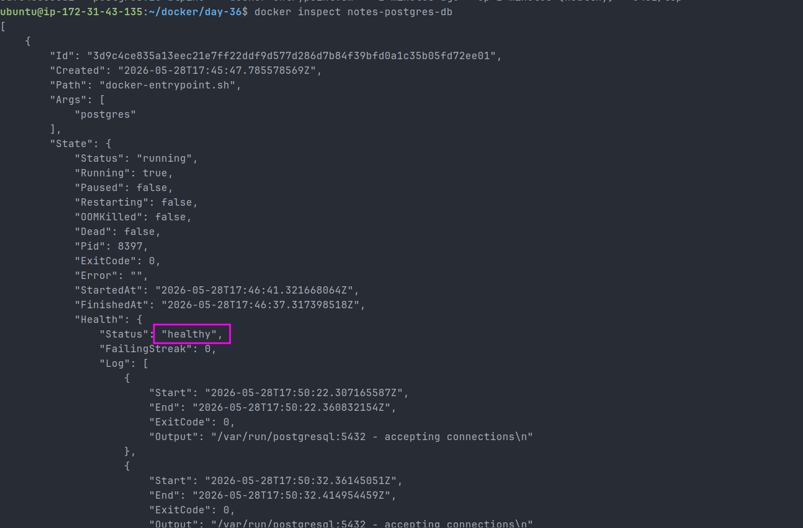
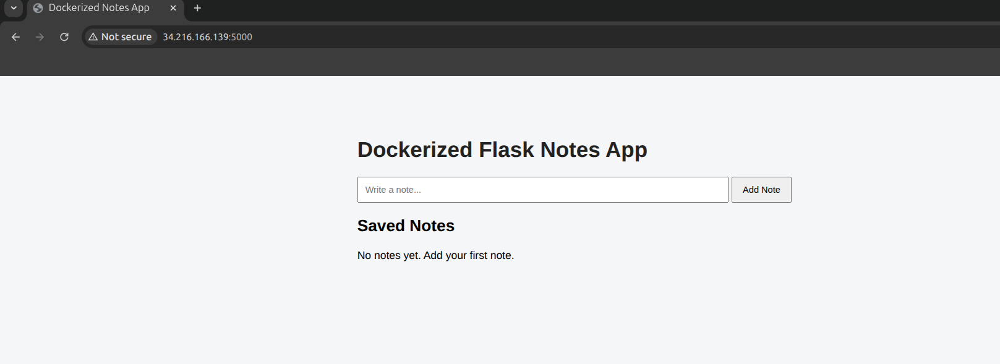
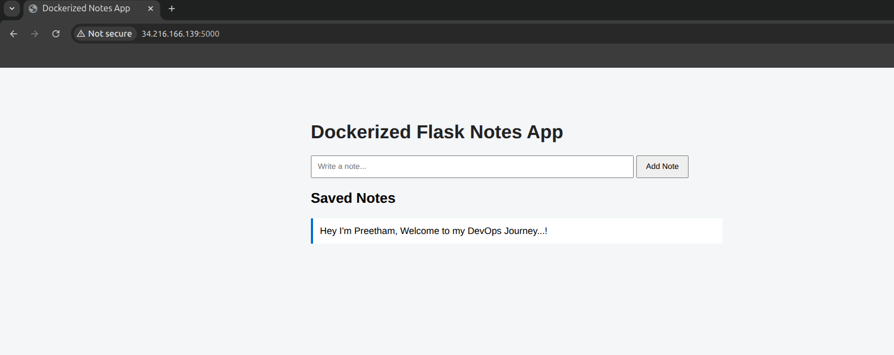
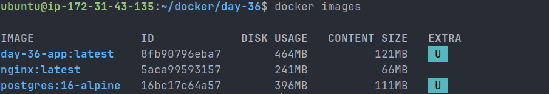
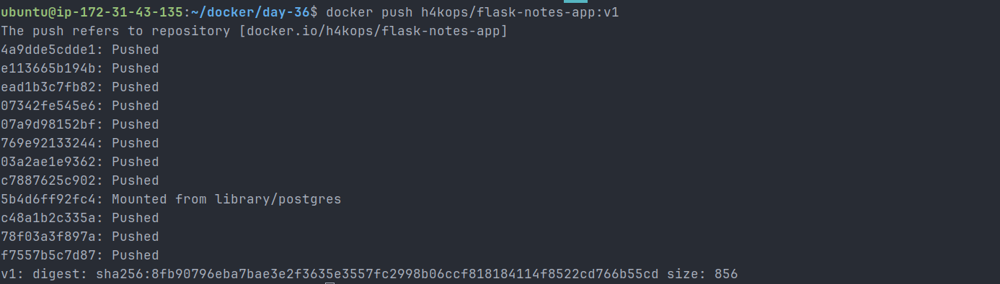
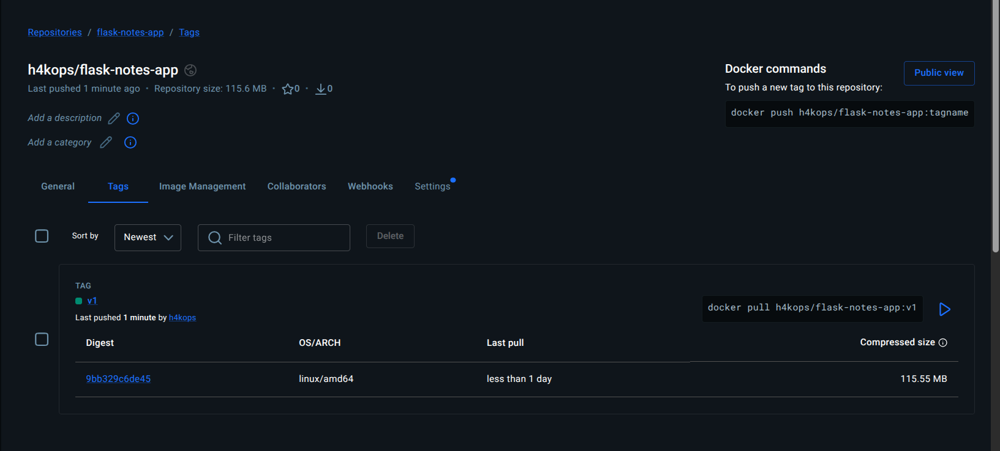
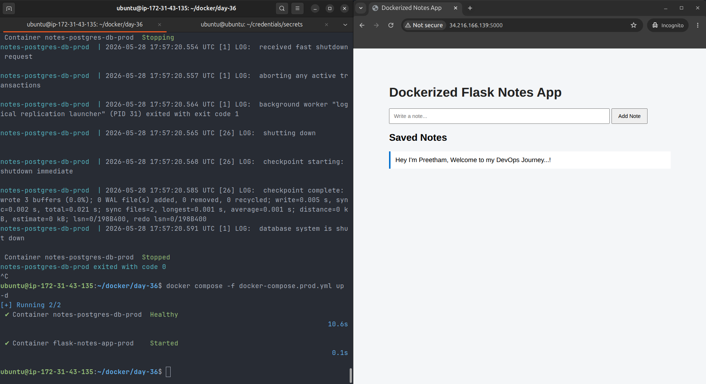

# Day 36 – Docker Project: Dockerize a Full Application

## Objective

The goal of Day 36 was to take a real application and Dockerize it end-to-end.

This included:

- Creating an application
- Writing a Dockerfile
- Running the app with Docker Compose
- Connecting the app to a database
- Using Docker volumes for persistence
- Adding a custom Docker network
- Adding database healthchecks
- Pushing the final image to Docker Hub
- Testing the complete flow from Docker Hub

---

## Application Chosen

For this project, I chose a **Python Flask Notes App with PostgreSQL**.

The application allows users to:

- Open a web page
- Add notes
- Save notes into a PostgreSQL database
- View saved notes from the browser

I chose this app because it is simple enough to build quickly but realistic enough to represent how real-world applications are containerized.

It includes both:

- An application service
- A database service

This makes it a good practical Docker project.

---

## Project Structure

```bash
day-36/
├── .dockerignore
├── .env.example
├── Dockerfile
├── README.md
├── app
│   ├── app.py
│   ├── requirements.txt
│   └── templates
│       └── index.html
├── day-36-docker-project.md
├── docker-compose.prod.yml
└── docker-compose.yml
```

### Screenshot



---

## Dockerfile

```dockerfile
# Use a lightweight Python base image
FROM python:3.12-slim

# Set the working directory inside the container
WORKDIR /app

# Prevent Python from creating .pyc files
ENV PYTHONDONTWRITEBYTECODE=1

# Print Python logs directly to the terminal
ENV PYTHONUNBUFFERED=1

# Install system dependencies required for PostgreSQL client libraries
RUN apt-get update && apt-get install -y --no-install-recommends \
    gcc \
    libpq-dev \
    && rm -rf /var/lib/apt/lists/*

# Copy requirements file first for better Docker layer caching
COPY app/requirements.txt .

# Install Python dependencies
RUN pip install --no-cache-dir -r requirements.txt

# Create a non-root user for better container security
RUN adduser --disabled-password --gecos "" appuser

# Copy application files into the container
COPY app/ .

# Give ownership of app files to the non-root user
RUN chown -R appuser:appuser /app

# Switch to the non-root user
USER appuser

# Expose Flask application port
EXPOSE 5000

# Start the Flask application
CMD ["python", "app.py"]
```

---

## Dockerfile Explanation

| Instruction                     | Purpose                               |
| ------------------------------- | ------------------------------------- |
| `FROM python:3.12-slim`         | Uses a small Python base image        |
| `WORKDIR /app`                  | Sets `/app` as the working directory  |
| `ENV PYTHONDONTWRITEBYTECODE=1` | Prevents unnecessary `.pyc` files     |
| `ENV PYTHONUNBUFFERED=1`        | Shows logs immediately                |
| `RUN apt-get update...`         | Installs required system packages     |
| `COPY app/requirements.txt .`   | Copies dependencies first for caching |
| `RUN pip install...`            | Installs Python packages              |
| `RUN adduser...`                | Creates a non-root user               |
| `COPY app/ .`                   | Copies application source code        |
| `RUN chown...`                  | Gives file ownership to non-root user |
| `USER appuser`                  | Runs the app securely as non-root     |
| `EXPOSE 5000`                   | Documents the application port        |
| `CMD ["python", "app.py"]`      | Starts the Flask app                  |

---

## Docker Compose Configuration

The project uses Docker Compose to run the Flask app and PostgreSQL database together.

Key Compose features used:

- App service built from Dockerfile
- PostgreSQL database service
- Persistent database volume
- Custom Docker network
- Environment variables from `.env`
- Database healthcheck
- Service dependency using `depends_on`

---

## Services

### App Service

The app service runs the Flask application.

It exposes port:

```text
5000:5000
```

This allows the app to be accessed from the browser.

### Database Service

The database service uses:

```text
postgres:16-alpine
```

It stores data using a Docker volume:

```text
notes-db-data
```

The database also has a healthcheck using:

```bash
pg_isready -U notesuser -d notesdb
```

---

## Commands Used

### Build and Run

```bash
docker compose up --build -d
```

### Screenshot



### Check Running Services

```bash
docker compose ps
```

### Check Running Containers

```bash
docker ps
```

### Inspect Database Healthcheck

```bash
docker inspect notes-postgres-db
```

### Check Docker Images

```bash
docker images
```

---

## Local Test Result

The application was successfully started using Docker Compose.

Running containers:

```text
flask-notes-app
notes-postgres-db
```

### Containers Running



Database status:

```text
healthy
```

### Database Healthcheck



Application URL:

```text
http://34.216.166.139:5000
```

The browser successfully displayed the Flask Notes App.

### Browser Output



A note was added successfully:

```text
Hey I'm Preetham, Welcome to my DevOps Journey...!
```

### Note Added



---

## Docker Image Size

Local image details:

```text
Image: day-36-app:latest
Content Size: 121 MB
Disk Usage: 464 MB
```

Docker Hub compressed size:

```text
115.55 MB
```

### Screenshot



---

## Docker Hub Push

The image was tagged as:

```bash
h4kops/flask-notes-app:v1
```

Push command:

```bash
docker push h4kops/flask-notes-app:v1
```

### Push Screenshot



Docker Hub repository:

```text
https://hub.docker.com/r/h4kops/flask-notes-app
```

### Repository Screenshot



Pull command:

```bash
docker pull h4kops/flask-notes-app:v1
```

---

## Fresh Pull Test

To verify the full flow, I removed the local tagged image and used the production Compose file.

Commands used:

```bash
docker compose down
docker rmi h4kops/flask-notes-app:v1
docker compose -f docker-compose.prod.yml up -d
```

Result:

```text
Container notes-postgres-db-prod Healthy
Container flask-notes-app-prod Started
```

The application worked successfully after pulling the image from Docker Hub.

### Screenshot



---

## Challenges Faced

### Challenge 1: Connecting Flask to PostgreSQL

The Flask app needed to wait until PostgreSQL was ready.

Solution:

- Added a database healthcheck in Docker Compose
- Used `depends_on` with `condition: service_healthy`
- Added retry logic in the Flask app database initialization

---

### Challenge 2: Keeping Database Data Persistent

Containers are temporary, so database data could be lost if the container is removed.

Solution:

- Added a Docker named volume:

```yaml
volumes:
  notes-db-data:
```

This keeps PostgreSQL data persistent across container restarts.

---

### Challenge 3: Running the App Securely

By default, containers may run as root.

Solution:

- Created a non-root user in the Dockerfile
- Changed file ownership
- Switched to the non-root user using:

```dockerfile
USER appuser
```

---

### Challenge 4: Testing Docker Hub Image

The app needed to work after pulling from Docker Hub.

Solution:

- Created a separate production Compose file
- Used the Docker Hub image instead of building locally
- Removed the local tag
- Ran the app again using:

```bash
docker compose -f docker-compose.prod.yml up -d
```

---

## Final Outcome

The project was completed successfully.

Final deliverables:

- Flask application code
- Dockerfile
- Docker Compose file
- Production Compose file
- Docker Hub image
- README documentation
- Day 36 project documentation
- Screenshots of build, run, healthcheck, Docker Hub push, and fresh pull test

---

## Final Docker Hub Image

```text
h4kops/flask-notes-app:v1
```

Docker Hub link:

```text
https://hub.docker.com/r/h4kops/flask-notes-app
```

---

## Key Learning

Today I learned how to Dockerize a complete application stack end-to-end.

The most important concepts were:

- Writing a production-style Dockerfile
- Running containers as a non-root user
- Using Docker Compose for multi-container apps
- Connecting an app container to a database container
- Using Docker volumes for persistence
- Adding database healthchecks
- Tagging and pushing images to Docker Hub
- Testing a fresh deployment from Docker Hub

This project helped me understand how Docker is used in real DevOps workflows.
