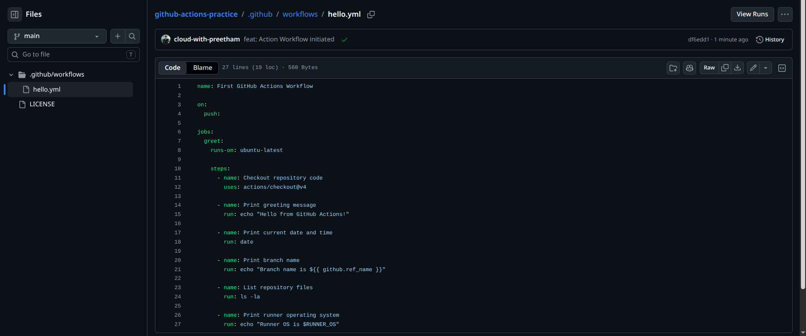
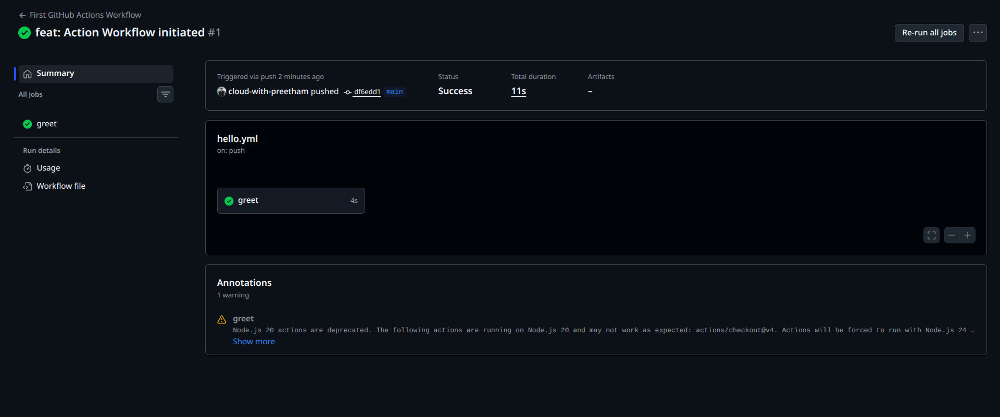
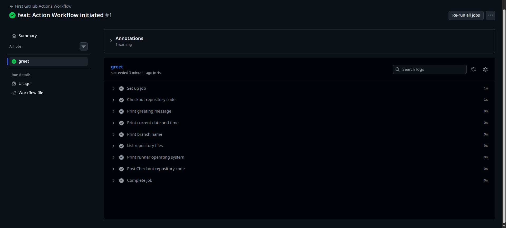
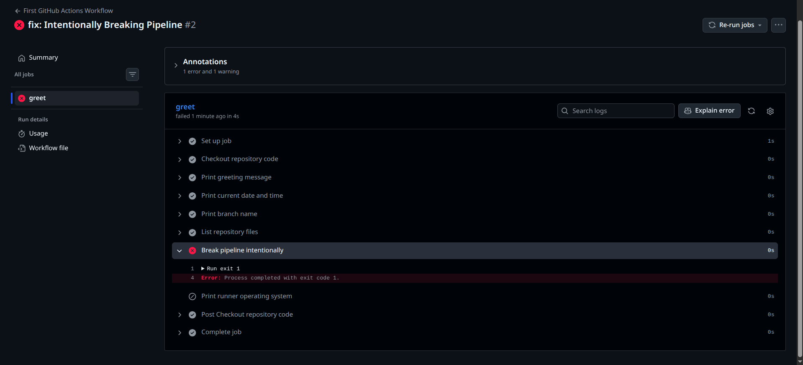
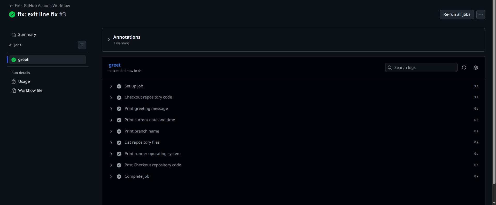

# Day 40 – Your First GitHub Actions Workflow

## Objective

The goal of this task was to create my first GitHub Actions workflow and understand how a basic CI pipeline runs in the cloud.

GitHub Actions is used to automate CI/CD tasks such as checking code, running commands, testing applications, and deploying projects whenever a repository event happens.

---

## Repository

Repository name:

```text
github-actions-practice
```

Workflow file:

```text
.github/workflows/hello.yml
```

---

## Project Structure

```text
github-actions-practice/
├── .github/
│   └── workflows/
│       └── hello.yml
├── LICENSE
└── 2026/
    └── day-40/
        └── day-40-first-workflow.md
```

---

## Workflow YAML

Screenshot of the workflow file:



```yaml
name: First GitHub Actions Workflow

on:
  push:

jobs:
  greet:
    runs-on: ubuntu-latest

    steps:
      - name: Checkout repository code
        uses: actions/checkout@v4

      - name: Print greeting message
        run: echo "Hello from GitHub Actions!"

      - name: Print current date and time
        run: date

      - name: Print branch name
        run: echo "Branch name is ${{ github.ref_name }}"

      - name: List repository files
        run: ls -la

      - name: Print runner operating system
        run: echo "Runner OS is $RUNNER_OS"
```

---

## Workflow Anatomy

### `name:`

The `name` key gives the workflow a readable name.

In this task, the workflow name is:

```yaml
name: First GitHub Actions Workflow
```

This name appears in the GitHub Actions tab.

---

### `on:`

The `on` key defines when the workflow should run.

```yaml
on:
  push:
```

This means the workflow runs automatically every time code is pushed to the repository.

---

### `jobs:`

The `jobs` key contains the work that GitHub Actions should perform.

```yaml
jobs:
  greet:
```

In this workflow, I created one job called `greet`.

A workflow can contain one job or multiple jobs.

---

### `runs-on:`

The `runs-on` key defines the runner machine where the job executes.

```yaml
runs-on: ubuntu-latest
```

This means GitHub provides an Ubuntu Linux virtual machine to run the job.

---

### `steps:`

The `steps` key contains the list of actions or shell commands that run inside the job.

Steps run in order from top to bottom.

---

### `uses:`

The `uses` key runs a reusable GitHub Action.

```yaml
uses: actions/checkout@v4
```

Here, `actions/checkout@v4` checks out the repository code into the GitHub Actions runner.

This is usually the first step when a workflow needs access to the repository files.

---

### `run:`

The `run` key executes shell commands on the runner.

Example:

```yaml
run: echo "Hello from GitHub Actions!"
```

This prints a message in the workflow logs.

---

### `name:` on a step

The `name` key inside a step gives that step a readable label in the GitHub Actions UI.

Example:

```yaml
- name: Print greeting message
```

This makes the pipeline logs easier to read and debug.

---

## Successful Pipeline Run

After pushing the workflow file, GitHub Actions automatically triggered the pipeline.

The first successful run showed a green checkmark.



The workflow completed successfully with the `greet` job.

---

## Job Steps Verification

Inside the `greet` job, the following steps were executed successfully:

```text
Set up job
Checkout repository code
Print greeting message
Print current date and time
Print branch name
List repository files
Print runner operating system
Post Checkout repository code
Complete job
```



This confirmed that every workflow step ran in the expected order.

---

## Intentional Pipeline Failure

To understand how failures work in CI/CD, I intentionally added a failing step:

```yaml
- name: Break pipeline intentionally
  run: exit 1
```

After pushing this change, the workflow failed.



The failed step showed this error:

```text
Error: Process completed with exit code 1.
```

This means the command returned a non-zero exit code, so GitHub Actions marked the job as failed.

---

## How I Debugged the Failure

To debug the failed pipeline:

1. I opened the failed workflow run.
2. I clicked the failed `greet` job.
3. I expanded the failed step.
4. I checked the command that caused the failure.
5. I identified that `exit 1` intentionally failed the pipeline.
6. I removed the failing step.
7. I pushed the fix again.

---

## Fixed Pipeline Run

After removing the failing step and pushing the fix, the workflow passed again.



This confirmed that the workflow was fixed successfully.

---

## Note About Warning

GitHub Actions showed a warning related to Node.js version deprecation for the checkout action.

The workflow still passed successfully, but this warning is useful because it shows that CI/CD logs can include warnings even when the pipeline is green.

In real projects, warnings should be reviewed because they may become errors in the future.

---

## What I Learned

* GitHub Actions workflows live inside `.github/workflows/`.
* Workflow files use YAML syntax.
* The workflow can be triggered automatically on `push`.
* A job is a group of steps.
* `runs-on` defines the runner environment.
* `uses` runs reusable GitHub Actions.
* `run` executes shell commands.
* A green check means the pipeline passed.
* A red cross means the pipeline failed.
* Pipeline logs help identify exactly where and why a failure happened.
* Fixing a failed pipeline is a normal part of CI/CD work.

---

## Final Status

The first GitHub Actions workflow was created, pushed, executed, intentionally failed, debugged, fixed, and verified successfully.

This was my first hands-on CI pipeline using GitHub Actions.
