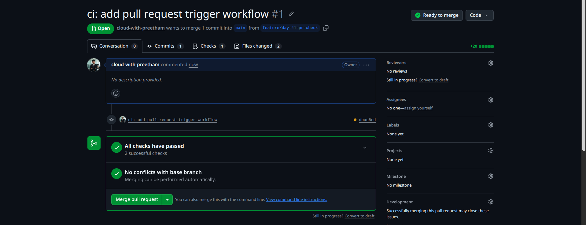
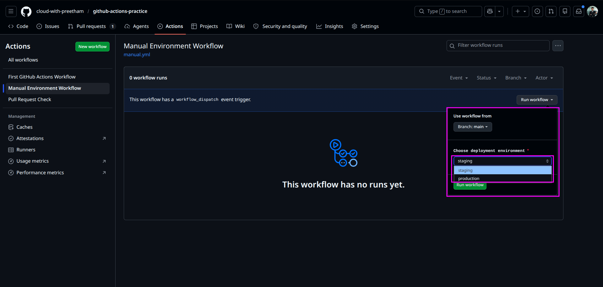
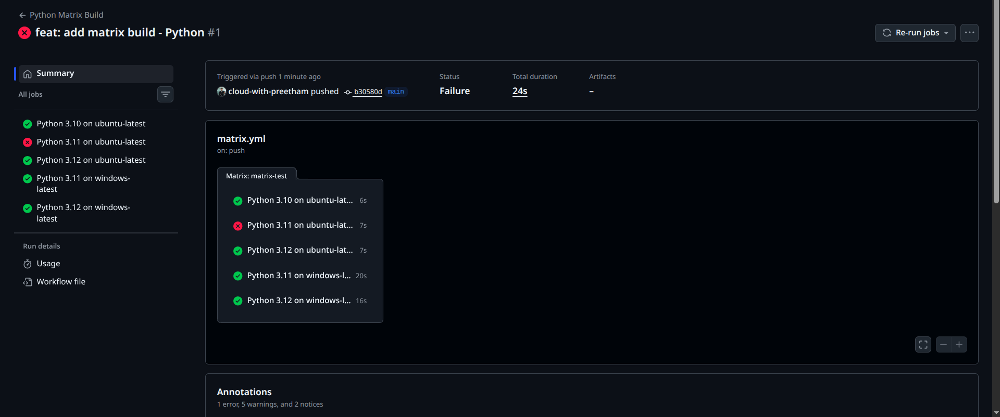

# Day 41 – GitHub Actions Triggers and Matrix Builds

## Overview

Today I learned how to use different GitHub Actions triggers and how to run jobs across multiple environments using matrix builds.

Before this task, my workflow only ran on `push`. In this day, I practiced:

- Pull request triggers
- Scheduled triggers
- Manual workflow triggers
- Workflow inputs
- Matrix builds
- Matrix exclusions
- Fail-fast behavior

---

## Repository

```text
github-actions-practice
```

---

## Final Project Structure

```text
github-actions-practice/
├── .github/
│   └── workflows/
│       ├── pr-check.yml
│       ├── manual.yml
│       └── matrix.yml
└── 2026/
    └── day-41/
        └── day-41-triggers.md
```

---

## Task 1: Trigger on Pull Request

### Objective

Create a workflow that runs only when a pull request is opened or updated against the `main` branch.

### Workflow File

```text
.github/workflows/pr-check.yml
```

### Workflow YAML

```yaml
name: Pull Request Check

on:
  pull_request:
    branches:
      - main
    types:
      - opened
      - synchronize

jobs:
  pr-check:
    name: PR Branch Check
    runs-on: ubuntu-latest

    steps:
      - name: Print PR branch name
        run: |
          echo "PR check running for branch: ${{ github.head_ref }}"
```

### Explanation

This workflow uses the `pull_request` trigger.

It runs when:

- A pull request is opened
- New commits are pushed to an existing pull request
- The pull request targets the `main` branch

The workflow prints the pull request source branch using:

```text
${{ github.head_ref }}
```

### Verification

I created a new branch:

```text
feature/day-41-pr-check
```

Then I pushed a commit and opened a pull request into `main`.

### Screenshot



### Result

The workflow appeared automatically on the pull request page, and all checks passed successfully.

---

## Task 2: Scheduled Trigger

### Objective

Use cron syntax to schedule a GitHub Actions workflow.

### Daily Midnight UTC Schedule

```yaml
on:
  schedule:
    - cron: "0 0 * * *"
```

### Explanation

This cron expression runs the workflow every day at midnight UTC.

### Cron Expression for Every Monday at 9 AM UTC

```text
0 9 * * 1
```

### Cron Breakdown

```text
0 9 * * 1
| | | | |
| | | | └── Monday
| | | └──── Every month
| | └────── Every day of the month
| └──────── 9 AM UTC
└────────── 0th minute
```

---

## Task 3: Manual Trigger

### Objective

Create a workflow that can be manually triggered from the GitHub Actions tab.

### Workflow File

```text
.github/workflows/manual.yml
```

### Workflow YAML

```yaml
name: Manual Environment Workflow

on:
  workflow_dispatch:
    inputs:
      environment:
        description: "Choose deployment environment"
        required: true
        default: "staging"
        type: choice
        options:
          - staging
          - production

jobs:
  manual-run:
    name: Manual Trigger Job
    runs-on: ubuntu-latest

    steps:
      - name: Print selected environment
        run: |
          echo "Selected environment is ${{ github.event.inputs.environment }}"
```

### Explanation

This workflow uses `workflow_dispatch`, which allows the workflow to be started manually from the GitHub Actions tab.

The workflow also accepts an input called `environment`.

Available options:

- staging
- production

### Verification

I went to:

```text
Actions → Manual Environment Workflow → Run workflow
```

Then I selected the environment value and ran the workflow manually.

### Screenshot



### Result

The manual trigger appeared correctly and showed the input dropdown with `staging` and `production`.

---

## Task 4: Matrix Builds

### Objective

Create a workflow that runs the same job across multiple Python versions and operating systems.

### Workflow File

```text
.github/workflows/matrix.yml
```

### Workflow YAML

```yaml
name: Python Matrix Build

on:
  push:
    branches:
      - main
  workflow_dispatch:

jobs:
  matrix-test:
    name: Python ${{ matrix.python-version }} on ${{ matrix.os }}
    runs-on: ${{ matrix.os }}

    strategy:
      fail-fast: false
      matrix:
        os:
          - ubuntu-latest
          - windows-latest
        python-version:
          - "3.10"
          - "3.11"
          - "3.12"
        exclude:
          - os: windows-latest
            python-version: "3.10"

    steps:
      - name: Checkout repository
        uses: actions/checkout@v4

      - name: Set up Python
        uses: actions/setup-python@v5
        with:
          python-version: ${{ matrix.python-version }}

      - name: Print Python version
        run: python --version

      - name: Intentional failure for testing fail-fast false
        if: matrix.os == 'ubuntu-latest' && matrix.python-version == '3.11'
        run: exit 1
```

### Matrix Configuration

Python versions:

- Python 3.10
- Python 3.11
- Python 3.12

Operating systems:

- ubuntu-latest
- windows-latest

### Job Count Before Adding Operating Systems

```text
3 Python versions = 3 jobs
```

### Job Count After Adding Two Operating Systems

```text
3 Python versions × 2 operating systems = 6 jobs
```

### Job Count After Excluding One Combination

Excluded combination:

```yaml
exclude:
  - os: windows-latest
    python-version: "3.10"
```

Final job count:

```text
6 total jobs - 1 excluded job = 5 jobs
```

### Screenshot



### Result

The matrix workflow ran 5 jobs:

- Python 3.10 on ubuntu-latest
- Python 3.11 on ubuntu-latest
- Python 3.12 on ubuntu-latest
- Python 3.11 on windows-latest
- Python 3.12 on windows-latest

The Python 3.10 on Windows job was excluded successfully.

---

## Task 5: Exclude and Fail-Fast

### Objective

Exclude one specific matrix combination and test how `fail-fast` works.

### Excluded Combination

```yaml
exclude:
  - os: windows-latest
    python-version: "3.10"
```

This excluded:

```text
Python 3.10 on windows-latest
```

### Fail-Fast Configuration

```yaml
fail-fast: false
```

### Intentional Failure Step

```yaml
- name: Intentional failure for testing fail-fast false
  if: matrix.os == 'ubuntu-latest' && matrix.python-version == '3.11'
  run: exit 1
```

### What Happened

The Python 3.11 job on Ubuntu failed intentionally.

However, the remaining matrix jobs continued running and completed successfully.

This confirmed that:

```yaml
fail-fast: false
```

was working correctly.

---

## fail-fast: true vs fail-fast: false

### fail-fast: true

`fail-fast: true` is the default behavior.

If one matrix job fails, GitHub Actions cancels the remaining queued or running matrix jobs.

This is useful when one failed job means the remaining matrix jobs are no longer useful.

### fail-fast: false

If one matrix job fails, the remaining matrix jobs continue running.

This is useful when we want complete test results from every environment.

Example:

Even if Python 3.11 on Ubuntu fails, we may still want to know whether Python 3.12 on Windows works.

---

## Commands Used

### Create Workflow Directory

```bash
mkdir -p .github/workflows
```

### Create Day 41 Directory

```bash
mkdir -p 2026/day-41
```

### Create Pull Request Branch

```bash
git checkout -b feature/day-41-pr-check
```

### Add Pull Request Workflow

```bash
git add .github/workflows/pr-check.yml
git commit -m "ci: add pull request trigger workflow"
git push origin feature/day-41-pr-check
```

### Add Manual Workflow

```bash
git add .github/workflows/manual.yml
git commit -m "ci: add manual workflow dispatch trigger"
git push origin main
```

### Add Matrix Workflow

```bash
git add .github/workflows/matrix.yml
git commit -m "ci: add matrix build workflow with fail-fast control"
git push origin main
```

### Add Day 41 Documentation

```bash
git add 2026/day-41/day-41-triggers.md
git commit -m "docs: add day 41 GitHub Actions trigger notes"
git push origin main
```

---

## Screenshot Checklist

| Screenshot                       | Purpose                                                        |
| -------------------------------- | -------------------------------------------------------------- |
| `day-41-pr-check-run.png`        | Shows pull request checks passed                               |
| `day-41-manual-workflow-run.png` | Shows manual workflow input dropdown                           |
| `day-41-matrix-build-run.png`    | Shows matrix jobs across Python versions and operating systems |

---

## Key Learnings

- GitHub Actions workflows can be triggered using different events.
- `pull_request` helps validate code before merging.
- `workflow_dispatch` allows manual workflow execution.
- Manual workflows can accept input values.
- `schedule` uses cron syntax for automatic workflow runs.
- Matrix builds reduce workflow duplication.
- Matrix builds are useful for testing multiple versions and operating systems.
- `exclude` removes specific matrix combinations.
- `fail-fast: false` allows other matrix jobs to continue after one job fails.

---

## Real-World DevOps Use Cases

### Pull Request Trigger

Used to validate code before merging into the main branch.

Common checks:

- Linting
- Unit tests
- Security scans
- Build verification

### Scheduled Trigger

Used for recurring automation.

Common examples:

- Daily backups
- Nightly builds
- Dependency checks
- Security scans

### Manual Trigger

Used when human approval or manual control is needed.

Common examples:

- Deploy to staging
- Deploy to production
- Run database migration
- Trigger rollback

### Matrix Build

Used to test software across different environments.

Common examples:

- Multiple Python versions
- Multiple Node.js versions
- Linux and Windows compatibility
- Different dependency versions

---

## Interview Notes

### What is a GitHub Actions trigger?

A trigger is an event that starts a workflow.

Examples:

- `push`
- `pull_request`
- `schedule`
- `workflow_dispatch`

### What is a matrix build?

A matrix build runs the same job across multiple configurations.

Example:

```text
Python 3.10, 3.11, and 3.12 across Ubuntu and Windows
```

### Why use matrix builds?

Matrix builds reduce duplication and help verify that code works across multiple environments.

### What does `exclude` do in a matrix?

`exclude` removes a specific combination from the matrix.

### What does `fail-fast: false` do?

It allows all matrix jobs to continue running even if one job fails.

---

## Learn in Public Post

Today I completed Day 41 of my 90 Days of DevOps journey.

I learned how GitHub Actions workflows can be triggered using pull requests, schedules, manual inputs, and matrix builds.

The best part was watching multiple matrix jobs run in parallel across different Python versions and operating systems.

Key concepts practiced:

- Pull request workflows
- Manual workflow dispatch
- Cron-based scheduled workflows
- Matrix builds
- Matrix exclusions
- Fail-fast behavior

#90DaysOfDevOps
#DevOpsKaJosh
#TrainWithShubham
