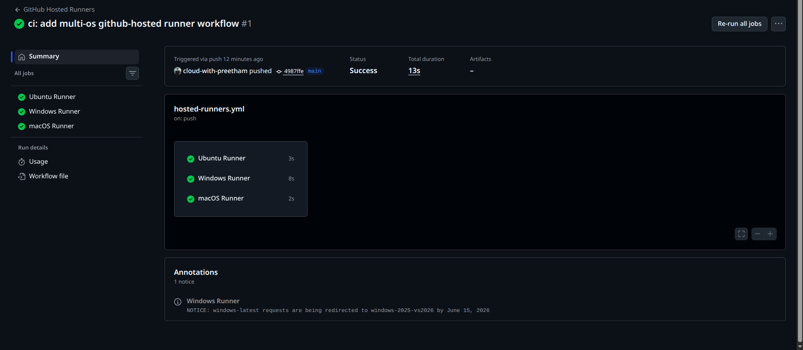
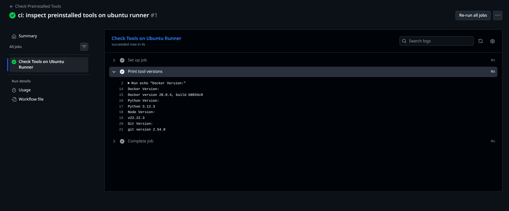
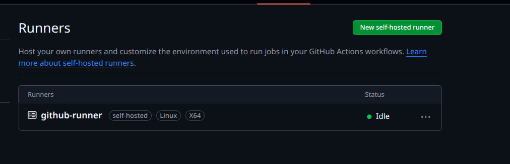
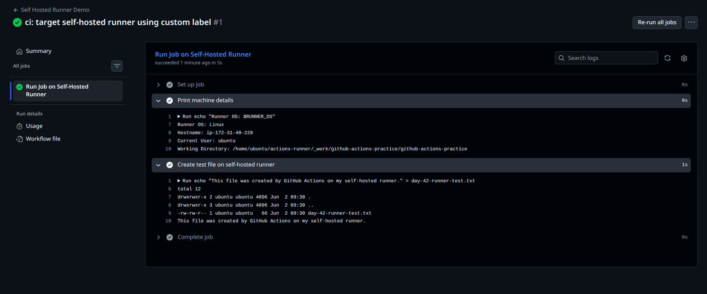

# Day 42 – Runners: GitHub-Hosted & Self-Hosted

## Overview

Today I learned about **GitHub Actions runners**.

A runner is the machine that executes GitHub Actions workflow jobs. Every job in a workflow needs a runner to run on.

GitHub Actions supports two main types of runners:

- **GitHub-hosted runners**
- **Self-hosted runners**

GitHub-hosted runners are managed by GitHub. Self-hosted runners are machines that I configure and manage myself.

---

## Objectives

- Understand what GitHub Actions runners are
- Run jobs on GitHub-hosted runners
- Compare Ubuntu, Windows, and macOS runners
- Check pre-installed tools on GitHub-hosted runners
- Set up a self-hosted runner on an EC2 instance
- Run a workflow on my own self-hosted runner
- Use custom labels to target a specific self-hosted runner
- Compare GitHub-hosted and self-hosted runners

---

## Repository Structure

```text
github-actions-practice/
├── .github/
│   └── workflows/
│       ├── hosted-runners.yml
│       ├── preinstalled-tools.yml
│       └── self-hosted.yml
└── 2026/
    └── day-42/
        ├── day-42-runners.md
        └── screenshots/
            ├── day-42-hosted-runners-parallel.png
            ├── day-42-preinstalled-tools.png
            ├── day-42-self-hosted-runner-idle.png
            └── day-42-self-hosted-job-running.png
```

---

# Task 1: GitHub-Hosted Runners

## What I Did

I created a GitHub Actions workflow with three jobs. Each job ran on a different GitHub-hosted runner operating system:

- `ubuntu-latest`
- `windows-latest`
- `macos-latest`

Each job printed:

- OS name
- Hostname
- Current user

---

## Workflow File

**File:** `.github/workflows/hosted-runners.yml`

```yaml
name: GitHub Hosted Runners

on:
  workflow_dispatch:
  push:
    branches:
      - main

jobs:
  ubuntu-job:
    name: Ubuntu Runner
    runs-on: ubuntu-latest
    steps:
      - name: Print Ubuntu runner info
        run: |
          echo "OS Name: $RUNNER_OS"
          echo "Hostname: $(hostname)"
          echo "Current User: $(whoami)"

  windows-job:
    name: Windows Runner
    runs-on: windows-latest
    steps:
      - name: Print Windows runner info
        shell: pwsh
        run: |
          Write-Output "OS Name: $env:RUNNER_OS"
          Write-Output "Hostname: $env:COMPUTERNAME"
          Write-Output "Current User: $env:USERNAME"

  macos-job:
    name: macOS Runner
    runs-on: macos-latest
    steps:
      - name: Print macOS runner info
        run: |
          echo "OS Name: $RUNNER_OS"
          echo "Hostname: $(hostname)"
          echo "Current User: $(whoami)"
```

---

## Output

The workflow completed successfully.

All three jobs ran successfully:

- Ubuntu Runner
- Windows Runner
- macOS Runner

The jobs ran in parallel because they were independent jobs in the same workflow.

---

## Screenshot



---

## Notes

A **GitHub-hosted runner** is a virtual machine provided by GitHub to run workflow jobs.

GitHub manages:

- Runner machine
- Operating system image
- Installed tools
- Updates
- Cleanup after each job

GitHub-hosted runners are useful because we can run CI/CD workflows without managing our own infrastructure.

---

# Task 2: Explore Pre-installed Tools

## What I Did

I created a workflow to check which tools were already installed on the `ubuntu-latest` GitHub-hosted runner.

The workflow printed versions for:

- Docker
- Python
- Node.js
- Git

---

## Workflow File

**File:** `.github/workflows/preinstalled-tools.yml`

```yaml
name: Check Preinstalled Tools

on:
  workflow_dispatch:
  push:
    branches:
      - main

jobs:
  check-tools:
    name: Check Tools on Ubuntu Runner
    runs-on: ubuntu-latest

    steps:
      - name: Print tool versions
        run: |
          echo "Docker Version:"
          docker --version

          echo "Python Version:"
          python3 --version

          echo "Node Version:"
          node --version

          echo "Git Version:"
          git --version
```

---

## Output

The workflow completed successfully.

The Ubuntu GitHub-hosted runner had the following tools available:

```text
Docker version 28.0.4
Python 3.12.3
Node v22.22.3
git version 2.54.0
```

---

## Screenshot



---

## Notes

Pre-installed tools are important because they make CI/CD workflows faster and simpler.

If common tools like Docker, Python, Node.js, and Git are already available, we do not need to install them manually in every workflow run.

This helps with:

- Faster pipeline execution
- Cleaner workflow files
- Less setup work
- More consistent CI environments

---

# Task 3: Set Up a Self-Hosted Runner

## What I Did

I configured a self-hosted runner on an EC2 Linux instance.

I followed these steps:

1. Opened the GitHub repository
2. Went to **Settings**
3. Opened **Actions**
4. Opened **Runners**
5. Clicked **New self-hosted runner**
6. Selected **Linux**
7. Followed the GitHub-provided setup commands
8. Registered the runner
9. Started the runner
10. Verified that it appeared as **Idle** in GitHub

---

## Runner Details

```text
Runner name: github-runner
Runner type: self-hosted
Operating system: Linux
Architecture: X64
Status: Idle
```

---

## Screenshot



---

## Notes

A **self-hosted runner** is a machine that I own or manage and connect to GitHub Actions.

In this task, my EC2 instance became the runner machine.

This means GitHub Actions jobs can now run directly on my own server instead of GitHub's hosted virtual machines.

---

# Task 4: Use Self-Hosted Runner

## What I Did

I created a workflow that runs on my self-hosted runner.

The workflow printed:

- Runner OS
- Hostname
- Current user
- Working directory

It also created a test file on the self-hosted runner.

---

## Workflow File

**File:** `.github/workflows/self-hosted.yml`

```yaml
name: Self Hosted Runner Demo

on:
  workflow_dispatch:
  push:
    branches:
      - main

jobs:
  run-on-my-machine:
    name: Run Job on Self-Hosted Runner
    runs-on: [self-hosted, my-linux-runner]

    steps:
      - name: Print machine details
        run: |
          echo "Runner OS: $RUNNER_OS"
          echo "Hostname: $(hostname)"
          echo "Current User: $(whoami)"
          echo "Working Directory: $(pwd)"

      - name: Create test file on self-hosted runner
        run: |
          echo "This file was created by GitHub Actions on my self-hosted runner." > day-42-runner-test.txt
          ls -la
          cat day-42-runner-test.txt
```

---

## Output

The workflow completed successfully.

The job ran on my EC2 self-hosted runner.

```text
Runner OS: Linux
Hostname: ip-172-31-40-228
Current User: ubuntu
Working Directory: /home/ubuntu/actions-runner/_work/github-actions-practice/github-actions-practice
```

The workflow also created a file:

```text
day-42-runner-test.txt
```

File content:

```text
This file was created by GitHub Actions on my self-hosted runner.
```

---

## Screenshot



---

## Verification Command

I verified the file on the EC2 runner using:

```bash
cd ~/actions-runner
find . -name "day-42-runner-test.txt"
```

To view the file:

```bash
cat ./_work/github-actions-practice/github-actions-practice/day-42-runner-test.txt
```

---

## Notes

The hostname in the workflow logs matched my EC2 instance:

```text
ip-172-31-40-228
```

This confirmed that the job was executed on my self-hosted runner.

---

# Task 5: Labels

## What I Did

I added a custom label to my self-hosted runner:

```text
my-linux-runner
```

Then I updated the workflow to use the label:

```yaml
runs-on: [self-hosted, my-linux-runner]
```

The workflow still ran successfully.

---

## Why Labels Are Useful

Labels are useful when there are multiple self-hosted runners.

They help GitHub Actions select the correct runner for a job.

For example, a team may have different runners for:

- Linux builds
- Windows builds
- Docker builds
- Production deployments
- Staging deployments
- GPU workloads

Instead of sending a job to any self-hosted runner, labels allow us to target a specific machine or environment.

---

# Task 6: GitHub-Hosted vs Self-Hosted

| Topic               | GitHub-Hosted                                                           | Self-Hosted                                                                        |
| ------------------- | ----------------------------------------------------------------------- | ---------------------------------------------------------------------------------- |
| Who manages it?     | GitHub manages the runner, OS image, updates, and cleanup               | I manage the machine, runner app, updates, security, and cleanup                   |
| Cost                | Uses GitHub Actions minutes based on the GitHub plan                    | Uses my own machine, EC2 instance, VM, or server cost                              |
| Pre-installed tools | Comes with many common tools already installed                          | I decide what tools to install                                                     |
| Good for            | General CI, testing, builds, open-source projects, and multi-OS testing | Private infrastructure access, custom tools, deployments, and special environments |
| Security concern    | Limited access to private infrastructure                                | Riskier because workflow code runs on my own machine                               |

---

# Important Runner Commands

## Start Runner Manually

```bash
cd ~/actions-runner
./run.sh
```

## Install Runner as a Service

```bash
cd ~/actions-runner
sudo ./svc.sh install
```

## Start Runner Service

```bash
sudo ./svc.sh start
```

## Check Runner Service Status

```bash
sudo ./svc.sh status
```

## Stop Runner Service

```bash
sudo ./svc.sh stop
```

---

# Issue Faced

While starting the runner manually, I saw this message:

```text
A session for this runner already exists.
Runner connect error: Error: Conflict.
```

## Reason

This happened because the runner was already connected in another session or running as a background service.

## Fix

I should use only one runner mode at a time:

```text
Manual mode: ./run.sh
Service mode: sudo ./svc.sh start
```

For EC2, service mode is better because the runner stays active even after closing the SSH session.

---

# Security Notes

Self-hosted runners must be used carefully.

Since workflow jobs run directly on my own machine, unsafe workflow code can affect the runner environment.

Best practices:

- Do not run untrusted code on self-hosted runners
- Avoid using self-hosted runners for unknown pull requests
- Use temporary VMs for practice
- Keep the runner machine updated
- Restrict secrets carefully
- Use labels to separate environments
- Remove unused runners from GitHub

---

# Key Learnings

- A runner is the machine that executes GitHub Actions jobs.
- GitHub-hosted runners are managed by GitHub.
- Self-hosted runners are managed by the user.
- GitHub-hosted runners are good for general CI workflows.
- Self-hosted runners are useful for private infrastructure and custom environments.
- GitHub-hosted runners come with many tools pre-installed.
- Self-hosted runners require more security responsibility.
- Labels help target specific self-hosted runners.
- My EC2 instance successfully ran a GitHub Actions job.

---

# Final Status

| Task                                           | Status    |
| ---------------------------------------------- | --------- |
| Created multi-OS GitHub-hosted runner workflow | Completed |
| Checked pre-installed tools on Ubuntu runner   | Completed |
| Registered self-hosted runner                  | Completed |
| Verified runner as Idle                        | Completed |
| Ran workflow on self-hosted runner             | Completed |
| Created file on self-hosted runner             | Completed |
| Used custom runner label                       | Completed |
| Completed comparison table                     | Completed |

---

# Conclusion

Today I learned how GitHub Actions jobs are executed using runners.

I used GitHub-hosted runners for Ubuntu, Windows, and macOS jobs. I also configured an EC2 instance as a self-hosted runner and successfully ran a workflow on my own machine.

This helped me understand how CI/CD jobs can run both on GitHub-managed infrastructure and on custom infrastructure managed by DevOps teams.
