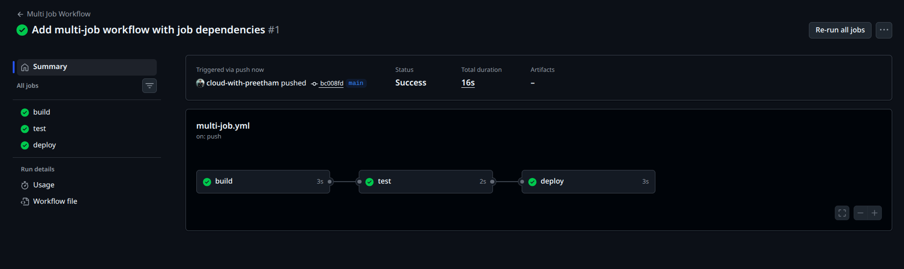
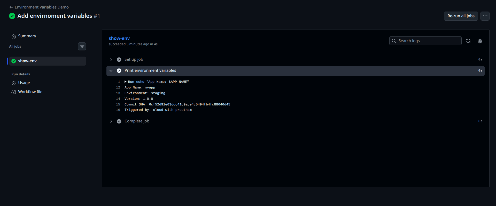
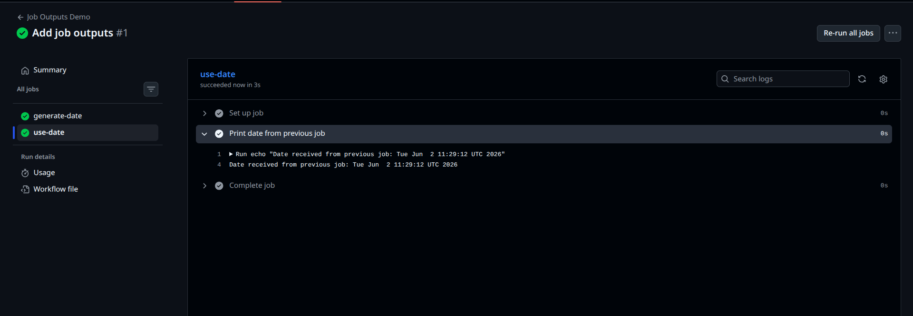
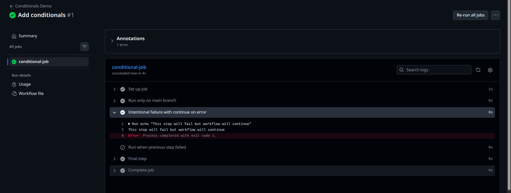
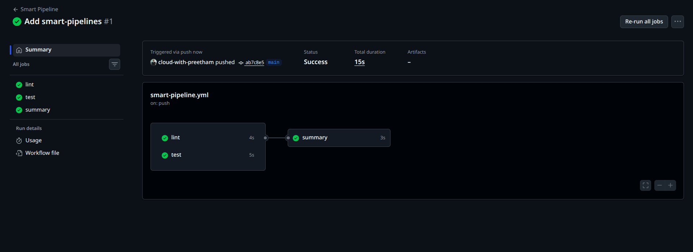

# Day 43 – Jobs, Steps, Env Vars & Conditionals

## Overview

Today I learned how to control the flow of a GitHub Actions pipeline using jobs, steps, environment variables, job outputs, and conditionals.

This is an important CI/CD skill because real-world pipelines usually do not run as one simple job. They often have multiple stages such as build, test, security scan, deploy, and summary.

---

## Objectives

By the end of this task, I practiced:

- Creating multi-job GitHub Actions workflows
- Controlling job order using `needs:`
- Using environment variables at workflow, job, and step levels
- Reading GitHub context variables
- Passing outputs between jobs
- Running jobs and steps conditionally
- Using `continue-on-error`
- Running jobs in parallel
- Creating a final summary job

---

## Repository

Repository used:

```text
github-actions-practice
```

Workflow directory:

```text
.github/workflows/
```

Day 43 documentation directory:

```text
2026/day-43/
```

---

# Task 1: Multi-Job Workflow

## File Created

```text
.github/workflows/multi-job.yml
```

## Workflow Code

```yaml
name: Multi Job Workflow

on:
  push:
    branches:
      - "**"

jobs:
  build:
    runs-on: ubuntu-latest
    steps:
      - name: Build app
        run: echo "Building the app"

  test:
    runs-on: ubuntu-latest
    needs: build
    steps:
      - name: Run tests
        run: echo "Running tests"

  deploy:
    runs-on: ubuntu-latest
    needs: test
    steps:
      - name: Deploy app
        run: echo "Deploying"
```

## Explanation

This workflow has three jobs:

```text
build → test → deploy
```

The `build` job runs first.

The `test` job uses:

```yaml
needs: build
```

This means the `test` job will only run after the `build` job completes successfully.

The `deploy` job uses:

```yaml
needs: test
```

This means the `deploy` job will only run after the `test` job completes successfully.

## Verification

The workflow graph showed the correct dependency chain:

```text
build → test → deploy
```

Screenshot:



## What I Learned

The `needs:` keyword is used to control job dependency.

Without `needs:`, jobs run in parallel by default.

With `needs:`, jobs can be forced to run in a specific order.

---

# Task 2: Environment Variables

## File Created

```text
.github/workflows/env-vars.yml
```

## Workflow Code

```yaml
name: Environment Variables Demo

on:
  push:
    branches:
      - "**"

env:
  APP_NAME: myapp

jobs:
  show-env:
    runs-on: ubuntu-latest

    env:
      ENVIRONMENT: staging

    steps:
      - name: Print environment variables
        env:
          VERSION: 1.0.0
        run: |
          echo "App Name: $APP_NAME"
          echo "Environment: $ENVIRONMENT"
          echo "Version: $VERSION"
          echo "Commit SHA: ${{ github.sha }}"
          echo "Triggered by: ${{ github.actor }}"
```

## Environment Variable Levels

## 1. Workflow-Level Environment Variable

```yaml
env:
  APP_NAME: myapp
```

This variable is available to all jobs and steps in the workflow.

## 2. Job-Level Environment Variable

```yaml
env:
  ENVIRONMENT: staging
```

This variable is available only inside the `show-env` job.

## 3. Step-Level Environment Variable

```yaml
env:
  VERSION: 1.0.0
```

This variable is available only inside that specific step.

## GitHub Context Variables Used

```yaml
${{ github.sha }}
${{ github.actor }}
```

These values are provided automatically by GitHub Actions.

`github.sha` shows the commit SHA that triggered the workflow.

`github.actor` shows the GitHub user who triggered the workflow.

## Verification

The workflow logs printed:

```text
App Name: myapp
Environment: staging
Version: 1.0.0
Commit SHA: <commit-sha>
Triggered by: cloud-with-preetham
```

Screenshot:



## What I Learned

Environment variables help avoid repeated hardcoded values.

GitHub context variables help workflows access useful information about the event, repository, branch, commit, and user.

---

# Task 3: Job Outputs

## File Created

```text
.github/workflows/job-outputs.yml
```

## Workflow Code

```yaml
name: Job Outputs Demo

on:
  push:
    branches:
      - "**"

jobs:
  generate-date:
    runs-on: ubuntu-latest

    outputs:
      today: ${{ steps.date-step.outputs.today }}

    steps:
      - name: Set today's date
        id: date-step
        run: echo "today=$(date)" >> $GITHUB_OUTPUT

  use-date:
    runs-on: ubuntu-latest
    needs: generate-date

    steps:
      - name: Print date from previous job
        run: echo "Date received from previous job: ${{ needs.generate-date.outputs.today }}"
```

## Explanation

The first job is:

```text
generate-date
```

It creates an output called:

```text
today
```

The output is created using:

```bash
echo "today=$(date)" >> $GITHUB_OUTPUT
```

The second job is:

```text
use-date
```

It depends on the first job using:

```yaml
needs: generate-date
```

It reads the output using:

```yaml
${{ needs.generate-date.outputs.today }}
```

## Verification

The second job successfully printed the date generated by the first job.

Screenshot:



## Why Pass Outputs Between Jobs?

Job outputs are useful when one job generates a value that another job needs.

Examples:

- Docker image tag
- Build version
- Release number
- Generated date
- Artifact name
- Deployment environment
- Test summary
- Commit metadata

## What I Learned

Outputs allow jobs to share data with each other.

This is useful because each GitHub Actions job runs separately, so data must be explicitly passed between jobs when needed.

---

# Task 4: Conditionals

## File Created

```text
.github/workflows/conditionals.yml
```

## Workflow Code

```yaml
name: Conditionals Demo

on:
  push:
    branches:
      - "**"
  pull_request:
    branches:
      - main

jobs:
  conditional-job:
    runs-on: ubuntu-latest
    if: github.event_name == 'push'

    steps:
      - name: Run only on main branch
        if: github.ref == 'refs/heads/main'
        run: echo "This step runs only on main branch"

      - name: Intentional failure with continue on error
        continue-on-error: true
        run: |
          echo "This step will fail but workflow will continue"
          exit 1

      - name: Run when previous step failed
        if: failure()
        run: echo "A previous step failed"

      - name: Final step
        run: echo "Workflow continued successfully"
```

## Conditional Job

```yaml
if: github.event_name == 'push'
```

This makes the job run only for push events.

It will not run for pull request events.

## Conditional Step for Main Branch

```yaml
if: github.ref == 'refs/heads/main'
```

This step runs only when the workflow is triggered from the `main` branch.

## Continue on Error

```yaml
continue-on-error: true
```

This allows the workflow to continue even if the step fails.

In this workflow, the command:

```bash
exit 1
```

caused a failure, but the workflow continued because `continue-on-error` was enabled.

## Failure Conditional

```yaml
if: failure()
```

This is used to run a step only when a previous step failed.

## Important Observation

In my workflow run, the intentional failure step failed, but because it had:

```yaml
continue-on-error: true
```

the workflow continued successfully.

The final step still ran.

Screenshot:



## What I Learned

Conditionals help control when jobs and steps should run.

They are useful for:

- Running deploy jobs only on `main`
- Skipping jobs for pull requests
- Running cleanup steps after failure
- Allowing optional checks to fail without blocking the pipeline

---

# Task 5: Smart Pipeline

## File Created

```text
.github/workflows/smart-pipeline.yml
```

## Workflow Code

```yaml
name: Smart Pipeline

on:
  push:
    branches:
      - "**"

jobs:
  lint:
    runs-on: ubuntu-latest
    steps:
      - name: Run lint
        run: |
          echo "Running lint checks..."
          echo "Lint passed"

  test:
    runs-on: ubuntu-latest
    steps:
      - name: Run tests
        run: |
          echo "Running test cases..."
          echo "Tests passed"

  summary:
    runs-on: ubuntu-latest
    needs: [lint, test]

    steps:
      - name: Print branch type
        run: |
          if [ "${{ github.ref }}" = "refs/heads/main" ]; then
            echo "This is a main branch push"
          else
            echo "This is a feature branch push"
          fi

      - name: Print commit message
        run: echo "Commit message: ${{ github.event.commits[0].message }}"
```

## Explanation

This workflow has three jobs:

```text
lint
test
summary
```

The `lint` and `test` jobs run in parallel because there is no dependency between them.

The `summary` job uses:

```yaml
needs: [lint, test]
```

This means the summary job waits for both `lint` and `test` jobs to complete successfully.

## Workflow Flow

```text
lint ┐
     ├── summary
test ┘
```

## Verification

The workflow graph showed `lint` and `test` running before `summary`.

Screenshot:



## What I Learned

Parallel jobs make pipelines faster.

A summary job is useful when multiple jobs need to finish before final reporting, deployment, or notification.

---

# Key Concepts

## What Does `needs:` Do?

The `needs:` keyword defines job dependencies.

Example:

```yaml
needs: build
```

This means the current job waits for the `build` job to complete successfully before starting.

Multiple dependencies can be added like this:

```yaml
needs: [lint, test]
```

This means the current job waits for both `lint` and `test`.

## What Does `outputs:` Do?

The `outputs:` keyword allows a job to expose values that other jobs can use.

Example:

```yaml
outputs:
  today: ${{ steps.date-step.outputs.today }}
```

Another job can read it using:

```yaml
${{ needs.generate-date.outputs.today }}
```

## What Does `if:` Do?

The `if:` keyword controls whether a job or step runs.

Examples:

```yaml
if: github.ref == 'refs/heads/main'
```

Runs only on the main branch.

```yaml
if: github.event_name == 'push'
```

Runs only on push events.

```yaml
if: failure()
```

Runs only when a previous step failed.

## What Does `continue-on-error` Do?

`continue-on-error: true` allows the workflow to continue even when that step fails.

This is useful for optional checks, experiments, or non-blocking validations.

---

# Real-World DevOps Use Cases

These GitHub Actions concepts are used in real CI/CD pipelines.

## Job Dependencies

Used for:

- Build before test
- Test before deploy
- Security scan before release
- Approval before production deployment

## Environment Variables

Used for:

- Application names
- Deployment environments
- Versions
- Docker image tags
- Cloud regions

## Job Outputs

Used for:

- Passing Docker image tags between jobs
- Sharing generated version numbers
- Passing artifact names
- Passing test summaries
- Passing deployment URLs

## Conditionals

Used for:

- Deploying only from `main`
- Running preview deployments for feature branches
- Skipping production jobs on pull requests
- Running cleanup steps after failures
- Allowing optional checks without failing the whole pipeline

---

# Screenshots

## 1. Multi-Job Workflow Graph

```text
01-multi-job-workflow-graph.png
```

Shows:

```text
build → test → deploy
```

## 2. Environment Variables Output

```text
02-env-vars-output.png
```

Shows:

```text
APP_NAME
ENVIRONMENT
VERSION
github.sha
github.actor
```

## 3. Job Outputs Result

```text
03-job-outputs-result.png
```

Shows the generated date passed from one job to another.

## 4. Conditionals Workflow

```text
04-conditionals-workflow.png
```

Shows conditional execution and `continue-on-error`.

## 5. Smart Pipeline Graph

```text
05-smart-pipeline-graph.png
```

Shows `lint` and `test` running before `summary`.

---

# Final Verification Checklist

- [x] Created multi-job workflow
- [x] Verified job dependency chain
- [x] Created environment variable workflow
- [x] Printed workflow-level environment variable
- [x] Printed job-level environment variable
- [x] Printed step-level environment variable
- [x] Printed GitHub SHA and actor
- [x] Created job output workflow
- [x] Passed output between jobs
- [x] Created conditional workflow
- [x] Tested branch condition
- [x] Tested push-only job condition
- [x] Tested `continue-on-error`
- [x] Created smart pipeline
- [x] Verified parallel jobs
- [x] Verified summary job dependency

---

# Interview Notes

## What is `needs:` in GitHub Actions?

`needs:` is used to make one job depend on another job. If a job has `needs: build`, it will wait until the `build` job finishes successfully.

## Do GitHub Actions jobs run sequentially by default?

No. Jobs run in parallel by default unless dependencies are defined using `needs:`.

## How do you pass data between jobs?

Data can be passed using job outputs.

One job sets an output using `$GITHUB_OUTPUT`, and another job reads it using:

```yaml
${{ needs.job-name.outputs.output-name }}
```

## What is the difference between workflow, job, and step environment variables?

Workflow-level variables are available across the whole workflow.

Job-level variables are available only inside a specific job.

Step-level variables are available only inside a specific step.

## What is `continue-on-error`?

It allows a step or job to fail without failing the entire workflow immediately.

---

# Learn in Public

For LinkedIn, I can share the dependency chain screenshot from the multi-job workflow.

Suggested caption:

```text
Day 43 of #90DaysOfDevOps

Today I practiced GitHub Actions workflow control:

- Multi-job workflows
- Job dependencies with needs
- Environment variables
- Job outputs
- Conditional steps
- Parallel jobs
- Summary jobs

The key learning was understanding how real CI/CD pipelines control flow between build, test, and deploy stages.

#90DaysOfDevOps
#DevOpsKaJosh
#TrainWithShubham
#GitHubActions
#DevOps
```

---

# Summary

Day 43 helped me understand how GitHub Actions workflows become smarter and more production-like.

Instead of running simple one-job pipelines, I practiced controlling the full pipeline flow using dependencies, variables, outputs, and conditions.

These are important skills for building real CI/CD pipelines used in DevOps roles.
