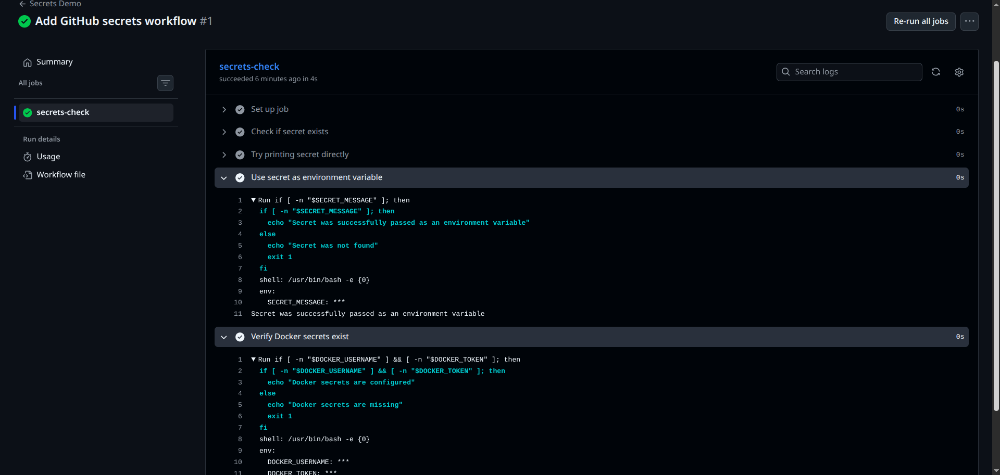
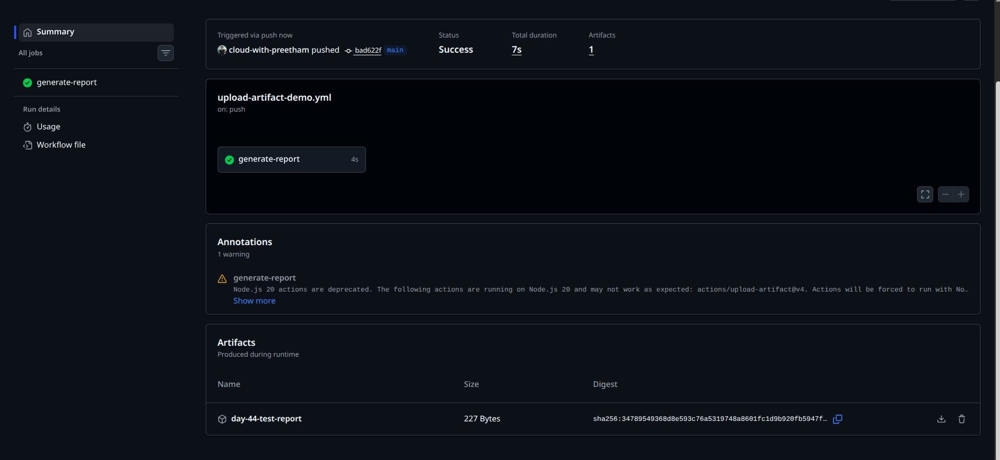
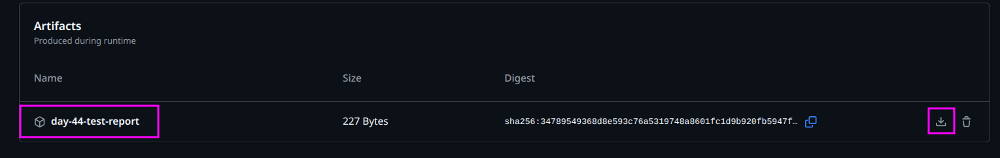
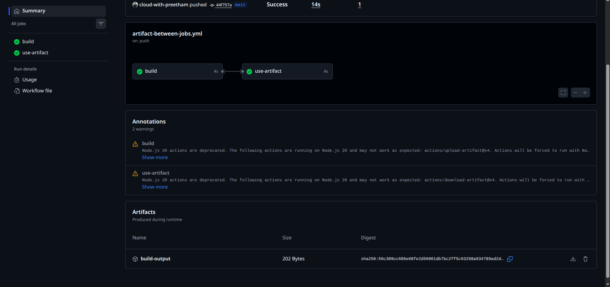
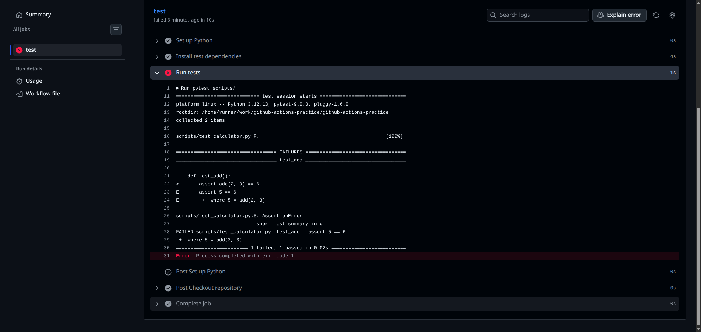
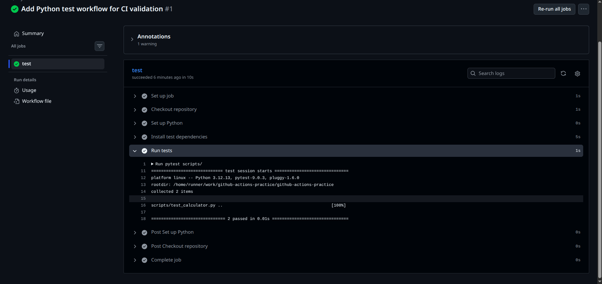
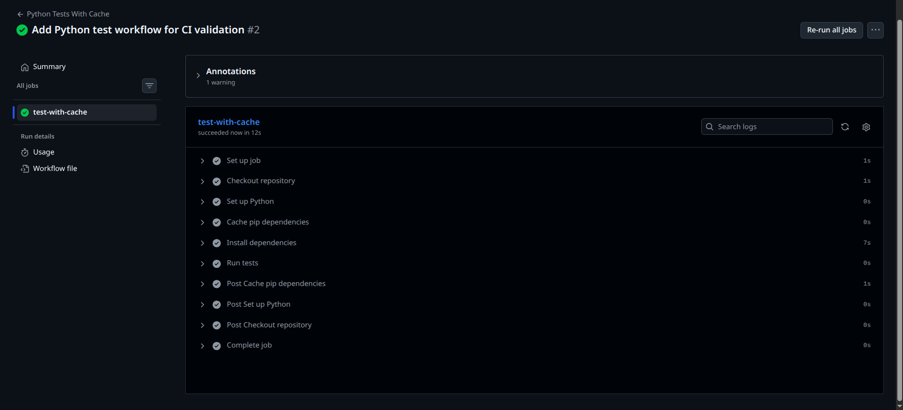

# Day 44 – Secrets, Artifacts & Running Real Tests in CI

## Overview

Today I learned how to make GitHub Actions workflows more practical by using secrets, artifacts, job-to-job artifact sharing, real test execution, and dependency caching.

This day was important because real CI pipelines do more than just run simple commands. They securely handle sensitive values, generate useful output files, pass data between jobs, run automated tests, and improve performance using caching.

---

## Tasks Completed

- Created GitHub repository secrets
- Used secrets safely inside GitHub Actions workflows
- Verified that GitHub masks secret values in workflow logs
- Uploaded artifacts from a CI workflow
- Downloaded artifacts from the GitHub Actions UI
- Shared artifacts between jobs
- Created a Python script and test file
- Ran real tests using `pytest` in CI
- Intentionally broke a test to verify pipeline failure
- Fixed the test and verified pipeline success
- Added dependency caching using `actions/cache`

---

## 1. GitHub Secrets

I created the following secrets in my GitHub repository:

```text
MY_SECRET_MESSAGE
DOCKER_USERNAME
DOCKER_TOKEN
```

These secrets were added from:

```text
Repository → Settings → Secrets and variables → Actions → New repository secret
```

I created a workflow named `secrets-demo.yml` to check if the secret exists without exposing the actual value.

The workflow printed:

```text
The secret is set: true
```

I also tried to print the secret directly in the workflow logs. GitHub automatically masked the secret value and displayed it as:

```text
***
```



---

## Why Secrets Should Never Be Printed in CI Logs

Secrets should never be printed in CI logs because logs may be visible to team members, stored in workflow history, or accidentally shared.

If a secret is exposed, attackers could use it to access private systems such as:

- Docker Hub accounts
- Cloud platforms
- Databases
- Deployment servers
- Production environments

Best practice is to store secrets in GitHub Secrets and use them as environment variables without printing their actual values.

---

## 2. Using Secrets as Environment Variables

I passed a GitHub secret into a workflow step using the `env` block.

Example:

```yaml
env:
  SECRET_MESSAGE: ${{ secrets.MY_SECRET_MESSAGE }}
```

Then I used it safely in a shell command:

```bash
if [ -n "$SECRET_MESSAGE" ]; then
  echo "Secret was successfully passed as an environment variable"
else
  echo "Secret was not found"
  exit 1
fi
```

This confirmed that secrets can be used inside CI jobs without hardcoding sensitive values in the repository.

---

## 3. Uploading Artifacts

I created a workflow named `upload-artifact-demo.yml`.

This workflow generated a test report file and uploaded it as a GitHub Actions artifact.

The artifact was uploaded using:

```yaml
uses: actions/upload-artifact@v4
```

The artifact name was:

```text
day-44-test-report
```

The workflow completed successfully and the artifact appeared in the GitHub Actions run summary.



I also verified that the artifact could be downloaded from the GitHub Actions UI.



---

## 4. Downloading Artifacts Between Jobs

I created a workflow named `artifact-between-jobs.yml`.

This workflow had two jobs:

```text
build
use-artifact
```

The `build` job generated a file and uploaded it as an artifact.

The `use-artifact` job downloaded the artifact from the previous job and printed its contents.

The workflow completed successfully.



---

## When Artifacts Are Used in Real Pipelines

Artifacts are used in real CI/CD pipelines when one job produces a file that needs to be stored, reviewed, downloaded, or used by another job.

Common examples include:

- Test reports
- Build logs
- Compiled application files
- Code coverage reports
- Security scan reports
- Deployment packages
- Docker image metadata

Artifacts are useful because they preserve important files generated during pipeline execution.

---

## 5. Running Real Tests in CI

I created a simple Python script:

```text
scripts/calculator.py
```

I also created a test file:

```text
scripts/test_calculator.py
```

The test workflow used `pytest` to run automated tests inside GitHub Actions.

The workflow command was:

```bash
pytest scripts/
```

---

## Failed Test Verification

First, I intentionally broke the test by changing the expected result.

The test failed successfully, and the GitHub Actions pipeline turned red.

This confirmed that CI can detect broken code.



---

## Passing Test Verification

After verifying the failure, I fixed the test and pushed the correction.

The workflow passed successfully.

The final result showed:

```text
2 passed
```



---

## Why Running Tests in CI Is Important

Running tests in CI is important because it gives fast feedback whenever code changes.

A good CI pipeline should:

- Run tests automatically
- Fail when code is broken
- Protect the main branch
- Help developers catch issues early
- Increase confidence before deployment

This is one of the most important practices in real DevOps teams.

---

## 6. Caching Dependencies

I created a workflow named `python-tests-cache.yml`.

This workflow used GitHub Actions cache to speed up dependency installation.

The cache action used was:

```yaml
uses: actions/cache@v4
```

The cached path was:

```text
~/.cache/pip
```

This stores downloaded Python packages so future workflow runs can reuse them.



---

## What Is Being Cached?

The workflow caches Python pip dependencies.

Specifically, it caches:

```text
~/.cache/pip
```

This means Python packages do not need to be downloaded from scratch on every workflow run.

---

## Where Is the Cache Stored?

The cache is stored in GitHub-managed cache storage.

It is connected to the repository and restored in future workflow runs when the cache key matches.

---

## Final Project Structure

```text
day-44/
├── github-actions-practice/
│   └── .github/
│       └── workflows/
│           ├── artifact-between-jobs.yml
│           ├── python-tests-cache.yml
│           ├── python-tests.yml
│           ├── secrets-demo.yml
│           └── upload-artifact-demo.yml
├── screenshots/
│   ├── day-44-artifact-between-jobs.png
│   ├── day-44-artifact-download.png
│   ├── day-44-artifact-upload.png
│   ├── day-44-cache-restored.png
│   ├── day-44-secret-masked.png
│   ├── day-44-test-failed.png
│   └── day-44-test-passed.png
├── scripts/
│   ├── calculator.py
│   └── test_calculator.py
├── day-44-secrets-artifacts.md
├── README.md
└── task.md
```

---

## Key Learnings

- Secrets should be stored in GitHub Secrets, not inside source code
- Secrets should never be printed in CI logs
- GitHub masks secret values automatically
- Environment variables are a safe way to use secrets in workflows
- Artifacts are used to store files generated during CI
- Artifacts can be downloaded from GitHub Actions
- Artifacts can be shared between jobs
- CI tests help catch broken code early
- A failing test should make the pipeline fail
- A fixed test should make the pipeline pass
- Caching speeds up workflows by reusing dependencies

---

## Final Status

Day 44 completed successfully.

I configured secrets, uploaded and downloaded artifacts, passed artifacts between jobs, ran real Python tests in CI, verified both failure and success cases, and added dependency caching to improve workflow performance.
