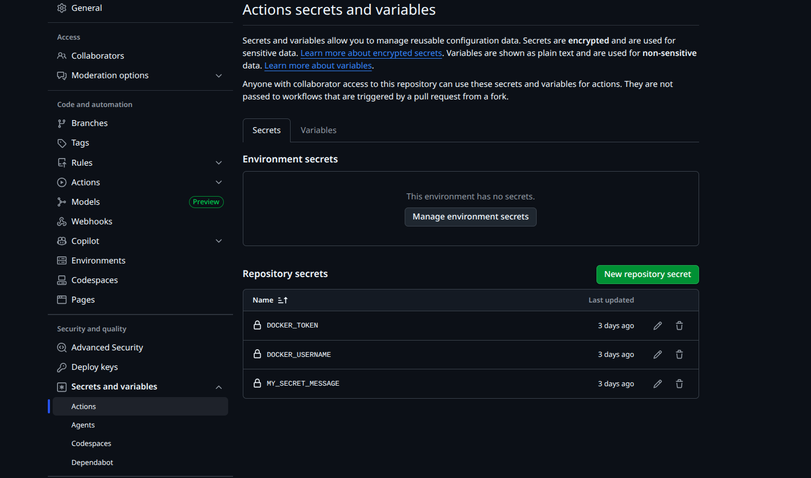
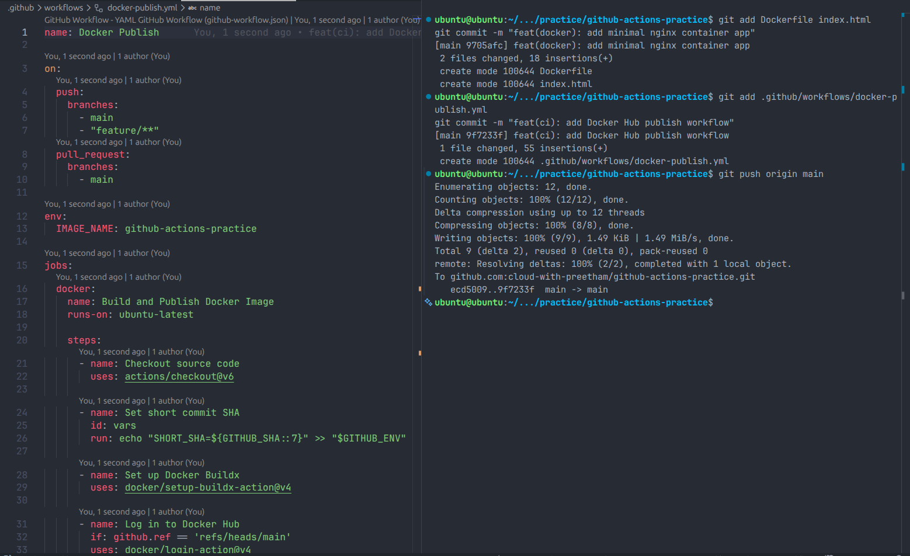
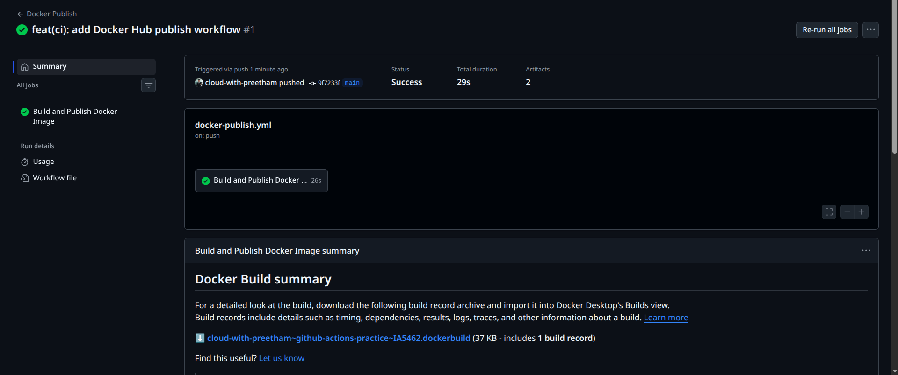
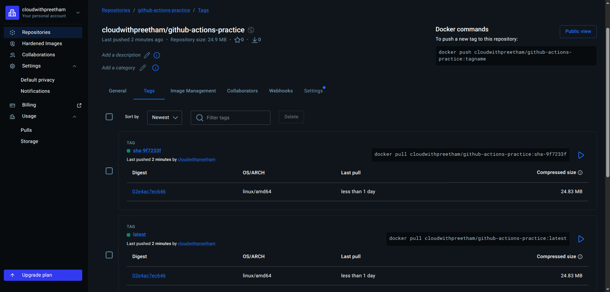
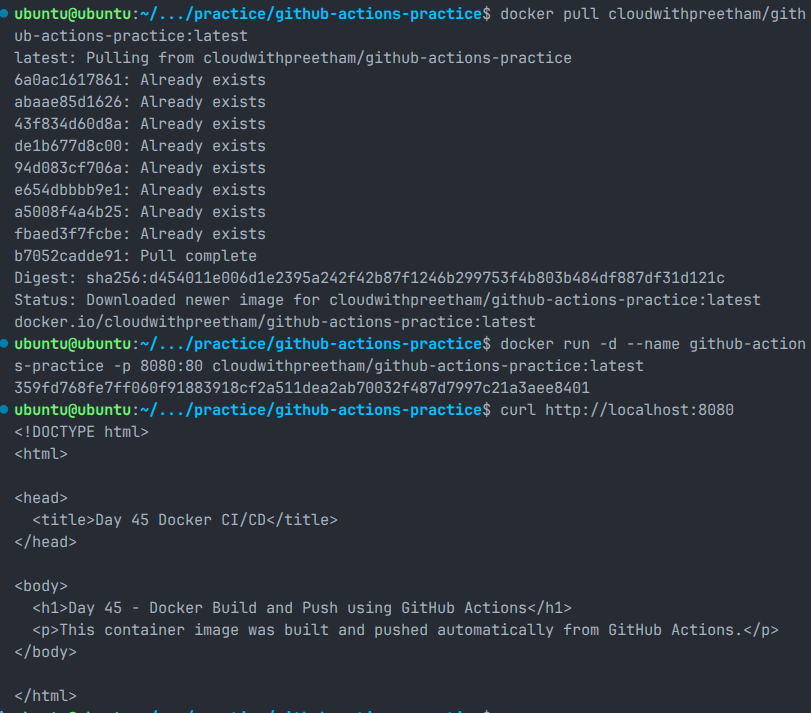

# Day 45 - Docker Build & Push in GitHub Actions

## Objective

The goal of Day 45 was to create a complete CI/CD pipeline using GitHub Actions.

In this task, I configured a workflow that automatically builds a Docker image and pushes it to Docker Hub whenever code is pushed to the `main` branch.

This is a real-world DevOps workflow because teams commonly use CI/CD pipelines to package applications into Docker images and publish them to container registries.

---

## What I Built

I created a GitHub Actions workflow that performs the following steps:

1. Checks out the repository code
2. Sets up Docker Buildx
3. Logs in to Docker Hub securely using GitHub Secrets
4. Builds the Docker image from the Dockerfile
5. Tags the image as `latest`
6. Tags the image with the short Git commit SHA
7. Pushes both image tags to Docker Hub
8. Allows feature branches to build the image but not push it

---

## Project Structure

```text
day-45/
├── github-actions-practice/
│   └── .github/
│       └── workflows/
│           └── docker-publish.yml
├── screenshots/
├── day-45-docker-cicd.md
├── Dockerfile
├── index.html
├── README.md
└── task.md
```

---

## Dockerfile

```dockerfile
FROM nginx:alpine

COPY index.html /usr/share/nginx/html/index.html

EXPOSE 80
```

---

## Sample Application

File: `index.html`

```html
<!DOCTYPE html>
<html>
  <head>
    <title>Day 45 Docker CI/CD</title>
  </head>
  <body>
    <h1>Day 45 - Docker Build and Push using GitHub Actions</h1>
    <p>
      This container image was built and pushed automatically from GitHub
      Actions.
    </p>
  </body>
</html>
```

---

## GitHub Secrets Used

The Docker Hub credentials were stored securely using GitHub Actions Secrets.

Secrets configured:

```text
DOCKER_USERNAME
DOCKER_TOKEN
```

The actual secret values were not printed in the workflow logs.



---

## GitHub Actions Workflow

File: `github-actions-practice/.github/workflows/docker-publish.yml`



```yaml
name: Docker Publish

on:
  push:
    branches:
      - main
      - "feature/**"
  pull_request:
    branches:
      - main

env:
  IMAGE_NAME: github-actions-practice

jobs:
  docker:
    name: Build and Publish Docker Image
    runs-on: ubuntu-latest

    steps:
      - name: Checkout source code
        uses: actions/checkout@v6

      - name: Set short commit SHA
        id: vars
        run: echo "SHORT_SHA=${GITHUB_SHA::7}" >> "$GITHUB_ENV"

      - name: Set up Docker Buildx
        uses: docker/setup-buildx-action@v4

      - name: Log in to Docker Hub
        if: github.ref == 'refs/heads/main'
        uses: docker/login-action@v4
        with:
          username: ${{ secrets.DOCKER_USERNAME }}
          password: ${{ secrets.DOCKER_TOKEN }}

      - name: Build Docker image
        uses: docker/build-push-action@v7
        with:
          context: .
          push: false
          tags: |
            ${{ secrets.DOCKER_USERNAME }}/${{ env.IMAGE_NAME }}:latest
            ${{ secrets.DOCKER_USERNAME }}/${{ env.IMAGE_NAME }}:sha-${{ env.SHORT_SHA }}

      - name: Build and push Docker image
        if: github.ref == 'refs/heads/main'
        uses: docker/build-push-action@v7
        with:
          context: .
          push: true
          tags: |
            ${{ secrets.DOCKER_USERNAME }}/${{ env.IMAGE_NAME }}:latest
            ${{ secrets.DOCKER_USERNAME }}/${{ env.IMAGE_NAME }}:sha-${{ env.SHORT_SHA }}
```

---

## Workflow Explanation

### Trigger

The workflow runs when code is pushed to:

```text
main
feature/**
```

It also runs on pull requests targeting the `main` branch.

```yaml
on:
  push:
    branches:
      - main
      - "feature/**"
  pull_request:
    branches:
      - main
```

---

### Checkout Source Code

```yaml
- name: Checkout source code
  uses: actions/checkout@v6
```

This step downloads the repository code into the GitHub Actions runner.

---

### Set Short Commit SHA

```yaml
- name: Set short commit SHA
  id: vars
  run: echo "SHORT_SHA=${GITHUB_SHA::7}" >> "$GITHUB_ENV"
```

This creates a short version of the commit hash.

Example:

```text
sha-a1b2c3d
```

This helps identify exactly which commit created the Docker image.

---

### Docker Buildx Setup

```yaml
- name: Set up Docker Buildx
  uses: docker/setup-buildx-action@v4
```

Docker Buildx is used for modern Docker image builds in CI pipelines.

---

### Docker Hub Login

```yaml
- name: Log in to Docker Hub
  if: github.ref == 'refs/heads/main'
  uses: docker/login-action@v4
  with:
    username: ${{ secrets.DOCKER_USERNAME }}
    password: ${{ secrets.DOCKER_TOKEN }}
```

This step logs in to Docker Hub using GitHub Secrets.

The condition ensures login only happens on the `main` branch.

---

### Build Docker Image

```yaml
- name: Build Docker image
  uses: docker/build-push-action@v7
  with:
    context: .
    push: false
    tags: |
      ${{ secrets.DOCKER_USERNAME }}/${{ env.IMAGE_NAME }}:latest
      ${{ secrets.DOCKER_USERNAME }}/${{ env.IMAGE_NAME }}:sha-${{ env.SHORT_SHA }}
```

This step builds the Docker image but does not push it.

This is useful for feature branches and pull requests because it validates that the Docker image can be built successfully.

---

### Build and Push Docker Image

```yaml
- name: Build and push Docker image
  if: github.ref == 'refs/heads/main'
  uses: docker/build-push-action@v7
  with:
    context: .
    push: true
    tags: |
      ${{ secrets.DOCKER_USERNAME }}/${{ env.IMAGE_NAME }}:latest
      ${{ secrets.DOCKER_USERNAME }}/${{ env.IMAGE_NAME }}:sha-${{ env.SHORT_SHA }}
```

This step builds and pushes the Docker image to Docker Hub.

It only runs when the branch is `main`.



---

## Docker Image Tags

The image is pushed with two tags:

```text
latest
sha-<short-commit-hash>
```

Example:

```text
preetham/github-actions-practice:latest
preetham/github-actions-practice:sha-a1b2c3d
```

The `latest` tag is useful for pulling the newest image.

The SHA tag is useful for traceability and rollback.



---

## Docker Hub Image

Docker Hub image link:

```text
https://hub.docker.com/r/YOUR_DOCKER_USERNAME/github-actions-practice
```

Replace `YOUR_DOCKER_USERNAME` with your Docker Hub username.

---

## README Status Badge

The workflow status badge was added to the repository `README.md`.

```md

```

The badge shows whether the latest workflow run is passing or failing.

---

## Testing Feature Branch Behavior

I also tested the workflow from a feature branch.

Commands used:

```bash
git checkout -b feature/test-docker-build
echo "<p>Testing feature branch build</p>" >> index.html
git add .
git commit -m "test docker image build on feature branch"
git push origin feature/test-docker-build
```

Expected result:

```text
Docker image builds successfully.
Docker Hub login is skipped.
Docker image push is skipped.
```

This confirms that images are only pushed from the `main` branch.

---

## Pull and Run the Docker Image

After the image was pushed to Docker Hub, I pulled and ran it locally.

```bash
docker pull YOUR_DOCKER_USERNAME/github-actions-practice:latest
```

Run the container:

```bash
docker run -d \
  --name github-actions-practice \
  -p 8080:80 \
  YOUR_DOCKER_USERNAME/github-actions-practice:latest
```

Verify the app:

```bash
curl http://localhost:8080
```

Expected output:

```html
<h1>Day 45 - Docker Build and Push using GitHub Actions</h1>
```



Cleanup:

```bash
docker stop github-actions-practice
docker rm github-actions-practice
```

---

## Full Journey: From Git Push to Running Container

The complete CI/CD journey works like this:

1. Developer writes or updates application code.
2. Developer pushes the code to GitHub.
3. GitHub Actions automatically detects the push.
4. A GitHub-hosted Ubuntu runner starts.
5. The repository code is checked out.
6. Docker Buildx is configured.
7. The Docker image is built from the Dockerfile.
8. If the branch is `main`, GitHub Actions logs in to Docker Hub.
9. The image is tagged as `latest`.
10. The image is also tagged with the short commit SHA.
11. Both image tags are pushed to Docker Hub.
12. A server or local machine pulls the image from Docker Hub.
13. The container is started using `docker run`.
14. The application becomes available through the mapped port.

This is the basic workflow used in real CI/CD pipelines to automatically build, package, and publish applications.

---

## Verification Checklist

| Task                              | Status |
| --------------------------------- | ------ |
| Dockerfile added                  | Done   |
| Sample app added                  | Done   |
| Docker Hub secrets configured     | Done   |
| GitHub Actions workflow created   | Done   |
| Docker image built in CI          | Done   |
| Docker image pushed to Docker Hub | Done   |
| `latest` tag pushed               | Done   |
| SHA tag pushed                    | Done   |
| Push restricted to main branch    | Done   |
| Feature branch build tested       | Done   |
| README badge added                | Done   |
| Docker image pulled and tested    | Done   |

---

## Key Learnings

From this task, I learned:

1. How to build Docker images using GitHub Actions
2. How to push Docker images to Docker Hub from CI
3. How to use GitHub Secrets safely
4. How to tag Docker images using `latest` and commit SHA
5. How to restrict deployment steps to the `main` branch
6. How CI/CD connects source code, Docker, and container registries

---

## Real-World Understanding

In real DevOps teams, developers do not manually build and push Docker images every time.

Instead, CI/CD pipelines handle the process automatically.

This improves:

- Speed
- Consistency
- Security
- Traceability
- Deployment reliability

Day 45 helped me understand how a basic production-style Docker CI/CD pipeline works.

---

## Final Status

Day 45 was completed successfully.

A Docker image was built using GitHub Actions, pushed to Docker Hub, tagged properly, and tested by pulling and running it locally.
