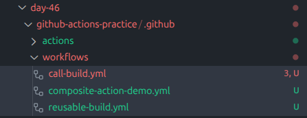
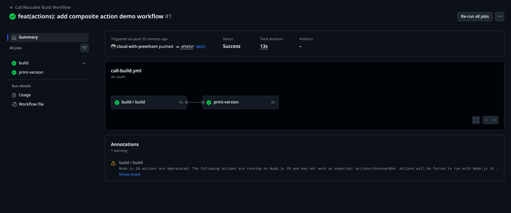
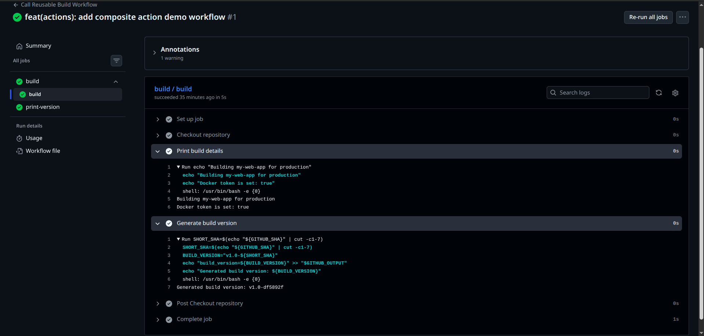
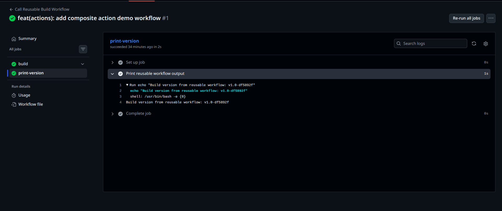
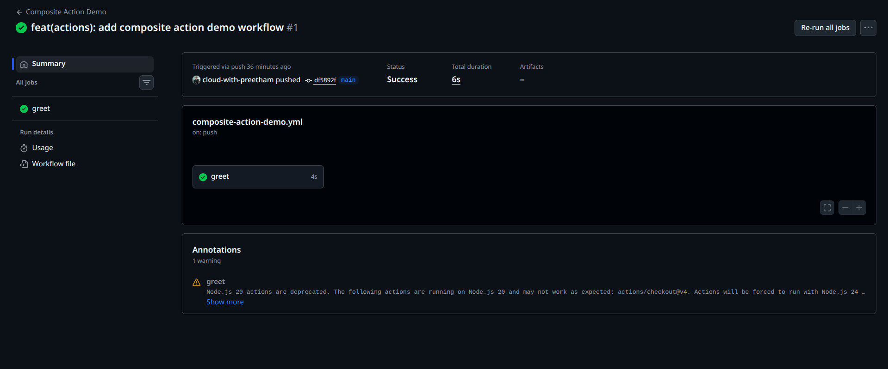

# Day 46 – Reusable Workflows & Composite Actions

## Overview

On Day 46, I learned how to reduce repetition in GitHub Actions by using reusable workflows and composite actions.

In real DevOps teams, CI/CD logic is not copied again and again across multiple repositories. Instead, teams create reusable workflow templates and custom actions that can be used across projects.

This day focused on:

- Creating a reusable workflow with `workflow_call`
- Passing inputs and secrets to reusable workflows
- Returning outputs from reusable workflows
- Calling reusable workflows from another workflow
- Creating a custom composite action
- Understanding the difference between reusable workflows and composite actions

---

## Why Reusable Workflows Matter

Reusable workflows help teams follow the DRY principle:

> Do not repeat yourself.

Instead of writing the same build, test, scan, or deploy logic in every repository, teams can define that logic once and call it wherever needed.

This improves:

- Maintainability
- Consistency
- Security
- CI/CD standardization
- Team productivity

---

## Task 1: Understanding `workflow_call`

### What is a Reusable Workflow?

A reusable workflow is a GitHub Actions workflow that can be called by another workflow.

It is useful when the same CI/CD process is needed in multiple workflows or repositories.

Example use cases:

- Standard build workflow
- Docker image build workflow
- Test workflow
- Security scan workflow
- Deployment workflow

---

### What is the `workflow_call` Trigger?

The `workflow_call` trigger allows a workflow to be called by another workflow.

A workflow using `workflow_call` does not run directly on `push` or `pull_request`.

It only runs when another workflow calls it.

Example:

```yaml
on:
  workflow_call:
```

---

### Reusable Workflow vs Regular Action

A reusable workflow is called at the job level.

Example:

```yaml
jobs:
  build:
    uses: ./.github/workflows/reusable-build.yml
```

A regular action or composite action is called inside steps.

Example:

```yaml
steps:
  - uses: actions/checkout@v4
```

Main difference:

- Reusable workflows can contain jobs.
- Composite actions contain reusable steps.

---

### Where Must a Reusable Workflow Live?

Reusable workflows must be stored inside the `.github/workflows/` directory.

Example:

```bash
.github/workflows/reusable-build.yml
```

---

## Final Project Structure

```bash
day-46/
├── github-actions-practice/
│   └── .github/
│       ├── actions/
│       │   └── setup-and-greet/
│       │       └── action.yml
│       └── workflows/
│           ├── call-build.yml
│           ├── composite-action-demo.yml
│           └── reusable-build.yml
├── screenshots/
│   ├── day-46-build-version-output.png
│   ├── day-46-call-build-success.png
│   ├── day-46-composite-action-success.png
│   ├── day-46-reusable-workflow-logs.png
│   └── day-46-workflow-files.png
├── day-46-reusable-workflows.md
├── README.md
└── task.md
```



---

## Task 2: Reusable Build Workflow

File created:

```bash
github-actions-practice/.github/workflows/reusable-build.yml
```

This workflow uses `workflow_call`, accepts inputs, accepts a secret, and generates a build version output.

```yaml
name: Reusable Build Workflow

on:
  workflow_call:
    inputs:
      app_name:
        description: "Application name"
        required: true
        type: string
      environment:
        description: "Target environment"
        required: true
        default: "staging"
        type: string

    secrets:
      docker_token:
        description: "Docker Hub token"
        required: true

    outputs:
      build_version:
        description: "Generated build version"
        value: ${{ jobs.build.outputs.build_version }}

jobs:
  build:
    runs-on: ubuntu-latest

    outputs:
      build_version: ${{ steps.version.outputs.build_version }}

    steps:
      - name: Checkout repository
        uses: actions/checkout@v4

      - name: Print build details
        run: |
          echo "Building ${{ inputs.app_name }} for ${{ inputs.environment }}"
          echo "Docker token is set: ${{ secrets.docker_token != '' }}"

      - name: Generate build version
        id: version
        run: |
          SHORT_SHA=$(echo "${GITHUB_SHA}" | cut -c1-7)
          BUILD_VERSION="v1.0-${SHORT_SHA}"
          echo "build_version=${BUILD_VERSION}" >> "$GITHUB_OUTPUT"
          echo "Generated build version: ${BUILD_VERSION}"
```

---

## Explanation

The reusable workflow accepts two inputs:

| Input         | Type   | Required | Purpose                                          |
| ------------- | ------ | -------- | ------------------------------------------------ |
| `app_name`    | string | Yes      | Name of the application                          |
| `environment` | string | Yes      | Target environment such as staging or production |

It also accepts one secret:

| Secret         | Required | Purpose                                |
| -------------- | -------- | -------------------------------------- |
| `docker_token` | Yes      | Used to verify secret passing securely |

The workflow prints:

```bash
Building my-web-app for production
Docker token is set: true
```

The actual Docker token is not printed. This is the correct security practice.

---

## Task 3: Caller Workflow

File created:

```bash
github-actions-practice/.github/workflows/call-build.yml
```

This workflow runs on push to the `main` branch and calls the reusable workflow.

```yaml
name: Call Reusable Build Workflow

on:
  push:
    branches:
      - main

jobs:
  build:
    uses: ./.github/workflows/reusable-build.yml
    with:
      app_name: "my-web-app"
      environment: "production"
    secrets:
      docker_token: ${{ secrets.DOCKER_TOKEN }}

  print-version:
    runs-on: ubuntu-latest
    needs: build

    steps:
      - name: Print reusable workflow output
        run: |
          echo "Build version from reusable workflow: ${{ needs.build.outputs.build_version }}"
```

---

## Explanation

The caller workflow calls the reusable workflow using:

```yaml
uses: ./.github/workflows/reusable-build.yml
```

Inputs are passed using:

```yaml
with:
  app_name: "my-web-app"
  environment: "production"
```

The Docker token secret is passed securely using:

```yaml
secrets:
  docker_token: ${{ secrets.DOCKER_TOKEN }}
```



---

## Task 4: Reusable Workflow Output

The reusable workflow generates a build version using the short Git commit SHA.

Example:

```bash
v1.0-df5892f
```

The output is created inside the reusable workflow:

```bash
echo "build_version=${BUILD_VERSION}" >> "$GITHUB_OUTPUT"
```

Then it is exposed at the workflow level:

```yaml
outputs:
  build_version:
    description: "Generated build version"
    value: ${{ jobs.build.outputs.build_version }}
```

The caller workflow reads it using:

```yaml
${{ needs.build.outputs.build_version }}
```

---

## Output Verification

The `print-version` job successfully printed:

```bash
Build version from reusable workflow: v1.0-df5892f
```





This confirms that outputs are correctly passed from the reusable workflow to the caller workflow.

---

## Task 5: Composite Action

File created:

```bash
github-actions-practice/.github/actions/setup-and-greet/action.yml
```

This custom composite action accepts a name and language, prints a greeting, prints runner details, and returns an output.

```yaml
name: Setup and Greet
description: Custom composite action to greet a user and print runner details

inputs:
  name:
    description: "Name of the person to greet"
    required: true

  language:
    description: "Greeting language"
    required: false
    default: "en"

outputs:
  greeted:
    description: "Whether greeting was completed"
    value: ${{ steps.set-output.outputs.greeted }}

runs:
  using: "composite"

  steps:
    - name: Print greeting
      shell: bash
      run: |
        if [ "${{ inputs.language }}" = "hi" ]; then
          echo "Namaste, ${{ inputs.name }}!"
        else
          echo "Hello, ${{ inputs.name }}!"
        fi

    - name: Print date and runner OS
      shell: bash
      run: |
        echo "Current date: $(date)"
        echo "Runner OS: $RUNNER_OS"

    - name: Set output
      id: set-output
      shell: bash
      run: |
        echo "greeted=true" >> "$GITHUB_OUTPUT"
```

---

## Composite Action Demo Workflow

File created:

```bash
github-actions-practice/.github/workflows/composite-action-demo.yml
```

```yaml
name: Composite Action Demo

on:
  push:
    branches:
      - main

jobs:
  greet:
    runs-on: ubuntu-latest

    steps:
      - name: Checkout repository
        uses: actions/checkout@v4

      - name: Run custom composite action
        id: greet-action
        uses: ./.github/actions/setup-and-greet
        with:
          name: "Preetham"
          language: "en"

      - name: Print composite action output
        run: |
          echo "Greeting completed: ${{ steps.greet-action.outputs.greeted }}"
```

---

## Composite Action Verification

The composite action workflow ran successfully.

Expected output:

```bash
Hello, Preetham!
Current date: <date>
Runner OS: Linux
Greeting completed: true
```

This confirms that the custom composite action works correctly.



---

## Task 6: Reusable Workflow vs Composite Action

|                              | Reusable Workflow                        | Composite Action                                                  |
| ---------------------------- | ---------------------------------------- | ----------------------------------------------------------------- |
| Triggered by                 | `workflow_call`                          | `uses:` in a step                                                 |
| Can contain jobs?            | Yes                                      | No                                                                |
| Can contain multiple steps?  | Yes                                      | Yes                                                               |
| Lives where?                 | `.github/workflows/`                     | Commonly `.github/actions/<action-name>/`                         |
| Can accept secrets directly? | Yes                                      | No, secrets must be passed through workflow, job, or step context |
| Best for                     | Reusing complete CI/CD jobs or pipelines | Reusing repeated step logic                                       |

---

## Verification Summary

| Task                              | Status    |
| --------------------------------- | --------- |
| Created reusable workflow         | Completed |
| Used `workflow_call`              | Completed |
| Added inputs                      | Completed |
| Passed secret securely            | Completed |
| Created caller workflow           | Completed |
| Added reusable workflow output    | Completed |
| Printed output in caller workflow | Completed |
| Created composite action          | Completed |
| Used composite action in workflow | Completed |
| Added documentation               | Completed |

---

## Issue Faced

A warning appeared in GitHub Actions:

```bash
Node.js 20 actions are deprecated
```

This warning came from the GitHub action runtime used by `actions/checkout@v4`.

The workflow still completed successfully, so this was not a blocking issue.

---

## Key Learnings

- Reusable workflows help avoid duplicate CI/CD logic.
- `workflow_call` allows one workflow to call another workflow.
- Reusable workflows are called at the job level.
- Composite actions are called inside workflow steps.
- Reusable workflows can contain jobs.
- Composite actions cannot contain jobs.
- Reusable workflows are better for full pipelines.
- Composite actions are better for repeated step logic.
- Secrets should never be printed directly in logs.
- Outputs can be passed from reusable workflows back to caller workflows.

---

## Real-World DevOps Use Case

In a real DevOps team, reusable workflows can be used for:

- Docker image builds
- Unit test pipelines
- Security scanning
- Deployment workflows
- Environment promotion
- Release automation

Composite actions can be used for:

- Tool setup
- Repeated validation steps
- Metadata printing
- Common shell command groups
- Environment preparation

This helps teams keep CI/CD pipelines clean, consistent, and easier to maintain.

---

## Final Status

Day 46 was successfully completed.

Reusable workflows and composite actions are important GitHub Actions skills because they are commonly used in production CI/CD systems.
