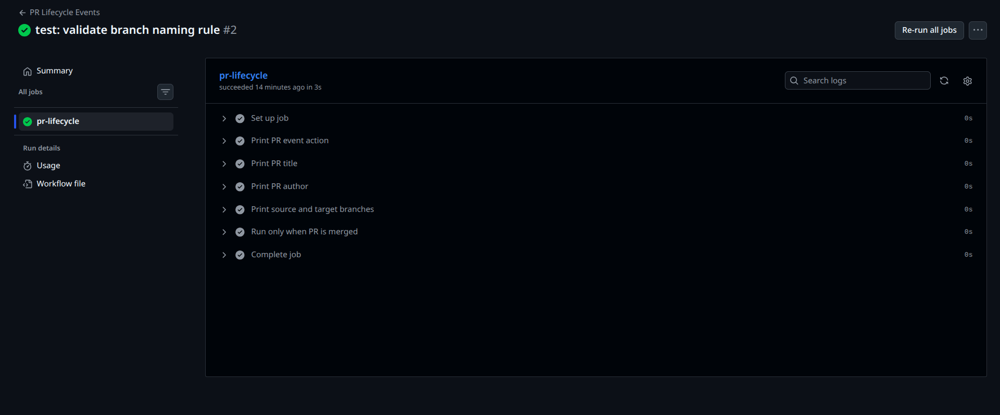
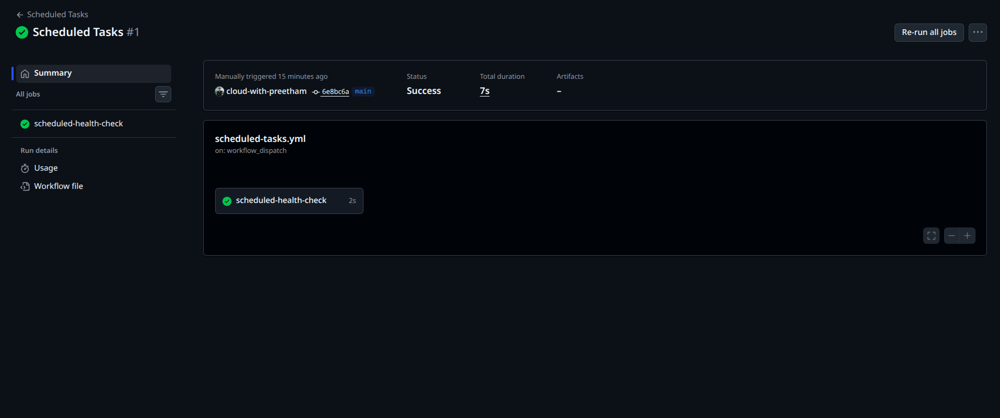
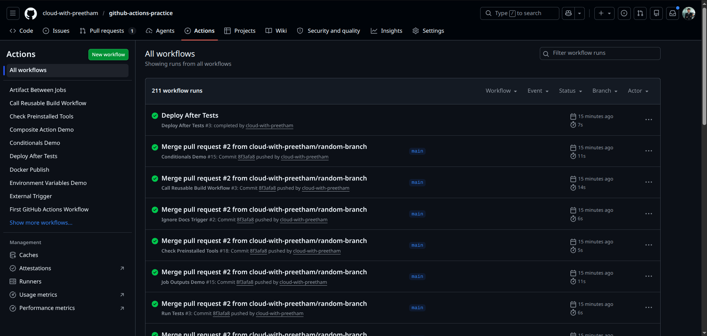

# Day 47 – Advanced Triggers: PR Events, Cron Schedules & Event-Driven Pipelines

## Overview

Today I learned about advanced GitHub Actions triggers beyond basic `push` and `pull_request`.

In real DevOps pipelines, workflows do not only run when code is pushed. They can also run when pull requests are opened, updated, merged, scheduled by cron jobs, triggered by another workflow, or even started by an external system.

This day helped me understand how production CI/CD pipelines are automated using event-driven workflows.

---

## Objectives

- Understand pull request lifecycle events
- Create PR validation checks
- Use scheduled workflows with cron
- Apply path and branch filters
- Chain workflows using `workflow_run`
- Trigger workflows from external systems using `repository_dispatch`

---

## Workflow Files Created

```text
.github/workflows/pr-lifecycle.yml
.github/workflows/pr-checks.yml
.github/workflows/scheduled-tasks.yml
.github/workflows/smart-triggers.yml
.github/workflows/ignore-docs-trigger.yml
.github/workflows/tests.yml
.github/workflows/deploy-after-tests.yml
.github/workflows/external-trigger.yml
```

---

## Task 1 – Pull Request Lifecycle Events

### File

```text
.github/workflows/pr-lifecycle.yml
```

### Workflow

```yaml
name: PR Lifecycle Events

on:
  pull_request:
    types:
      - opened
      - synchronize
      - reopened
      - closed

jobs:
  pr-lifecycle:
    runs-on: ubuntu-latest

    steps:
      - name: Print PR event action
        run: echo "Event action: ${{ github.event.action }}"

      - name: Print PR title
        run: echo "PR title: ${{ github.event.pull_request.title }}"

      - name: Print PR author
        run: echo "PR author: ${{ github.event.pull_request.user.login }}"

      - name: Print source and target branches
        run: |
          echo "Source branch: ${{ github.event.pull_request.head.ref }}"
          echo "Target branch: ${{ github.event.pull_request.base.ref }}"

      - name: Run only when PR is merged
        if: github.event.pull_request.merged == true
        run: echo "This PR was merged successfully."
```

### What I Learned

A pull request workflow can run at different stages of a PR lifecycle.

Common PR activity types:

| Event Type    | Meaning                                           |
| ------------- | ------------------------------------------------- |
| `opened`      | Runs when a new PR is created                     |
| `synchronize` | Runs when new commits are pushed to the PR branch |
| `reopened`    | Runs when a closed PR is opened again             |
| `closed`      | Runs when a PR is closed or merged                |

To check whether a PR was merged, I used:

```yaml
if: github.event.pull_request.merged == true
```

This is useful because a closed PR does not always mean it was merged. It may also be closed without merging.

---

## Task 2 – PR Validation Workflow

### File

```text
.github/workflows/pr-checks.yml
```

### Workflow

```yaml
name: PR Validation Checks

on:
  pull_request:
    branches:
      - main

jobs:
  file-size-check:
    runs-on: ubuntu-latest

    steps:
      - name: Checkout repository
        uses: actions/checkout@v4

      - name: Fail if any file is larger than 1 MB
        run: |
          echo "Checking for files larger than 1 MB..."

          large_files=$(find . -type f -size +1M \
            -not -path "./.git/*" \
            -not -path "./node_modules/*")

          if [ -n "$large_files" ]; then
            echo "The following files are larger than 1 MB:"
            echo "$large_files"
            exit 1
          else
            echo "No files larger than 1 MB found."
          fi

  branch-name-check:
    runs-on: ubuntu-latest

    steps:
      - name: Validate branch name
        run: |
          branch_name="${{ github.head_ref }}"

          echo "Checking branch name: $branch_name"

          if [[ "$branch_name" =~ ^(feature|fix|docs)/.+$ ]]; then
            echo "Branch name is valid."
          else
            echo "Invalid branch name."
            echo "Branch name must start with feature/, fix/, or docs/"
            exit 1
          fi

  pr-body-check:
    runs-on: ubuntu-latest

    steps:
      - name: Check PR description
        run: |
          pr_body="${{ github.event.pull_request.body }}"

          if [ -z "$pr_body" ]; then
            echo "Warning: PR description is empty."
          else
            echo "PR description is present."
          fi
```

### What I Learned

PR validation workflows are used as automated quality gates before code gets merged.

This workflow checks:

- File size
- Branch naming convention
- PR description

In real projects, teams use PR gates to prevent bad code, large files, poor branch naming, and incomplete pull requests from entering the main branch.

### Branch Naming Rule

Allowed branch patterns:

```text
feature/*
fix/*
docs/*
```

Examples:

```text
feature/add-login
fix/docker-build-error
docs/update-readme
```

Invalid example:

```text
random-branch
```



---

## Task 3 – Scheduled Workflows

### File

```text
.github/workflows/scheduled-tasks.yml
```

### Workflow

```yaml
name: Scheduled Tasks

on:
  schedule:
    - cron: "30 2 * * 1"
    - cron: "0 */6 * * *"
  workflow_dispatch:

jobs:
  scheduled-health-check:
    runs-on: ubuntu-latest

    steps:
      - name: Print schedule trigger
        run: |
          echo "Triggered by schedule: ${{ github.event.schedule }}"

      - name: Run health check
        run: |
          URL="https://github.com"
          STATUS_CODE=$(curl -o /dev/null -s -w "%{http_code}" "$URL")

          echo "Health check URL: $URL"
          echo "Status code: $STATUS_CODE"

          if [ "$STATUS_CODE" -ge 200 ] && [ "$STATUS_CODE" -lt 400 ]; then
            echo "Health check passed."
          else
            echo "Health check failed."
            exit 1
          fi
```

### Cron Expressions

| Requirement                              | Cron Expression |
| ---------------------------------------- | --------------- |
| Every Monday at 2:30 AM UTC              | `30 2 * * 1`    |
| Every 6 hours                            | `0 */6 * * *`   |
| Every weekday at 9 AM IST                | `30 3 * * 1-5`  |
| First day of every month at midnight UTC | `0 0 1 * *`     |

### Cron Format

```text
minute hour day-of-month month day-of-week
```

Example:

```text
30 2 * * 1
```

Meaning:

```text
At 2:30 AM every Monday
```

### Important Notes

GitHub cron schedules use UTC time.

India Standard Time is UTC + 5:30.

So, 9:00 AM IST is equal to 3:30 AM UTC.

That is why the cron expression for every weekday at 9 AM IST is:

```text
30 3 * * 1-5
```

### Why Scheduled Workflows May Be Delayed or Skipped

GitHub scheduled workflows may be delayed during high load.

Scheduled workflows may also stop running if the repository is inactive for a long time.

Scheduled workflows only run on the default branch.

### Why `workflow_dispatch` Was Added

I added:

```yaml
workflow_dispatch:
```

This allows me to manually run the scheduled workflow from the GitHub Actions UI without waiting for the cron schedule.



---

## Task 4 – Path and Branch Filters

### File 1

```text
.github/workflows/smart-triggers.yml
```

### Workflow Using `paths`

```yaml
name: Smart Path Trigger

on:
  push:
    branches:
      - main
      - "release/**"
    paths:
      - "src/**"
      - "app/**"

jobs:
  smart-trigger-job:
    runs-on: ubuntu-latest

    steps:
      - name: Print trigger message
        run: echo "Workflow triggered because src/ or app/ changed."
```

### File 2

```text
.github/workflows/ignore-docs-trigger.yml
```

### Workflow Using `paths-ignore`

```yaml
name: Ignore Docs Trigger

on:
  push:
    branches:
      - main
      - "release/**"
    paths-ignore:
      - "*.md"
      - "docs/**"

jobs:
  ignore-docs-job:
    runs-on: ubuntu-latest

    steps:
      - name: Print trigger message
        run: echo "Workflow skipped if only markdown or docs files changed."
```

### What I Learned

Path filters help avoid unnecessary pipeline runs.

Use `paths` when the workflow should run only for specific files or folders.

Example:

```yaml
paths:
  - "src/**"
  - "app/**"
```

Use `paths-ignore` when the workflow should run normally but skip for certain files.

Example:

```yaml
paths-ignore:
  - "*.md"
  - "docs/**"
```

### Real-World Use Cases

Use `paths` in a monorepo where each service has its own pipeline.

Example:

```text
frontend/
backend/
infra/
```

If only `frontend/` changes, only the frontend pipeline should run.

Use `paths-ignore` to skip CI when only documentation files are updated.

Example:

```text
README.md
docs/setup.md
```

---

## Task 5 – Chaining Workflows with `workflow_run`

### Test Workflow File

```text
.github/workflows/tests.yml
```

### Workflow

```yaml
name: Run Tests

on:
  push:

jobs:
  test:
    runs-on: ubuntu-latest

    steps:
      - name: Checkout repository
        uses: actions/checkout@v4

      - name: Run sample tests
        run: |
          echo "Running tests..."
          echo "All tests passed."
```

### Deploy Workflow File

```text
.github/workflows/deploy-after-tests.yml
```

### Workflow

```yaml
name: Deploy After Tests

on:
  workflow_run:
    workflows:
      - Run Tests
    types:
      - completed

jobs:
  deploy:
    runs-on: ubuntu-latest

    steps:
      - name: Check test workflow result
        run: |
          echo "Triggered workflow conclusion: ${{ github.event.workflow_run.conclusion }}"

      - name: Stop deployment if tests failed
        if: github.event.workflow_run.conclusion != 'success'
        run: |
          echo "Tests failed or were cancelled. Deployment skipped."
          exit 0

      - name: Deploy after successful tests
        if: github.event.workflow_run.conclusion == 'success'
        run: |
          echo "Tests passed successfully."
          echo "Starting deployment..."
```

### What I Learned

`workflow_run` is used to start one workflow after another workflow completes.

Flow:

```text
Run Tests workflow starts on push
        ↓
Run Tests completes successfully
        ↓
Deploy After Tests workflow starts
```

This pattern is useful when deployment should happen only after tests finish successfully.



---

## Task 6 – External Trigger with `repository_dispatch`

### File

```text
.github/workflows/external-trigger.yml
```

### Workflow

```yaml
name: External Trigger

on:
  repository_dispatch:
    types:
      - deploy-request

jobs:
  external-deploy:
    runs-on: ubuntu-latest

    steps:
      - name: Print external payload
        run: |
          echo "External deployment requested."
          echo "Environment: ${{ github.event.client_payload.environment }}"
```

### Trigger Command

```bash
gh api repos/<owner>/<repo>/dispatches \
  -f event_type=deploy-request \
  -f client_payload='{"environment":"production"}'
```

Example:

```bash
gh api repos/cloud-with-preetham/github-actions-practice/dispatches \
  -f event_type=deploy-request \
  -f client_payload='{"environment":"production"}'
```

### What I Learned

`repository_dispatch` allows external systems to trigger GitHub Actions workflows.

This is useful when something outside GitHub needs to start a pipeline.

Examples:

- Slack bot triggers a deployment
- Monitoring system triggers rollback
- Release dashboard triggers production deployment
- Incident management tool starts recovery workflow
- Another CI/CD system triggers GitHub Actions

### Important Note

`repository_dispatch` requires authentication.

Usually, a Personal Access Token is needed with the correct repository permissions.

---

## `workflow_run` vs `workflow_call`

| Feature          | `workflow_run`                              | `workflow_call`                            |
| ---------------- | ------------------------------------------- | ------------------------------------------ |
| Purpose          | Chain workflows                             | Reuse workflows                            |
| Trigger Type     | Event-based                                 | Called directly by another workflow        |
| Example Use Case | Deploy after tests finish                   | Reusable CI template                       |
| Relationship     | One workflow reacts after another completes | One workflow calls another like a function |
| Common Usage     | CI followed by CD                           | Shared workflow across repositories        |

### Explanation in My Own Words

`workflow_run` is used when I want one workflow to automatically start after another workflow finishes.

Example:

```text
Tests complete successfully, then deployment starts.
```

`workflow_call` is used when I want to create a reusable workflow and call it from another workflow.

Example:

```text
Many repositories use the same reusable Docker build workflow.
```

So, the main difference is:

```text
workflow_run = event-driven chaining
workflow_call = reusable workflow template
```

---

## Testing Steps

### Test PR Lifecycle Workflow

1. Create a new branch.

```bash
git checkout -b feature/day-47-pr-lifecycle
```

2. Make a small change.

```bash
echo "Day 47 PR lifecycle test" >> test.txt
```

3. Commit and push.

```bash
git add test.txt
git commit -m "test: trigger pull request lifecycle workflow"
git push origin feature/day-47-pr-lifecycle
```

4. Open a pull request to `main`.

Expected result:

```text
PR Lifecycle Events workflow should run with action opened.
```

5. Push another commit to the same branch.

Expected result:

```text
Workflow should run again with action synchronize.
```

6. Merge the PR.

Expected result:

```text
Workflow should run with action closed and merged condition should execute.
```

---

### Test PR Validation Workflow

Create a bad branch name:

```bash
git checkout main
git pull
git checkout -b random-branch
```

Make a test change:

```bash
echo "Testing bad branch name" >> bad-branch-test.txt
```

Commit and push:

```bash
git add bad-branch-test.txt
git commit -m "test: validate bad branch name"
git push origin random-branch
```

Open a PR to `main`.

Expected result:

```text
branch-name-check should fail.
```

Now create a valid branch:

```bash
git checkout main
git pull
git checkout -b feature/day-47-validation
```

Expected result:

```text
branch-name-check should pass.
```

---

### Test Scheduled Workflow Manually

Because cron workflows run at scheduled times, I added `workflow_dispatch`.

Steps:

1. Go to GitHub repository.
2. Open the Actions tab.
3. Select `Scheduled Tasks`.
4. Click `Run workflow`.

Expected result:

```text
The health check should run successfully.
```

---

### Test Path Filter Workflow

Change a markdown file:

```bash
echo "Docs update" >> README.md
git add README.md
git commit -m "docs: test path ignore workflow"
git push origin main
```

Expected result:

```text
Smart Path Trigger should not run because src/ or app/ did not change.
```

Change a file inside `src/`:

```bash
mkdir -p src
echo "console.log('test');" > src/app.js
git add src/app.js
git commit -m "test: trigger smart path workflow"
git push origin main
```

Expected result:

```text
Smart Path Trigger should run.
```

---

### Test Workflow Chaining

Push any commit to the repository.

Expected result:

```text
Run Tests workflow runs first.
Deploy After Tests workflow runs after Run Tests completes successfully.
```

---

### Test Repository Dispatch

Run:

```bash
gh api repos/cloud-with-preetham/github-actions-practice/dispatches \
  -f event_type=deploy-request \
  -f client_payload='{"environment":"production"}'
```

Expected result:

```text
External Trigger workflow should run and print environment as production.
```

---

## Real-World DevOps Use Cases

Advanced triggers are used heavily in real CI/CD pipelines.

Examples:

- Run validation checks when a PR is opened
- Re-run tests when new commits are pushed to a PR
- Run scheduled health checks
- Skip CI for documentation-only changes
- Deploy only after tests pass
- Trigger deployments from Slack, monitoring tools, or release dashboards

---

## Final Summary

Day 47 helped me understand how GitHub Actions can respond to different events.

Today I practiced:

- Pull request lifecycle triggers
- PR validation gates
- Scheduled cron workflows
- Path and branch filters
- Workflow chaining using `workflow_run`
- External triggers using `repository_dispatch`

This is important for real-world DevOps because production pipelines are event-driven, automated, and controlled by different types of triggers.
