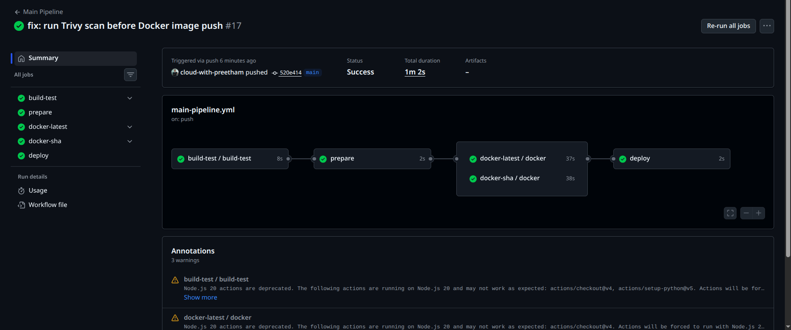

# Day 49 – DevSecOps: Add Security to Your CI/CD Pipeline

## Objective

The goal of Day 49 was to add basic DevSecOps security checks to the existing `github-actions-capstone` CI/CD pipeline.

Before this task, the pipeline could build, test, create Docker images, push images, and deploy.
After this task, the pipeline also checks for security issues before allowing the Docker image to continue toward deployment.

---

## What is DevSecOps?

DevSecOps means adding security directly into the DevOps pipeline.

Instead of checking security after deployment, the pipeline automatically checks for vulnerabilities, unsafe dependencies, and secrets during the CI/CD process. This helps catch problems early before they reach production.

In simple terms:

```text
DevOps + Security Automation = DevSecOps
```

---

## Repository Used

```text
github-actions-capstone
```

---

## Tools Used

| Tool                     | Purpose                                        |
| ------------------------ | ---------------------------------------------- |
| GitHub Actions           | CI/CD pipeline automation                      |
| Docker                   | Container image build                          |
| Trivy                    | Docker image vulnerability scanning            |
| GitHub Secret Scanning   | Detect leaked secrets                          |
| GitHub Push Protection   | Block secrets before they are pushed           |
| Dependency Review Action | Check vulnerable dependencies in pull requests |

---

## Updated Workflow Files

The project contains the following workflow files:

```text
.github/workflows/
├── health-check.yml
├── main-pipeline.yml
├── pr-pipeline.yml
├── reusable-build-test.yml
└── reusable-docker.yml
```

For Day 49, the main DevSecOps changes were added to:

```text
.github/workflows/main-pipeline.yml
.github/workflows/reusable-docker.yml
.github/workflows/pr-pipeline.yml
```

---

## Final Secure Pipeline Flow

```text
Push to main
    |
    v
Build and Test
    |
    v
Prepare Short SHA
    |
    v
Build Docker Image :latest
    |
    v
Run Trivy Scan on :latest Image
    |
    v
Push :latest Image
    |
    v
Build Docker Image :sha-xxxxxxx
    |
    v
Run Trivy Scan on SHA Image
    |
    v
Push SHA Image
    |
    v
Deploy to Production
```

The Docker image is now scanned before it is pushed and deployed.

---

## Main Pipeline Result

The final GitHub Actions main pipeline completed successfully.

Pipeline jobs:

```text
build-test     - Passed
prepare        - Passed
docker-latest  - Passed
docker-sha     - Passed
deploy         - Passed
```

This confirms that the CI/CD pipeline is working with DevSecOps checks included.



---

## Trivy Docker Image Vulnerability Scan

Trivy was added to scan Docker images for known vulnerabilities.

The scan runs inside the reusable Docker workflow before the image is pushed to Docker Hub.

### Trivy Scan Configuration

```yaml
- name: Scan Docker Image for Vulnerabilities
  uses: aquasecurity/trivy-action@v0.36.0
  with:
    image-ref: ${{ env.IMAGE_URL }}
    format: "table"
    exit-code: "1"
    severity: "CRITICAL,HIGH"
    ignore-unfixed: true
```

### What This Does

| Option                    | Meaning                                                  |
| ------------------------- | -------------------------------------------------------- |
| `image-ref`               | Docker image to scan                                     |
| `format: table`           | Prints readable scan output                              |
| `exit-code: 1`            | Fails the pipeline if matching vulnerabilities are found |
| `severity: CRITICAL,HIGH` | Checks serious vulnerabilities                           |
| `ignore-unfixed: true`    | Does not fail for vulnerabilities with no available fix  |

---

## Docker Image Used

The Dockerfile uses a slim Python base image:

```dockerfile
FROM python:3.12.13-slim-bookworm
```

This is better than using a full Python image because it creates a smaller image with fewer unnecessary packages.

---

## Dockerfile

```dockerfile
FROM python:3.12.13-slim-bookworm

WORKDIR /app

RUN apt-get update \
  && apt-get upgrade -y \
  && apt-get clean \
  && rm -rf /var/lib/apt/lists/*

COPY requirements.txt .

RUN pip install --no-cache-dir --upgrade pip \
  && pip install --no-cache-dir -r requirements.txt

COPY app/ ./app

EXPOSE 5000

CMD ["python", "app/main.py"]
```

---

## Initial Trivy Scan Result

During testing, Trivy found HIGH and CRITICAL vulnerabilities in base image packages.

Examples found:

```text
libncursesw6   CVE-2025-69720   HIGH
libsqlite3-0   CVE-2025-7458    CRITICAL
libtinfo6      CVE-2025-69720   HIGH
perl-base      CVE-2026-42496   CRITICAL
perl-base      CVE-2026-42497   HIGH
zlib1g         CVE-2023-45853   CRITICAL
```

The pipeline failed with:

```text
Error: Process completed with exit code 1.
```

This proved that the security gate was working correctly.

---

## Handling Unfixed Vulnerabilities

Some vulnerabilities came from Debian base image packages and did not have available fixes.

One example was:

```text
zlib1g   CVE-2023-45853   CRITICAL   will_not_fix
```

To make the pipeline practical, I configured Trivy with:

```yaml
ignore-unfixed: true
```

This means:

```text
Fixable HIGH/CRITICAL vulnerability found  -> fail pipeline
Unfixed vulnerability found                -> report it, but do not block pipeline
```

This keeps the pipeline secure while avoiding failures for vulnerabilities that currently cannot be fixed through package updates.

---

## Secret Scanning

GitHub Secret Scanning was enabled from repository settings.

Path:

```text
Repository → Settings → Code security and analysis → Secret scanning
```

Secret scanning helps detect sensitive values such as:

```text
AWS access keys
GitHub tokens
API keys
Database passwords
Docker tokens
```

---

## Push Protection

Push protection was also enabled if available.

Push protection blocks secrets before they are pushed into the repository.

### Difference Between Secret Scanning and Push Protection

| Feature         | Purpose                                           |
| --------------- | ------------------------------------------------- |
| Secret scanning | Detects secrets already present in the repository |
| Push protection | Blocks secrets before they enter the repository   |

If GitHub detects a leaked AWS key, the correct action is:

```text
1. Revoke the leaked key immediately
2. Remove the secret from the repository
3. Rotate credentials
4. Store the new value in GitHub Secrets
5. Never hardcode secrets in source code
```

---

## Dependency Review

Dependency Review was added to the pull request pipeline.

```yaml
- name: Check Dependencies for Vulnerabilities
  uses: actions/dependency-review-action@v4
  with:
    fail-on-severity: critical
```

This checks dependency changes in pull requests.

If a new dependency introduces a critical vulnerability, the PR check fails before the code is merged.

---

## Workflow Permissions

Workflow permissions were restricted using:

```yaml
permissions:
  contents: read
```

This follows the principle of least privilege.

### Why This Matters

GitHub Actions should only receive the permissions they need.

If a third-party action is compromised and the workflow has write access, an attacker could:

```text
Modify repository code
Push malicious commits
Create unsafe releases
Access sensitive workflow data
Abuse repository tokens
```

By limiting permissions, the damage is reduced if something goes wrong.

---

## Final Pipeline Diagram

```text
Pull Request Opened
        |
        v
Build and Test
        |
        v
Dependency Vulnerability Review
        |
        v
PR Passes or Fails


Push / Merge to Main
        |
        v
Build and Test
        |
        v
Prepare Docker Image Tag
        |
        v
Build Docker Image
        |
        v
Trivy Vulnerability Scan
        |
        v
Push Docker Image
        |
        v
Deploy


Always Active
        |
        v
GitHub Secret Scanning
        |
        v
Push Protection for Secrets
```

---

## Final Verification

| Check                                     | Status    |
| ----------------------------------------- | --------- |
| Build and test workflow runs              | Completed |
| Docker image builds successfully          | Completed |
| Trivy scan runs before Docker push        | Completed |
| Docker image push happens only after scan | Completed |
| Main pipeline completes successfully      | Completed |
| Secret scanning reviewed                  | Completed |
| Push protection reviewed                  | Completed |
| Dependency review added to PR workflow    | Completed |
| Workflow permissions restricted           | Completed |

---

## What I Learned

- DevSecOps means security is added directly into the CI/CD pipeline.
- Trivy can scan Docker images for known CVEs.
- A pipeline can be configured to fail when serious vulnerabilities are found.
- Not all vulnerabilities have available fixes immediately.
- `ignore-unfixed: true` helps avoid blocking the pipeline for vulnerabilities that cannot currently be patched.
- Secret scanning helps detect leaked credentials.
- Push protection is stronger because it blocks secrets before they enter the repository.
- Dependency Review protects pull requests from vulnerable packages.
- Workflow permissions should follow the principle of least privilege.

---

## Final Outcome

The `github-actions-capstone` project now has a DevSecOps-enabled CI/CD pipeline.

The pipeline can:

```text
Build the app
Run tests
Build Docker images
Scan Docker images with Trivy
Push images only after scan checks
Deploy after successful security validation
```

This is closer to how real-world DevOps teams secure CI/CD pipelines in production environments.
