# Day 79 – Creating a Custom Helm Chart for AI-BankApp

## Overview

On Day 79, I converted the AI-BankApp Kubernetes manifests into a reusable and configurable Helm chart. Instead of deploying the application using multiple static YAML files, the entire application stack can now be deployed with a single Helm command.

The custom Helm chart packages the complete AI-BankApp, including:

- Spring Boot BankApp
- MySQL Database
- Ollama AI Service
- Persistent Storage
- ConfigMaps
- Secrets
- Services
- Horizontal Pod Autoscaler (HPA)

This exercise demonstrates how Helm simplifies Kubernetes application packaging, deployment, and configuration management.

---

# Objectives

- Create a custom Helm chart
- Convert raw Kubernetes manifests into Helm templates
- Parameterize application configuration using `values.yaml`
- Preserve init containers, lifecycle hooks, and health probes
- Validate the chart using Helm commands
- Deploy the application on a Kind cluster
- Verify application functionality

---

# Project Structure

```text
helm-chart/
└── bankapp
    ├── Chart.yaml
    ├── values.yaml
    └── templates
        ├── _helpers.tpl
        ├── NOTES.txt
        ├── bankapp-deployment.yaml
        ├── mysql-deployment.yaml
        ├── ollama-deployment.yaml
        ├── services.yaml
        ├── storage.yaml
        ├── configmap.yaml
        ├── secret.yaml
        └── hpa.yaml
```

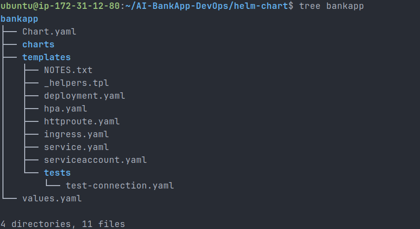

---

# Raw Kubernetes Manifests vs Helm Templates

| Raw Manifest | Helm Template |
|--------------|---------------|
| namespace.yml | Namespace provided during Helm install |
| configmap.yml | templates/configmap.yaml |
| secrets.yml | templates/secret.yaml |
| pv.yml | templates/storage.yaml |
| pvc.yml | templates/storage.yaml |
| bankapp-deployment.yml | templates/bankapp-deployment.yaml |
| mysql-deployment.yml | templates/mysql-deployment.yaml |
| ollama-deployment.yml | templates/ollama-deployment.yaml |
| service.yml | templates/services.yaml |
| hpa.yml | templates/hpa.yaml |

---

# Chart Metadata

The `Chart.yaml` defines the Helm package metadata.

```yaml
apiVersion: v2
name: bankapp
description: AI-BankApp
type: application
version: 0.1.0
appVersion: "1.0.0"
```

It also contains:

- Maintainer information
- Keywords
- Application version

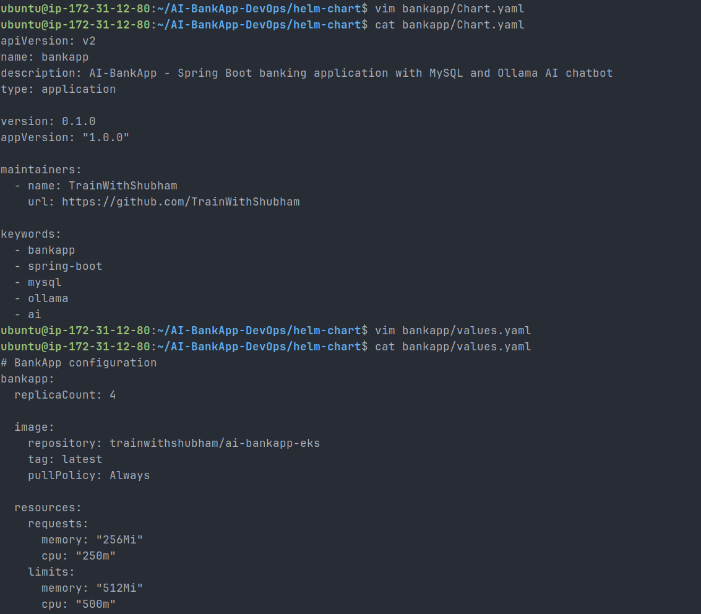

---

# values.yaml

The `values.yaml` centralizes all configurable settings.

It includes:

## BankApp

- Replica count
- Docker image
- Resources
- Service
- Autoscaling

## MySQL

- Image
- Resource requests
- Storage
- StorageClass

## Ollama

- Image
- AI model
- Resources
- Storage

## Shared Configuration

- MySQL database
- Ollama URL

## Secrets

- MySQL credentials

## StorageClass

- Provisioner
- Name

## Gateway

- Optional Gateway API configuration

---

# Templates Created

## ConfigMap

Contains:

- MYSQL_HOST
- MYSQL_PORT
- MYSQL_DATABASE
- OLLAMA_URL

Uses:

```yaml
{{ .Values.config.mysqlDatabase }}
```

---

## Secret

Instead of hardcoded Base64 strings:

```yaml
{{ .Values.secrets.mysqlPassword | b64enc }}
```

Secrets are encoded automatically.

---

## Storage

Created:

- StorageClass
- MySQL PVC
- Ollama PVC

Supports:

```yaml
{{- if .Values.storageClass.create }}
```

---

## BankApp Deployment

Includes:

- Init container for MySQL
- Init container for Ollama
- ConfigMap
- Secret
- Resource limits
- Readiness probe
- Liveness probe

Replica count becomes dynamic when HPA is disabled.

---

## MySQL Deployment

Configured:

- Secret references
- ConfigMap references
- PVC mounting
- Readiness probe
- Liveness probe

---

## Ollama Deployment

Preserved:

- Lifecycle hook
- Model download
- Persistent storage
- Readiness probe
- Liveness probe

Model is configurable using:

```yaml
{{ .Values.ollama.model }}
```

---

## Services

Created services for:

- BankApp
- MySQL
- Ollama

Supports conditional deployment:

```yaml
{{- if .Values.ollama.enabled }}
```

---

## Horizontal Pod Autoscaler

Configured using:

```yaml
autoscaling/v2
```

Supports:

- Min replicas
- Max replicas
- CPU utilization
- Scale up behavior
- Scale down behavior

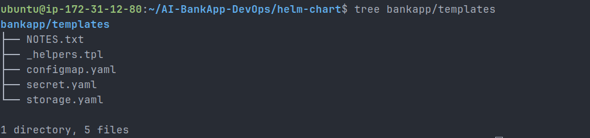

---

# Helm Template Functions Used

| Function | Purpose |
|-----------|----------|
| `.Values` | Read values from values.yaml |
| `include` | Reuse helper templates |
| `if` | Conditional rendering |
| `default` | Default values |
| `b64enc` | Encode Secrets |
| `toYaml` | Convert object into YAML |
| `nindent` | Proper indentation |

---

# Helm Validation

## Lint

```bash
helm lint bankapp/
```

Result

```
1 chart(s) linted, 0 chart(s) failed
```

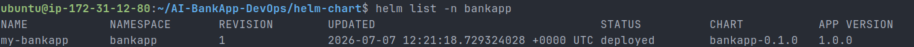

---

## Template Rendering

```bash
helm template my-bankapp bankapp/
```

Rendered:

- ConfigMap
- Secret
- StorageClass
- PVCs
- Deployments
- Services
- HPA

without errors.

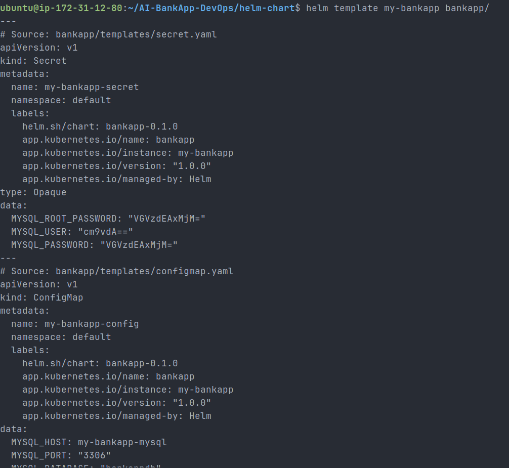

---

## Conditional Rendering

Testing:

```bash
helm template my-bankapp bankapp \
--set ollama.enabled=false
```

Verified:

- Ollama Deployment removed
- Ollama Service removed
- Ollama PVC removed
- Init container removed

This demonstrates reusable component-based deployment.

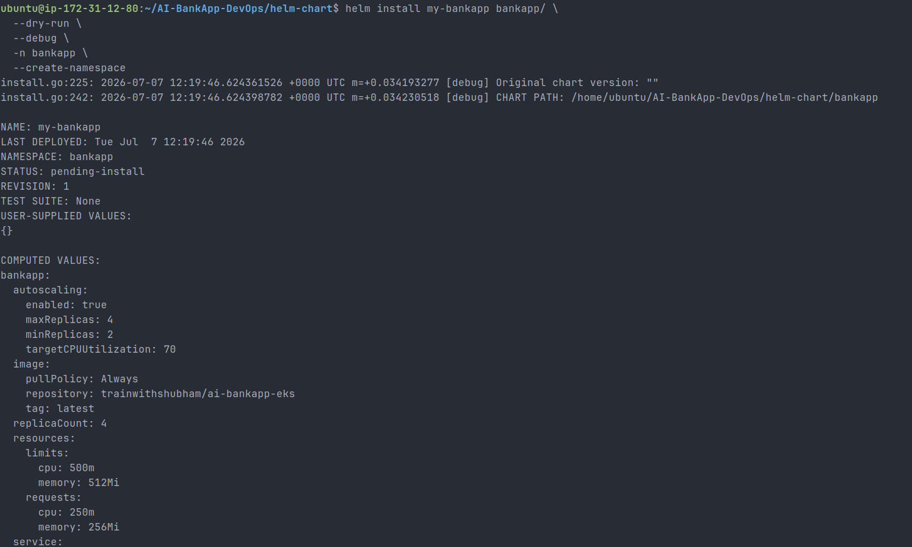

---

# Deploying on Kind

Created a local Kubernetes cluster.

```bash
kind create cluster --name bankapp
```

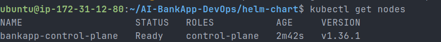

Installed the Helm chart.

```bash
helm install my-bankapp bankapp \
-n bankapp \
--create-namespace \
--set storageClass.create=false \
--set mysql.persistence.storageClass=standard \
--set ollama.persistence.storageClass=standard
```

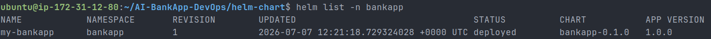

---

# Resources Created

The Helm chart successfully deployed:

- ConfigMap
- Secret
- MySQL Deployment
- Spring Boot Deployment
- Ollama Deployment
- Services
- PVCs
- HPA

---

# Troubleshooting

## Issue 1

Helm lint failed because the default `NOTES.txt` referenced unsupported values.

### Solution

Simplified `NOTES.txt`.

---

## Issue 2

No Kubernetes context configured.

### Solution

Created a Kind cluster.

---

## Issue 3

Ollama pod remained Pending.

### Cause

Insufficient CPU resources.

### Solution

Reduced CPU and memory requests inside `values.yaml`.

---

## Issue 4

Browser couldn't access the application.

### Cause

Port forwarding bound to localhost.

### Solution

Used:

```bash
kubectl port-forward \
--address 0.0.0.0 \
svc/my-bankapp-service \
-n bankapp \
8080:8080
```

---

# Verification

Verified using:

```bash
helm list -n bankapp
```

```bash
kubectl get all -n bankapp
```

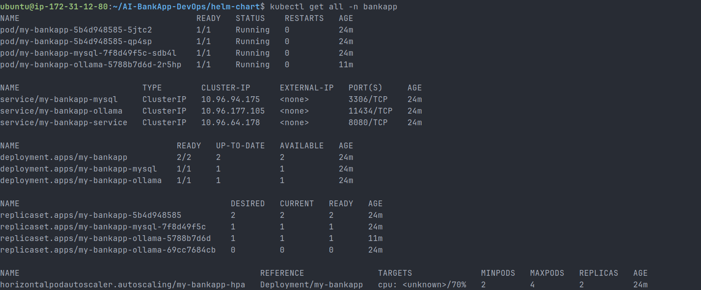

```bash
kubectl get pvc -n bankapp
```

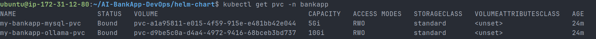

```bash
kubectl get pods -n bankapp
```

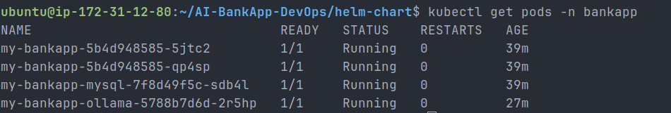

Health endpoint:

```bash
curl http://localhost:8080/actuator/health
```

Output

```json
{
  "status": "UP"
}
```

Successfully accessed the AI-BankApp login page from the browser.

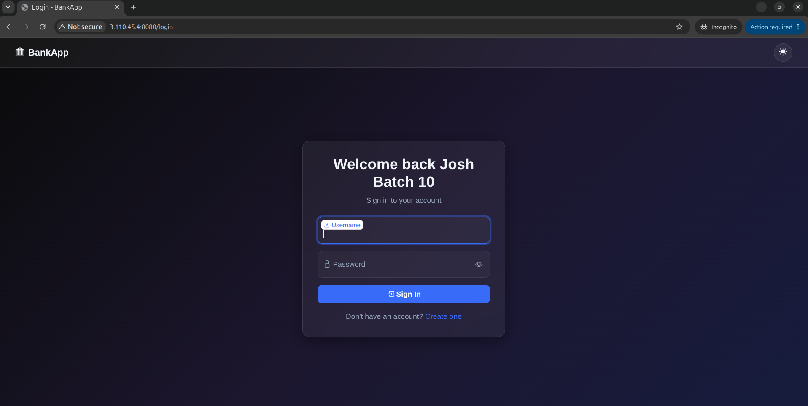

---

# Key Learnings

- Helm packages Kubernetes applications into reusable charts.
- `values.yaml` removes hardcoded configuration.
- Templates allow dynamic resource generation.
- Secrets can be generated using `b64enc`.
- Conditional rendering makes components optional.
- `helm lint` validates chart structure.
- `helm template` renders manifests before deployment.
- `helm install --dry-run --debug` validates deployments safely.
- Helm significantly simplifies deploying complex multi-service applications.

---

# Outcome

Successfully built and validated a production-style custom Helm chart for AI-BankApp. The application stack—including Spring Boot, MySQL, and Ollama—can now be deployed with a single Helm command while remaining configurable, reusable, and easier to maintain across different environments.
