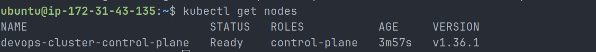
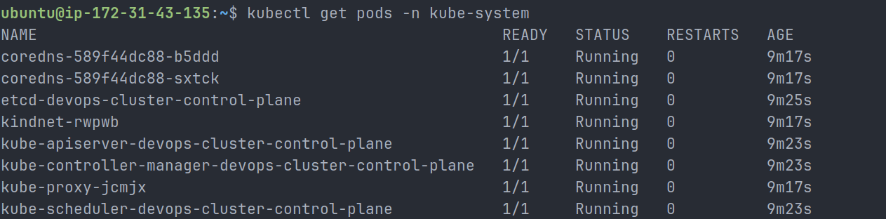

# Day 50 – Kubernetes Architecture and Cluster Setup

## Overview

Today I started my Kubernetes journey by understanding why Kubernetes is needed, how its architecture works, and how to create a local Kubernetes cluster.

Until now, I was working with Docker to build and run containers. Docker is useful for running containers on a single machine, but real production systems often need to run many containers across multiple servers. Kubernetes solves this problem by managing, scheduling, scaling, networking, and self-healing containers across a cluster.

For this task, I installed `kubectl`, installed `kind`, created a local Kubernetes cluster, explored the cluster components, and practiced deleting and recreating the cluster.

---

## Task 1: Kubernetes Story

Kubernetes was created to manage containerized applications at scale. Docker can run containers, but Docker alone does not automatically manage containers across multiple servers, restart failed workloads, expose services, or maintain the desired state of an application.

Kubernetes was originally created by Google and was inspired by Google's internal container orchestration systems. Later, Kubernetes became a major open-source project under the Cloud Native Computing Foundation.

The word Kubernetes comes from Greek and means "pilot" or "helmsman." This makes sense because Kubernetes acts like the controller that steers and manages containers across a cluster.

---

## Task 2: Kubernetes Architecture

```text
                         +----------------------------+
                         |       Control Plane         |
                         |----------------------------|
                         | kube-apiserver             |
kubectl ---------------> | etcd                       |
                         | kube-scheduler             |
                         | kube-controller-manager    |
                         +-------------+--------------+
                                       |
                                       |
                         +-------------v--------------+
                         |        Worker Node          |
                         |----------------------------|
                         | kubelet                    |
                         | kube-proxy                 |
                         | container runtime          |
                         | Pods                       |
                         +----------------------------+
```

---

## Kubernetes Components

### Control Plane Components

#### kube-apiserver

The API server is the front door of the Kubernetes cluster. Every command from `kubectl` goes through the API server first.

#### etcd

etcd is the key-value database that stores the entire cluster state, configuration, and desired state.

#### kube-scheduler

The scheduler decides which node should run a newly created pod.

#### kube-controller-manager

The controller manager continuously watches the cluster and makes sure the actual state matches the desired state.

---

### Worker Node Components

#### kubelet

The kubelet is the agent running on each node. It talks to the API server and ensures that pods are running on the node.

#### kube-proxy

kube-proxy manages networking rules and helps services communicate with pods.

#### Container Runtime

The container runtime is responsible for actually running containers. In my kind cluster, the container runtime is `containerd`.

---

## What Happens When I Run `kubectl apply -f pod.yaml`?

1. I run the command from my terminal.
2. `kubectl` sends the request to the Kubernetes API server.
3. The API server validates the request.
4. The desired state is stored in etcd.
5. The scheduler selects a suitable node for the pod.
6. The kubelet on that node receives the instruction.
7. The kubelet asks the container runtime to start the container.
8. The pod starts running.
9. The controller manager keeps watching the cluster to make sure the desired state is maintained.

---

## What Happens If the API Server Goes Down?

If the API server goes down, I cannot run new `kubectl` commands or create/update Kubernetes resources. Existing pods may continue running, but the cluster cannot accept new control-plane instructions until the API server is restored.

---

## What Happens If a Worker Node Goes Down?

If a worker node goes down, the pods running on that node become unavailable. Kubernetes detects the failure and tries to reschedule affected workloads onto healthy nodes, depending on the cluster capacity and workload configuration.

---

## Task 3: Installed kubectl

I installed `kubectl`, which is the command-line tool used to communicate with Kubernetes clusters.

### Command Used

```bash
curl -LO "https://dl.k8s.io/release/$(curl -L -s https://dl.k8s.io/release/stable.txt)/bin/linux/amd64/kubectl"

chmod +x kubectl
sudo mv kubectl /usr/local/bin/
```

### Verification

```bash
kubectl version --client
```

Output:

```text
Client Version: v1.36.1
Kustomize Version: v5.8.1
```

---

## Task 4: Local Cluster Setup

I chose **kind** for my local Kubernetes cluster.

### Why I Chose kind

I chose kind because it runs Kubernetes nodes as Docker containers. Since I already learned Docker, kind is a good tool for practicing Kubernetes locally. It is lightweight, fast, and easy to create or delete clusters.

### kind Installation

```bash
curl -Lo ./kind https://kind.sigs.k8s.io/dl/latest/kind-linux-amd64
chmod +x ./kind
sudo mv ./kind /usr/local/bin/kind
```

### Verification

```bash
kind version
```

Output:

```text
kind v0.33.0-alpha+3f9ba7e259e03b go1.26.3 linux/amd64
```

---

## Created Kubernetes Cluster

```bash
kind create cluster --name devops-cluster
```

Output:

```text
Creating cluster "devops-cluster" ...
✓ Ensuring node image (kindest/node:v1.36.1)
✓ Preparing nodes
✓ Writing configuration
✓ Starting control-plane
✓ Installing CNI
✓ Installing StorageClass
Set kubectl context to "kind-devops-cluster"
```

---

## Task 5: Cluster Exploration

### Cluster Info

```bash
kubectl cluster-info
```

Output:

```text
Kubernetes control plane is running at https://127.0.0.1:37187
CoreDNS is running at https://127.0.0.1:37187/api/v1/namespaces/kube-system/services/kube-dns:dns/proxy
```

---

### Nodes

```bash
kubectl get nodes
```

Output:

```text
NAME                           STATUS   ROLES           AGE     VERSION
devops-cluster-control-plane   Ready    control-plane   3m57s   v1.36.1
```

Screenshot:



---

### Nodes with Extra Details

```bash
kubectl get nodes -o wide
```

Output:

```text
NAME                           STATUS   ROLES           AGE     VERSION   INTERNAL-IP   EXTERNAL-IP   OS-IMAGE                       KERNEL-VERSION           CONTAINER-RUNTIME
devops-cluster-control-plane   Ready    control-plane   5m10s   v1.36.1   172.19.0.2    <none>        Debian GNU/Linux 13 (trixie)   7.0.0-1004-aws (amd64)   containerd://2.3.1
```

---

### Namespaces

```bash
kubectl get namespace
```

Output:

```text
NAME                 STATUS   AGE
default              Active   9m3s
kube-node-lease      Active   9m3s
kube-public          Active   9m3s
kube-system          Active   9m3s
local-path-storage   Active   8m59s
```

---

### All Pods Across All Namespaces

```bash
kubectl get pods -A
```

Output:

```text
NAMESPACE            NAME                                                   READY   STATUS    RESTARTS   AGE
kube-system          coredns-589f44dc88-b5ddd                               1/1     Running   0          9m6s
kube-system          coredns-589f44dc88-sxtck                               1/1     Running   0          9m6s
kube-system          etcd-devops-cluster-control-plane                      1/1     Running   0          9m14s
kube-system          kindnet-rwpwb                                          1/1     Running   0          9m6s
kube-system          kube-apiserver-devops-cluster-control-plane            1/1     Running   0          9m12s
kube-system          kube-controller-manager-devops-cluster-control-plane   1/1     Running   0          9m12s
kube-system          kube-proxy-jcmjx                                       1/1     Running   0          9m6s
kube-system          kube-scheduler-devops-cluster-control-plane            1/1     Running   0          9m12s
local-path-storage   local-path-provisioner-855c7b7774-zg42f                1/1     Running   0          9m6s
```

---

### kube-system Pods

```bash
kubectl get pods -n kube-system
```

Output:

```text
NAME                                                   READY   STATUS    RESTARTS   AGE
coredns-589f44dc88-b5ddd                               1/1     Running   0          9m17s
coredns-589f44dc88-sxtck                               1/1     Running   0          9m17s
etcd-devops-cluster-control-plane                      1/1     Running   0          9m25s
kindnet-rwpwb                                          1/1     Running   0          9m17s
kube-apiserver-devops-cluster-control-plane            1/1     Running   0          9m23s
kube-controller-manager-devops-cluster-control-plane   1/1     Running   0          9m23s
kube-proxy-jcmjx                                       1/1     Running   0          9m17s
kube-scheduler-devops-cluster-control-plane            1/1     Running   0          9m23s
```

Screenshot:



---

## kube-system Pod Explanation

| Pod                                                    | Component Type  | Purpose                                                        |
| ------------------------------------------------------ | --------------- | -------------------------------------------------------------- |
| `coredns`                                              | DNS             | Provides internal DNS resolution inside the Kubernetes cluster |
| `etcd-devops-cluster-control-plane`                    | Control Plane   | Stores the cluster state and configuration                     |
| `kindnet-rwpwb`                                        | Networking      | Provides networking inside the kind cluster                    |
| `kube-apiserver-devops-cluster-control-plane`          | Control Plane   | Receives all API requests from kubectl and cluster components  |
| `kube-controller-manager-devops-cluster-control-plane` | Control Plane   | Watches and reconciles the desired state of the cluster        |
| `kube-proxy-jcmjx`                                     | Node Networking | Manages networking rules for services and pod communication    |
| `kube-scheduler-devops-cluster-control-plane`          | Control Plane   | Assigns pods to suitable nodes                                 |

---

## Node Details

I also inspected the node using:

```bash
kubectl describe node devops-cluster-control-plane
```

Important details from the node:

```text
Name: devops-cluster-control-plane
Roles: control-plane
Operating System: linux
Architecture: amd64
Container Runtime Version: containerd://2.3.1
Kubelet Version: v1.36.1
PodCIDR: 10.244.0.0/24
```

Node conditions showed that the node was healthy:

```text
MemoryPressure: False
DiskPressure: False
PIDPressure: False
Ready: True
```

---

## Task 6: Cluster Lifecycle Practice

### Deleted the Cluster

```bash
kind delete cluster --name devops-cluster
```

Output:

```text
Deleting cluster "devops-cluster" ...
Deleted nodes: ["devops-cluster-control-plane"]
```

---

### Recreated the Cluster

```bash
kind create cluster --name devops-cluster
```

Output:

```text
Creating cluster "devops-cluster" ...
✓ Ensuring node image (kindest/node:v1.36.1)
✓ Preparing nodes
✓ Writing configuration
✓ Starting control-plane
✓ Installing CNI
✓ Installing StorageClass
Set kubectl context to "kind-devops-cluster"
```

---

### Verified Cluster After Recreation

```bash
kubectl get nodes
```

Output:

```text
NAME                           STATUS   ROLES           AGE     VERSION
devops-cluster-control-plane   Ready    control-plane   2m10s   v1.36.1
```

---

## Kubernetes Context and kubeconfig

### Current Context

```bash
kubectl config current-context
```

Output:

```text
kind-devops-cluster
```

### Available Contexts

```bash
kubectl config get-contexts
```

Output:

```text
CURRENT   NAME                  CLUSTER               AUTHINFO              NAMESPACE
*         kind-devops-cluster   kind-devops-cluster   kind-devops-cluster
```

---

## What is kubeconfig?

A kubeconfig file stores the connection details that `kubectl` uses to communicate with a Kubernetes cluster.

It contains:

- Cluster endpoint
- Certificate data
- User authentication details
- Contexts
- Current active context

The default kubeconfig location is:

```text
~/.kube/config
```

In my setup, the current context is:

```text
kind-devops-cluster
```

This means my `kubectl` command is currently connected to the `devops-cluster` kind cluster.

---

## Key Learnings

- Kubernetes is used to orchestrate containers across multiple machines.
- The control plane manages the cluster.
- Worker node components run and manage application workloads.
- `kubectl` talks to the cluster through the API server.
- etcd stores the cluster state.
- Scheduler decides where pods should run.
- kubelet ensures pods are running on nodes.
- kube-proxy handles networking rules.
- kind is a simple way to run Kubernetes locally using Docker.
- kubeconfig controls which cluster `kubectl` talks to.
- Control plane components can be seen as pods in the `kube-system` namespace.

---

## Conclusion

Today I successfully created my first local Kubernetes cluster using kind. I explored the cluster architecture, verified the node status, checked system pods, inspected the node, and practiced deleting and recreating the cluster.

This was my first hands-on step into Kubernetes orchestration.
