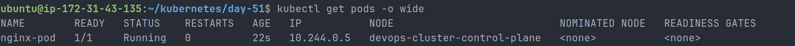
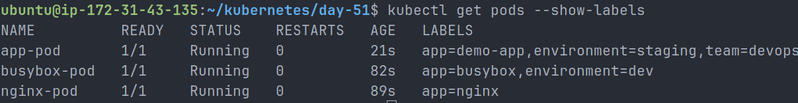
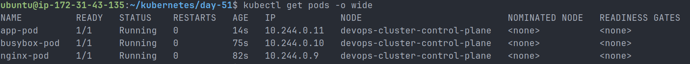

# Day 51 – Kubernetes Manifests and Your First Pods

## Objective

Today I learned how to write Kubernetes Pod manifests from scratch and deploy them into a running Kubernetes cluster.

The main goal was to understand the structure of a Kubernetes manifest, create multiple Pods, inspect them using `kubectl`, practice labels, compare imperative and declarative approaches, validate manifests before applying them, and understand why standalone Pods are not used directly in production.

## What is a Kubernetes Pod?

A Pod is the smallest deployable unit in Kubernetes.

A Pod can run one or more containers, but in most common use cases, one Pod runs one main application container.

In this task, I created standalone Pods manually. This helped me understand the basics, but standalone Pods are not usually used in production because Kubernetes will not recreate them if they are deleted.

In production, we usually use higher-level controllers like Deployments, ReplicaSets, StatefulSets, or DaemonSets.

## Kubernetes Manifest Structure

A Kubernetes manifest is usually written in YAML.

A basic Kubernetes manifest has four important top-level fields:

| Field        | Description                                                      |
| ------------ | ---------------------------------------------------------------- |
| `apiVersion` | Defines which Kubernetes API version to use                      |
| `kind`       | Defines the type of Kubernetes resource                          |
| `metadata`   | Defines identity information such as name, labels, and namespace |
| `spec`       | Defines the desired state of the resource                        |

Example:

```yaml
apiVersion: v1
kind: Pod
metadata:
  name: example-pod
  labels:
    app: example
spec:
  containers:
    - name: example-container
      image: nginx:latest
```

## Task 1: Nginx Pod

I created my first Pod manifest using Nginx.

File: `nginx-pod.yaml`

```yaml
apiVersion: v1
kind: Pod
metadata:
  name: nginx-pod
  labels:
    app: nginx
spec:
  containers:
    - name: nginx
      image: nginx:latest
      ports:
        - containerPort: 80
```

Command used to create the Pod:

```bash
kubectl apply -f nginx-pod.yaml
```

Verification commands:

```bash
kubectl get pods
kubectl get pods -o wide
kubectl describe pod nginx-pod
kubectl logs nginx-pod
```



I also entered the running container:

```bash
kubectl exec -it nginx-pod -- /bin/bash
```

Inside the container, I tested Nginx:

```bash
curl localhost:80
exit
```

The Nginx welcome page was displayed, confirming that the container was running correctly inside the Pod.

## Task 2: BusyBox Pod

Next, I created a BusyBox Pod.

File: `busybox-pod.yaml`

```yaml
apiVersion: v1
kind: Pod
metadata:
  name: busybox-pod
  labels:
    app: busybox
    environment: dev
spec:
  containers:
    - name: busybox
      image: busybox:latest
      command: ["sh", "-c", "echo Hello from BusyBox && sleep 3600"]
```

Command used:

```bash
kubectl apply -f busybox-pod.yaml
```

Verification commands:

```bash
kubectl get pods
kubectl logs busybox-pod
```

Output:

```text
Hello from BusyBox
```

### Learning

BusyBox does not run a long-running server by default.

If I did not use:

```bash
sleep 3600
```

the container would exit quickly after printing the message.

The `sleep 3600` command keeps the container running for 3600 seconds.

## Task 3: Third Pod with Labels

I created a third Pod with multiple labels.

File: `app-pod.yaml`

```yaml
apiVersion: v1
kind: Pod
metadata:
  name: app-pod
  labels:
    app: demo-app
    environment: staging
    team: devops
spec:
  containers:
    - name: demo-container
      image: nginx:stable
      ports:
        - containerPort: 80
```

Command used:

```bash
kubectl apply -f app-pod.yaml
```

Verification command:

```bash
kubectl get pods --show-labels
```

The Pod was created successfully with these labels:

```text
app=demo-app
environment=staging
team=devops
```

## Pod Label Filtering

I practiced filtering Pods using labels.

Commands used:

```bash
kubectl get pods --show-labels
kubectl get pods -l app=demo-app
kubectl get pods -l environment=staging
kubectl get pods -l team=devops
```

### Learning

Labels are key-value pairs used to organize and select Kubernetes resources.

Labels are useful in real-world Kubernetes because they are used by:

- Services
- Deployments
- ReplicaSets
- Monitoring tools
- Automation scripts
- CI/CD workflows
- Debugging and filtering commands

Example:

```bash
kubectl get pods -l environment=staging
```

This command shows only Pods with the label:

```text
environment=staging
```



## Running Pods Verification

I verified the running Pods using:

```bash
kubectl get pods -o wide
```

The following Pods were running successfully:

```text
nginx-pod
busybox-pod
app-pod
```



All Pods showed:

```text
READY: 1/1
STATUS: Running
RESTARTS: 0
```

This confirmed that all three Pods were healthy.

## Task 4: Imperative vs Declarative Kubernetes

Kubernetes supports two main ways to create resources:

1. Imperative approach
2. Declarative approach

## Imperative Approach

The imperative approach means creating resources directly using commands.

Example:

```bash
kubectl run redis-pod --image=redis:latest
```

This command created a Redis Pod without writing a YAML file first.

Verification command:

```bash
kubectl get pods
```

I also viewed the YAML generated by Kubernetes:

```bash
kubectl get pod redis-pod -o yaml
```

The generated YAML contained many extra fields added by Kubernetes, such as:

```text
creationTimestamp
namespace
resourceVersion
uid
nodeName
podIP
status
restartPolicy
dnsPolicy
```

### Learning

The imperative approach is fast for testing, but it is not the best approach for production because the configuration is not stored as code.

## Declarative Approach

The declarative approach means writing YAML files and applying them using `kubectl`.

Example:

```bash
kubectl apply -f nginx-pod.yaml
```

This is the preferred approach in real DevOps work because the configuration can be:

- Stored in Git
- Reviewed through pull requests
- Reused across environments
- Applied consistently
- Tracked as Infrastructure as Code

## Dry Run YAML Generation

I generated a Pod manifest without creating the Pod:

```bash
kubectl run test-pod --image=nginx --dry-run=client -o yaml > test-pod.yaml
```

Then I viewed the file:

```bash
cat test-pod.yaml
```

Generated file: `test-pod.yaml`

```yaml
apiVersion: v1
kind: Pod
metadata:
  labels:
    run: test-pod
  name: test-pod
spec:
  containers:
    - image: nginx
      name: test-pod
      resources: {}
  dnsPolicy: ClusterFirst
  restartPolicy: Always
status: {}
```

### Learning

Dry run is useful for quickly generating manifest templates.

Instead of writing everything from scratch, I can generate a basic manifest and then customize it.

This is useful in real DevOps workflows when creating Kubernetes resources quickly.

## Task 5: Manifest Validation

Before applying a manifest, I practiced validation using dry-run.

Client-side validation:

```bash
kubectl apply -f nginx-pod.yaml --dry-run=client
```

Server-side validation:

```bash
kubectl apply -f nginx-pod.yaml --dry-run=server
```

Output:

```text
pod/nginx-pod unchanged (dry run)
pod/nginx-pod unchanged (server dry run)
```

### Client-Side Dry Run

Client-side dry run checks the manifest locally before sending it to the Kubernetes API server.

### Server-Side Dry Run

Server-side dry run validates the manifest against the Kubernetes API server but does not actually create or update the resource.

### Learning

Dry-run validation is a good habit before applying Kubernetes manifests.

It helps catch issues early and reduces the chance of breaking workloads in a real cluster.

## Task 6: Cleanup

I deleted the standalone Pods using:

```bash
kubectl delete pod nginx-pod
kubectl delete pod busybox-pod
kubectl delete pod redis-pod
kubectl delete pod app-pod
```

Verification command:

```bash
kubectl get pods
```

Final output:

```text
No resources found in default namespace.
```

## What Happens When a Standalone Pod is Deleted?

When a standalone Pod is deleted, Kubernetes does not recreate it.

This is because the Pod is not managed by any controller.

For example, if I delete this Pod:

```bash
kubectl delete pod nginx-pod
```

it is removed permanently.

There is no Deployment, ReplicaSet, or controller watching it and creating a replacement.

### Important Production Lesson

Bare Pods are useful for learning, testing, and debugging.

But in production, we do not usually run standalone Pods directly.

Instead, we use Deployments because Deployments can:

- Maintain the desired number of replicas
- Recreate Pods if they fail
- Perform rolling updates
- Roll back to previous versions
- Provide self-healing behavior

This is why Day 52 will focus on Deployments.

## Final Files Created

```text
day-51/
├── nginx-pod.yaml
├── busybox-pod.yaml
├── app-pod.yaml
├── test-pod.yaml
├── day-51-pods.md
└── screenshots/
    ├── day-51-kubectl-get-pods.png
    ├── day-51-three-pods-running.png
    └── day-51-pod-labels.png
```

## Commands Practiced

```bash
kubectl apply -f nginx-pod.yaml
kubectl apply -f busybox-pod.yaml
kubectl apply -f app-pod.yaml

kubectl get pods
kubectl get pods -o wide
kubectl get pods --show-labels

kubectl describe pod nginx-pod
kubectl logs nginx-pod
kubectl logs busybox-pod

kubectl exec -it nginx-pod -- /bin/bash

kubectl get pods -l app=nginx
kubectl get pods -l environment=dev
kubectl get pods -l environment=staging
kubectl get pods -l team=devops

kubectl run redis-pod --image=redis:latest
kubectl get pod redis-pod -o yaml

kubectl run test-pod --image=nginx --dry-run=client -o yaml > test-pod.yaml

kubectl apply -f nginx-pod.yaml --dry-run=client
kubectl apply -f nginx-pod.yaml --dry-run=server

kubectl delete pod nginx-pod
kubectl delete pod busybox-pod
kubectl delete pod redis-pod
kubectl delete pod app-pod
```

## Key Learnings

- A Pod is the smallest deployable unit in Kubernetes.
- Kubernetes manifests are written in YAML.
- The four key manifest fields are `apiVersion`, `kind`, `metadata`, and `spec`.
- `metadata.name` gives the resource its name.
- Labels help organize and filter Kubernetes resources.
- `spec.containers` defines which container images should run inside the Pod.
- `kubectl apply -f` is the declarative way to create resources.
- `kubectl run` is the imperative way to create resources.
- `kubectl describe` is useful for debugging Pod events.
- `kubectl logs` shows container output.
- `kubectl exec` allows access inside a running container.
- Dry run helps validate manifests before applying them.
- Kubernetes automatically adds extra metadata and status fields.
- Standalone Pods are not recreated after deletion.
- Production workloads usually use Deployments instead of bare Pods.

## Final Reflection

Today was my first real hands-on day deploying workloads into Kubernetes.

I moved from only setting up a cluster to actually creating and managing Pods.

The most important learning was understanding that Kubernetes works based on desired state. When I write a manifest and apply it, I am telling Kubernetes what I want the cluster to run.

I also learned that standalone Pods are temporary and not self-healing. This helped me understand why Deployments are important in real production environments.

Day 51 gave me a strong foundation for writing Kubernetes manifests and prepared me for Deployments on Day 52.
