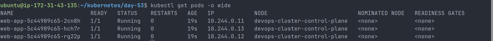
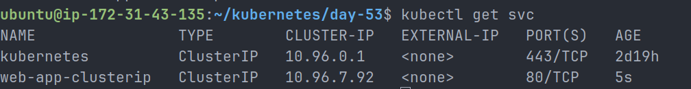
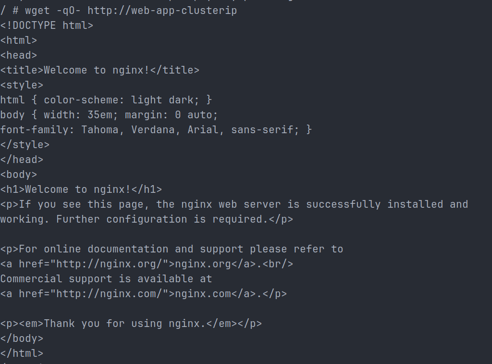
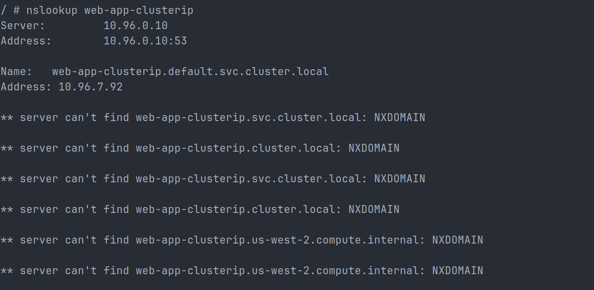
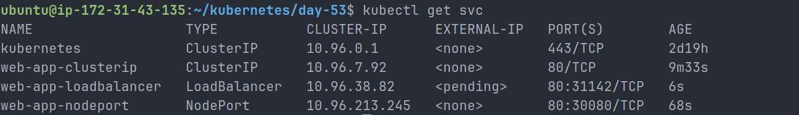

# Day 53 – Kubernetes Services

## Objective

The goal of this lab was to understand how Kubernetes Services provide stable networking and load balancing for Pods. Since Pod IP addresses are dynamic and can change when Pods restart, Services offer a reliable endpoint for communication within and outside the cluster.

---

# Why Kubernetes Services?

Pods are ephemeral resources in Kubernetes. Whenever a Pod is recreated, it receives a new IP address.

Problems solved by Services:

- Pod IPs are not permanent
- Deployments create multiple Pods
- Clients need a stable endpoint to access applications
- Traffic should be distributed across healthy Pods

A Kubernetes Service provides:

- Stable virtual IP (ClusterIP)
- Stable DNS name
- Load balancing across matching Pods
- Internal and external application exposure

---

# Deployment Used

## app-deployment.yaml

```yaml
apiVersion: apps/v1
kind: Deployment
metadata:
  name: web-app
  labels:
    app: web-app
spec:
  replicas: 3
  selector:
    matchLabels:
      app: web-app
  template:
    metadata:
      labels:
        app: web-app
    spec:
      containers:
        - name: nginx
          image: nginx:1.25
          ports:
            - containerPort: 80
```

Deployment created:

- 3 Nginx Pods
- Label: `app=web-app`

Pod IPs observed:

```text
10.244.0.11
10.244.0.12
10.244.0.13
```



---

# ClusterIP Service

ClusterIP is the default Service type and is only accessible from inside the Kubernetes cluster.

## clusterip-service.yaml

```yaml
apiVersion: v1
kind: Service
metadata:
  name: web-app-clusterip
spec:
  type: ClusterIP
  selector:
    app: web-app
  ports:
    - port: 80
      targetPort: 80
```

## Verification

```bash
kubectl get svc
```

Output:

```text
web-app-clusterip   ClusterIP   10.96.7.92
```



### Connectivity Test

```bash
kubectl run test-client --image=busybox:latest --rm -it --restart=Never -- sh
```

Inside the pod:

```bash
wget -qO- http://web-app-clusterip
```

Result:

```text
Nginx Welcome Page displayed successfully
```



---

# Kubernetes DNS Service Discovery

Every Service automatically receives a DNS entry.

DNS Format:

```text
<service-name>.<namespace>.svc.cluster.local
```

Example:

```text
web-app-clusterip.default.svc.cluster.local
```

## DNS Verification

```bash
nslookup web-app-clusterip
```

Output:

```text
Name: web-app-clusterip.default.svc.cluster.local
Address: 10.96.7.92
```

The DNS address matched the Service ClusterIP.



---

# Service Endpoints

Endpoints represent the Pods currently receiving traffic from a Service.

## Inspect Endpoints

```bash
kubectl get endpoints web-app-clusterip
```

Output:

```text
10.244.0.11:80
10.244.0.12:80
10.244.0.13:80
```

This confirms that traffic is distributed across all healthy Pods selected by:

```yaml
selector:
  app: web-app
```

---

# NodePort Service

NodePort exposes an application externally through a port on every Kubernetes node.

## nodeport-service.yaml

```yaml
apiVersion: v1
kind: Service
metadata:
  name: web-app-nodeport
spec:
  type: NodePort
  selector:
    app: web-app
  ports:
    - port: 80
      targetPort: 80
      nodePort: 30080
```

## Verification

```bash
kubectl get svc
```

Output:

```text
web-app-nodeport   NodePort   80:30080/TCP
```

Traffic Flow:

```text
Client
   ↓
NodeIP:30080
   ↓
NodePort Service
   ↓
Nginx Pods
```

Use Cases:

- Development environments
- Testing applications
- Direct node access

---

# LoadBalancer Service

LoadBalancer is commonly used in cloud environments to expose applications publicly.

## loadbalancer-service.yaml

```yaml
apiVersion: v1
kind: Service
metadata:
  name: web-app-loadbalancer
spec:
  type: LoadBalancer
  selector:
    app: web-app
  ports:
    - port: 80
      targetPort: 80
```

## Verification

```bash
kubectl get svc
```

Output:

```text
web-app-loadbalancer   LoadBalancer   10.96.38.82   <pending>
```



### Why is EXTERNAL-IP Pending?

The lab was performed on a Kind cluster running locally.

Kind does not have a cloud provider integration capable of provisioning an external load balancer.

Therefore:

```text
EXTERNAL-IP = <pending>
```

is the expected behavior.

---

# Relationship Between Service Types

Kubernetes Service types build on each other.

```text
LoadBalancer
    └── NodePort
            └── ClusterIP
```

Verification:

```bash
kubectl describe service web-app-loadbalancer
```

Output showed:

```text
Type: LoadBalancer
ClusterIP: 10.96.38.82
NodePort: 31142/TCP
```

This proves that a LoadBalancer Service automatically creates both a ClusterIP and a NodePort.

---

# Service Type Comparison

| Service Type | Accessible From    | Use Case                       |
| ------------ | ------------------ | ------------------------------ |
| ClusterIP    | Inside Cluster     | Internal service communication |
| NodePort     | NodeIP:Port        | Testing and development        |
| LoadBalancer | Public IP/Hostname | Production workloads in cloud  |

---

# Key Learnings

- Services provide stable networking for Pods.
- ClusterIP enables internal communication.
- NodePort exposes applications through Kubernetes nodes.
- LoadBalancer exposes applications externally in cloud environments.
- Kubernetes DNS automatically creates service names.
- Endpoints show which Pods receive traffic.
- Service selectors must match Pod labels.
- LoadBalancer services build on NodePort and ClusterIP.

---

# Conclusion

In this lab, Kubernetes Services were used to provide stable networking and service discovery for a multi-pod Nginx deployment. ClusterIP, NodePort, and LoadBalancer Services were created and tested, demonstrating internal communication, external access mechanisms, DNS-based service discovery, and endpoint-based load balancing within a Kubernetes cluster.
