# Day 57 – Resource Requests, Limits, and Probes

## Objective

In this lab, I learned how Kubernetes manages container resources using requests and limits, how Pods behave when resource constraints are exceeded, and how health probes help Kubernetes maintain application availability through automatic recovery and traffic management.

---

# Task 1: Resource Requests and Limits

## Purpose

Resource requests and limits help Kubernetes schedule workloads efficiently and prevent a single container from consuming excessive cluster resources.

### Requests

Requests define the minimum resources guaranteed to a container.

```yaml
requests:
  cpu: "100m"
  memory: "128Mi"
```

### Limits

Limits define the maximum resources a container can consume.

```yaml
limits:
  cpu: "250m"
  memory: "256Mi"
```

---

## Verification

```bash
kubectl describe pod resource-demo
```

Observed:

```text
Requests:
  cpu: 100m
  memory: 128Mi

Limits:
  cpu: 250m
  memory: 256Mi

QoS Class: Burstable
```

### Result

Since requests and limits are different, Kubernetes assigned the Pod a **Burstable** QoS Class.

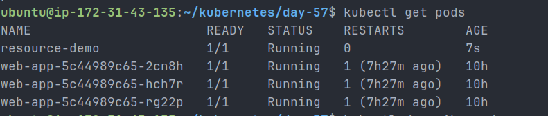

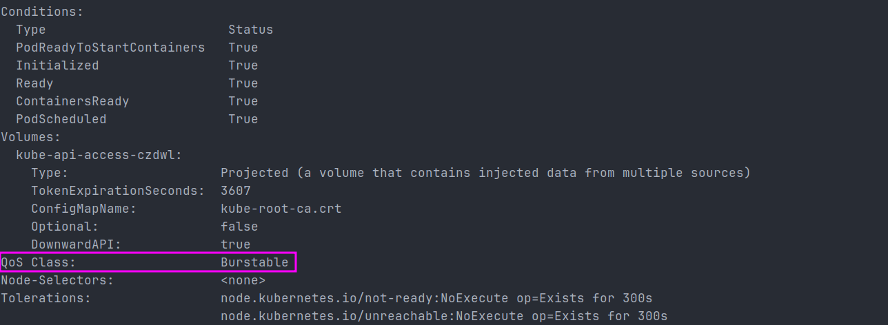

---

# Task 2: OOMKilled – Exceeding Memory Limits

## Purpose

To observe Kubernetes behavior when a container exceeds its memory limit.

### Test Configuration

```yaml
resources:
  limits:
    memory: "100Mi"
  requests:
    memory: "50Mi"
```

Container workload:

```yaml
command: ["stress"]
args:
  - "--vm"
  - "1"
  - "--vm-bytes"
  - "200M"
  - "--vm-hang"
  - "1"
```

The container attempted to allocate 200 MB while only 100 MiB was allowed.

---

## Verification

```bash
kubectl describe pod oom-demo
```

Observed:

```text
Reason: OOMKilled
Exit Code: 137
```

### Result

Kubernetes terminated the container because it exceeded the configured memory limit.

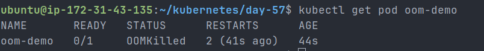

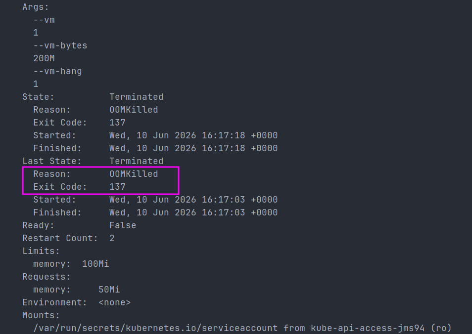

### Key Learning

* CPU overuse results in throttling.
* Memory overuse results in container termination.
* Exit Code **137** indicates an OOMKilled container.

---

# Task 3: Pending Pod Due to Excessive Requests

## Purpose

To understand scheduler behavior when resource requests exceed available cluster capacity.

### Configuration

```yaml
requests:
  cpu: "100"
  memory: "128Gi"
```

These values exceeded available node resources.

---

## Verification

```bash
kubectl get pod huge-request
```

Observed:

```text
STATUS: Pending
```

Scheduler Events:

```text
0/1 nodes are available:
1 Insufficient cpu,
1 Insufficient memory.
```

### Result

The Pod remained in the Pending state because no node could satisfy the requested resources.

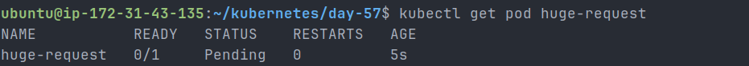

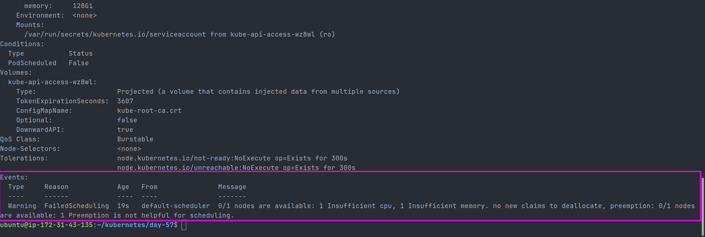

---

# Task 4: Liveness Probe

## Purpose

A liveness probe detects unhealthy containers and automatically restarts them.

### Configuration

```yaml
livenessProbe:
  exec:
    command:
      - cat
      - /tmp/healthy
  periodSeconds: 5
  failureThreshold: 3
```

The container created a file during startup and removed it after 30 seconds.

---

## Verification

```bash
kubectl describe pod liveness-demo
```

Observed:

```text
Liveness probe failed
Container liveness failed liveness probe
Container restarted
```

Observed restart count:

```text
Restart Count: 2
```

### Result

After three consecutive probe failures, Kubernetes restarted the container automatically.

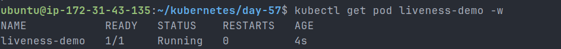

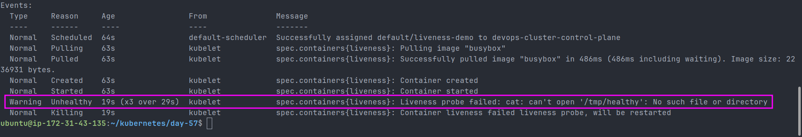

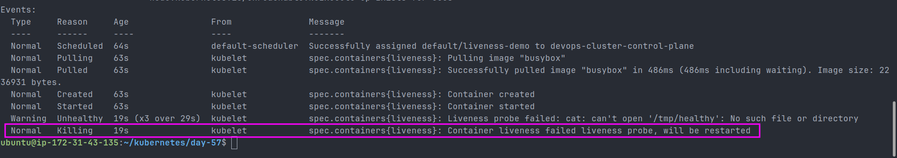

### Key Learning

Liveness probes provide self-healing by restarting unhealthy containers.

---

# Task 5: Readiness Probe

## Purpose

Readiness probes determine whether a Pod should receive traffic.

### Configuration

```yaml
readinessProbe:
  httpGet:
    path: /
    port: 80
```

---

## Verification

Before failure:

```bash
kubectl get endpoints readiness-svc
```

Observed:

```text
10.244.x.x:80
```

The Pod was available as a Service endpoint.

---

After removing the nginx homepage:

```bash
kubectl exec readiness-demo -- rm /usr/share/nginx/html/index.html
```

Observed:

```text
READY 0/1
```

Endpoints:

```text
<none>
```

Restart Count:

```text
0
```

### Result

The Pod was removed from Service endpoints but the container was not restarted.

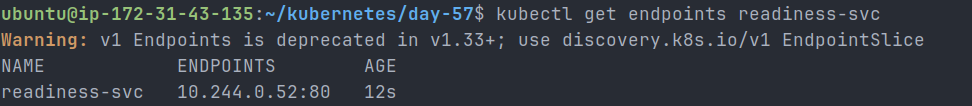

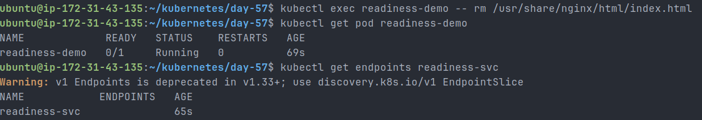

### Key Learning

Readiness probes control traffic routing, not container lifecycle.

---

# Task 6: Startup Probe

## Purpose

Startup probes protect slow-starting applications from premature restarts.

### Configuration

```yaml
startupProbe:
  exec:
    command:
      - cat
      - /tmp/started
  periodSeconds: 5
  failureThreshold: 12
```

The application waited 20 seconds before creating the required file.

---

## Verification

```bash
kubectl get pod startup-demo
```

Observed:

```text
READY 1/1
STATUS Running
RESTARTS 0
```

### Result

The startup probe allowed the container sufficient time to initialize successfully.

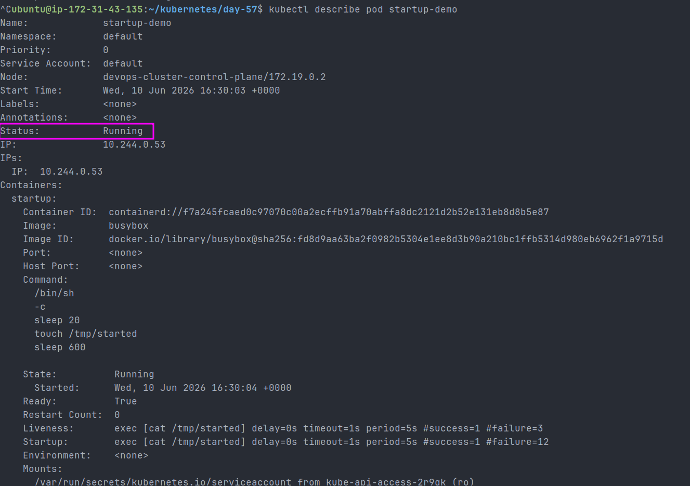

### What if failureThreshold = 2?

```text
periodSeconds = 5
failureThreshold = 2
```

Maximum startup allowance:

```text
5 × 2 = 10 seconds
```

Since the application required 20 seconds to start, Kubernetes would kill and restart the container repeatedly.

---

# Resource Requests vs Limits

| Feature                      | Requests   | Limits              |
| ---------------------------- | ---------- | ------------------- |
| Purpose                      | Scheduling | Runtime Enforcement |
| Guaranteed                   | Yes        | No                  |
| Used By Scheduler            | Yes        | No                  |
| Prevents Resource Exhaustion | No         | Yes                 |

---

# QoS Classes

| QoS Class  | Condition             |
| ---------- | --------------------- |
| Guaranteed | Requests = Limits     |
| Burstable  | Requests < Limits     |
| BestEffort | No Requests or Limits |

Observed QoS Classes:

* Resource Demo → Burstable
* OOM Demo → Burstable
* Liveness Demo → BestEffort

---

# Probe Comparison

| Probe Type      | Purpose                     | Action on Failure |
| --------------- | --------------------------- | ----------------- |
| Liveness Probe  | Detect unhealthy containers | Restart Container |
| Readiness Probe | Control Service traffic     | Remove Endpoint   |
| Startup Probe   | Allow startup time          | Restart Container |

---

# Cleanup Verification

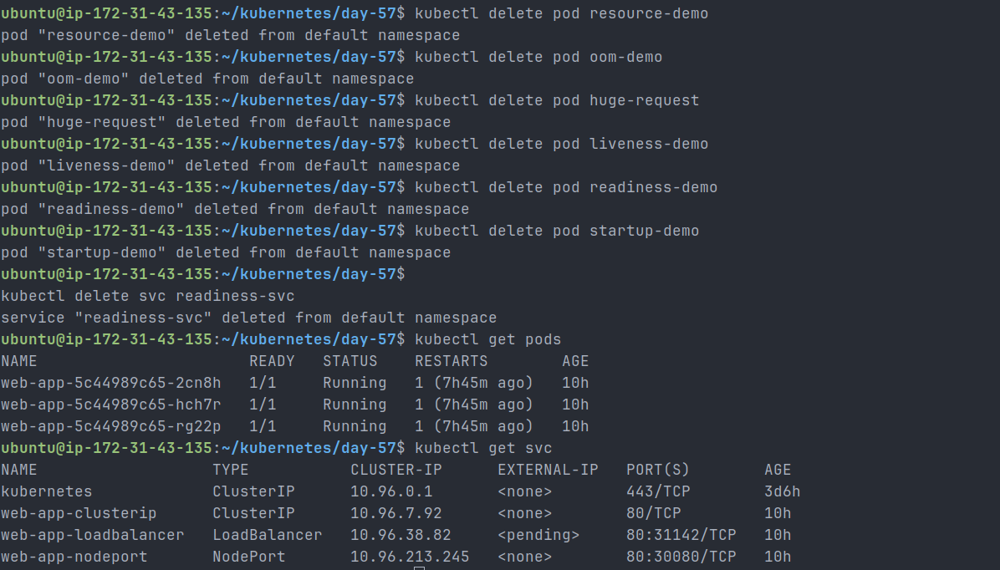

---

# Conclusion

This lab demonstrated how Kubernetes manages workload resources using requests and limits, enforces memory constraints through OOMKilled events, prevents scheduling when resources are unavailable, and uses liveness, readiness, and startup probes to ensure application reliability and self-healing behavior.
