# Day 59 – Helm: Kubernetes Package Manager

## Objective

The goal of this lab was to learn Helm, the package manager for Kubernetes. Helm simplifies Kubernetes application deployment by packaging multiple Kubernetes manifests into reusable charts. During this exercise, I installed Helm, deployed applications using Helm charts, customized deployments using values, performed upgrades and rollbacks, and created a custom Helm chart.

---

# What is Helm?

Helm is the package manager for Kubernetes, similar to how apt works for Ubuntu or yum works for CentOS.

Instead of manually creating and managing multiple Kubernetes YAML files, Helm packages everything into a reusable unit called a Chart.

## Core Concepts

### Chart

A Chart is a collection of Kubernetes manifests packaged together.

Examples:

* NGINX Chart
* MySQL Chart
* WordPress Chart

### Release

A Release is a running instance of a chart deployed in a Kubernetes cluster.

Example:

```bash
helm install my-nginx bitnami/nginx
```

Here:

* Chart: bitnami/nginx
* Release: my-nginx

### Repository

A Repository is a collection of Helm charts.

Example:

```text
https://charts.bitnami.com/bitnami
```

---

# Task 1 – Install Helm

Installed Helm using the official installation script.

```bash
curl -fsSL https://raw.githubusercontent.com/helm/helm/main/scripts/get-helm-3 | bash
```

Verified installation:

```bash
helm version
helm env
```

## Installed Version

```text
v3.21.0
```

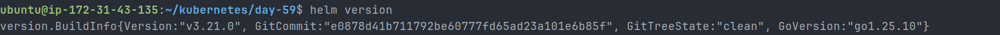

---

# Task 2 – Add Bitnami Repository

Added the Bitnami chart repository:

```bash
helm repo add bitnami https://charts.bitnami.com/bitnami
```

Updated repository metadata:

```bash
helm repo update
```

Searched available charts:

```bash
helm search repo nginx
helm search repo bitnami
```

Checked total charts available:

```bash
helm search repo bitnami | wc -l
```

## Observation

```text
Bitnami Repository Charts: 145
```

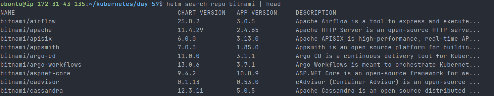

---

# Task 3 – Install an NGINX Chart

Installed NGINX using Helm:

```bash
helm install my-nginx bitnami/nginx
```

Verified release:

```bash
helm list
helm status my-nginx
```

Inspected generated manifests:

```bash
helm get manifest my-nginx
```

Verified cluster resources:

```bash
kubectl get all
```

## Observations

* Release Name: my-nginx
* Revision: 1
* Chart Version: nginx-25.0.3
* Service Type: LoadBalancer

Helm automatically created:

* Deployment
* ReplicaSet
* Pod
* Service
* Configurations required by the chart

This demonstrates how Helm replaces multiple manual YAML manifests with a single command.

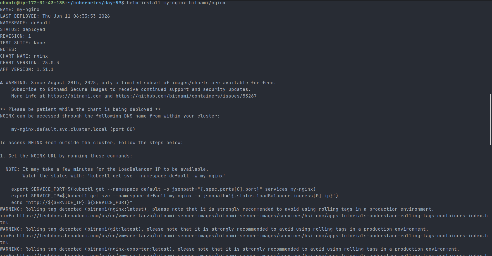

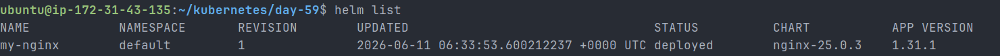

---

# Task 4 – Customize Helm Deployments

## Using --set Overrides

Installed a customized release:

```bash
helm install nginx-custom bitnami/nginx \
  --set replicaCount=3 \
  --set service.type=NodePort
```

Verified deployment:

```bash
kubectl get deploy
kubectl get svc
```

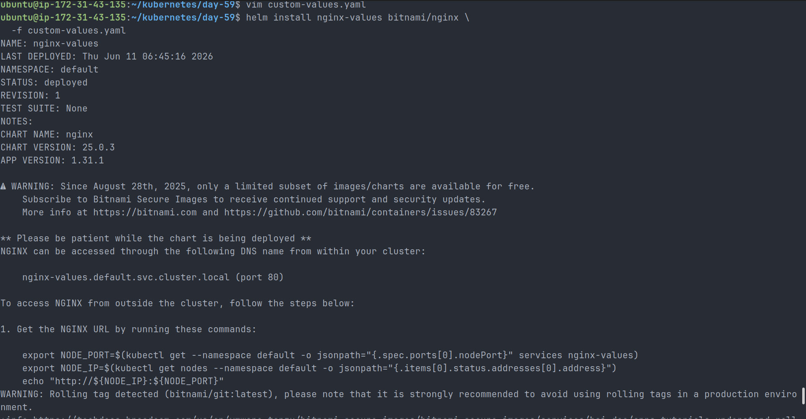

## Using a Values File

Created a custom values file.

### custom-values.yaml

```yaml
replicaCount: 3

service:
  type: NodePort
  port: 80

resources:
  requests:
    cpu: 250m
    memory: 256Mi

  limits:
    cpu: 500m
    memory: 512Mi
```

Installed using:

```bash
helm install nginx-values bitnami/nginx \
  -f custom-values.yaml
```

Verified overrides:

```bash
helm get values nginx-values
```

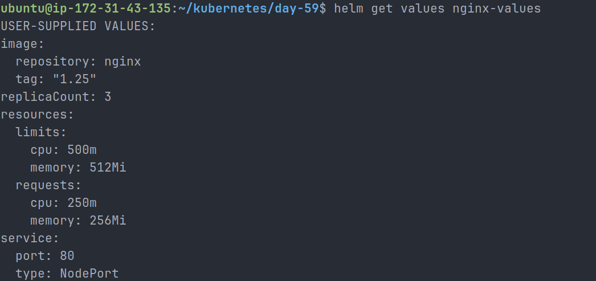

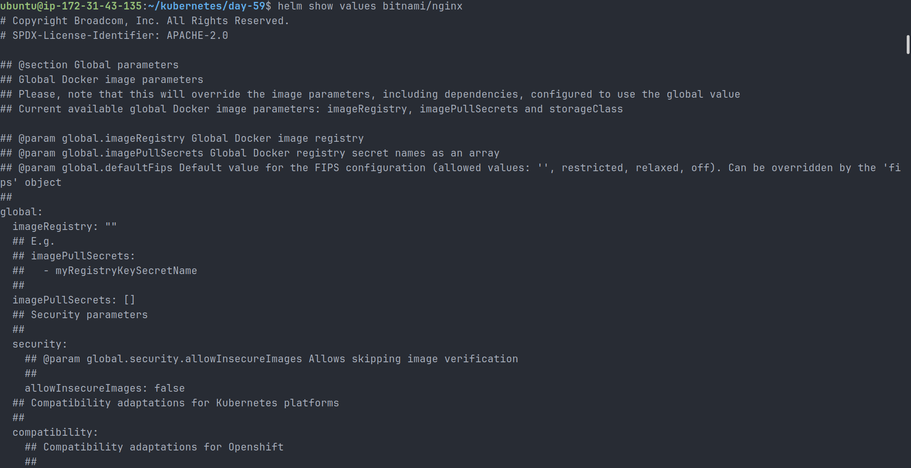

### Benefits of Values Files

* Reusable configuration
* Easier maintenance
* Environment-specific customization
* Version-controlled settings

---

# Task 5 – Upgrade and Rollback

## Upgrade Release

Scaled deployment from 1 replica to 5 replicas.

```bash
helm upgrade my-nginx bitnami/nginx \
  --set replicaCount=5
```

Verified:

```bash
helm history my-nginx
```

Result:

```text
Revision 1 → Install
Revision 2 → Upgrade
```

### Resource Constraint Observation

The Kubernetes scheduler reported:

```text
0/1 nodes are available: 1 Insufficient cpu
```

Because the Kind cluster had limited CPU resources and multiple deployments were already running.

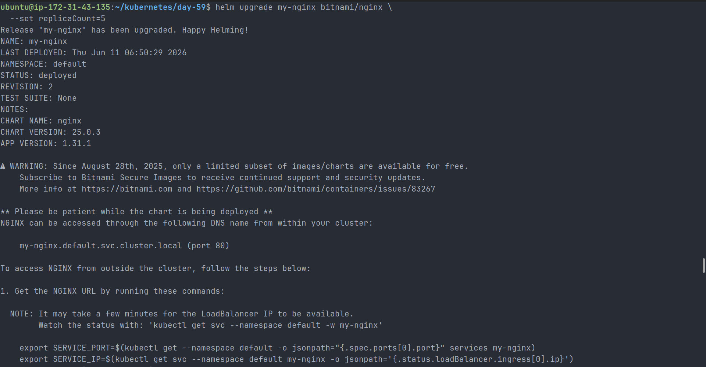

## Rollback Release

Rolled back to revision 1.

```bash
helm rollback my-nginx 1
```

Verified:

```bash
helm history my-nginx
```

Result:

```text
Revision 1 → Install
Revision 2 → Upgrade
Revision 3 → Rollback
```

### Important Learning

Helm does not overwrite previous revisions.

Instead, a rollback creates a brand-new revision that restores an earlier state.

---

# Task 6 – Create a Custom Helm Chart

Created a new chart scaffold:

```bash
helm create my-app
```

Generated structure:

```text
my-app/
├── Chart.yaml
├── values.yaml
├── charts/
└── templates/
```

## Updated values.yaml

Modified replica count:

```yaml
replicaCount: 3
```

Modified image:

```yaml
image:
  repository: nginx
  tag: "1.25"
```

---

# Understanding Helm Templates

Helm templates use Go Template syntax.

Examples:

```yaml
{{ .Values.replicaCount }}
{{ .Chart.Name }}
{{ .Release.Name }}
```

### Template Variables

| Template | Description         |
| -------- | ------------------- |
| .Values  | Reads values.yaml   |
| .Chart   | Chart metadata      |
| .Release | Release information |

Example:

```yaml
replicas: {{ .Values.replicaCount }}
```

The value is dynamically pulled from values.yaml.

---

# Validate Chart

Validated chart structure:

```bash
helm lint my-app
```

Result:

```text
1 chart(s) linted, 0 chart(s) failed
```

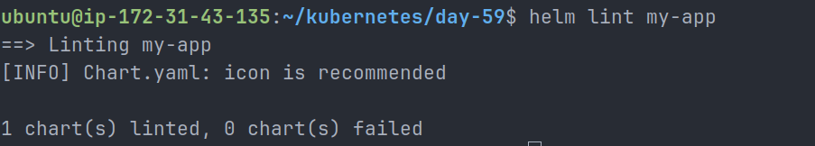

---

# Render Templates

Previewed generated manifests without installation:

```bash
helm template my-release ./my-app
```

This rendered all Kubernetes YAML files locally for inspection.

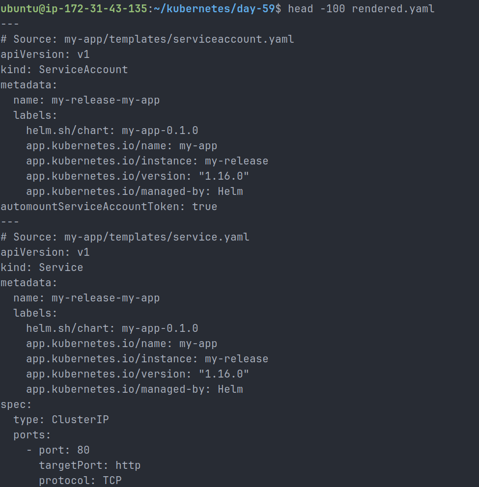

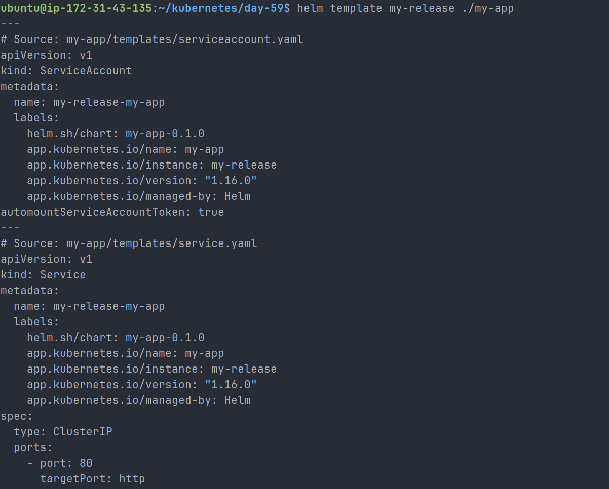

---

# Install Custom Chart

Installed chart:

```bash
helm install my-release ./my-app
```

Verified:

```bash
helm list
kubectl get deploy
```

Observation:

```text
Replicas: 3
```

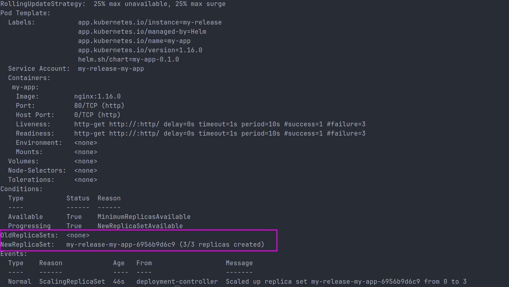

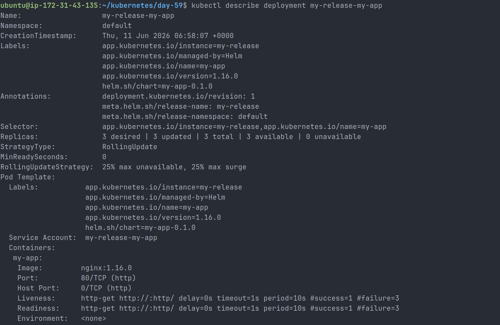

---

# Upgrade Custom Chart

Upgraded deployment replicas:

```bash
helm upgrade my-release ./my-app \
  --set replicaCount=5
```

Verified:

```bash
helm history my-release
```

Result:

```text
Revision 1 → Install
Revision 2 → Upgrade
```

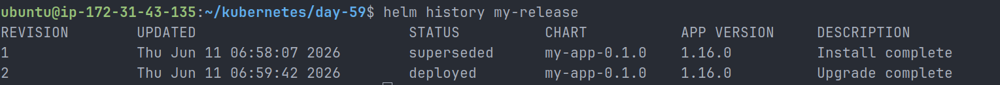

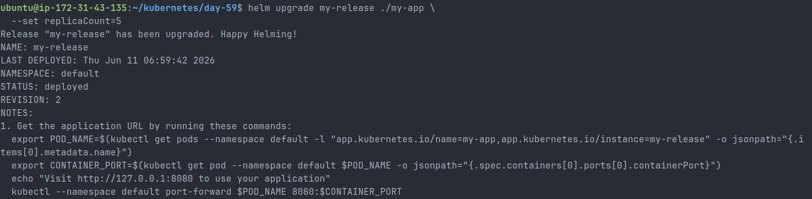

---

# Task 7 – Cleanup

Removed all releases:

```bash
helm uninstall my-nginx
helm uninstall nginx-custom
helm uninstall nginx-values
helm uninstall my-release
```

Verified:

```bash
helm list
```

Result:

```text
No active releases found.
```

Removed local chart and values file:

```bash
rm -rf my-app
rm -f custom-values.yaml
```

---

# Key Learnings

* Helm is the package manager for Kubernetes.
* Charts package multiple Kubernetes resources together.
* Releases represent installed chart instances.
* Repositories store and distribute charts.
* Values files provide reusable configuration.
* Helm upgrades simplify application changes.
* Rollbacks restore previous versions safely.
* Helm templates use Go templating syntax.
* helm lint validates chart correctness.
* helm template renders manifests without installation.
* Custom charts enable reusable application deployments.

---

# Conclusion

In this lab, I successfully installed Helm, deployed and customized Bitnami charts, performed upgrades and rollbacks, created a custom Helm chart using Go templates, and learned how Helm simplifies Kubernetes application lifecycle management. Helm significantly reduces the complexity of managing large Kubernetes deployments by packaging infrastructure into reusable, configurable charts.
