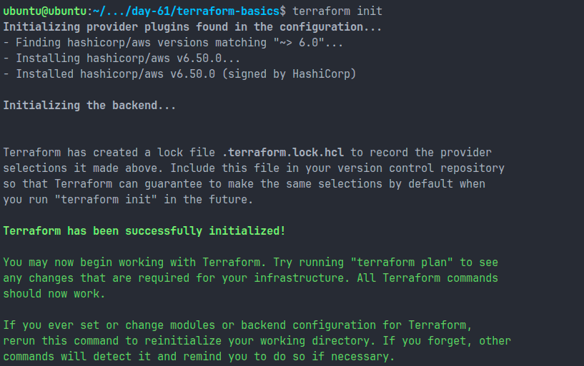
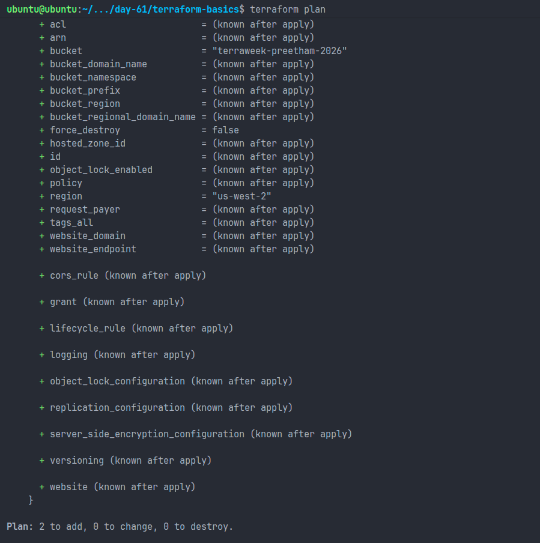
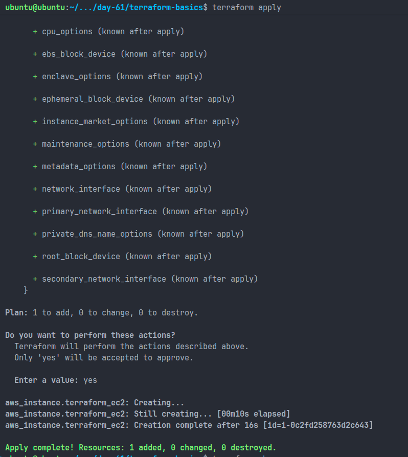
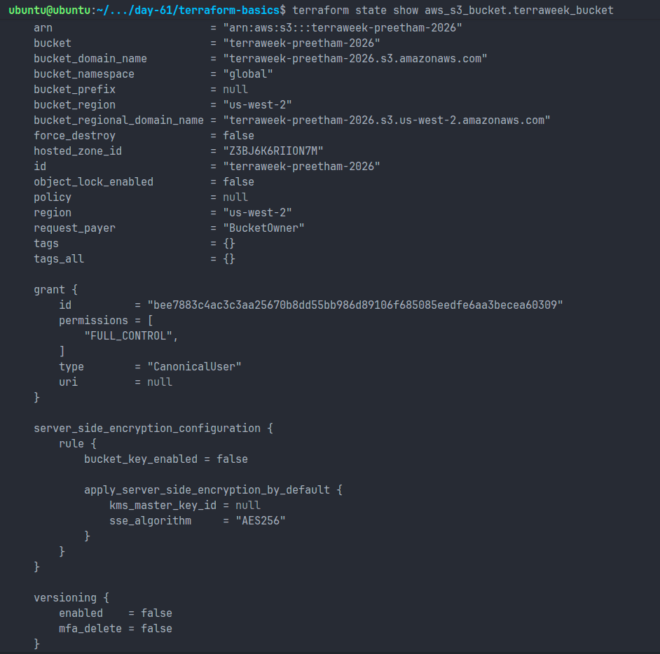
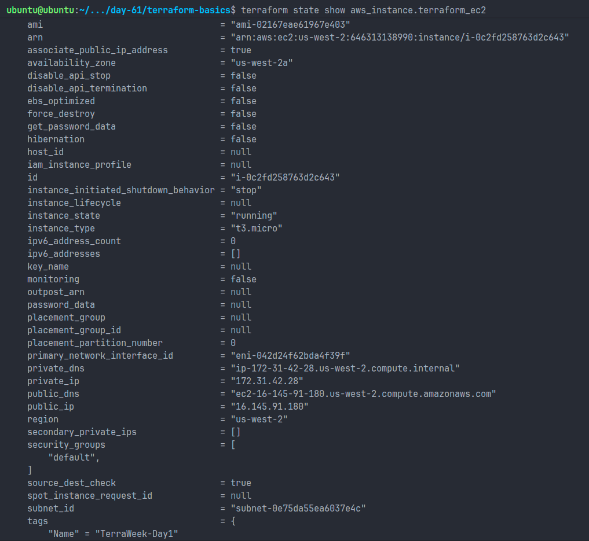
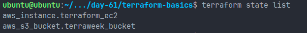
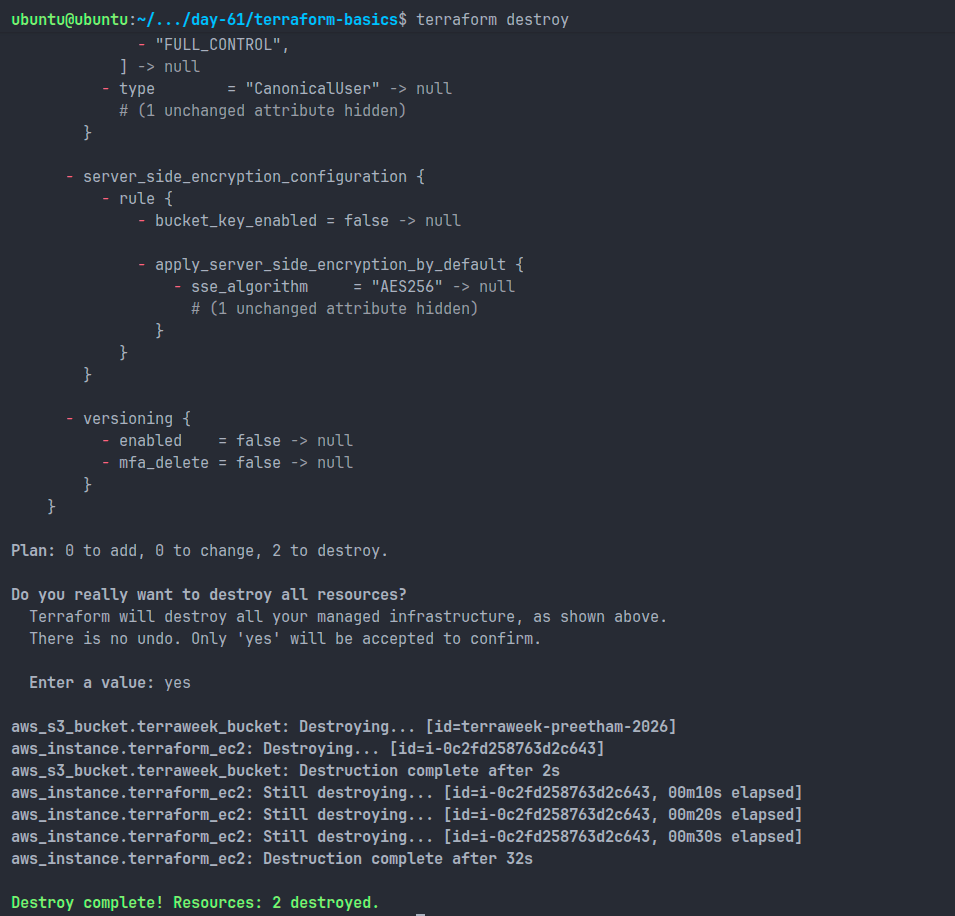

# Day 61 - Introduction to Terraform and Your First AWS Infrastructure

## Objective

The goal of this task was to understand the fundamentals of Infrastructure as Code (IaC) using Terraform and provision AWS resources through code instead of manually creating them in the AWS Management Console.

---

# What is Infrastructure as Code (IaC)?

Infrastructure as Code (IaC) is the practice of managing and provisioning infrastructure through code rather than manual processes. Instead of clicking through cloud consoles, we define resources such as servers, storage, and networks in configuration files.

IaC is important in DevOps because it brings consistency, repeatability, version control, and automation to infrastructure management. Teams can deploy the same infrastructure across multiple environments with minimal effort and fewer human errors.

---

# Problems Solved by IaC

Manual infrastructure creation can lead to:

- Configuration drift between environments
- Human errors during resource creation
- Lack of documentation
- Difficulty reproducing environments
- Time-consuming deployments

IaC solves these issues by allowing infrastructure to be stored as code, reviewed, version controlled, and deployed automatically.

---

# Terraform vs Other Tools

## Terraform

- Open-source Infrastructure as Code tool by HashiCorp
- Uses HCL (HashiCorp Configuration Language)
- Supports multiple cloud providers
- Declarative approach

## AWS CloudFormation

- AWS-native IaC service
- Works only with AWS resources
- Uses JSON or YAML templates

## Ansible

- Primarily a configuration management tool
- Uses playbooks to configure existing systems
- Procedural approach

## Pulumi

- Infrastructure as Code using programming languages
- Supports Python, TypeScript, Go, and C#
- Suitable for developers preferring traditional programming languages

---

# Declarative and Cloud-Agnostic

Terraform is declarative because we define the desired end state instead of specifying every step required to reach that state.

Terraform is cloud-agnostic because the same tool can manage resources across AWS, Azure, Google Cloud, Kubernetes, and many other platforms through providers.

---

# Environment Setup

## Terraform Installation Verification

```bash
terraform -version
```

### Output

```bash
Terraform v1.x.x
```

Screenshot:


---

## AWS CLI Configuration

```bash
aws configure
```

Configured:

- AWS Access Key ID
- AWS Secret Access Key
- Region: ap-south-1
- Output Format: json

Verification:

```bash
aws sts get-caller-identity
```

Screenshot:


---

# Terraform Configuration

## Project Structure

```text
terraform-basics/
├── main.tf
├── .terraform/
├── terraform.tfstate
├── terraform.tfstate.backup
└── .gitignore
```

---

## S3 Bucket Resource

Terraform configuration included an S3 bucket resource with a globally unique name.

Example:

```hcl
resource "aws_s3_bucket" "terraweek_bucket" {
  bucket = "terraweek-preetham-2026"
}
```

---

## EC2 Instance Resource

Terraform configuration also included an EC2 instance.

Example:

```hcl
resource "aws_instance" "terraform_ec2" {
  ami           = "ami-0f5ee92e2d63afc18"
  instance_type = "t2.micro"

  tags = {
    Name = "TerraWeek-Day1"
  }
}
```

---

# Terraform Workflow

## terraform init

```bash
terraform init
```

Purpose:

- Initializes the working directory
- Downloads required providers
- Creates the `.terraform/` directory
- Generates provider lock file

### What Was Downloaded?

- AWS Provider Plugin
- Provider metadata
- Dependency information

### .terraform Directory Contains

- Provider binaries
- Downloaded plugins
- Terraform dependency metadata

Screenshot:



---

## terraform plan

```bash
terraform plan
```

Purpose:

- Shows resources Terraform intends to create, modify, or destroy
- Helps verify infrastructure changes before execution

Screenshot:



---

## terraform apply

```bash
terraform apply
```

Purpose:

- Creates or updates infrastructure
- Saves resource details into the Terraform state file

Resources Created:

- S3 Bucket
- EC2 Instance

Screenshot:



---

# AWS Resource Verification

## S3 Bucket

Verified bucket creation from AWS S3 Console.

Screenshot:



---

## EC2 Instance

Verified instance creation from AWS EC2 Console.

Screenshot:



---

# Understanding Terraform State

Terraform maintains infrastructure information in:

```bash
terraform.tfstate
```

This file stores the current state of all resources managed by Terraform.

---

## terraform show

```bash
terraform show
```

Purpose:

Displays a human-readable view of the current infrastructure state.

---

## terraform state list

```bash
terraform state list
```

Purpose:

Lists all resources currently managed by Terraform.

Example:

```bash
aws_instance.terraform_ec2
aws_s3_bucket.terraweek_bucket
```

---

## terraform state show

```bash
terraform state show aws_s3_bucket.terraweek_bucket
```

```bash
terraform state show aws_instance.terraform_ec2
```

Purpose:

Displays detailed information about a specific resource.

Screenshot:



---

# How Terraform Knows What Already Exists

Terraform uses the state file (`terraform.tfstate`) to track resources it created.

When `terraform plan` is executed:

1. Terraform reads the configuration files.
2. Terraform reads the current state file.
3. Terraform compares the desired state with the actual state.
4. Only missing or modified resources are planned for changes.

This is why Terraform created only the EC2 instance after the S3 bucket already existed.

---

# Modifying Infrastructure

Updated EC2 tag:

Before:

```hcl
Name = "TerraWeek-Day1"
```

After:

```hcl
Name = "TerraWeek-Modified"
```

Running:

```bash
terraform plan
```

showed a resource update.

### Terraform Symbols

| Symbol | Meaning                  |
| ------ | ------------------------ |
| +      | Create Resource          |
| -      | Destroy Resource         |
| ~      | Modify Existing Resource |

The EC2 tag update was an in-place modification and did not require resource recreation.

---

# Destroying Infrastructure

Command:

```bash
terraform destroy
```

Purpose:

- Removes all resources managed by Terraform
- Updates the state file accordingly

Resources Destroyed:

- S3 Bucket
- EC2 Instance

Screenshot:



---

# Why State Files Should Not Be Committed

State files may contain:

- Resource IDs
- Account information
- Infrastructure metadata
- Sensitive values

Risks:

- Exposure of infrastructure details
- State corruption from concurrent edits
- Security concerns

Recommended `.gitignore`:

```gitignore
.terraform/
*.tfstate
*.tfstate.*
```

---

# Key Learnings

- Learned the fundamentals of Infrastructure as Code.
- Installed and configured Terraform with AWS.
- Created AWS resources using Terraform code.
- Understood Terraform lifecycle commands.
- Explored Terraform state management.
- Modified infrastructure using Terraform plans.
- Destroyed resources safely using code.
- Learned best practices for managing Terraform state files.

---

# Conclusion

Day 61 introduced the foundations of Infrastructure as Code using Terraform. I successfully provisioned an S3 bucket and EC2 instance on AWS, explored Terraform state management, and learned how infrastructure can be created, updated, and destroyed through code. This marks the beginning of my Terraform and cloud automation journey.
