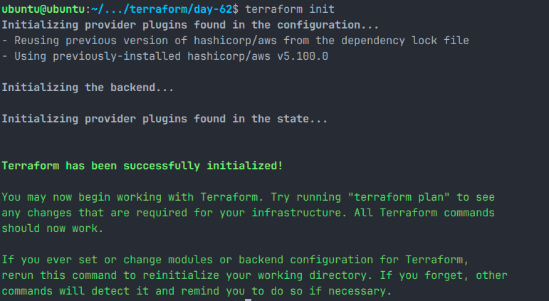
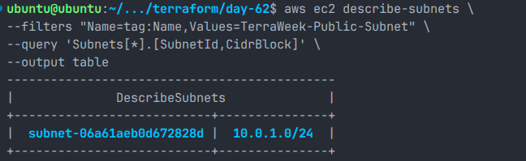
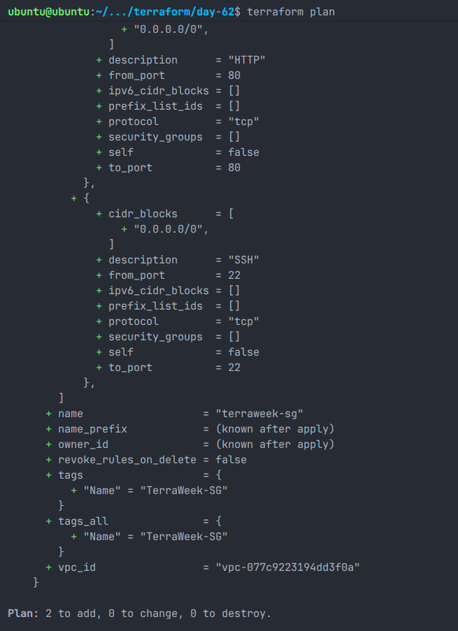
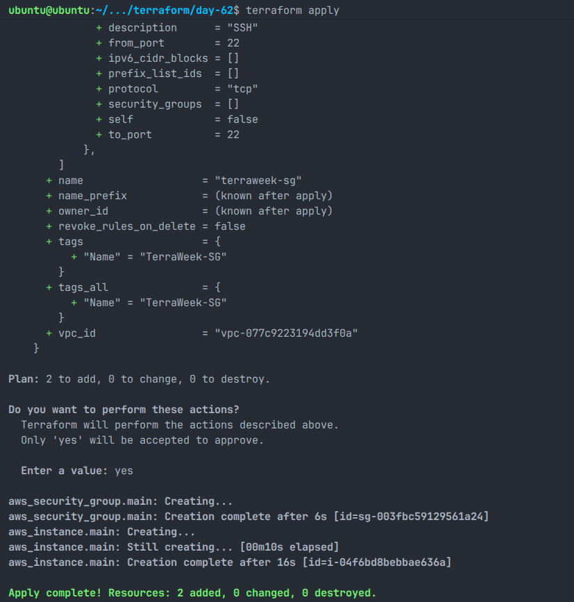
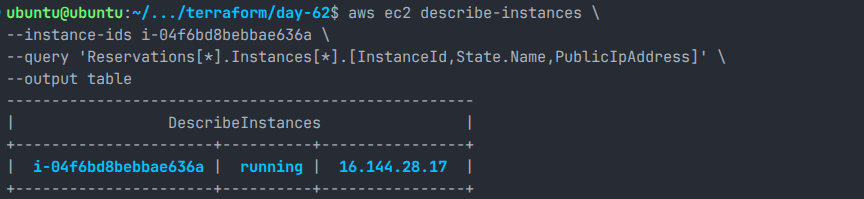
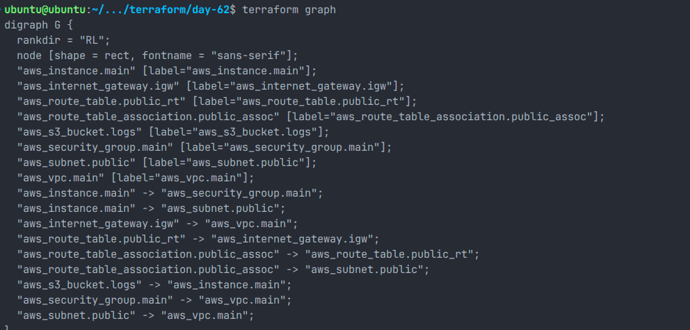
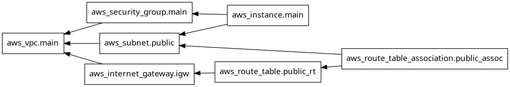

# Day 62 - Providers, Resources and Dependencies

## Overview

On Day 62, I explored Terraform Providers, Resources, and Dependency Management by building a complete AWS networking stack from scratch.

The infrastructure included:

- AWS VPC
- Public Subnet
- Internet Gateway
- Route Table
- Route Table Association
- Security Group
- EC2 Instance
- S3 Bucket
- Dependency Graph Visualization

This lab helped me understand how Terraform automatically determines resource creation order using implicit dependencies and how explicit dependencies can be enforced using `depends_on`.

---

# Objectives

- Configure AWS Provider in Terraform
- Understand provider version constraints
- Build a complete AWS networking stack
- Learn implicit and explicit dependencies
- Visualize Terraform dependency graphs
- Understand lifecycle rules
- Observe Terraform destroy order

---

# Project Structure

```text
day-62/
├── day-62-providers-resources.md
├── providers.tf
├── main.tf
├── graph.png
├── screenshots/
│   ├── 01-terraform-init.png
│   ├── 02-terraform-plan.png
│   ├── 03-terraform-apply.png
│   ├── 04-aws-subnet.png
│   ├── 05-aws-ec2.png
│   └── 06-terraform-graph.png
└── README.md
```

---

# Task 1 - AWS Provider Configuration

## providers.tf

```hcl
terraform {
  required_providers {
    aws = {
      source  = "hashicorp/aws"
      version = "~> 5.0"
    }
  }

  required_version = ">= 1.5.0"
}

provider "aws" {
  region = "ap-south-1"
}
```

---

## Terraform Initialization

```bash
terraform init
```

Installed AWS Provider:

```text
hashicorp/aws v5.100.0
```



---

## What is `.terraform.lock.hcl`?

Terraform automatically generates the lock file to:

- Record exact provider versions
- Ensure consistency across environments
- Prevent unexpected provider upgrades
- Improve reproducibility

Example:

```text
provider "registry.terraform.io/hashicorp/aws" {
  version = "5.100.0"
}
```

---

## Provider Version Constraints

### `~> 5.0`

Allows:

```text
5.0.x
5.1.x
5.50.x
5.100.x
```

Blocks:

```text
6.0.0
```

---

### `>= 5.0`

Allows:

```text
5.0
5.5
6.0
7.0
```

Less predictable.

---

### `= 5.0.0`

Only:

```text
5.0.0
```

No upgrades allowed.

---

# Task 2 - Build AWS Networking Stack

## Create VPC

```hcl
resource "aws_vpc" "main" {
  cidr_block = "10.0.0.0/16"

  tags = {
    Name = "TerraWeek-VPC"
  }
}
```

---

## Create Public Subnet

```hcl
resource "aws_subnet" "public" {
  vpc_id                  = aws_vpc.main.id
  cidr_block              = "10.0.1.0/24"
  map_public_ip_on_launch = true

  tags = {
    Name = "TerraWeek-Public-Subnet"
  }
}
```



---

## Create Internet Gateway

```hcl
resource "aws_internet_gateway" "igw" {
  vpc_id = aws_vpc.main.id

  tags = {
    Name = "TerraWeek-IGW"
  }
}
```

---

## Create Route Table

```hcl
resource "aws_route_table" "public_rt" {
  vpc_id = aws_vpc.main.id

  route {
    cidr_block = "0.0.0.0/0"
    gateway_id = aws_internet_gateway.igw.id
  }

  tags = {
    Name = "TerraWeek-RouteTable"
  }
}
```

---

## Associate Route Table

```hcl
resource "aws_route_table_association" "public_assoc" {
  subnet_id      = aws_subnet.public.id
  route_table_id = aws_route_table.public_rt.id
}
```

---

# Terraform Plan

Terraform identified:

```text
Plan: 5 to add, 0 to change, 0 to destroy.
```

Resources:

- VPC
- Subnet
- Internet Gateway
- Route Table
- Route Table Association



---

# Terraform Apply

Applied the planned infrastructure changes:

```bash
terraform apply
```



---

# Task 3 - Understanding Implicit Dependencies

Terraform automatically detects dependencies whenever one resource references another.

Example:

```hcl
vpc_id = aws_vpc.main.id
```

This tells Terraform:

```text
VPC must be created first.
Subnet depends on VPC.
```

---

## Implicit Dependencies Found

### Subnet → VPC

```hcl
vpc_id = aws_vpc.main.id
```

---

### Internet Gateway → VPC

```hcl
vpc_id = aws_vpc.main.id
```

---

### Route Table → Internet Gateway

```hcl
gateway_id = aws_internet_gateway.igw.id
```

---

### Route Table Association → Route Table

```hcl
route_table_id = aws_route_table.public_rt.id
```

---

### Route Table Association → Subnet

```hcl
subnet_id = aws_subnet.public.id
```

---

## How Terraform Knows the Order

Terraform builds a dependency graph internally.

Creation order:

```text
VPC
├── Subnet
├── Internet Gateway
└── Route Table
        └── Route Table Association
```

---

## What Happens If Subnet Is Created First?

AWS would reject the request because:

```text
Subnet requires an existing VPC.
```

Terraform prevents this using dependency analysis.

---

# Task 4 - Security Group and EC2

## Security Group

```hcl
resource "aws_security_group" "main" {
  name        = "terraweek-sg"
  description = "Allow SSH and HTTP"
  vpc_id      = aws_vpc.main.id

  ingress {
    description = "SSH"
    from_port   = 22
    to_port     = 22
    protocol    = "tcp"
    cidr_blocks = ["0.0.0.0/0"]
  }

  ingress {
    description = "HTTP"
    from_port   = 80
    to_port     = 80
    protocol    = "tcp"
    cidr_blocks = ["0.0.0.0/0"]
  }

  egress {
    from_port   = 0
    to_port     = 0
    protocol    = "-1"
    cidr_blocks = ["0.0.0.0/0"]
  }

  tags = {
    Name = "TerraWeek-SG"
  }
}
```

---

## EC2 Instance

```hcl
resource "aws_instance" "main" {
  ami                         = "ami-02167eae61967e403"
  instance_type               = "t3.micro"
  subnet_id                   = aws_subnet.public.id
  vpc_security_group_ids      = [aws_security_group.main.id]
  associate_public_ip_address = true

  tags = {
    Name = "TerraWeek-Server"
  }
}
```



---

# Task 5 - Explicit Dependencies

## S3 Bucket

```hcl
resource "aws_s3_bucket" "logs" {
  bucket = "terraweek-logs-preetham-2026"

  depends_on = [
    aws_instance.main
  ]

  tags = {
    Name = "TerraWeek-Logs"
  }
}
```

---

## Why Use `depends_on`?

Terraform cannot infer a relationship because:

```text
S3 Bucket
EC2 Instance
```

have no direct references.

`depends_on` forces Terraform to create:

```text
EC2 Instance
↓
S3 Bucket
```

---

## Real World Examples

### Example 1

Create IAM roles before EC2 startup scripts use them.

### Example 2

Create monitoring infrastructure only after application deployment.

---

# Dependency Graph

Generated using:

```bash
terraform graph | dot -Tpng > graph.png
```

Graph Output:

```text
aws_instance.main -> aws_security_group.main
aws_instance.main -> aws_subnet.public

aws_security_group.main -> aws_vpc.main
aws_subnet.public -> aws_vpc.main

aws_internet_gateway.igw -> aws_vpc.main

aws_route_table.public_rt -> aws_internet_gateway.igw

aws_route_table_association.public_assoc -> aws_route_table.public_rt
aws_route_table_association.public_assoc -> aws_subnet.public

aws_s3_bucket.logs -> aws_instance.main
```





---

# Task 6 - Lifecycle Rules

## create_before_destroy

```hcl
lifecycle {
  create_before_destroy = true
}
```

Use for:

- EC2 replacement
- Blue-Green deployments
- Zero downtime updates

---

## prevent_destroy

```hcl
lifecycle {
  prevent_destroy = true
}
```

Use for:

- Production databases
- Critical S3 buckets

Prevents accidental deletion.

---

## ignore_changes

```hcl
lifecycle {
  ignore_changes = [tags]
}
```

Use when external systems modify resources.

---

# Terraform Destroy

Command:

```bash
terraform destroy
```

Terraform destroyed resources in reverse dependency order.

Observed order:

```text
Route Table Association
↓
Route Table
↓
Internet Gateway
↓
EC2 Instance
↓
Subnet
↓
Security Group
↓
VPC
```

This ensures dependent resources are removed safely.

---

# Key Learnings

- Terraform Providers connect Terraform with cloud platforms.
- Version constraints prevent unexpected upgrades.
- Terraform automatically determines creation order.
- Resource references create implicit dependencies.
- `depends_on` creates explicit dependencies.
- Dependency graphs help visualize infrastructure.
- Lifecycle rules control resource replacement behavior.
- Terraform destroys resources in reverse dependency order.
- State drift occurs when infrastructure changes outside Terraform.

---

# Conclusion

Today I built a complete AWS networking environment using Terraform and explored how Terraform manages dependencies between resources.

I learned the difference between implicit and explicit dependencies, generated dependency graphs, worked with lifecycle rules, and observed Terraform's destruction order.

This lab strengthened my understanding of Infrastructure as Code and how Terraform orchestrates complex cloud infrastructure reliably.
