# Day 64 - Terraform State Management and Remote Backends

## Overview

Today I learned one of the most critical concepts in Terraform: **State Management**. Terraform state acts as the source of truth for infrastructure and maintains the mapping between Terraform configuration files and real-world cloud resources.

During this lab, I migrated local state to a remote backend using Amazon S3, implemented state locking with DynamoDB, imported existing AWS resources into Terraform state, performed state operations, and simulated infrastructure drift.

---

# Architecture Diagram

```text
                    ┌──────────────────┐
                    │ Terraform CLI    │
                    └────────┬─────────┘
                             │
                             ▼
                 ┌──────────────────────┐
                 │ S3 Remote Backend    │
                 │ terraform.tfstate    │
                 └─────────┬────────────┘
                           │
                           ▼
               ┌────────────────────────┐
               │ DynamoDB Lock Table    │
               │ terraform-state-lock   │
               └────────────────────────┘
                           │
                           ▼
                  ┌─────────────────┐
                  │ AWS Resources   │
                  │ VPC             │
                  │ Subnet          │
                  │ Security Group  │
                  │ EC2 Instance    │
                  │ S3 Bucket       │
                  └─────────────────┘
```

---

# Infrastructure Created

## Resources Managed by Terraform

```bash
terraform state list
```

Output:

```text
aws_instance.web
aws_s3_bucket.logs_bucket
aws_security_group.web_sg
aws_subnet.public
aws_vpc.main
```

Total Resources Managed:

```text
5
```

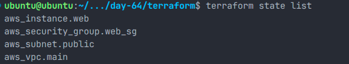

---

# Task 1 - State Inspection

## View Terraform State

```bash
terraform show
```

## List Resources

```bash
terraform state list
```

## Inspect EC2 Resource

```bash
terraform state show aws_instance.web
```

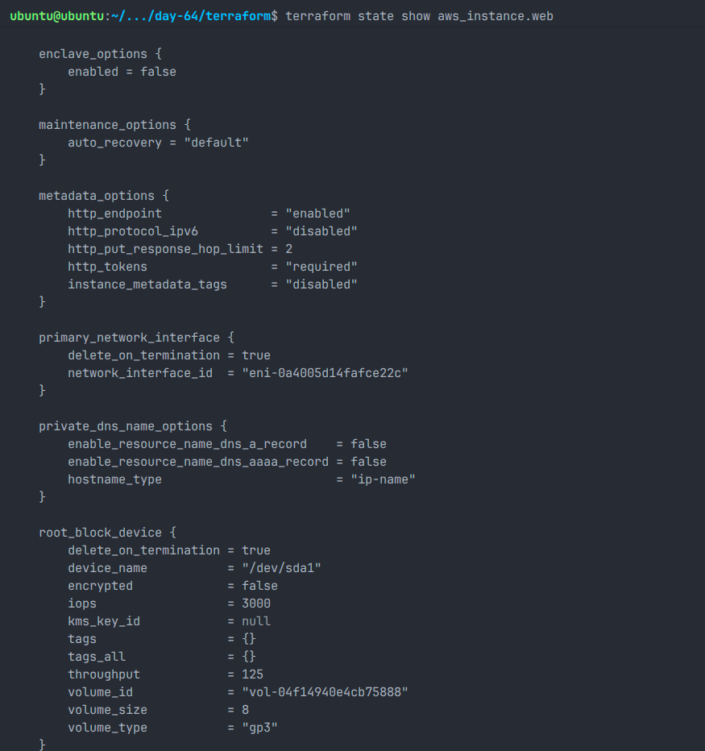

### Important Attributes Stored in State

- Instance ID
- ARN
- AMI ID
- Instance Type
- Public IP
- Private IP
- Availability Zone
- Security Groups
- Tags
- Instance State

Terraform stores significantly more information than what is explicitly defined in configuration files.

---

## Terraform State Serial Number

The Terraform state file contains a serial number:

```json
"serial": <value>
```

### Purpose

- Tracks state versions
- Prevents stale state overwrites
- Increments after every successful state update
- Helps coordinate remote state changes

---

# Task 2 - Remote Backend Configuration

## S3 Bucket Creation

Created a dedicated S3 bucket for Terraform state storage.

```bash
aws s3api create-bucket \
--bucket preetham-terraform-state-2026 \
--region us-west-2 \
--create-bucket-configuration LocationConstraint=us-west-2
```

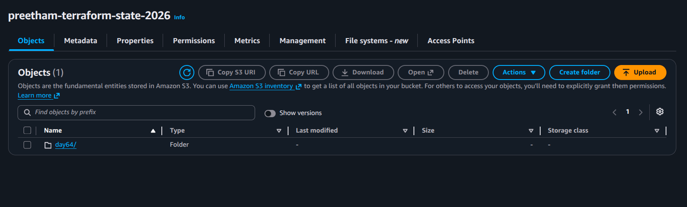

---

## Enable Versioning

```bash
aws s3api put-bucket-versioning \
--bucket preetham-terraform-state-2026 \
--versioning-configuration Status=Enabled
```

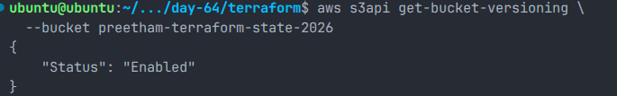

### Why Versioning?

- Protects against accidental deletion
- Allows rollback to previous state versions
- Improves disaster recovery

---

## DynamoDB Lock Table

```bash
aws dynamodb create-table \
--table-name terraform-state-lock \
--attribute-definitions AttributeName=LockID,AttributeType=S \
--key-schema AttributeName=LockID,KeyType=HASH \
--billing-mode PAY_PER_REQUEST \
--region us-west-2
```

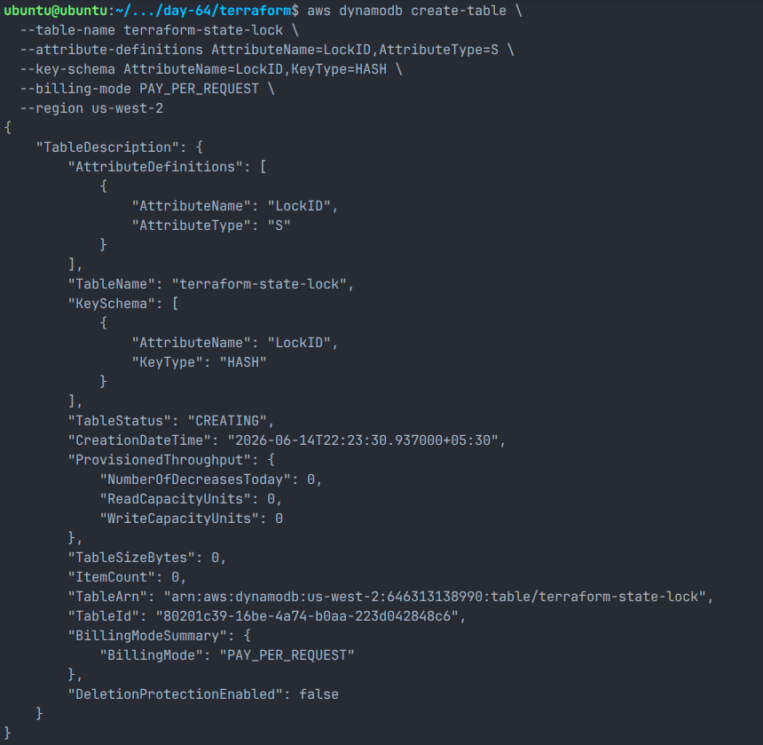

---

## Backend Configuration

```hcl
terraform {
  backend "s3" {
    bucket         = "preetham-terraform-state-2026"
    key            = "day64/terraform.tfstate"
    region         = "us-west-2"
    dynamodb_table = "terraform-state-lock"
    encrypt        = true
  }
}
```

---

## State Migration

```bash
terraform init -migrate-state
```

Terraform successfully migrated the local state file to the S3 backend.

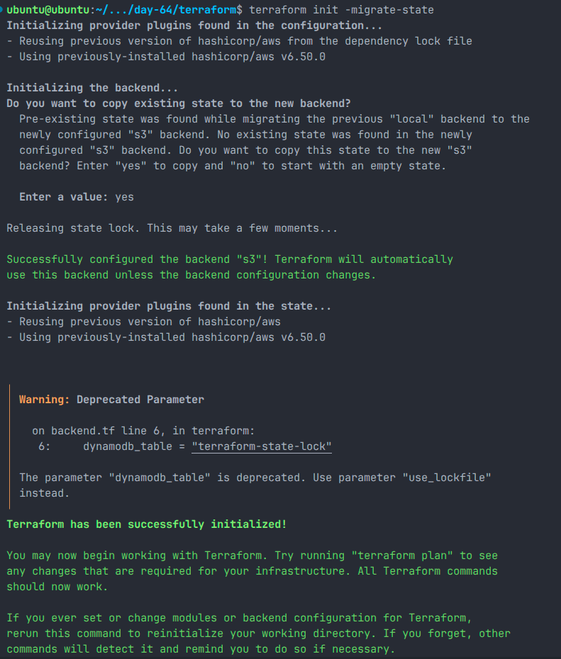

Verification:

```bash
aws s3 ls s3://preetham-terraform-state-2026/day64/
```

Output:

```text
terraform.tfstate
```

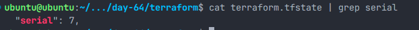

---

# Task 3 - State Locking

Terraform state locking prevents multiple users from modifying the same infrastructure simultaneously.

## Test Procedure

Terminal 1:

```bash
terraform apply
```

Terminal 2:

```bash
terraform plan
```

---

## Lock Error Captured

```text
Error acquiring the state lock

ConditionalCheckFailedException

Operation: OperationTypeApply
```

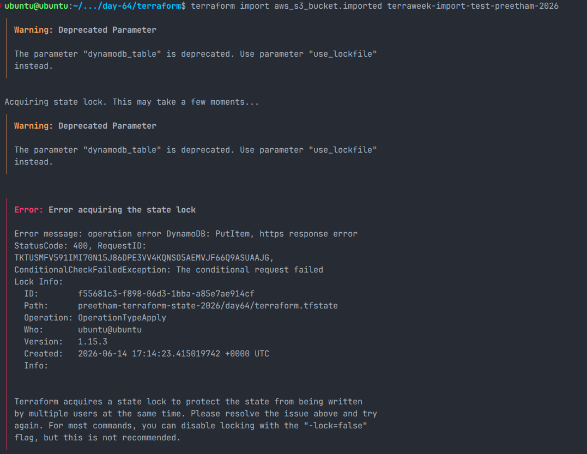

### Why Locking Is Important

- Prevents concurrent changes
- Avoids state corruption
- Ensures infrastructure consistency
- Critical for team collaboration

---

# Task 4 - Import Existing Resource

Created an S3 bucket manually from AWS Console:

```text
terraweek-import-test-preetham-2026
```

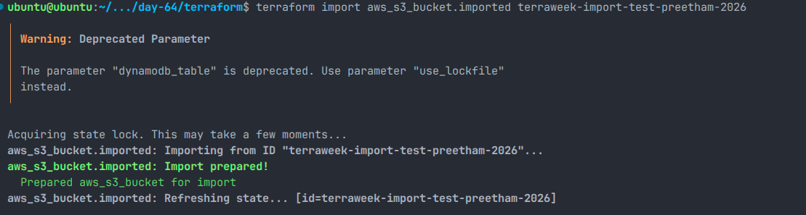

---

## Terraform Resource Block

```hcl
resource "aws_s3_bucket" "imported" {
  bucket = "terraweek-import-test-preetham-2026"
}
```

---

## Import Command

```bash
terraform import aws_s3_bucket.imported terraweek-import-test-preetham-2026
```

Result:

```text
Import successful!
```

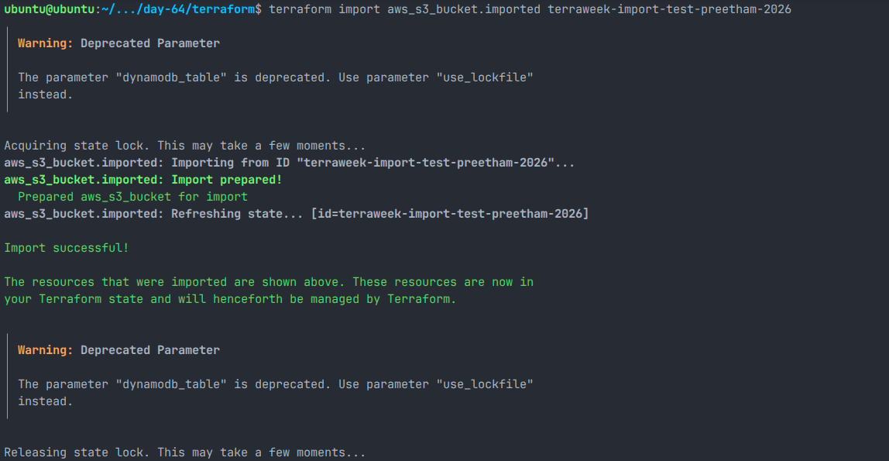

### Import vs Create

| Terraform Apply                 | Terraform Import                |
| ------------------------------- | ------------------------------- |
| Creates new infrastructure      | Uses existing infrastructure    |
| Adds resource to state          | Adds existing resource to state |
| Resource must not already exist | Resource already exists         |

---

# Task 5 - State Surgery

## Rename Resource

```bash
terraform state mv \
aws_s3_bucket.imported \
aws_s3_bucket.logs_bucket
```

### Use Cases

- Resource renaming
- Refactoring Terraform code
- Moving resources between modules

---

## Remove Resource from State

```bash
terraform state rm aws_s3_bucket.logs_bucket
```

### Result

Terraform stopped managing the bucket but the bucket still existed in AWS.

---

## Re-import Resource

```bash
terraform import \
aws_s3_bucket.logs_bucket \
terraweek-import-test-preetham-2026
```

Successfully restored resource tracking.

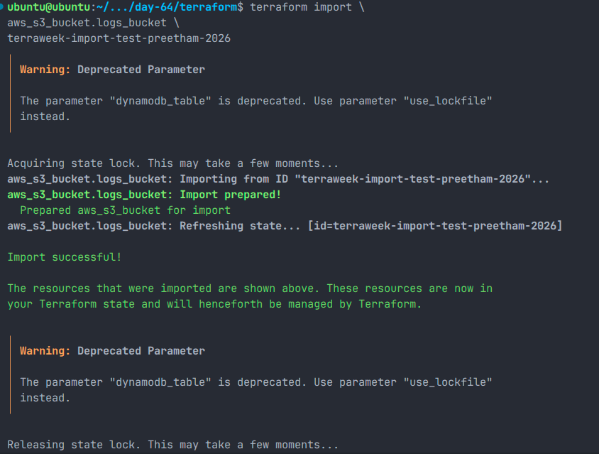

---

# Task 6 - State Drift Detection

Infrastructure drift occurs when resources are modified outside Terraform.

## Manual Change

Changed EC2 Name tag manually from AWS Console:

```text
Terraform-Web-Server-v2
```

to

```text
ManuallyChanged
```

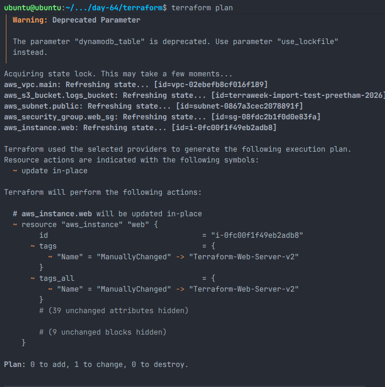

---

## Detect Drift

```bash
terraform plan
```

Terraform detected:

```diff
~ tags.Name

- ManuallyChanged
+ Terraform-Web-Server-v2
```

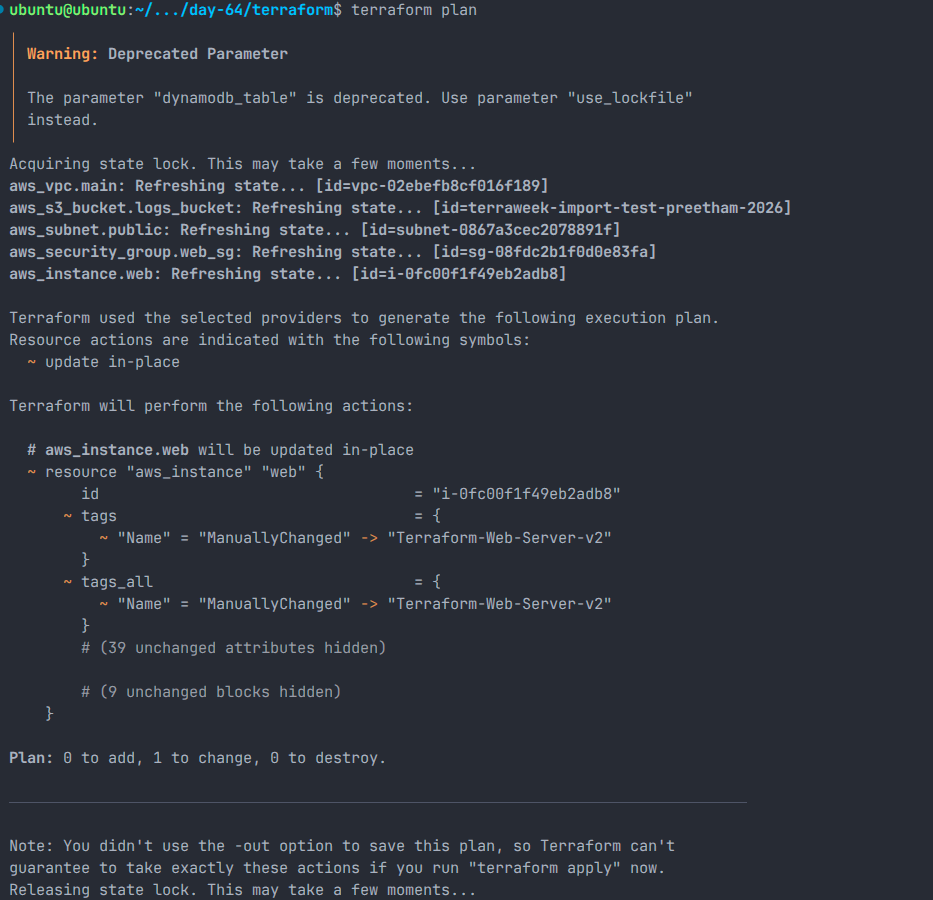

---

## Reconcile Drift

```bash
terraform apply
```

Terraform restored the infrastructure to match the desired configuration.

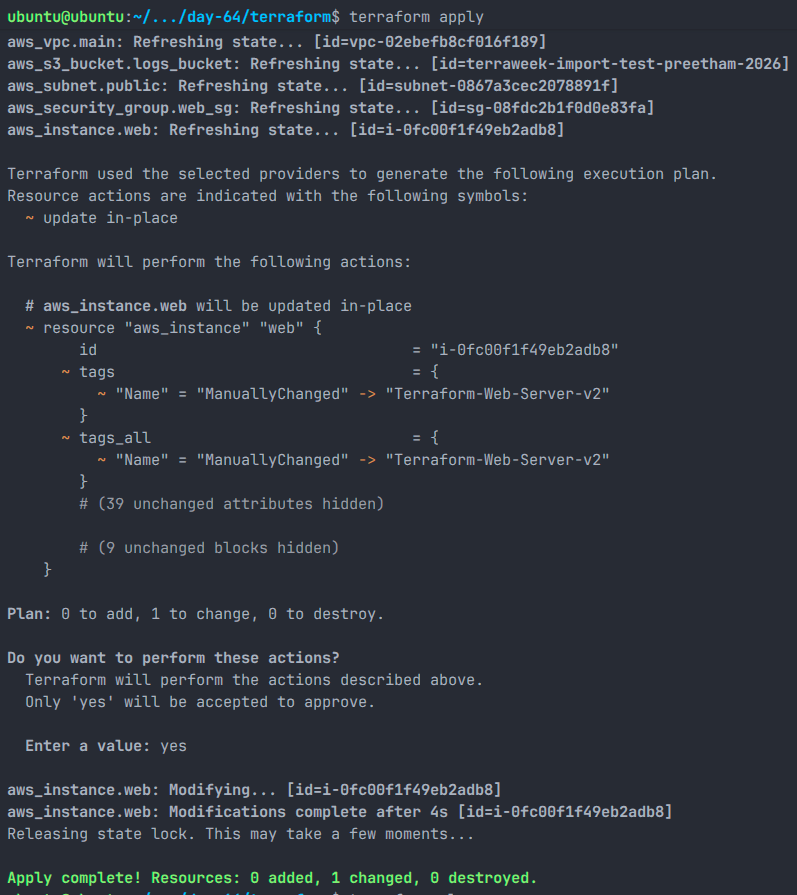

Verification:

```bash
terraform plan
```

Output:

```text
No changes.
Your infrastructure matches the configuration.
```

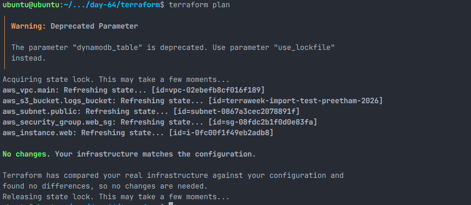

---

# Useful Terraform State Commands

## View State

```bash
terraform show
```

## List Managed Resources

```bash
terraform state list
```

## Inspect Specific Resource

```bash
terraform state show <resource>
```

## Move Resource

```bash
terraform state mv
```

## Remove Resource from State

```bash
terraform state rm
```

## Import Existing Resource

```bash
terraform import
```

## Remove Stale Lock

```bash
terraform force-unlock <LOCK_ID>
```

## Refresh State

```bash
terraform refresh
```

---

# Key Learnings

- Terraform state is the source of truth.
- Remote backends are mandatory for team environments.
- S3 provides centralized state storage.
- DynamoDB prevents concurrent state modifications.
- Existing infrastructure can be imported into Terraform.
- State surgery allows safe refactoring without resource recreation.
- Terraform can detect and reconcile infrastructure drift.
- Versioning protects state from accidental loss.
- Proper state management is essential for production-grade Infrastructure as Code.

---

# Conclusion

Day 64 focused on mastering Terraform state management. I successfully migrated local state to a remote backend, implemented state locking, imported existing resources, performed state operations, and resolved infrastructure drift. These skills are critical for managing Terraform safely and reliably in real-world production environments.
