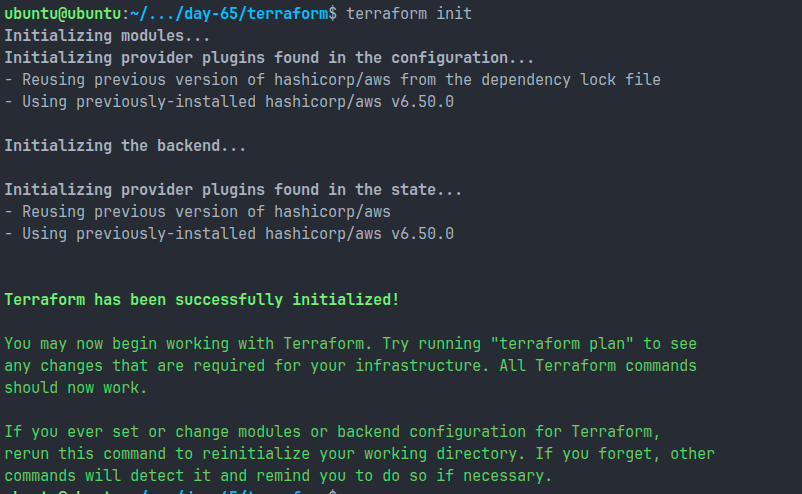
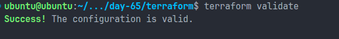
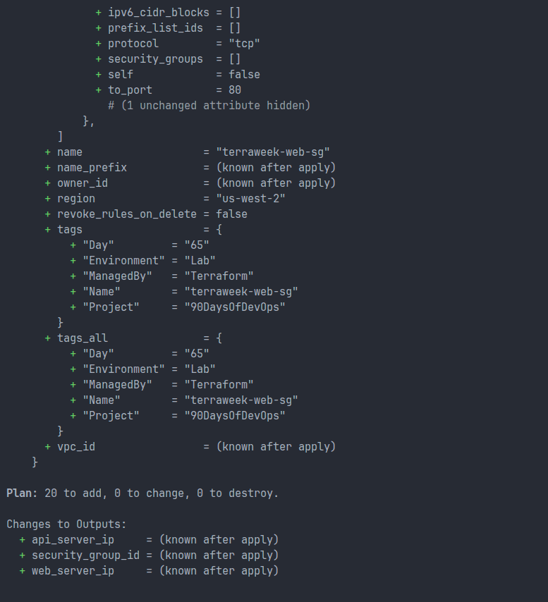
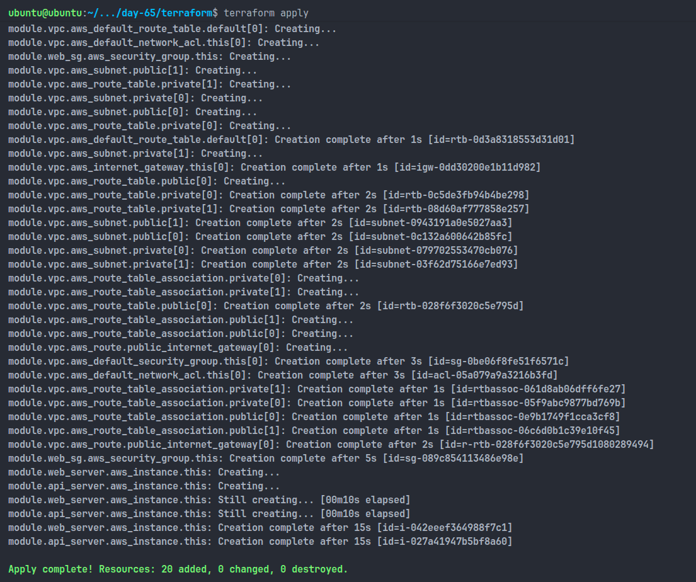
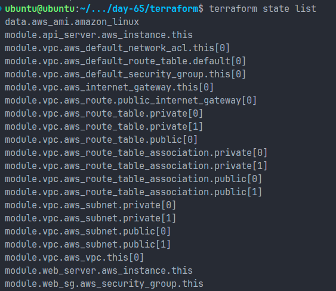
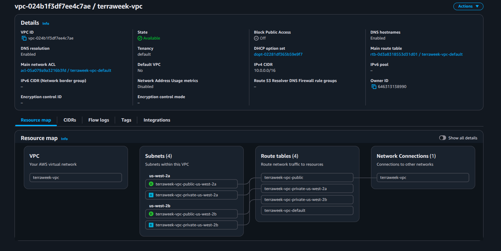
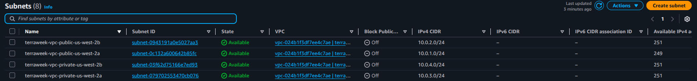
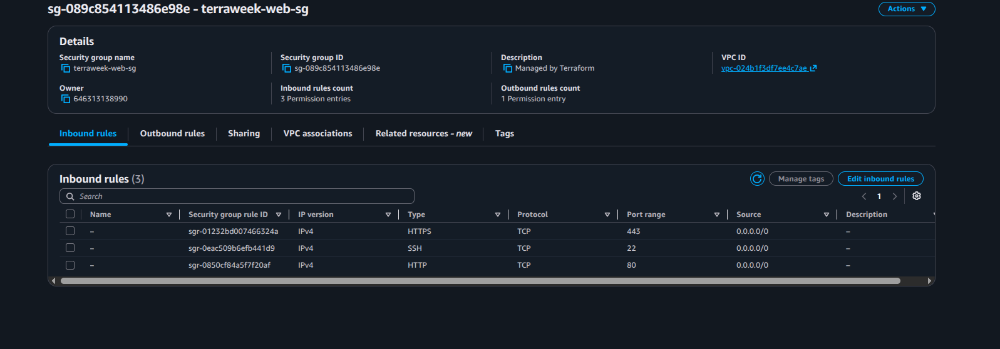
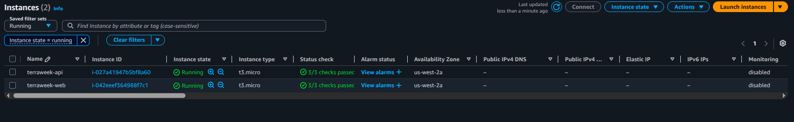
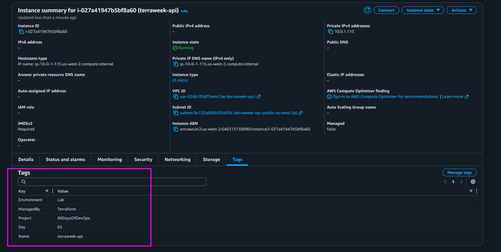

Here's a professional `day-65-modules.md` for your Day 65 submission.

# Day 65 – Terraform Modules: Build Reusable Infrastructure

## Overview

Today I learned how to build reusable Infrastructure as Code using Terraform Modules. Instead of writing all resources in a single configuration file, I created custom modules for EC2 instances and Security Groups, then reused them multiple times. I also explored the Terraform Registry by using the official AWS VPC module.

This approach improves maintainability, scalability, and reusability in real-world DevOps projects.

---

# Objectives

* Understand Terraform module architecture
* Create reusable EC2 and Security Group modules
* Use module inputs and outputs
* Deploy multiple EC2 instances from the same module
* Use a public Terraform Registry module
* Explore module versioning and best practices

---

# Project Structure

```text
terraform/
├── providers.tf
├── variables.tf
├── outputs.tf
├── locals.tf
├── main.tf
│
└── modules/
    ├── ec2-instance/
    │   ├── main.tf
    │   ├── variables.tf
    │   └── outputs.tf
    │
    └── security-group/
        ├── main.tf
        ├── variables.tf
        └── outputs.tf
```

---

# Root Module vs Child Module

## Root Module

The root module is the primary Terraform configuration executed using:

```bash
terraform init
terraform plan
terraform apply
```

It acts as the entry point and orchestrates all infrastructure components.

## Child Module

A child module is a reusable Terraform component called by another module.

Examples:

* EC2 Module
* Security Group Module
* VPC Registry Module

Child modules help eliminate duplication and simplify infrastructure management.

---

# EC2 Instance Module

## Purpose

Create reusable EC2 instances using configurable variables.

### Input Variables

| Variable           | Type         | Description       |
| ------------------ | ------------ | ----------------- |
| ami_id             | string       | AMI ID            |
| instance_type      | string       | EC2 instance type |
| subnet_id          | string       | Subnet ID         |
| security_group_ids | list(string) | Security Groups   |
| instance_name      | string       | EC2 Name Tag      |
| tags               | map(string)  | Additional tags   |

### Outputs

* Instance ID
* Public IP
* Private IP

---

# Security Group Module

## Purpose

Create reusable Security Groups with dynamic ingress rules.

### Input Variables

| Variable      | Type         | Description         |
| ------------- | ------------ | ------------------- |
| vpc_id        | string       | VPC ID              |
| sg_name       | string       | Security Group Name |
| ingress_ports | list(number) | Allowed ports       |
| tags          | map(string)  | Additional tags     |

### Dynamic Block Example

```hcl
dynamic "ingress" {
  for_each = var.ingress_ports

  content {
    from_port   = ingress.value
    to_port     = ingress.value
    protocol    = "tcp"
    cidr_blocks = ["0.0.0.0/0"]
  }
}
```

### Generated Rules

```text
22  -> SSH
80  -> HTTP
443 -> HTTPS
```

---

# Terraform Registry VPC Module

Instead of manually creating:

* VPC
* Internet Gateway
* Route Tables
* Route Associations
* Public Subnets
* Private Subnets

I used the official Terraform Registry module:

```hcl
module "vpc" {
  source  = "terraform-aws-modules/vpc/aws"
  version = "~> 5.0"
}
```

This significantly reduced infrastructure code and improved maintainability.

---

# Module Calls

## Security Group Module

```hcl
module "web_sg" {
  source        = "./modules/security-group"
  vpc_id        = module.vpc.vpc_id
  sg_name       = "terraweek-web-sg"
  ingress_ports = [22, 80, 443]
  tags          = local.common_tags
}
```

---

## Web Server Module

```hcl
module "web_server" {
  source             = "./modules/ec2-instance"
  ami_id             = data.aws_ami.amazon_linux.id
  instance_type      = "t3.micro"
  subnet_id          = module.vpc.public_subnets[0]
  security_group_ids = [module.web_sg.sg_id]
  instance_name      = "terraweek-web"
  tags               = local.common_tags
}
```

---

## API Server Module

```hcl
module "api_server" {
  source             = "./modules/ec2-instance"
  ami_id             = data.aws_ami.amazon_linux.id
  instance_type      = "t3.micro"
  subnet_id          = module.vpc.public_subnets[0]
  security_group_ids = [module.web_sg.sg_id]
  instance_name      = "terraweek-api"
  tags               = local.common_tags
}
```

---

# Deployment Results

Terraform successfully created:

## VPC Resources

* 1 VPC
* 1 Internet Gateway
* 2 Public Subnets
* 2 Private Subnets
* Route Tables
* Route Associations

## Security Resources

* 1 Custom Security Group

## Compute Resources

* 2 EC2 Instances

  * terraweek-web
  * terraweek-api

---

# Terraform State Verification

```bash
terraform state list
```

Resources appeared with module prefixes:

```text
module.vpc.aws_vpc.this[0]
module.web_sg.aws_security_group.this
module.web_server.aws_instance.this
module.api_server.aws_instance.this
```

This demonstrates how Terraform tracks resources inside modules.

---

# Registry Module Location

Terraform downloaded the registry module into:

```text
.terraform/modules/
```

This directory stores all externally sourced modules.

---

# Hand-Written VPC vs Registry Module

| Feature          | Hand-Written VPC | Registry Module |
| ---------------- | ---------------- | --------------- |
| Code Size        | Large            | Small           |
| Setup Time       | High             | Low             |
| Reusability      | Medium           | High            |
| Maintenance      | High             | Low             |
| Built-in Outputs | No               | Yes             |
| Best Practices   | Manual           | Included        |

### Observation

The registry module automatically created multiple supporting resources that would otherwise require significant manual configuration.

---

# Screenshots

## Terraform Init



## Terraform Validation



## Terraform Plan



## Terraform Apply



## Terraform State List



## AWS VPC



## AWS Subnets



## AWS Security Groups



## EC2 Instances Running



## EC2 Instance Tags



---

# Five Module Best Practices

### 1. Pin Module Versions

Always specify module versions to prevent unexpected changes.

### 2. Keep Modules Focused

A module should solve a single problem.

### 3. Avoid Hardcoding

Use variables for configurable values.

### 4. Expose Outputs

Outputs allow other modules to consume resource information.

### 5. Document Every Module

Include README files explaining inputs, outputs, and usage examples.

---

# Key Learnings

* Terraform modules improve reusability and maintainability.
* Child modules reduce code duplication.
* Dynamic blocks simplify repetitive configurations.
* Registry modules accelerate infrastructure deployment.
* Outputs enable communication between modules.
* Version pinning ensures predictable deployments.
* Modular design is essential for production-grade Terraform projects.

---

# Conclusion

Today I successfully created custom Terraform modules for EC2 instances and Security Groups, deployed multiple EC2 instances using the same module, and leveraged the official Terraform Registry VPC module. This exercise demonstrated how modular Infrastructure as Code helps teams build scalable, reusable, and maintainable cloud infrastructure.
