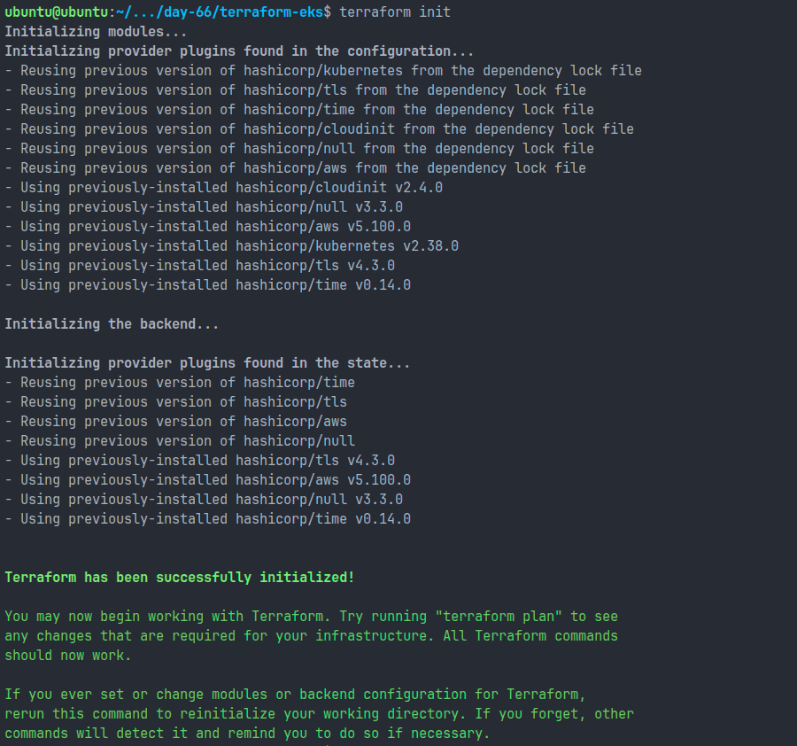
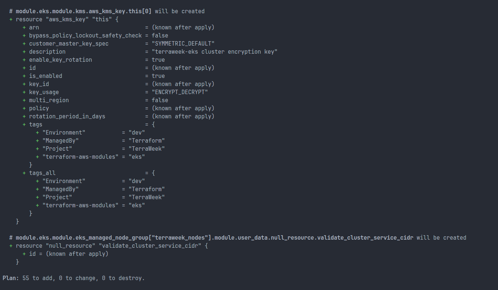
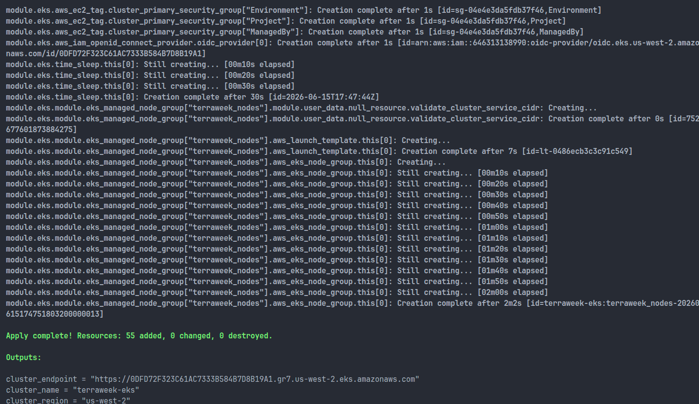
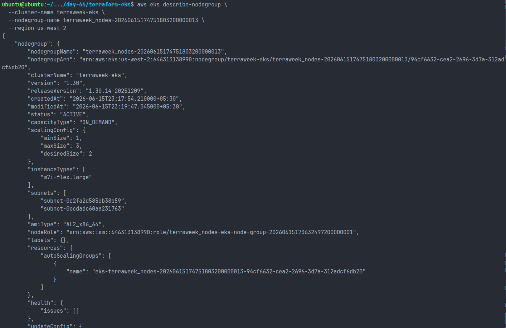
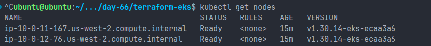
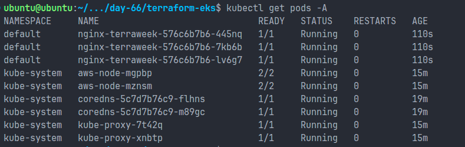
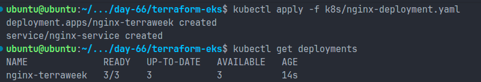
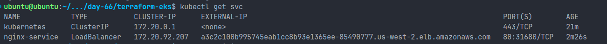
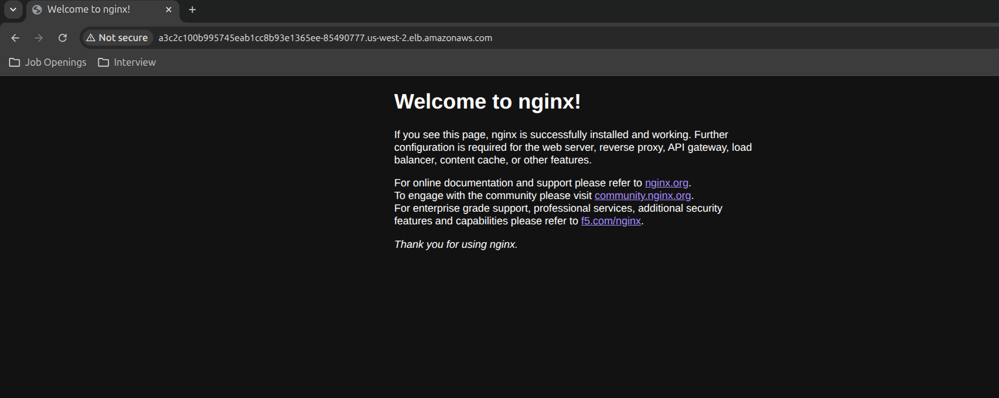
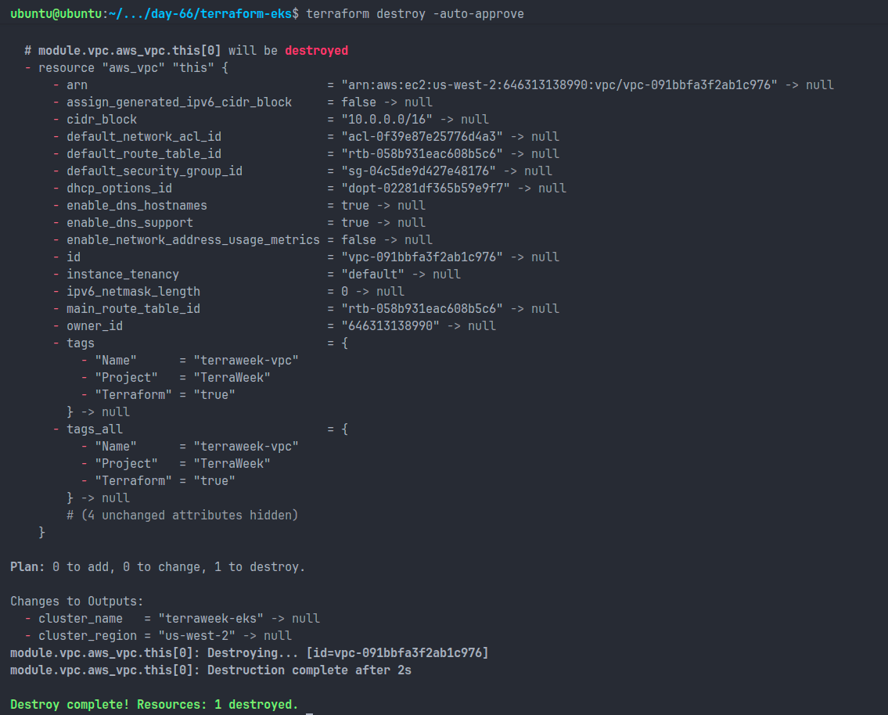

# Day 66 – Provision an EKS Cluster with Terraform Modules

## Objective

The goal of this lab was to provision a fully managed Amazon EKS cluster using Terraform Registry modules, deploy a Kubernetes workload, verify cluster functionality, and clean up all resources after completion.

---

# Architecture

Terraform was used to provision:

* Amazon VPC
* Public and Private Subnets
* Internet Gateway
* NAT Gateway
* Route Tables
* Security Groups
* IAM Roles and Policies
* AWS KMS Key
* Amazon EKS Control Plane
* EKS Managed Node Group

Kubernetes was used to deploy:

* Nginx Deployment
* LoadBalancer Service

---

# Project Structure

```text
terraform-eks/
├── providers.tf
├── variables.tf
├── terraform.tfvars
├── vpc.tf
├── eks.tf
├── outputs.tf
└── k8s/
    └── nginx-deployment.yaml
```

---

# Terraform Configuration

## Provider Configuration

Configured Terraform with:

* AWS Provider v5.x
* Kubernetes Provider
* AWS Region: us-west-2

### providers.tf

```hcl
terraform {
  required_version = ">= 1.5"

  required_providers {
    aws = {
      source  = "hashicorp/aws"
      version = "~> 5.0"
    }

    kubernetes = {
      source  = "hashicorp/kubernetes"
      version = "~> 2.30"
    }
  }
}

provider "aws" {
  region = var.region
}
```

---

## Variables

Defined configurable inputs for:

* Region
* Cluster Name
* Cluster Version
* Instance Type
* Node Count
* VPC CIDR

### variables.tf

```hcl
variable "region" {
  type = string
}

variable "cluster_name" {
  type    = string
  default = "terraweek-eks"
}

variable "cluster_version" {
  type    = string
  default = "1.30"
}

variable "node_instance_type" {
  type    = string
  default = "m7i-flex.large"
}

variable "node_desired_count" {
  type    = number
  default = 2
}

variable "vpc_cidr" {
  type    = string
  default = "10.0.0.0/16"
}
```

---

# VPC Module

Terraform AWS VPC module was used to create:

* 2 Public Subnets
* 2 Private Subnets
* NAT Gateway
* Internet Gateway
* Route Tables

### Features

* Multi-AZ deployment
* DNS Hostnames enabled
* Single NAT Gateway for cost optimization

### EKS Subnet Tags

Public Subnets:

```hcl
"kubernetes.io/role/elb" = 1
```

Private Subnets:

```hcl
"kubernetes.io/role/internal-elb" = 1
```

### Why EKS Needs Public and Private Subnets

**Public Subnets**

* Host internet-facing load balancers.
* Allow external access to applications.

**Private Subnets**

* Host worker nodes securely.
* Prevent direct internet exposure.
* Improve cluster security posture.

### Purpose of Subnet Tags

These tags allow Kubernetes and AWS Load Balancer Controller to automatically discover suitable subnets when provisioning services of type LoadBalancer.

---

# EKS Cluster Module

Terraform AWS EKS module was used to create:

* EKS Control Plane
* Managed Node Group
* IAM Roles
* Security Groups
* KMS Encryption

### Cluster Details

| Property           | Value          |
| ------------------ | -------------- |
| Cluster Name       | terraweek-eks  |
| Kubernetes Version | 1.30           |
| Node Type          | m7i-flex.large |
| Desired Nodes      | 2              |
| Region             | us-west-2      |

---

# Terraform Init

Initialized the Terraform working directory and downloaded the required providers and modules.

```bash
terraform init
```



---

# Terraform Plan

Terraform generated a plan containing:

```text
Plan: 55 to add, 0 to change, 0 to destroy.
```

Resources included:

* VPC Components
* Security Groups
* IAM Roles
* EKS Cluster
* Node Group
* NAT Gateway
* KMS Key
* Route Tables



---

# Terraform Apply

Cluster provisioning took approximately 15 minutes.

### Outputs

```bash
terraform output
```

Output:

```text
cluster_name     = terraweek-eks
cluster_region   = us-west-2
cluster_endpoint = https://xxxxxxxx.gr7.us-west-2.eks.amazonaws.com
```



---

# Connect kubectl to EKS

Updated kubeconfig:

```bash
aws eks update-kubeconfig \
  --region us-west-2 \
  --name terraweek-eks
```

Verified the Kubernetes control plane endpoint after updating kubeconfig:

```bash
kubectl cluster-info
```



---

# Cluster Verification

## Nodes

```bash
kubectl get nodes
```

Output:

```text
NAME                                        STATUS   ROLES    AGE
ip-10-0-11-167.us-west-2.compute.internal   Ready
ip-10-0-12-76.us-west-2.compute.internal    Ready
```



---

## System Pods

```bash
kubectl get pods -A
```

Verified:

* CoreDNS
* kube-proxy
* aws-node

All pods were running successfully.



---

# Deploy Nginx Application

### Deployment Manifest

Created:

```text
k8s/nginx-deployment.yaml
```

Resources:

* Deployment
* Service (LoadBalancer)

### Apply Manifest

```bash
kubectl apply -f k8s/nginx-deployment.yaml
```



---

# Verify Workload

## Deployment

```bash
kubectl get deployments
```

## Pods

```bash
kubectl get pods
```

## Services

```bash
kubectl get svc
```

AWS provisioned a Classic Load Balancer and assigned a public endpoint.



Nginx welcome page was successfully accessible through the LoadBalancer URL.



---

# Challenges Faced

## kubectl Unauthorized Error

Initial access failed:

```text
You must be logged in to the server (Unauthorized)
```

### Resolution

Re-generated kubeconfig:

```bash
aws eks update-kubeconfig \
  --name terraweek-eks \
  --region us-west-2
```

After updating kubeconfig, kubectl connected successfully.

---

## Terraform Destroy DependencyViolation

Destroy initially failed due to:

```text
DependencyViolation
```

Cause:

* Kubernetes LoadBalancer created an AWS Classic ELB.
* ELB left behind network interfaces and security groups.
* VPC deletion was blocked.

### Resolution

1. Deleted ELB.
2. Removed orphaned security group.
3. Re-ran Terraform destroy.

Destroy completed successfully.

---

# Cleanup

Deleted Kubernetes resources:

```bash
kubectl delete -f k8s/nginx-deployment.yaml
```

Destroyed infrastructure:

```bash
terraform destroy
```

Final result:

```text
Destroy complete!
```



Resources destroyed successfully.

---

# Final Verification

Verified:

* No EKS clusters
* No worker nodes
* No NAT Gateways
* No VPC resources
* No Load Balancers
* No orphaned Security Groups

AWS account returned to a clean state.

---

# Reflection

Compared to local Kubernetes environments such as Kind and Minikube, EKS provides a production-grade managed Kubernetes platform.

### Kind / Minikube

* Local development only
* Single machine
* No cloud networking
* No IAM integration
* Limited scalability

### Amazon EKS

* Managed control plane
* High availability
* IAM integration
* Multi-AZ architecture
* Managed node groups
* Production-ready infrastructure

Terraform made the entire infrastructure reproducible, version-controlled, and easy to destroy after use. This reflects real-world DevOps and Platform Engineering practices used in production environments.

---

# Key Learnings

* Provisioned EKS using Terraform Registry modules.
* Built a production-style VPC architecture.
* Connected kubectl to a managed Kubernetes cluster.
* Deployed workloads on EKS.
* Exposed applications through AWS Load Balancers.
* Troubleshot authentication issues.
* Resolved Terraform destroy dependency problems.
* Practiced complete Infrastructure as Code lifecycle management.
