# TerraWeek Capstone - Multi-Environment Infrastructure with Terraform Workspaces

## Project Overview

This project demonstrates a production-style Terraform infrastructure using:

- Custom Terraform Modules
- Terraform Workspaces
- Environment-Specific Configuration
- AWS VPC Networking
- Security Groups
- EC2 Instances
- Infrastructure as Code Best Practices

The goal is to manage multiple environments from a single Terraform codebase while maintaining complete infrastructure isolation.

---

## Architecture

```text
                    Terraform Root Module
                             │
        ┌────────────────────┼────────────────────┐
        │                    │                    │
        ▼                    ▼                    ▼
   VPC Module         Security Group       EC2 Module
                           Module
        │                    │                    │
        └────────────────────┼────────────────────┘
                             │
                             ▼
                       AWS Resources
```

Each workspace creates:

- Dedicated VPC
- Dedicated Public Subnet
- Dedicated Route Table
- Dedicated Internet Gateway
- Dedicated Security Group
- Dedicated EC2 Instance

---

## Project Structure

```text
terraweek-capstone/
├── main.tf
├── providers.tf
├── variables.tf
├── outputs.tf
├── locals.tf
├── dev.tfvars
├── stg.tfvars
├── prd.tfvars
├── .gitignore
│
├── modules/
│   ├── vpc/
│   │   ├── main.tf
│   │   ├── variables.tf
│   │   └── outputs.tf
│   │
│   ├── security-group/
│   │   ├── main.tf
│   │   ├── variables.tf
│   │   └── outputs.tf
│   │
│   └── ec2-instance/
│       ├── main.tf
│       ├── variables.tf
│       └── outputs.tf
│
└── screenshots/
```

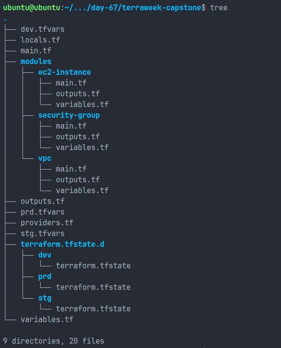

---

## Terraform Workspaces

Terraform workspaces were used to isolate infrastructure environments.

### Create Workspaces

```bash
terraform workspace new dev
terraform workspace new stg
terraform workspace new prd
```

### List Workspaces

```bash
terraform workspace list
```

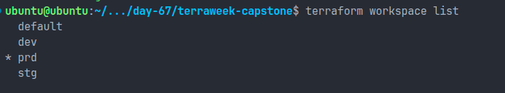

### Switch Workspace

```bash
terraform workspace select dev
terraform workspace select stg
terraform workspace select prd
```

---

## Environment Configuration

### Development

```hcl
vpc_cidr      = "10.0.0.0/16"
subnet_cidr   = "10.0.1.0/24"
instance_type = "t3.micro"

ingress_ports = [
  22,
  80
]
```

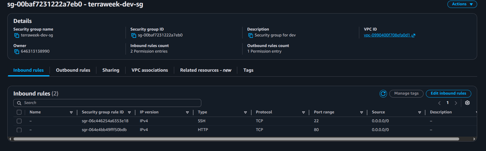

### Staging

```hcl
vpc_cidr      = "10.1.0.0/16"
subnet_cidr   = "10.1.1.0/24"
instance_type = "t3.small"

ingress_ports = [
  22,
  80,
  443
]
```

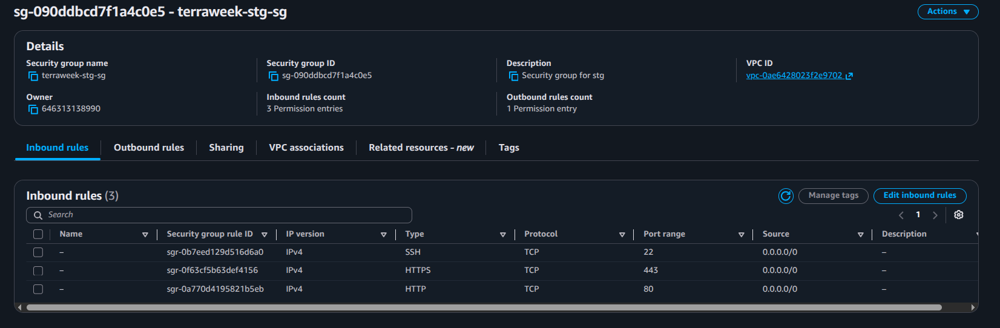

### Production

```hcl
vpc_cidr      = "10.2.0.0/16"
subnet_cidr   = "10.2.1.0/24"
instance_type = "m7i-flex.large"

ingress_ports = [
  80,
  443
]
```

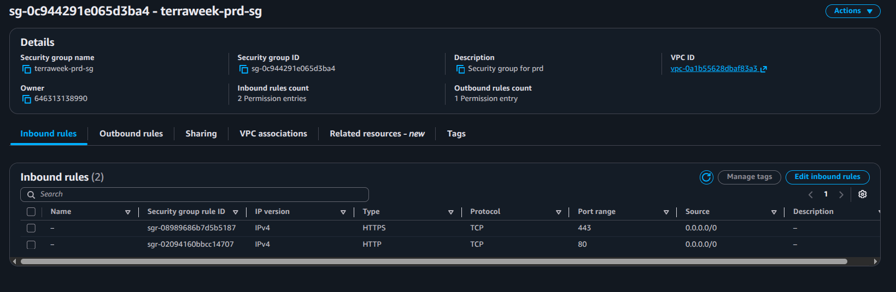

---

## Workspace-Aware Configuration

```hcl
locals {
  environment = terraform.workspace

  name_prefix = "${var.project_name}-${local.environment}"

  common_tags = {
    Project     = var.project_name
    Environment = local.environment
    ManagedBy   = "Terraform"
    Workspace   = terraform.workspace
  }
}
```

This enables automatic environment-specific naming and tagging.

---

## Resources Created Per Environment

### Networking

- VPC
- Public Subnet
- Internet Gateway
- Route Table
- Route Table Association

### Security

- Dynamic Security Group Rules
- Environment-Specific Access Controls

### Compute

- Amazon Linux EC2 Instance

---

## Deployment Commands

### Development

```bash
terraform workspace select dev

terraform plan -var-file="dev.tfvars"

terraform apply -var-file="dev.tfvars"
```

### Staging

```bash
terraform workspace select stg

terraform plan -var-file="stg.tfvars"

terraform apply -var-file="stg.tfvars"
```

### Production

```bash
terraform workspace select prd

terraform plan -var-file="prd.tfvars"

terraform apply -var-file="prd.tfvars"
```

---

## Verification

### Check Outputs

```bash
terraform output
```

Development output:

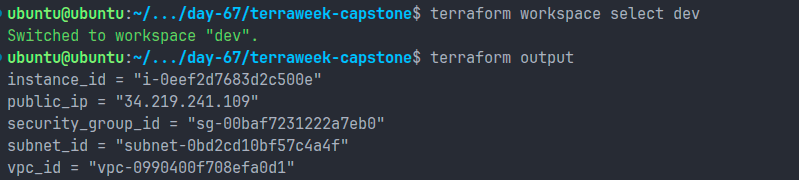

Staging output:

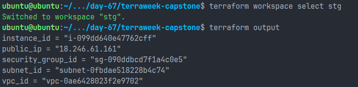

Production output:

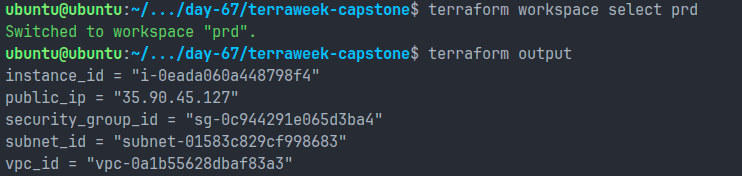

### Verify in AWS Console

- Three independent VPCs
- Three EC2 instances
- Three Security Groups
- Separate CIDR ranges
- Environment-specific tags

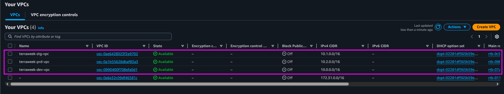

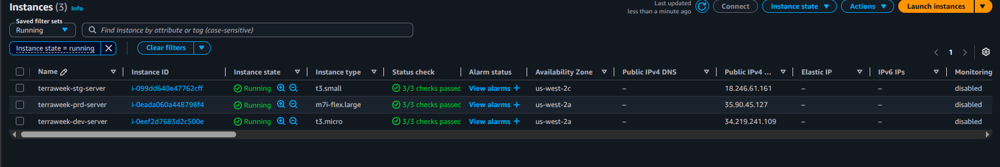

### VPC Details

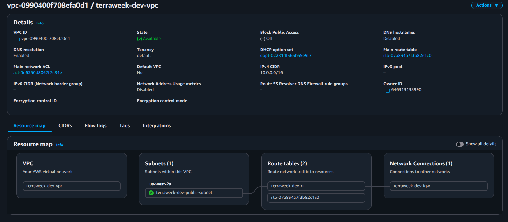


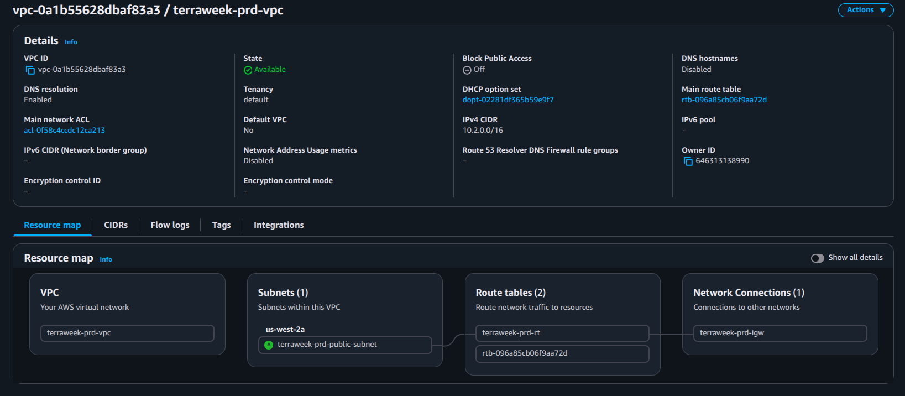

### Workspace Isolation Proof

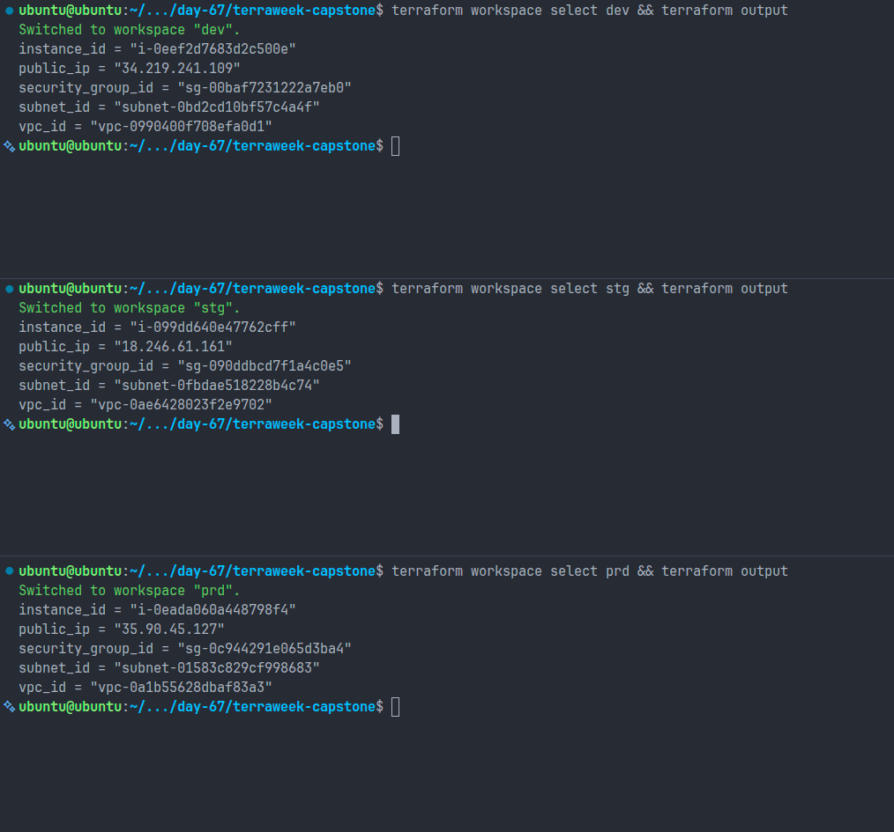

---

## Terraform Best Practices Implemented

### File Organization

- providers.tf
- variables.tf
- outputs.tf
- locals.tf
- main.tf

### State Management

- Workspace isolation
- Separate state per environment
- Remote backend ready

### Security

- Sensitive files ignored
- Environment separation
- Production SSH disabled

### Modules

- Reusable architecture
- Clear inputs and outputs
- Single responsibility design

### Tagging

Every resource includes:

```text
Project
Environment
ManagedBy
Workspace
```

### Naming Convention

```text
<project>-<environment>-<resource>
```

Examples:

```text
terraweek-dev-vpc
terraweek-stg-sg
terraweek-prd-server
```

---

## TerraWeek Learning Summary

| Day    | Concepts                                     |
| ------ | -------------------------------------------- |
| Day 61 | Terraform Basics, IaC, HCL, State            |
| Day 62 | Providers, Resources, Dependencies           |
| Day 63 | Variables, Outputs, Data Sources, Locals     |
| Day 64 | Remote Backend, Locking, Drift Detection     |
| Day 65 | Custom Modules, Registry Modules             |
| Day 66 | Amazon EKS Provisioning                      |
| Day 67 | Workspaces, Multi-Environment Infrastructure |

---

## Key Takeaways

- Infrastructure should be reproducible and version-controlled.
- Modules improve scalability and maintainability.
- Workspaces simplify environment management.
- Tagging and naming conventions improve governance.
- Terraform enables safe and repeatable infrastructure deployments.
- Environment isolation is critical for production-grade infrastructure.

---

## Cleanup

Destroy environments after verification:

```bash
terraform workspace select prd
terraform destroy -var-file="prd.tfvars"

terraform workspace select stg
terraform destroy -var-file="stg.tfvars"

terraform workspace select dev
terraform destroy -var-file="dev.tfvars"
```

Delete workspaces:

```bash
terraform workspace select default

terraform workspace delete dev
terraform workspace delete stg
terraform workspace delete prd
```

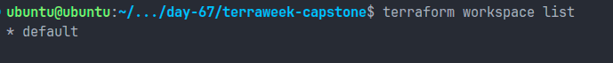

---

## Author

Part of the #90DaysOfDevOps challenge and TerraWeek Terraform learning journey.
