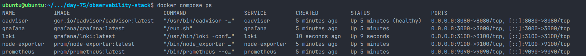
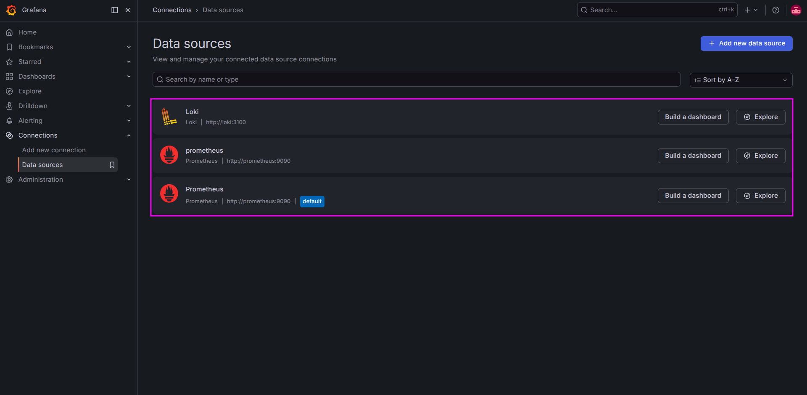
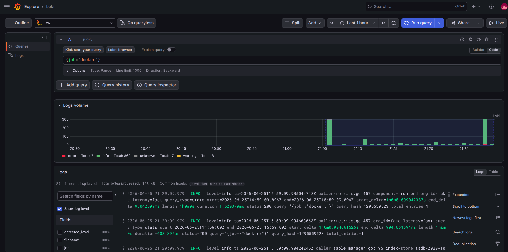
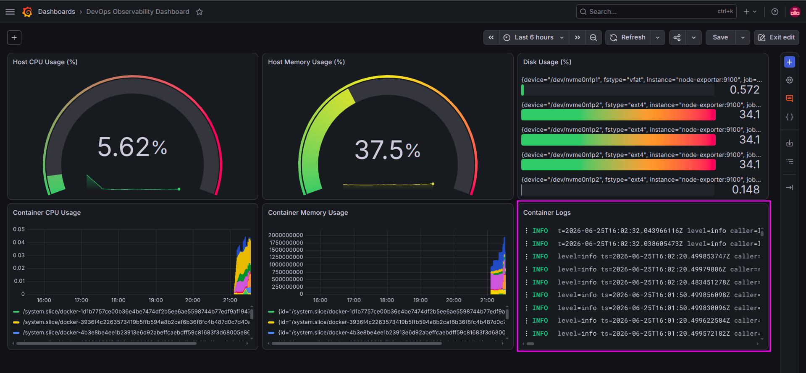
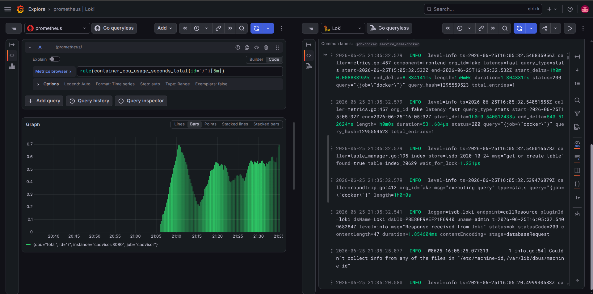

# Day 75 – Log Management with Loki and Promtail

## Overview

On Day 75, I completed the second pillar of observability by implementing centralized log management using **Grafana Loki** and **Promtail**. While Prometheus collects metrics to indicate **what** is happening, Loki stores logs that explain **why** it is happening.

I integrated Loki and Promtail into the existing observability stack built on Day 74, enabling log collection from Docker containers and visualization within Grafana using LogQL.

---

# Objectives

- Understand the log management pipeline
- Deploy Loki as the centralized log storage backend
- Configure Promtail to collect Docker container logs
- Integrate Loki with Grafana
- Query logs using LogQL
- Correlate metrics and logs in Grafana
- Compare Loki with the ELK Stack

---

# Logging Architecture

```text
                    Docker Containers
                           │
                           │ JSON Logs
                           ▼
          /var/lib/docker/containers/
                           │
                           ▼
                     Promtail Agent
                           │
                           │ Push Logs
                           ▼
                         Loki
                           │
                           │ LogQL Queries
                           ▼
                       Grafana
                           │
                 Metrics + Logs Together
                           │
                           ▼
                        DevOps Engineer
```

---

# Project Structure

```text
observability-stack/
├── docker-compose.yml
├── prometheus.yml
├── grafana/
│   └── provisioning/
│       └── datasources/
│           └── datasources.yml
├── loki/
│   └── loki-config.yml
└── promtail/
    └── promtail-config.yml
```

---

# Loki Configuration

**File:** `loki/loki-config.yml`

```yaml
auth_enabled: false

server:
  http_listen_port: 3100

common:
  ring:
    instance_addr: 127.0.0.1
    kvstore:
      store: inmemory
  replication_factor: 1
  path_prefix: /loki

schema_config:
  configs:
    - from: 2020-10-24
      store: tsdb
      object_store: filesystem
      schema: v13
      index:
        prefix: index_
        period: 24h

storage_config:
  filesystem:
    directory: /loki/chunks
```

### Configuration Explanation

| Configuration      | Purpose                                             |
| ------------------ | --------------------------------------------------- |
| auth_enabled       | Disables authentication for local development       |
| server             | Runs Loki API on port 3100                          |
| ring               | Uses in-memory storage for a single-node deployment |
| replication_factor | Stores one copy of logs                             |
| schema_config      | Defines the indexing schema                         |
| storage_config     | Stores log chunks on the local filesystem           |

---

# Promtail Configuration

**File:** `promtail/promtail-config.yml`

```yaml
server:
  http_listen_port: 9080
  grpc_listen_port: 0

positions:
  filename: /tmp/positions.yaml

clients:
  - url: http://loki:3100/loki/api/v1/push

scrape_configs:
  - job_name: docker
    static_configs:
      - targets:
          - localhost
        labels:
          job: docker
          __path__: /var/lib/docker/containers/*/*-json.log

    pipeline_stages:
      - docker: {}
```

### Configuration Explanation

| Configuration   | Purpose                                    |
| --------------- | ------------------------------------------ |
| server          | Runs Promtail HTTP server                  |
| positions       | Tracks the last-read position of log files |
| clients         | Sends logs to Loki                         |
| scrape_configs  | Defines log sources                        |
| **path**        | Reads Docker container JSON log files      |
| pipeline_stages | Parses Docker JSON log format              |

---

# Docker Compose Stack

The observability stack now includes:

- Prometheus
- Node Exporter
- cAdvisor
- Grafana
- Loki
- Promtail

Promtail mounts:

- Docker container logs
- Docker socket
- Promtail configuration

Loki mounts:

- Loki configuration
- Persistent storage volume

The running stack confirms that Loki started alongside Prometheus, Grafana, cAdvisor, and Node Exporter.



---

# Grafana Datasources

Configured datasources:

- Prometheus
- Loki

This enables querying both metrics and logs from the same Grafana instance.



---

# LogQL Queries Executed

## Show all Docker logs

```logql
{job="docker"}
```

**Result**

Displayed all Docker container logs collected by Promtail.



---

## Find error logs

```logql
{job="docker"} |= "error"
```

**Result**

Returned log entries containing the word **error**.

---

## Count logs over five minutes

```logql
count_over_time({job="docker"}[5m])
```

**Result**

Displayed the number of log entries generated during the previous five minutes.

---

## Log rate

```logql
rate({job="docker"}[5m])
```

**Result**

Calculated the rate of log generation per second.

---

## Search Promtail startup logs

```logql
{job="docker"} |= "Starting Promtail"
```

**Result**

Displayed Promtail initialization logs.

---

# Metrics and Logs Correlation

One of Grafana's most valuable features is correlating metrics and logs.

Using **Explore Split View**:

- Left Panel → Prometheus
- Right Panel → Loki

This allows investigation of:

- CPU spikes
- Memory usage
- Container restarts
- Error messages

without switching between different monitoring tools.

The DevOps dashboard combines infrastructure metrics with a live container logs panel.



Explore Split View makes it possible to inspect a Prometheus metric and the related Loki logs over the same time range.



---

# Why Loki Indexes Labels Instead of Log Content

Unlike Elasticsearch, Loki indexes **only labels** instead of the entire log message.

## Advantages

- Lower storage requirements
- Lower memory usage
- Faster ingestion
- Reduced infrastructure cost
- Simpler operations

## Trade-offs

- Slower full-text searches
- Limited advanced search capabilities
- Optimized for cloud-native environments rather than enterprise log analytics

---

# Loki vs ELK Stack

| Feature                | Loki        | ELK              |
| ---------------------- | ----------- | ---------------- |
| Storage Cost           | Low         | High             |
| Indexing               | Labels only | Full log content |
| Resource Usage         | Low         | High             |
| Grafana Integration    | Native      | External         |
| Kubernetes Support     | Excellent   | Good             |
| Full-text Search       | Limited     | Excellent        |
| Operational Complexity | Simple      | Complex          |

### Use Loki When

- Running Kubernetes
- Using Docker containers
- Monitoring cloud-native applications
- Cost efficiency is important

### Use ELK When

- Advanced log analytics are required
- Enterprise search capabilities are needed
- Compliance and auditing are priorities

---

# Challenges Faced

## Promtail Targets

Initially, the Promtail targets page was inaccessible because port **9080** was not published.

### Solution

Exposed Promtail HTTP port in `docker-compose.yml`.

---

## Loki Readiness

Immediately after startup, the `/ready` endpoint returned:

```text
Ingester not ready: waiting for 15s after being ready
```

### Solution

Waited a few seconds until Loki completed initialization.

---

## Lessons Learned

- Logs explain why incidents occur.
- Metrics identify performance issues.
- Loki integrates seamlessly with Grafana.
- Promtail automatically collects Docker logs.
- LogQL enables powerful log searches and aggregations.
- Combining metrics and logs significantly improves incident response.

---

# Key Takeaways

- Built a centralized logging pipeline using Loki and Promtail.
- Collected Docker container logs automatically.
- Queried logs with LogQL.
- Integrated Loki into Grafana.
- Correlated metrics and logs from a single interface.
- Learned the architectural differences between Loki and the ELK Stack.

Day 75 completed the observability stack by adding log management alongside metrics, providing a comprehensive monitoring solution suitable for modern cloud-native applications.
