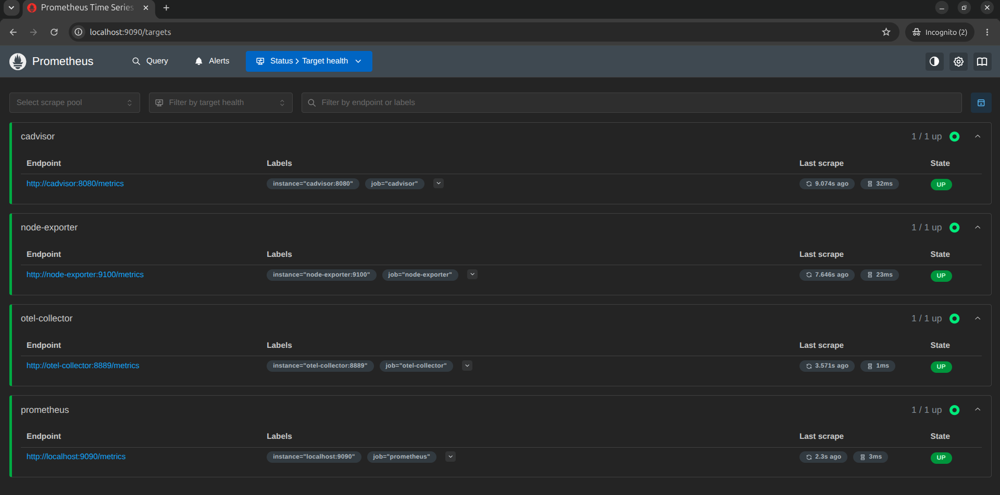
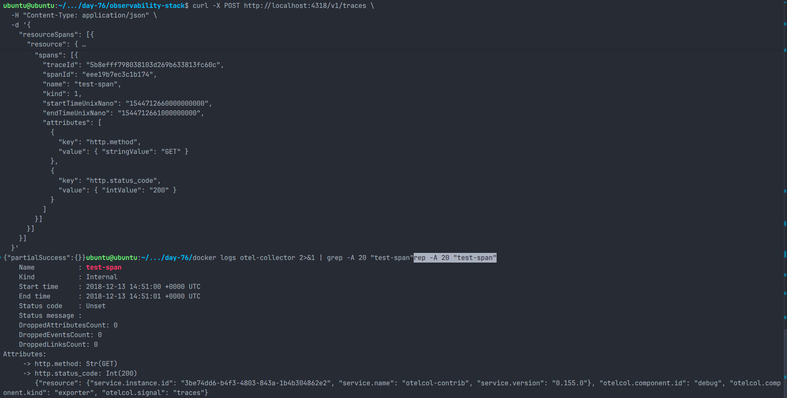
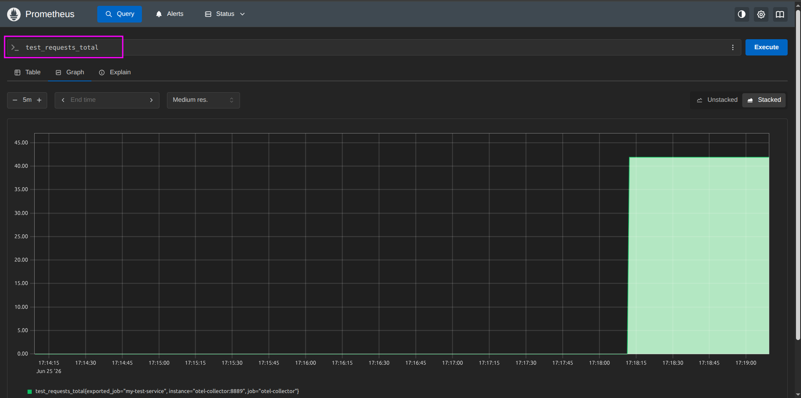
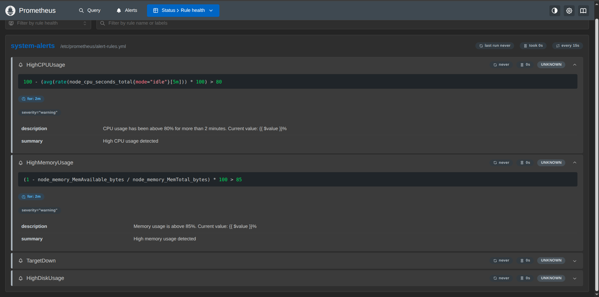
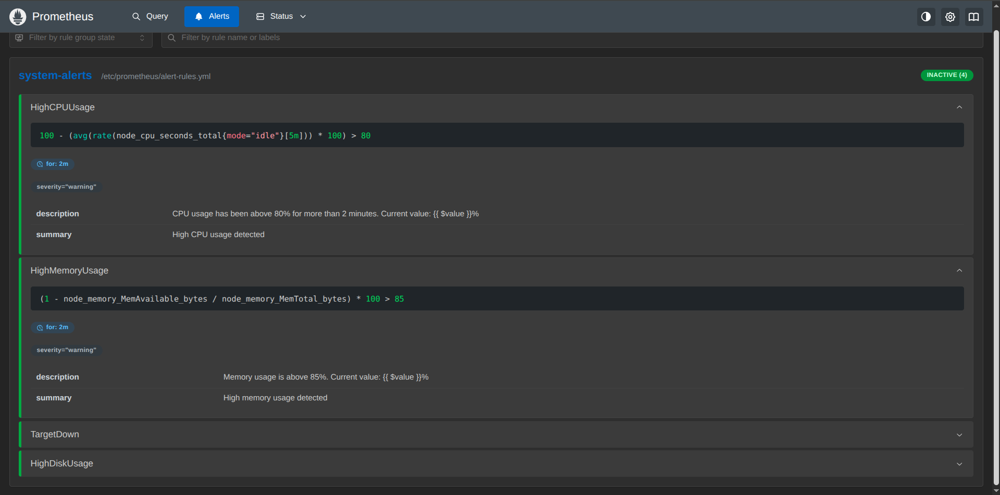
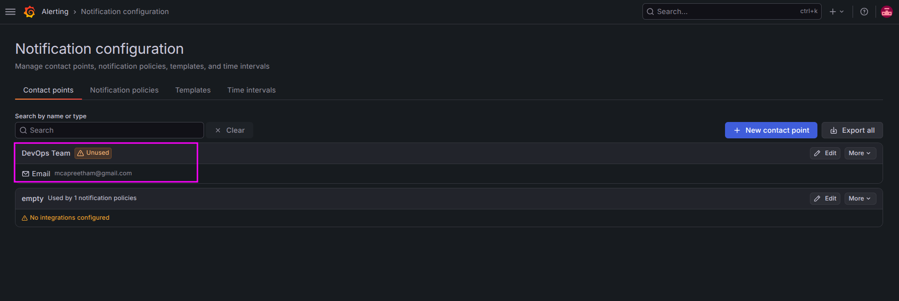
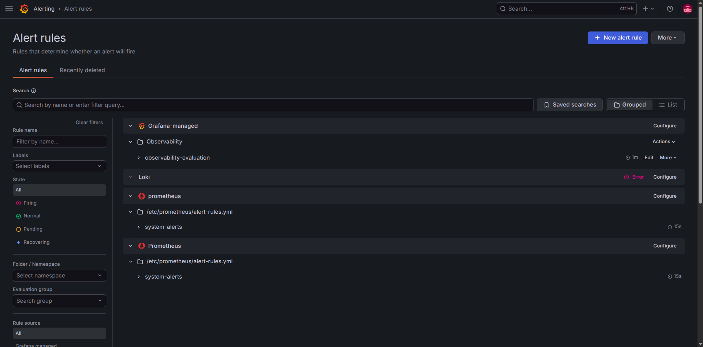
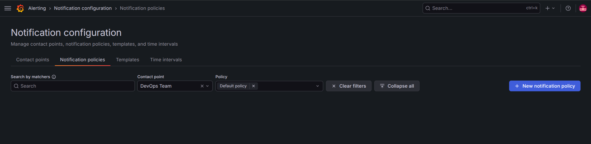

# Day 76 – OpenTelemetry and Alerting

**#90DaysOfDevOps**

## Objective

The goal of Day 76 was to extend the observability stack by introducing **OpenTelemetry (OTEL)** for distributed tracing and telemetry collection, followed by implementing **Prometheus Alerting Rules** and **Grafana Alerting**. With this setup, the observability platform now supports all three pillars of observability: **Metrics, Logs, and Traces**, along with proactive alerting.

---

# Learning Objectives

* Understand the purpose of OpenTelemetry.
* Learn the OpenTelemetry Collector architecture.
* Configure OTLP receivers.
* Export OTEL metrics to Prometheus.
* Send OTLP traces to the collector.
* Configure Prometheus Alert Rules.
* Configure Grafana Contact Points and Alert Rules.
* Understand the complete observability architecture.

---

# What is OpenTelemetry?

OpenTelemetry (OTEL) is a **vendor-neutral, open-source observability framework** maintained by the CNCF. It provides a standard way to generate, collect, process, and export telemetry data.

Unlike Prometheus or Grafana, OpenTelemetry **does not store telemetry data**. Instead, it acts as a telemetry pipeline that forwards data to supported backends.

Supported telemetry:

* Metrics
* Logs
* Traces

Supported backends include:

* Prometheus
* Grafana Tempo
* Jaeger
* Loki
* Datadog
* New Relic

---

# OpenTelemetry Collector Architecture

The OpenTelemetry Collector processes telemetry using a pipeline consisting of three main components.

## Receivers

Receivers collect telemetry from applications.

Examples:

* OTLP
* Prometheus
* Jaeger
* Zipkin

---

## Processors

Processors transform telemetry before exporting it.

Examples:

* Batch
* Memory Limiter
* Filter
* Sampling

For this project, the **Batch Processor** was used to improve export efficiency.

---

## Exporters

Exporters send telemetry to monitoring platforms.

Configured exporters:

* Prometheus Exporter
* Debug Exporter

---

# OTLP (OpenTelemetry Protocol)

OTLP is the standard protocol used by OpenTelemetry.

Supported protocols:

| Protocol | Port |
| -------- | ---- |
| gRPC     | 4317 |
| HTTP     | 4318 |

Applications send telemetry to the OTEL Collector using OTLP.

---

# Distributed Tracing

A distributed trace follows the complete lifecycle of a request as it travels across multiple services.

Example flow:

```text
User
   │
   ▼
API Gateway
   │
   ▼
Authentication Service
   │
   ▼
Database
```

Each operation is called a **Span**.

A span contains:

* Trace ID
* Span ID
* Parent Span ID
* Start Time
* End Time
* Duration
* Attributes

---

# Project Architecture

```text
                    OBSERVABILITY STACK

                        +----------------------+
                        |      Grafana        |
                        | Dashboards          |
                        | Alerting            |
                        +----------+----------+
                                   |
               +-------------------+-------------------+
               |                   |                   |
           Metrics              Logs               Traces
               |                   |                   |
      +--------v-------+    +-------v------+   +-------v--------+
      |  Prometheus    |    |     Loki     |   | OTEL Collector |
      +--------+-------+    +-------+------+   +-------+--------+
               |                    |                  |
     +---------+---------+          |           OTLP gRPC / HTTP
     |                   |          |                  |
+----v-----+      +------v------+   |            Applications
|Node Exp. |      | cAdvisor    |   |               / curl
+----------+      +-------------+   |
                                    |
                              +-----v------+
                              | Promtail   |
                              +------------+
```

---

# OpenTelemetry Collector Configuration

The collector was configured with:

* OTLP Receiver
* Batch Processor
* Prometheus Exporter
* Debug Exporter

### Receiver

* OTLP gRPC (4317)
* OTLP HTTP (4318)

### Processor

* Batch Processor

### Exporters

Metrics

* Prometheus Exporter (8889)

Logs

* Debug Exporter

Traces

* Debug Exporter

---

# Docker Compose Changes

A new OpenTelemetry Collector service was added.

Container:

* otel-collector

Ports exposed:

| Port | Purpose             |
| ---- | ------------------- |
| 4317 | OTLP gRPC           |
| 4318 | OTLP HTTP           |
| 8889 | Prometheus Exporter |

---

# Prometheus Configuration

Prometheus was updated to:

* Scrape the OTEL Collector
* Load custom alert rules

New scrape target:

```yaml
job_name: "otel-collector"
```

Alert rules file:

```text
alert-rules.yml
```

Prometheus confirmed that the cAdvisor, Node Exporter, OpenTelemetry Collector, and Prometheus scrape targets were healthy.



---

# Testing OTLP Traces

A sample trace was sent using curl.

Verification steps:

* OTLP HTTP endpoint accepted the trace.
* OTEL Collector processed the request.
* Debug exporter printed the trace.
* Span information was visible in collector logs.

Verified span:

* test-span

Attributes:

* http.method = GET
* http.status_code = 200



---

# Testing OTLP Metrics

A custom metric was sent using OTLP.

Metric:

```text
test_requests_total
```

Value:

```text
42
```

Verification:

* OTEL Collector received the metric.
* Prometheus scraped it successfully.
* Metric was queryable using PromQL.

PromQL:

```promql
test_requests_total
```



---

# Prometheus Alert Rules

Created:

## HighCPUUsage

Triggers when CPU usage exceeds 80% for more than 2 minutes.

---

## HighMemoryUsage

Triggers when memory usage exceeds 85%.

---

## TargetDown

Triggers when a Prometheus scrape target becomes unavailable.

---

## HighDiskUsage

Triggers when disk utilization exceeds 90%.

Prometheus loaded all four rules from the `system-alerts` rule group.



The Alerts page confirmed that each rule was being evaluated and was inactive while its threshold remained unmet.



---

# Grafana Alerting

Configured:

* Contact Point
* Evaluation Group
* Alert Rule
* Notification Policy

Alert Rule:

High CPU Usage

Evaluation:

* Every 1 minute

Pending:

* 2 minutes

Severity:

* warning

The **DevOps Team** email contact point was created as the notification destination.



The Grafana alerting view displayed the managed evaluation group alongside the Prometheus-managed rules.



The notification policy was configured to route matching alerts to the **DevOps Team** contact point.



---

# Validation Results

Successfully verified:

* OTEL Collector running
* Prometheus scraping OTEL metrics
* OTLP traces received
* Custom metrics exported
* Prometheus targets healthy
* Alert rules loaded
* Alerts evaluated
* Grafana alert configured
* Notification policy created

---

# Key Takeaways

* OpenTelemetry provides a vendor-neutral telemetry pipeline.
* OTEL Collector separates telemetry collection from storage.
* OTLP enables standardized communication between applications and collectors.
* Prometheus can scrape metrics exported by the OTEL Collector.
* Distributed tracing helps visualize request flow across services.
* Prometheus Alert Rules detect infrastructure issues automatically.
* Grafana Alerting provides notification routing through Contact Points and Notification Policies.
* Combining Prometheus, Loki, Grafana, and OpenTelemetry creates a complete observability platform suitable for modern cloud-native applications.

---

# Outcome

Day 76 successfully completed the observability stack by integrating **OpenTelemetry**, enabling **distributed tracing**, exporting **OTLP metrics**, configuring **Prometheus alerting**, and setting up **Grafana notifications**. The stack now supports all three pillars of observability—**Metrics, Logs, and Traces**—along with proactive monitoring and alerting.
