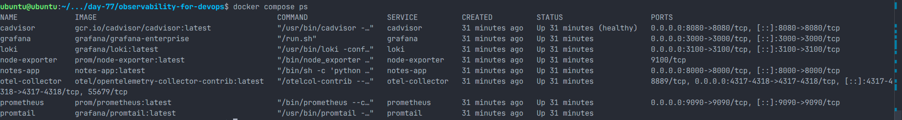
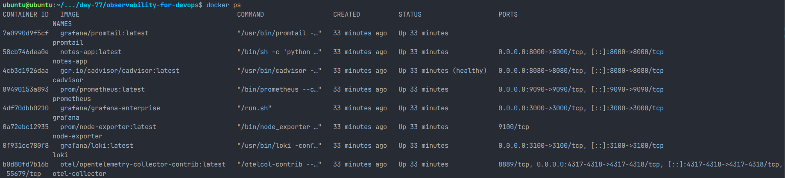
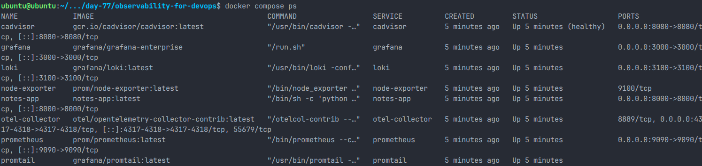
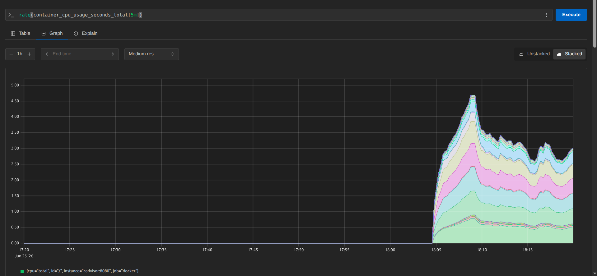
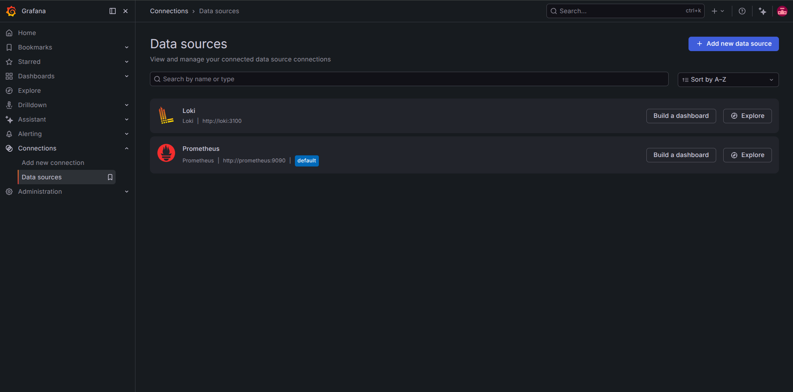
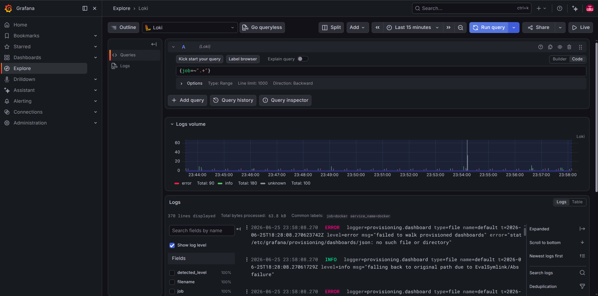

# Day 77 – End-to-End Observability Stack Validation (Prometheus, Grafana, Loki, Promtail & OpenTelemetry)

## Overview

Day 77 focused on deploying, validating, and troubleshooting a complete observability stack using Docker Compose. The stack integrates metrics collection, log aggregation, visualization, and telemetry components commonly used in modern DevOps environments.

Unlike previous days where individual tools were configured, today's objective was to validate the complete monitoring pipeline—from infrastructure metrics to centralized logging.

---

# Objectives

* Deploy the complete observability stack using Docker Compose.
* Validate Prometheus metric scraping.
* Verify Node Exporter and cAdvisor metrics.
* Configure and validate Grafana.
* Validate Loki log storage.
* Verify Promtail log collection.
* Generate application traffic.
* Query metrics using PromQL.
* Query logs using LogQL.
* Troubleshoot version-specific issues.
* Understand how observability components integrate together.

---

# Technology Stack

* Docker Compose
* Prometheus
* Grafana Enterprise
* Loki
* Promtail
* OpenTelemetry Collector
* Node Exporter
* cAdvisor
* Python Notes Application

---

# Project Architecture

```
                  ┌──────────────────────────┐
                  │     Notes Application    │
                  └─────────────┬────────────┘
                                │
                ┌───────────────┴───────────────┐
                │                               │
          Application Logs                Application Metrics
                │                               │
                ▼                               ▼
          ┌───────────┐                ┌──────────────────┐
          │ Promtail  │                │ OTEL Collector   │
          └─────┬─────┘                └─────────┬────────┘
                │                                │
                ▼                                ▼
          ┌───────────┐                 ┌──────────────────┐
          │   Loki    │                 │  Prometheus      │
          └─────┬─────┘                 └─────────┬────────┘
                │                                │
                └──────────────┬─────────────────┘
                               ▼
                      ┌─────────────────┐
                      │    Grafana      │
                      └─────────────────┘

Additional Exporters

Host
 └── Node Exporter

Docker
 └── cAdvisor
```

---

# Repository Setup

Clone repository

```bash
git clone https://github.com/LondheShubham153/observability-for-devops.git
```

Move into project

```bash
cd observability-for-devops
```

Validate project structure

```bash
tree -I 'node_modules|build|staticfiles|__pycache__'
```

Validate compose file

```bash
docker compose config
```

List services

```bash
docker compose config --services
```

---

# Issue 1 – Docker Pull Failure

While executing:

```bash
docker compose pull
```

Docker failed to download the Notes application image.

Reason:

The Notes application is built locally.

```yaml
notes-app:
  build:
    context: ./notes-app
```

Solution:

```bash
docker compose build notes-app
```

After successful build:

```bash
docker compose up -d
```

---

# Running Containers

Successfully deployed:

* Prometheus
* Grafana
* Loki
* Promtail
* Node Exporter
* cAdvisor
* OpenTelemetry Collector
* Notes App

Verification

```bash
docker compose ps
```

The Compose service list confirmed that all eight observability and application containers were running.



The Docker-level container view provided a second check that the services remained active and cAdvisor was healthy.



---

# Prometheus Validation

Opened

```
http://localhost:9090
```

Validated:

Status → Targets

Healthy Targets

* Prometheus
* Node Exporter
* cAdvisor
* OTEL Collector

All targets reported **UP**.



---

# Metrics Validation

Validated using PromQL.

### Target Health

```promql
up
```

---

### CPU Usage

Original Lab Query

```promql
rate(container_cpu_usage_seconds_total{name!=""}[5m])
```

Result

No Data

Reason

Recent cAdvisor versions no longer expose the `name` label.

Updated Query

```promql
rate(container_cpu_usage_seconds_total[5m])
```

Successfully returned CPU metrics.



---

### Memory Usage

Original Query

```promql
topk(3, container_memory_usage_bytes{name!=""})
```

Updated Query

```promql
topk(3, container_memory_usage_bytes)
```

Successfully displayed memory usage.

---

### Host Memory

```promql
(1 - node_memory_MemAvailable_bytes /
node_memory_MemTotal_bytes) * 100
```

Validated successfully.

---

# cAdvisor Validation

Verified metrics endpoint

```bash
curl http://localhost:8080/metrics
```

Confirmed metrics:

* container_cpu_usage_seconds_total
* container_memory_usage_bytes

---

# Node Exporter Validation

Attempting:

```bash
curl localhost:9100/metrics
```

Result

Connection refused

Reason

Node Exporter was not exposed to the host.

However, Prometheus successfully scraped it internally using Docker networking.

Validation completed via:

Prometheus → Targets

---

# Grafana Validation

Accessed

```
http://localhost:3000
```

Verified:

* Login successful
* Prometheus datasource
* Loki datasource

Both data sources connected successfully.



---

# Loki Validation

Health check

```bash
curl http://localhost:3100/ready
```

Output

```
ready
```

Loki operational.

---

# Promtail Validation

Generated application traffic

```bash
for i in $(seq 1 50); do
  curl -s http://localhost:8000 > /dev/null
  curl -s http://localhost:8000/api/ > /dev/null
done
```

Verified logs

```bash
docker logs promtail
```

Observed

* Adding target
* Tail routine started
* Watching Docker log directories

Promtail successfully tailed Docker container logs.

---

# Loki Validation

Verified

```bash
docker logs loki
```

Observed

* WAL checkpoints
* Table synchronization
* No ingestion errors

---

# LogQL Validation

Initial Query

```logql
{}
```

Returned parse error.

Reason

Loki 3.x no longer allows an empty selector.

Updated Query

```logql
{job=~".+"}
```

Logs appeared successfully.

Verified

* Log Volume
* Container logs
* Grafana Explore



---

# Version Differences Encountered

## cAdvisor

Older documentation:

```promql
{name!=""}
```

Current version:

No `name` label available.

---

## Loki

Older documentation:

```logql
{}
```

Current version:

Requires at least one matcher.

Updated query:

```logql
{job=~".+"}
```

---

# Components Successfully Validated

| Component               | Status    |
| ----------------------- | --------- |
| Docker Compose          | Completed |
| Prometheus              | Healthy   |
| Grafana                 | Healthy   |
| Loki                    | Healthy   |
| Promtail                | Healthy   |
| Node Exporter           | Healthy   |
| cAdvisor                | Healthy   |
| OpenTelemetry Collector | Healthy   |
| Notes Application       | Healthy   |

---

# Key Learnings

* Built and deployed a complete observability stack using Docker Compose.
* Validated infrastructure metrics with Prometheus.
* Collected host metrics using Node Exporter.
* Monitored container metrics using cAdvisor.
* Centralized Docker logs with Promtail and Loki.
* Queried metrics using PromQL.
* Queried logs using LogQL.
* Understood Docker networking between monitoring services.
* Adapted PromQL queries to newer cAdvisor versions.
* Adapted LogQL queries to Loki 3.x syntax changes.
* Learned practical troubleshooting techniques for modern observability stacks.

---

# Outcome

Successfully deployed, validated, and troubleshot a production-style observability stack consisting of Prometheus, Grafana, Loki, Promtail, Node Exporter, cAdvisor, OpenTelemetry Collector, and a sample application. Verified end-to-end metrics collection, centralized logging, and dashboard integration while resolving compatibility differences introduced by newer versions of cAdvisor and Loki.
