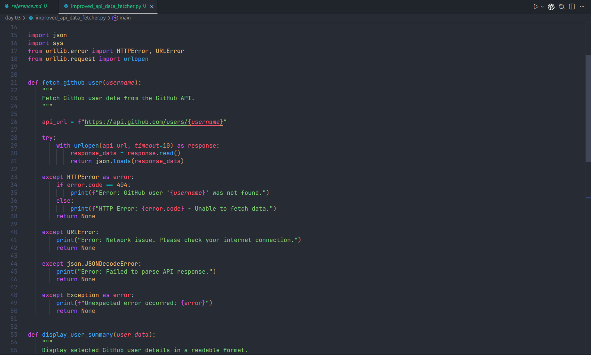
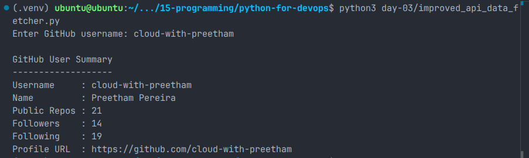
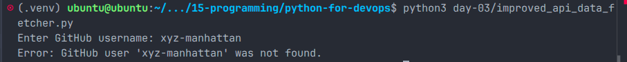

# Day 03 – Strengthening Python Fundamentals for DevOps

## Overview

On Day 03, I improved an existing Python automation script by applying better structure, basic error handling, and cleaner coding practices.

The goal was to take a previous script from Day 01 or Day 02 and refactor it so that it becomes easier to read, safer to run, and more maintainable in a DevOps environment.

For this task, I improved the Day 02 GitHub API data fetcher script and saved the updated version inside the `day-03` folder.

---

## Objectives

- Organize Python code into reusable functions
- Add basic exception handling using `try / except`
- Improve variable names and code readability
- Follow basic PEP8 coding practices
- Prevent the script from crashing on common errors
- Display output clearly in the terminal

---

## Script Created

```text
day-03/improved_api_data_fetcher.py
```

---

## What the Script Does

The script fetches GitHub user information using the public GitHub API.

It asks the user to enter a GitHub username and then displays selected profile details, including:

- Username
- Name
- Public repositories
- Followers
- Following
- GitHub profile URL

---

## Concepts Practiced

### 1. Functions

The script was divided into separate functions to keep the code clean and organized.

Functions used:

```python
fetch_github_user()
display_user_summary()
main()
```

This makes the script easier to read, debug, and update later.

---

### 2. Exception Handling

The script uses `try / except` blocks to handle common errors gracefully.

Errors handled:

- Invalid GitHub username
- GitHub API request failure
- Network connectivity issue
- JSON parsing failure
- Unexpected runtime errors

This ensures the script does not crash suddenly and gives a meaningful error message to the user.

---

### 3. API and JSON Handling

The script sends a request to the GitHub API and reads the JSON response.

It then extracts only the useful fields and prints them in a clean terminal format.

---

### 4. PEP8 and Readability Improvements

The script was improved with:

- Meaningful function names
- Clear variable names
- Proper indentation
- Clean formatting
- Simple comments and docstrings
- Better terminal output

---

## How to Run the Script

Run the script from the project root directory:

```bash
python3 day-03/improved_api_data_fetcher.py
```

---

## Successful Output Example

```text
Enter GitHub username: cloud-with-preetham

GitHub User Summary
-------------------
Username     : cloud-with-preetham
Name         : Preetham Pereira
Public Repos : 21
Followers    : 14
Following    : 19
Profile URL  : https://github.com/cloud-with-preetham
```

---

## Error Handling Example

When an invalid GitHub username is entered:

```text
Enter GitHub username: xyz-manhattan
Error: GitHub user 'xyz-manhattan' was not found.
```

This confirms that the script handles API errors gracefully instead of crashing.

---

## Screenshots

### Improved Script Code



### Successful API Output



### Error Handling Output



---

## Project Structure

```text
day-03/
├── screenshots/
│   ├── day-03-improved-script-code.png
│   ├── day-03-successful-api-output.png
│   └── day-03-error-handling-output.png
├── improved_api_data_fetcher.py
├── reference.md
└── README.md
```

---

## Key Learnings

- Writing code in functions makes automation scripts easier to maintain.
- Error handling is important because real-world scripts can fail due to bad input, network issues, or API errors.
- Clean code is easier for teammates to understand and modify.
- PEP8 improves consistency and readability in Python projects.
- DevOps automation should be reliable, readable, and safe to run repeatedly.

---

## DevOps Relevance

In real DevOps work, Python scripts are often used for automation tasks such as:

- Calling APIs
- Reading JSON data
- Monitoring systems
- Automating cloud operations
- Validating infrastructure information
- Generating reports

If these scripts do not handle errors properly, they can fail during production workflows. This task helped me understand how to write safer Python scripts for DevOps automation.

---

## Status

Completed Day 03 task successfully.
