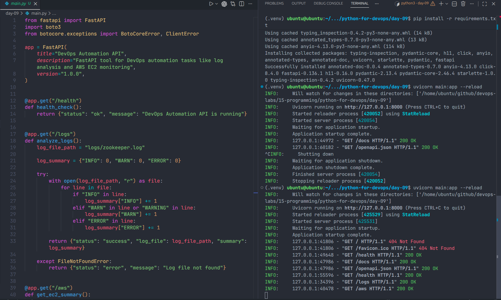
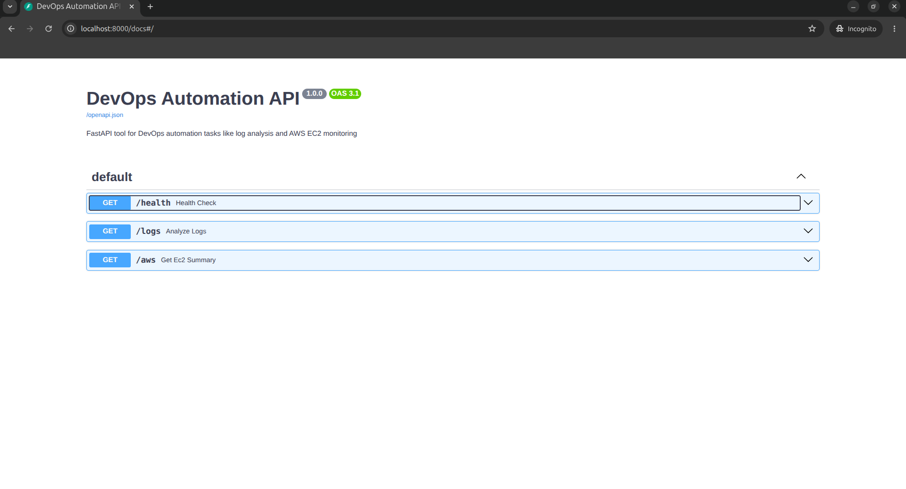
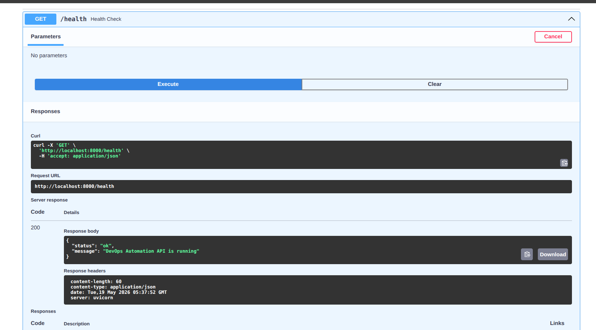
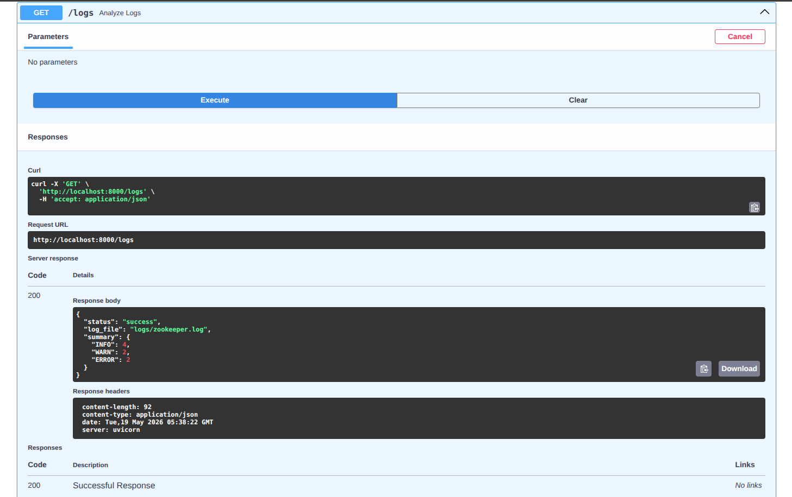
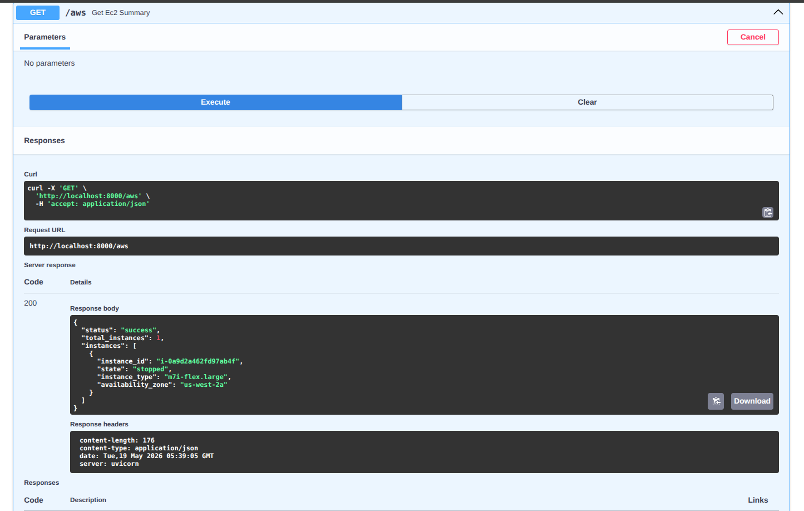

# Day 09 - DevOps Automation Tools with FastAPI

## Aim

Build a FastAPI-based REST API for DevOps automation tasks such as health checks, log analysis, and AWS EC2 monitoring.

This project shows how Python automation scripts can be exposed as API endpoints, which is a common practice in real DevOps workflows.

---

## Project Overview

In DevOps, automation is not always executed manually from the terminal. Many internal tools expose automation logic through APIs so teams can trigger tasks from dashboards, CI/CD pipelines, monitoring systems, or internal platforms.

In this project, FastAPI is used to build a simple DevOps Automation API with three main functions:

- Check whether the API service is running
- Analyze log files and count log levels
- Fetch EC2 instance details from AWS using Boto3

---

## Features

### 1. Health Check Endpoint

The `/health` endpoint verifies that the API service is running successfully.

### 2. Log Analyzer Endpoint

The `/logs` endpoint reads the `logs/zookeeper.log` file and counts log levels:

- INFO
- WARN
- ERROR

### 3. AWS EC2 Summary Endpoint

The `/aws` endpoint uses Boto3 to connect with AWS and fetch EC2 instance details such as:

- Instance ID
- Instance state
- Instance type
- Availability zone

### 4. Interactive API Documentation

FastAPI automatically provides Swagger UI documentation through the `/docs` endpoint.

---

## Project Structure

```bash
day-09/
├── __pycache__/
├── logs/
│   └── zookeeper.log
├── screenshots/
├── main.py
├── README.md
├── requirements.txt
└── task.md
```

---

## Tech Stack

- Python 3.13+
- FastAPI
- Uvicorn
- Boto3
- AWS CLI

---

## Prerequisites

Before running this project, make sure the following tools are installed and configured:

- Python 3
- pip
- AWS CLI
- AWS credentials configured locally

Check AWS CLI configuration:

```bash
aws configure
```

Verify AWS identity:

```bash
aws sts get-caller-identity
```

---

## Setup Instructions

### 1. Open the project folder

```bash
cd extras/python-for-devops/day-09
```

### 2. Create a virtual environment

```bash
python3 -m venv venv
```

### 3. Activate the virtual environment

```bash
source venv/bin/activate
```

### 4. Install dependencies

```bash
pip install -r requirements.txt
```

---

## Run the Application

Start the FastAPI application using Uvicorn:

```bash
uvicorn main:app --reload
```

The application will start at:

```bash
http://127.0.0.1:8000
```

Interactive API documentation will be available at:

```bash
http://127.0.0.1:8000/docs
```

---

## API Endpoints

| Endpoint  | Method | Description                            |
| --------- | ------ | -------------------------------------- |
| `/`       | GET    | Root endpoint with API navigation      |
| `/health` | GET    | Checks API service health              |
| `/logs`   | GET    | Analyzes Zookeeper log file            |
| `/aws`    | GET    | Fetches AWS EC2 instance summary       |
| `/docs`   | GET    | Opens FastAPI Swagger UI documentation |

---

## Endpoint Testing

### Test Root Endpoint

```bash
curl http://127.0.0.1:8000/
```

Example response:

```json
{
  "message": "Welcome to DevOps Automation API",
  "docs": "/docs",
  "health": "/health",
  "logs": "/logs",
  "aws": "/aws"
}
```

---

### Test Health Endpoint

```bash
curl http://127.0.0.1:8000/health
```

Example response:

```json
{
  "status": "ok",
  "message": "DevOps Automation API is running"
}
```

---

### Test Logs Endpoint

```bash
curl http://127.0.0.1:8000/logs
```

Example response:

```json
{
  "status": "success",
  "log_file": "logs/zookeeper.log",
  "summary": {
    "INFO": 4,
    "WARN": 2,
    "ERROR": 2
  }
}
```

---

### Test AWS Endpoint

```bash
curl http://127.0.0.1:8000/aws
```

Example response:

```json
{
  "status": "success",
  "total_instances": 1,
  "instances": [
    {
      "instance_id": "i-0a9d2a462fd97ab4f",
      "state": "stopped",
      "instance_type": "m7i-flex.large",
      "availability_zone": "us-west-2a"
    }
  ]
}
```

---

## requirements.txt

```txt
fastapi
uvicorn
boto3
```

---

## Screenshots

### Uvicorn Server Running



### FastAPI Swagger Documentation



### Health Endpoint Response



### Logs Endpoint Response



### AWS EC2 Summary Endpoint Response



---

## DevOps Learning Outcome

By completing this task, I learned:

- How to build REST APIs using FastAPI
- How to expose Python automation scripts through API endpoints
- How to analyze application logs using Python
- How to use Boto3 to fetch AWS EC2 instance information
- How FastAPI Swagger UI helps test APIs easily
- How DevOps engineers can build internal automation tools

---

## Real-World Use Case

This type of API can be used in real DevOps teams to:

- Build internal automation dashboards
- Trigger scripts through API calls
- Monitor cloud infrastructure
- Fetch AWS resource summaries
- Integrate automation with CI/CD pipelines
- Create lightweight platform engineering tools

---

## Author

Preetham
90 Days of DevOps Journey
